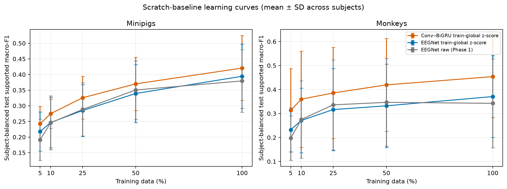
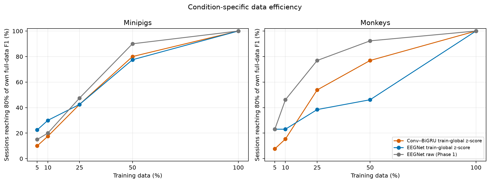
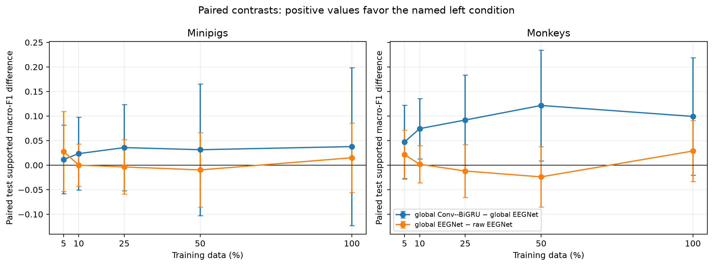
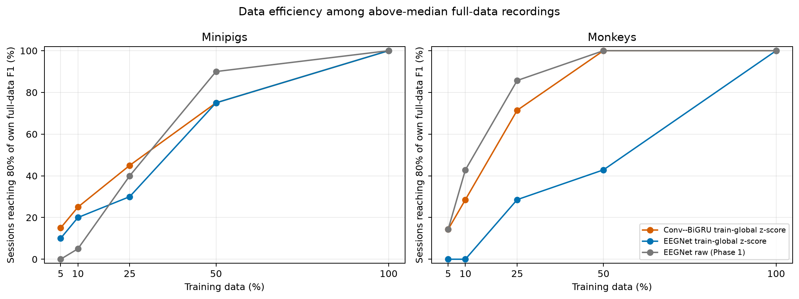

# Scratch Baselines Normalization

**Status:** Completed
**Date started:** 2026-09-01
**Parent experiment:** [Phase 3 -- NeuroSoft Input-Normalization Seed Replication](20260901-MS-neurosoft-input-normalization-replication.md)
**Follow-up experiments:** TBD
**Tags:** neurosoft, scratch, baselines, eegnet, convolution-bigru, input-normalization, learning-curves, 8band, intrasession-causal

## Background

The completed [Phase 3 input-normalization replication](20260901-MS-neurosoft-input-normalization-replication.md)
established on representative causal minipig and monkey recordings that
train-split-only global z-scoring is necessary or strongly beneficial for the
Conv--BiGRU, while raw input remains the strongest EEGNet condition.  It did
not establish whether those rankings generalize across the full audited
session/fraction matrix.

[Phase 1 EEGNet learning curves](20260826-MS-neurosoft-eegnet-learning-curves.md)
already provide the raw-input EEGNet reference at the five nested causal
training fractions.  This experiment adds two from-scratch, global-normalized
baselines over that identical matrix: EEGNet, to quantify the normalization
cost relative to Phase 1, and Conv--BiGRU, to compare architectures without
an input-normalization confound.  The Phase-1 raw EEGNet results are reused;
they are not rerun.

## Question

Across eligible NeuroSoft sessions and nested causal training fractions, how
do global-normalized from-scratch EEGNet and Conv--BiGRU compare with the
existing raw-input EEGNet learning curves in test supported macro-F1 and the
fraction of sessions reaching 80% of their own full-data performance?

## Hypothesis

Train-global z-scoring will produce lower test supported macro-F1 for EEGNet
than the Phase-1 raw-input reference at most training fractions.  With
normalization held fixed, Conv--BiGRU will achieve higher test supported
macro-F1 than EEGNet overall and will have an equal or greater share of
sessions reaching 80% of its own full-data test performance at lower training
fractions.  Effects must be reported separately by species and paired by
recording, fraction, and seed.

## Experiment

### Setup

- **Data:** the Phase-0-audited NeuroSoft cohort: 53 eligible recordings (40
  minipig, 13 monkey), yielding 255 supported recording/fraction cells.
- **Task:** `neurosoft_acoustic_stim_8band` (25 stimuli mapped to eight
  frequency bands).
- **Split:** `intrasession-causal`; train-global normalization statistics are
  fitted only on each causal training partition.  Validation and test
  intervals are invariant across fractions.
- **Fractions and seeds:** nested 5%, 10%, 25%, 50%, and 100% training
  fractions; seeds 42, 43, and 44 control initialization and the deterministic
  class-aware subset manifests.
- **New from-scratch conditions:**
  - **EEGNet global:** the Phase-1 EEGNet recipe with
    `recording_train_global_zscore` in place of raw input.
  - **Conv--BiGRU global:** the validated Phase-3 Conv--BiGRU scratch recipe
    with `recording_train_global_zscore`.
- **Reference condition:** completed Phase-1 raw-input EEGNet learning curves.
  Its one missing monkey 100%/seed-44 test result is excluded from paired
  contrasts and recorded explicitly rather than imputed.
- **Scope:** 1,530 new training jobs (255 supported cells x 3 seeds x 2 new
  conditions), plus the existing Phase-1 EEGNet reference runs.
- **Checkpoint selection:** best validation
  `val/neurosoft_acoustic_stim_8band_supported_f1`; consume test metrics only
  from that selected checkpoint.
- **Primary metric:** test supported-class macro-F1, summarized both
  subject-balanced (sessions -> subjects -> species) and across sessions.
- **Data-efficiency metric:** for each condition and session,
  `0.8 x mean_seed(test supported macro-F1 at 100%)`; report the cumulative
  percentage of sessions reaching that condition-specific threshold at each
  tested fraction.  Do not extrapolate or assign a value to unreached targets.
- **WandB:** project `neurosoft_supervised_pretraining`; use distinct,
  species-specific groups for the two new conditions and retain the Phase-1
  groups as a read-only reference in the analysis.
- **Final WandB groups:** `NORM_GLOBAL_EEGNET_MINIPIGS_PROD_OFFLINE_16_20260902`,
  `NORM_GLOBAL_EEGNET_MONKEYS_PROD_OFFLINE_16_20260902`,
  `NORM_GLOBAL_CONV_BIGRU_MINIPIGS_PROD_OFFLINE_16_20260902`, and
  `NORM_GLOBAL_CONV_BIGRU_MONKEYS_PROD_OFFLINE_16_20260902`; reference groups
  `PHASE1_EEGNET_MINIPIGS` and `PHASE1_EEGNET_MONKEYS`.

### Launch command

The four production Hydra configs reuse the audited Phase-1 cell sweep with
global normalization and model-specific recipes. Once they are committed,
submit four independent one-node Clariden pools using the snapshot workflow:

```bash
git status --short  # must print nothing
export FOUNDRY_SNAPSHOT_ROOT=<mounted-clariden-shared-path>/foundry-launches
scripts/launch_clariden_normalization.sh
```

Record every Slurm job ID and snapshot bundle path here immediately after
submission.

The first throughput canary uses the EEGNet minipig pool so its 579 queued
cells can keep 192 MPS workers busy across multiple waves:

- **Submitted:** 2026-09-01 at 22:37:13 CEST.
- **Slurm job:** `3257306` (`debug`, one exclusive GH200 node).
- **Start:** 2026-09-01 at 22:37:14 CEST on `nid007512` (no queue wait).
- **Expected end:** approximately 22:57:14 CEST after the 20-minute limit.
- **Concurrency:** `hydra.launcher.jobs_per_gpu=48` (192 workers/node).
- **Canary overrides:** `timeout_min=20`, `drain_guard_min=1`, and
  `signal_delay_s=60`.
- **Snapshot:**
  `/capstor/scratch/cscs/milosobral/foundry-launches/20260901T203654_NORM_GLOBAL_EEGNET_MINIPIGS_a7ce1664_b4d52560`
- **Git commit:** `a7ce166451d3db48a0a5cae72b1ac55c79734197`.

The subsequent production submissions did not yield usable experiment cells:

| Slurm job | Pool | Snapshot | Outcome |
| --- | --- | --- | --- |
| `3257481` | EEGNet minipigs | `/capstor/scratch/cscs/milosobral/foundry-launches/20260901T210135_NORM_GLOBAL_EEGNET_MINIPIGS_f23b8c75_40829b94` | Child processes inherited Slurm rank variables and failed when configuring WandB. Superseded by `cceed1a`, which clears those variables. |
| `3257560` | EEGNet minipigs | `/capstor/scratch/cscs/milosobral/foundry-launches/20260901T212243_NORM_GLOBAL_EEGNET_MINIPIGS_cceed1a3_d0378503` | All workers stopped during MPS NUMA-domain detection. |
| `3257632` | EEGNet minipigs | `/capstor/scratch/cscs/milosobral/foundry-launches/20260901T213448_NORM_GLOBAL_EEGNET_MINIPIGS_cceed1a3_dec0c317` | All workers stopped during MPS NUMA-domain detection. |
| `3257647` | Conv--BiGRU minipigs | `/capstor/scratch/cscs/milosobral/foundry-launches/20260901T213705_NORM_GLOBAL_CONV_BIGRU_MINIPIGS_cceed1a3_2a435564` | All workers stopped during MPS NUMA-domain detection. |
| `3257662` | EEGNet monkeys | `/capstor/scratch/cscs/milosobral/foundry-launches/20260901T213929_NORM_GLOBAL_EEGNET_MONKEYS_cceed1a3_48b6f364` | All workers stopped during MPS NUMA-domain detection. |
| `3257667` | Conv--BiGRU monkeys | `/capstor/scratch/cscs/milosobral/foundry-launches/20260901T214040_NORM_GLOBAL_CONV_BIGRU_MONKEYS_cceed1a3_f689014b` | All workers stopped during MPS NUMA-domain detection. |

The initial MPS validator treated the complete hwloc NUMA result as though it
had to contain one node.  On GH200, each CPU affinity also intersects
memory-only NUMA nodes, so that assumption halted every rank before it could
claim a cell.  The final topology-aware fix is recorded below.

### 2026-09-02 30-minute MPS canary

| Slurm job | Snapshot | Outcome |
| --- | --- | --- |
| `3264419` | `/capstor/scratch/cscs/milosobral/foundry-launches/20260902T130847_NORM_GLOBAL_EEGNET_MINIPIGS_d6d38741_1f05e154` | Cancelled after confirming that the first NUMA fix still rejected GH200 memory-only NUMA domains. |
| `3264441` | `/capstor/scratch/cscs/milosobral/foundry-launches/20260902T131036_NORM_GLOBAL_EEGNET_MINIPIGS_d6d38741_4456f5c7` | Cancelled because its immutable snapshot predated the corrected topology-aware validator. |
| `3264476` | `/capstor/scratch/cscs/milosobral/foundry-launches/20260902T131915_NORM_GLOBAL_EEGNET_MINIPIGS_f3078ff7_519eb3be` | Running on `nid006990` (`debug`, 30 minutes). At 15:28 CEST it claimed 192 cells; snapshot-resident logs confirm those cells entered training with zero failed cells. |
| `3264754` | `/capstor/scratch/cscs/milosobral/foundry-launches/20260902T140619_NORM_GLOBAL_EEGNET_MINIPIGS_CANARY_OFFLINE_16_c1b9ff60_449657bf` | Reached the 30-minute `debug` limit after the 64-worker offline-W&B canary. Of 579 submitted cells, 568 completed successfully; one active cell was stopped at the limit and ten had no final attempt record. No application failure was identified. |

The final binding logic requires exactly one GPU-associated physical NUMA
domain (`0`--`3`) in a worker's hwloc result, while allowing the expected
memory-only NUMA domains.  It is committed as `f3078ff`.

### 2026-09-02 production pools

All production pools use offline W&B, 16 workers/GPU (64 workers/node), the
`normal` partition, and a 90-minute limit. They were submitted from commit
`114337e`.

| Slurm job | Group | Snapshot | Scheduler start |
| --- | --- | --- | --- |
| `3265931` | `NORM_GLOBAL_EEGNET_MINIPIGS_PROD_OFFLINE_16_20260902` | `/capstor/scratch/cscs/milosobral/foundry-launches/20260902T154917_NORM_GLOBAL_EEGNET_MINIPIGS_PROD_OFFLINE_16_20260902_114337ec_df5ae191` | Started 2026-09-02 17:49:49 CEST (17 seconds after submission) on `nid006986`. |
| `3265945` | `NORM_GLOBAL_CONV_BIGRU_MINIPIGS_PROD_OFFLINE_16_20260902` | `/capstor/scratch/cscs/milosobral/foundry-launches/20260902T155156_NORM_GLOBAL_CONV_BIGRU_MINIPIGS_PROD_OFFLINE_16_20260902_114337ec_722ac6b6` | Started 2026-09-02 17:52:28 CEST (16 seconds after submission) on `nid006220`. |
| `3265970` | `NORM_GLOBAL_EEGNET_MONKEYS_PROD_OFFLINE_16_20260902` | `/capstor/scratch/cscs/milosobral/foundry-launches/20260902T155342_NORM_GLOBAL_EEGNET_MONKEYS_PROD_OFFLINE_16_20260902_114337ec_fa8067ce` | Started 2026-09-02 17:54:02 CEST (6 seconds after submission) on `nid006238`. |
| `3266014` | `NORM_GLOBAL_CONV_BIGRU_MONKEYS_PROD_OFFLINE_16_20260902` | `/capstor/scratch/cscs/milosobral/foundry-launches/20260902T155537_NORM_GLOBAL_CONV_BIGRU_MONKEYS_PROD_OFFLINE_16_20260902_114337ec_1e6ade9b` | Started 2026-09-02 17:56:08 CEST (14 seconds after submission) on `nid006280`. |

### Key config overrides

- Reuse the Phase-0 eligibility manifest, nested-fraction resolver, causal
  split, task, seed list, test evaluation, and supported-F1 checkpoint policy
  from the Phase-1 EEGNet configs.
- Set `data.input_normalization.mode=recording_train_global_zscore` for both
  new conditions; retain raw input only in the existing Phase-1 reference.
- Keep the EEGNet model and optimization recipe from Phase 1, and the
  Conv--BiGRU architecture and scratch recipe validated in Phase 3.  Do not
  substitute a common optimizer recipe merely to make the architectures look
  comparable.
- Require validated model/input-shape-specific FLOP metadata before any
  production submission.

## Results

### Summary

The reproducible WandB query resolved 2,361 raw records across the six declared
groups.  After retaining one finished test result per condition, recording,
fraction, and seed (primary before retry), 2,291 canonical test cells remained:
764 raw EEGNet reference cells, 763 global-normalized EEGNet cells, and 764
global-normalized Conv--BiGRU cells.  The global EEGNet set lacks test results
for monkey `sub-03_ses-01` at 100%/seed 42 and `sub-04_ses-01` at 5%/seed 42.
The pre-existing Phase-1 raw reference lacks its documented monkey 100%/seed-44
result; no missing result was imputed.

With train-global z-scoring held fixed, Conv--BiGRU had higher subject-balanced
test supported macro-F1 than EEGNet at all five training fractions in both
species.  The paired Conv--BiGRU-minus-EEGNet mean difference was positive at
every fraction: +0.012 to +0.038 in minipigs and +0.047 to +0.122 in monkeys.
Global-normalized EEGNet was near the raw reference rather than consistently
below it: its paired difference relative to raw ranged from -0.010 to +0.028
in minipigs and -0.024 to +0.029 in monkeys.

The 80%-of-own-full-data measure gives a more qualified picture of data
efficiency.  At 50%, Conv--BiGRU reached its own target for 80.0% of minipig
sessions and 76.9% of monkey sessions, versus 77.5% and 46.2% for global
EEGNet.  At the 5% and 10% budgets, however, Conv--BiGRU did not consistently
reach its target in a greater share of sessions.

To separate absolute performance from this relative target, the analysis also
computes a performance-qualified version.  A recording is retained when its
100%-data F1, averaged across all three conditions, is at least the
species-specific median; this gives one shared 20-recording minipig set and
seven-recording monkey set.  Within the qualified monkey set, Conv--BiGRU
reached its target for all recordings by 50%, versus 42.9% for global EEGNet;
the corresponding minipig shares were 75.0% for both global conditions and
90.0% for raw EEGNet.

### Metrics

Subject-balanced test supported macro-F1 (mean +/- SD across subjects; seeds
are averaged within each recording before subject and species aggregation):

| Training fraction | Minipig raw EEGNet | Minipig global EEGNet | Minipig global Conv--BiGRU |
|------------------:|-------------------:|----------------------:|----------------------------:|
| 5% | 0.191 +/- 0.066 | 0.218 +/- 0.063 | 0.242 +/- 0.055 |
| 10% | 0.246 +/- 0.086 | 0.247 +/- 0.081 | 0.275 +/- 0.047 |
| 25% | 0.288 +/- 0.085 | 0.285 +/- 0.083 | 0.326 +/- 0.068 |
| 50% | 0.351 +/- 0.093 | 0.339 +/- 0.093 | 0.370 +/- 0.085 |
| 100% | 0.379 +/- 0.100 | 0.394 +/- 0.103 | 0.421 +/- 0.104 |

| Training fraction | Monkey raw EEGNet | Monkey global EEGNet | Monkey global Conv--BiGRU |
|------------------:|------------------:|---------------------:|---------------------------:|
| 5% | 0.198 +/- 0.092 | 0.232 +/- 0.091 | 0.313 +/- 0.174 |
| 10% | 0.275 +/- 0.161 | 0.271 +/- 0.134 | 0.360 +/- 0.200 |
| 25% | 0.336 +/- 0.188 | 0.317 +/- 0.171 | 0.386 +/- 0.190 |
| 50% | 0.347 +/- 0.183 | 0.332 +/- 0.174 | 0.419 +/- 0.193 |
| 100% | 0.343 +/- 0.185 | 0.371 +/- 0.171 | 0.454 +/- 0.171 |

Cumulative share of sessions reaching 80% of their own condition-specific
full-data test F1:

| Training fraction | Minipig raw / global EEGNet / Conv--BiGRU | Monkey raw / global EEGNet / Conv--BiGRU |
|------------------:|------------------------------------------:|------------------------------------------:|
| 5% | 15.0% / 22.5% / 10.0% | 23.1% / 23.1% / 7.7% |
| 10% | 20.0% / 30.0% / 17.5% | 46.2% / 23.1% / 15.4% |
| 25% | 47.5% / 42.5% / 42.5% | 76.9% / 38.5% / 53.8% |
| 50% | 90.0% / 77.5% / 80.0% | 92.3% / 46.2% / 76.9% |
| 100% | 100.0% / 100.0% / 100.0% | 100.0% / 100.0% / 100.0% |

### Analysis

The analysis script fetches all three conditions through `wandb.Api()`, selects
canonical cells, regenerates the summary tables, and reports paired raw-vs-global
EEGNet and global EEGNet-vs-Conv--BiGRU contrasts:

```bash
GOMAXPROCS=1 OPENBLAS_NUM_THREADS=1 OMP_NUM_THREADS=1 MKL_NUM_THREADS=1 \
  uv run python analysis/20260901-MS-scratch-baselines-normalization.py
```

### Figures

Subject-balanced test supported macro-F1 by training fraction:



Cumulative percentage of sessions reaching 80% of condition-specific full-data
test performance:



Paired differences for the two planned contrasts:



Data efficiency after restricting every condition to the same recordings whose
pooled 100%-data F1 is at least the species-specific median:



## Conclusions

**Verdict: confirmed (investigator interpretation).** Under matched
train-global normalization, Conv--BiGRU consistently outperformed EEGNet in
test supported macro-F1 across both species and all five training budgets; the
paired effects are positive throughout and are substantial for monkeys.  The
global-normalized EEGNet comparison refines the expected normalization claim:
raw EEGNet was not uniformly superior, because the global-minus-raw effect was
near zero and changed sign across fractions.  Likewise, higher Conv--BiGRU F1
did not translate into uniformly greater low-budget 80%-target attainment,
though it was stronger than global EEGNet at the 50% budget in both species.

## Notes for future experiments

- Repeat the performance-qualified analysis with a pre-registered absolute F1
  threshold or several quantiles to check sensitivity to the median cutoff.
