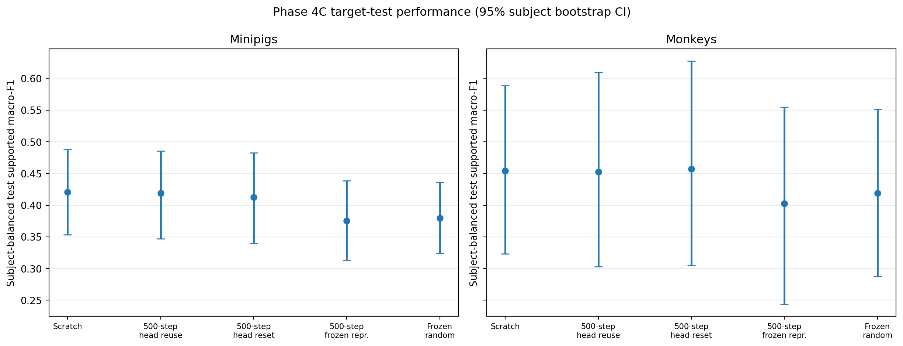
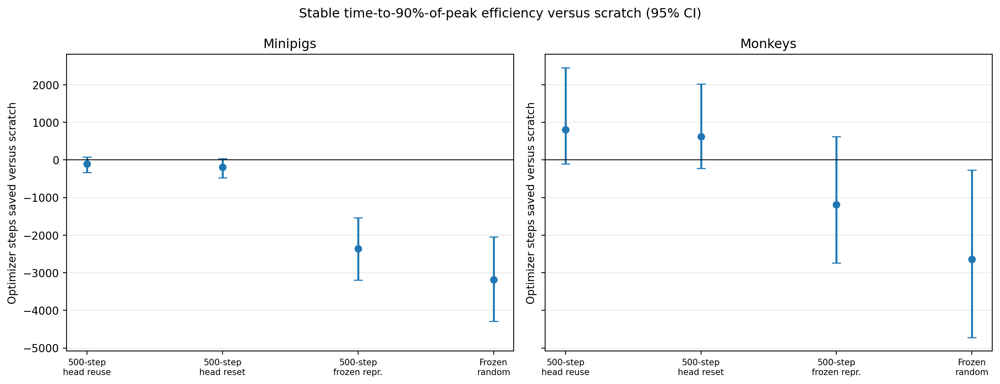
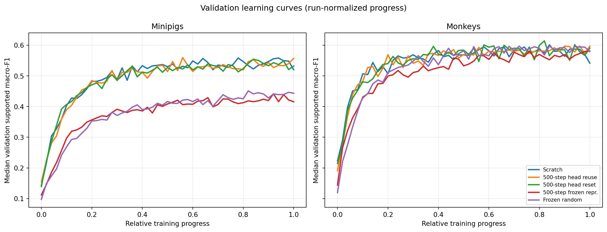

# Phase 4C -- 500-Step Head Reset and Backbone Freezing

**Status:** Completed
**Date started:** 2026-09-11
**Parent experiment:** [Phase 4B -- Early Source-Checkpoint Transfer](20260910-MS-early-checkpoint-transfer.md)
**Follow-up experiments:** [Phase 4D -- Transfer Recipe and LR Warmup Screen](20260911-MS-transfer-lr-warmup-screen.md)
**Tags:** neurosoft, supervised-pretraining, transfer, head-reset, frozen-representation, checkpoint-milestone, phase4, 8band, mila

## Background

[Phase 4B](20260910-MS-early-checkpoint-transfer.md) found that the existing
500-step source checkpoint was effectively neutral versus matched scratch under
the current `full_finetuning` transfer recipe, while longer source training
became detrimental.  That recipe loads the source temporal frontend, BiGRU,
and router/classification head, then trains all target parameters.  Thus its
neutral result does not distinguish an unhelpful 500-step representation from
a representation whose benefit is obscured by transfer of a source-task head
or by downstream overwriting of the backbone.

The Phase-3 transfer contract explicitly supports the needed boundary:
`frozen_representation` loads and freezes the temporal frontend and BiGRU,
while initializing both target session adapter and router afresh.  This
experiment adds the complementary, currently unimplemented, reset-head full
finetuning mode: load only frontend and BiGRU, initialize the target adapter
and router afresh, then train every target parameter.  It reuses the audited
Phase-4B 500-step checkpoints and the matched controls, so it isolates
downstream adaptation from source-checkpoint age and source-pretraining
hyperparameters.

## Question

At a fixed 500-step, target-excluded source checkpoint, does resetting the
source router/classification head make target adaptation performance-safe and
faster than matched scratch, and is any benefit retained when the transferred
temporal frontend and BiGRU are frozen?

## Hypothesis

Resetting the router while fully finetuning the transferred 500-step frontend
and BiGRU will be performance-safe relative to scratch (paired test supported
macro-F1 non-inferiority margin -0.01) and reach stable near-peak validation
performance sooner.  It will outperform both the existing head-reusing full
finetuning control and reset-head frozen representation, indicating that a
fresh target readout removes source-task bias without preventing useful
backbone adaptation.

## Experiment

### Setup

- **Model and task:** The Phase-2/Phase-4 train-global-normalized
  `NeurosoftConvBiGRU` on `neurosoft_acoustic_stim_8band`, with the matched
  target recipe (`learning_rate=0.0015`, `weight_decay=0.018`) and unchanged
  causal target splits.
- **Source checkpoints:** Reuse only the hash-verified Phase-4B 500-step
  manifests.  Fix the paired source selection/model seed to `(42, 42)` for
  every target subject; this seed is predeclared, not selected by downstream
  outcome.  Each source manifest must remain same-species and exclude the
  target subject.
- **Target population and seeds:** All 40 eligible minipig and 13 eligible
  monkey recordings.  Run each target recording with downstream seeds 42, 43,
  and 44.  The reset router and target adapter are initialized solely from the
  downstream seed.
- **New transfer modes:**
  - `full_finetuning_reset_router`: strictly load only `temporal_frontend` and
    `gru`; retain fresh `session_adapter` and `router`; train every target
    parameter.
  - `frozen_representation`: strictly load and freeze only
    `temporal_frontend` and `gru`; retain fresh `session_adapter` and `router`;
    train only those fresh modules.
  - `frozen_random_control`: initialize all modules normally, freeze the
    random `temporal_frontend` and `gru`, and train only the fresh target
    adapter and router.  It isolates the value of a frozen pretrained
    representation from the feasibility of the restricted target optimizer.
- **Reused controls:** Slice the completed Phase-4B 500-step full-finetuning
  matrix to source seed `(42, 42)` (pretrained router, all parameters
  trainable), and reuse the matched Phase-2 scratch matrix (fresh, all
  parameters trainable).  No source training, source checkpoint, full
  finetuning head-reuse, or scratch job is resubmitted.
- **WandB:** Use distinct groups per new condition and species, with
  deterministic compiled cell IDs and W&B IDs.  Proposed groups are
  `PHASE4C_STEP500_HEAD_RESET_FULL_FT_{MINIPIGS,MONKEYS}`,
  `PHASE4C_STEP500_FROZEN_REPRESENTATION_{MINIPIGS,MONKEYS}`, and
  `PHASE4C_FROZEN_RANDOM_{MINIPIGS,MONKEYS}`.

### Run matrix

| Condition | Source seed pairs | Target cells | Reused / new |
|---|---:|---:|---:|
| Scratch, all parameters trainable | none | 53 x 3 = 159 | Reused |
| 500-step full finetuning, source router reused | 1 | 53 x 1 x 3 = 159 | Reused |
| 500-step reset router, all parameters trainable | 1 | 53 x 1 x 3 = 159 | New |
| 500-step reset router, frontend + BiGRU frozen | 1 | 53 x 1 x 3 = 159 | New |
| Random frontend + BiGRU frozen, fresh router | none | 53 x 3 = 159 | New |
| **New Phase 4C work** |  | **477** | **477** |

This is a source-seed-42 mechanism screen, not a source-seed-generalized
claim.  If a reset-head regime passes the preregistered transfer gate, rerun
only that regime for source seed pairs `(43, 43)` and `(44, 44)` (318 new
target cells) before making a source-seed-robust claim.

### Metrics and decision rule

- **Performance:** Subject-balanced paired target-test supported macro-F1,
  calculated separately for minipigs and monkeys.  Aggregate target seeds and
  recordings within subject before species-level inference.  A condition is
  performance-safe when the lower bound of its 95% paired subject-bootstrap
  interval versus scratch is at least -0.01.
- **Convergence:** For each run, collect epoch-level validation supported
  macro-F1 and optimizer step from W&B.  Form a trailing three-validation
  rolling median, compute its run-specific maximum, and find the earliest
  optimizer step at which the smoothed value reaches 90% of that maximum and
  remains at or above that threshold for the next two validations.  Compare
  paired subject-balanced times separately by species.  Runs with no stable
  crossing are recorded as right-censored at their final validation step and
  reported explicitly rather than silently dropped.
- **Transfer gate:** A reset-head condition is favorable when it is
  performance-safe and shows a consistently earlier stable time-to-90%-peak
  validation performance than scratch.  F1 improvement is welcome but not
  required; reported efficiency must never be interpreted without the F1
  safety result.  The head-reset full-finetuning condition is the prespecified
  expected winner.

### Launch command

The strict `full_finetuning_reset_router` mode, frozen-random control recipe,
and compiled-cell recipe pinning source seed `(42,42)` were committed in
`9d9dacd`.  The exact cell lists passed source-manifest/checkpoint hash and
identity audits, and the production launch used normal snapshotting on the
legacy-cluster `long` partition.

```bash
export FOUNDRY_DATA_ROOT=/network/scratch/s/sobralm/brainsets/processed
export FOUNDRY_SNAPSHOT_ROOT=/network/scratch/s/sobralm/foundry-launches
export FOUNDRY_CHECKPOINT_ROOT=/network/scratch/s/sobralm/foundry-checkpoints

git status --short  # must print nothing

uv run python tools/compile_downstream_cells.py \
  --registry launch/checkpoint_sets/phase4a-mila-early-checkpoints.jsonl \
  --recipe configs/downstream_recipes/phase4c_step500_head_reset.yaml \
  --audit docs/neurosoft-phase0-audit.json \
  --checkpoint-root "$FOUNDRY_CHECKPOINT_ROOT" \
  --output-dir launch/phase4c \
  --check

uv run python main.py \
  experiment=auditory_decoding/neurosoft_conv_bigru_transfer_minipigs \
  hydra/launcher=slurm_default hydra.launcher.partition=long \
  hydra.launcher.gres=gpu:rtx8000:1 \
  hydra.launcher.cell_list=launch/phase4c/phase4c-step500-head-reset-minipigs.jsonl \
  hydra.launcher.tasks_per_node=4 hydra.launcher.cpus_per_task=1 \
  hydra.launcher.mem_gb=32 -m

uv run python main.py \
  experiment=auditory_decoding/neurosoft_conv_bigru_transfer_monkeys \
  hydra/launcher=slurm_default hydra.launcher.partition=long \
  hydra.launcher.gres=gpu:rtx8000:1 \
  hydra.launcher.cell_list=launch/phase4c/phase4c-step500-head-reset-monkeys.jsonl \
  hydra.launcher.tasks_per_node=2 hydra.launcher.cpus_per_task=2 \
  hydra.launcher.mem_gb=32 -m
```

Submitted on 2026-09-11: minipigs Slurm array `10760272_[0-89]` (360 cells),
snapshot `/network/scratch/s/sobralm/foundry-launches/20260911T152934_NEUROSOFT_TRANSFER_MINIPIGS_9d9dacdd_4e06eed8`;
monkeys Slurm array `10760271_[0-58]` (117 cells), snapshot
`/network/scratch/s/sobralm/foundry-launches/20260911T152939_NEUROSOFT_TRANSFER_MONKEYS_9d9dacdd_ecf02170`.

### Key config overrides

- `run.pretrained_checkpoint_manifest`: the audited Phase-4B 500-step manifest
  for the matching target subject and source seed pair `(42,42)`; random
  controls carry explicit nulls for source fields so packed cell vectors stay
  structurally identical while retaining no source provenance.
- `run.pretrained_transfer_regime=full_finetuning_reset_router` or
  `frozen_representation`; frozen-random is a separate explicit no-checkpoint
  mode, never a missing-manifest fallback. Its manifest and source-seed
  overrides are explicit `null` values only.
- `run.source_selection_seed=42`, `run.source_model_seed=42`, and
  `run.evaluate_test=true` for every pretrained cell.
- `run.seed in {42,43,44}`, `data.training_fraction=1.0`, and
  `hyperparameters.learning_rate=0.0015` in every target cell.
- New recipe/checkpoint-set IDs, cell IDs, W&B groups, and compiler locks must
  not overlap prior Phase-4A or Phase-4B identities.
- **Final W&B audit:** project `poyo-eeg/neurosoft_supervised_pretraining`;
  all 477 new Phase-4C runs finished successfully (360 minipigs, 117 monkeys)
  and all 159 reused Phase-4B head-reuse controls finished successfully (120
  minipigs, 39 monkeys).  The matched Phase-2 scratch pool contained 158 of
  159 expected finished controls; the missing unit was monkey
  `sub-01_ses-014`, target seed 43.

## Results

### Summary

All new Phase-4C cells completed successfully and passed the declared W&B
identity/configuration audit.  The exact common paired population contained
120 minipig subject-seed-recording units and 38 monkey units, after excluding
the one unavailable monkey scratch unit.

The full-finetuning head-reset condition was close to scratch and substantially
better than either frozen condition.  This supports the interpretation that
target adaptation of the backbone is important.  However, head reset did not
show a reliable performance or convergence advantage over scratch.  The
learned frozen representation was not better than the frozen random control.

### Metrics

Subject-balanced means and 95% subject-bootstrap intervals are shown below.
Positive stable-step savings indicate earlier stable time-to-90%-of-peak
validation performance.

| Species | Condition | Test supported macro-F1 | F1 change vs scratch | Stable steps saved vs scratch |
|---|---|---:|---:|---:|
| Minipigs | Scratch | 0.4206 [0.3535, 0.4877] | — | — |
| Minipigs | 500-step head reuse | 0.4188 [0.3467, 0.4855] | -0.0018 [-0.0097, 0.0064] | -103 [-328, 76] |
| Minipigs | 500-step head reset | 0.4126 [0.3396, 0.4828] | -0.0080 [-0.0157, 0.0003] | -191 [-476, 37] |
| Minipigs | 500-step frozen representation | 0.3755 [0.3131, 0.4388] | -0.0452 [-0.0886, -0.0020] | -2358 [-3189, -1531] |
| Minipigs | Frozen random control | 0.3792 [0.3239, 0.4363] | -0.0414 [-0.0867, 0.0041] | -3180 [-4294, -2046] |
| Monkeys | Scratch | 0.4541 [0.3230, 0.5886] | — | — |
| Monkeys | 500-step head reuse | 0.4527 [0.3031, 0.6092] | -0.0013 [-0.0200, 0.0199] | 809 [-105, 2455] |
| Monkeys | 500-step head reset | 0.4570 [0.3053, 0.6274] | 0.0029 [-0.0204, 0.0389] | 626 [-223, 2022] |
| Monkeys | 500-step frozen representation | 0.4026 [0.2437, 0.5546] | -0.0515 [-0.0993, -0.0132] | -1185 [-2737, 624] |
| Monkeys | Frozen random control | 0.4187 [0.2879, 0.5513] | -0.0354 [-0.0535, -0.0156] | -2645 [-4726, -263] |

Stable convergence endpoints used the trailing three-validation rolling median
and were right-censored at the final validation step when no stable crossing
occurred. The complete run-level endpoints, censoring indicators, and paired
subject-level tables are saved in `analysis/csv/`.

### Analysis

The W&B-backed script audits every new run against the compiled cell definition
and intersects the exact paired population across reused and new conditions.

```bash
uv run python analysis/20260911-MS-500step-head-reset-transfer_analysis.py
```

### Figures








## Conclusions

**Verdict: partially confirmed.**

The results support the mechanistic interpretation that training the backbone
is important for target adaptation. Both frozen conditions were clearly below
scratch in test supported macro-F1 and were substantially slower to reach the
stable validation endpoint. The frozen learned representation did not provide
an observable advantage over the frozen random representation under this
restricted optimizer, so the experiment does not establish value for a frozen
500-step representation itself.

Resetting the source router while fully finetuning the backbone produced
near-scratch performance and improved substantially over both frozen
conditions. It did not pass the prespecified transfer gate, however: the lower
95% paired-bootstrap F1 bounds were below the -0.01 non-inferiority margin for
both species, and the convergence intervals did not support consistently
earlier stable performance. Therefore this mechanism screen supports
backbone adaptation as important, but does not justify claiming that head reset
is performance-safe and faster than scratch.

## Notes for future experiments

No follow-up experiment has been selected yet; next steps remain open.
