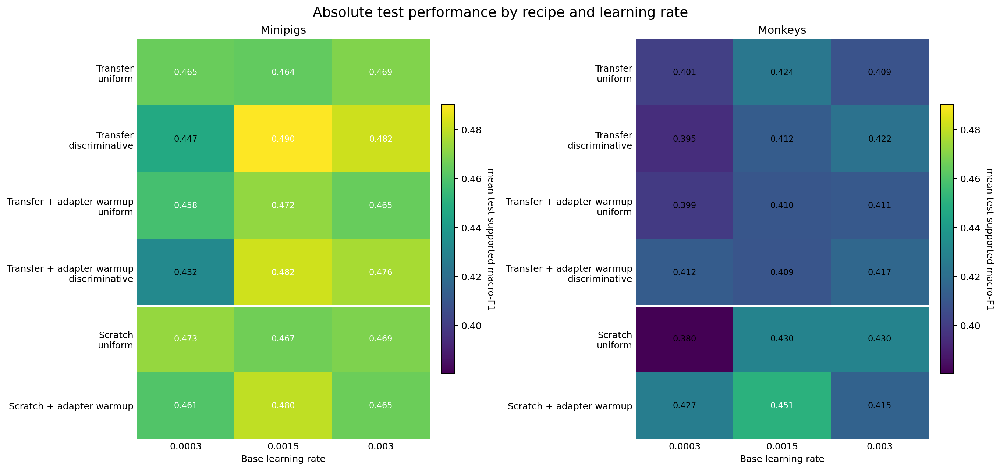
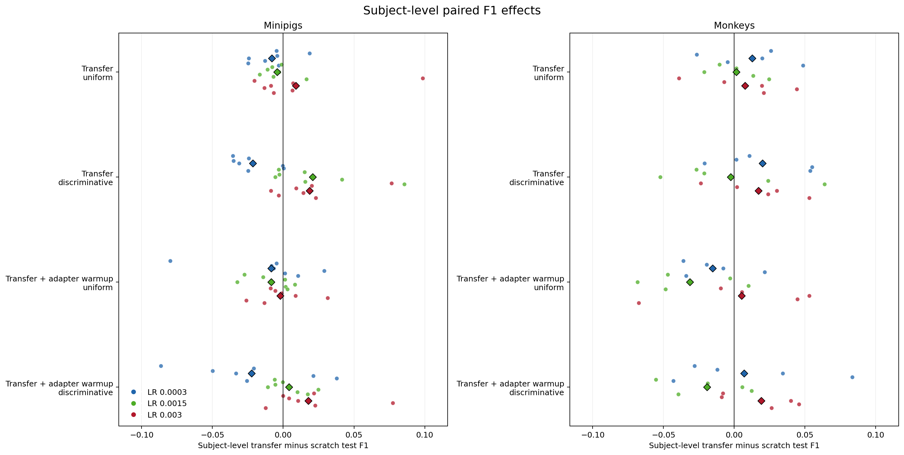
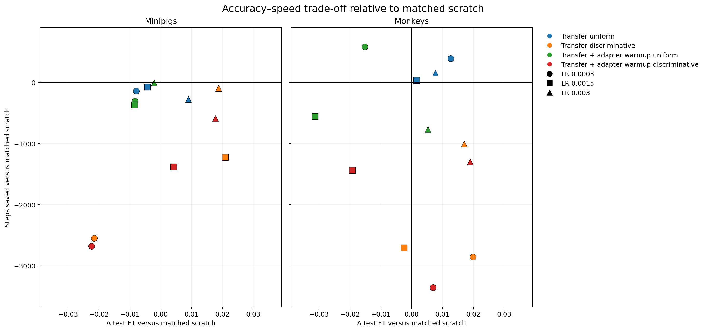
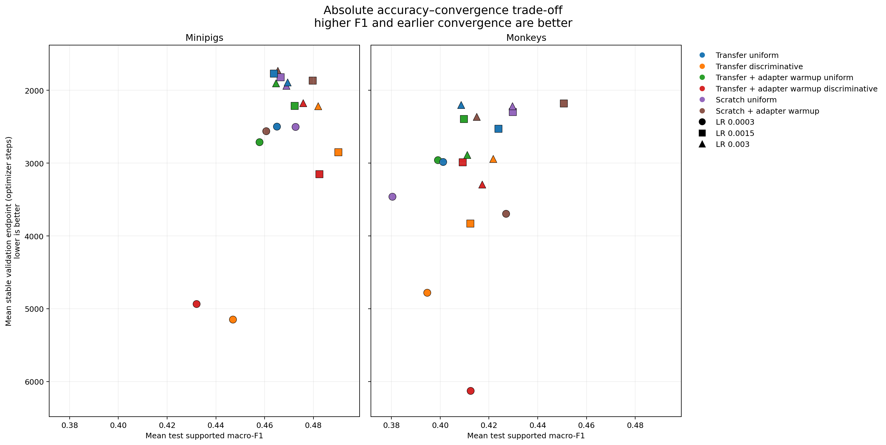

# Phase 4D -- Transfer Recipe and LR Warmup Screen

**Status:** Completed
**Date started:** 2026-09-11
**Parent experiment:** [Phase 4C -- 500-Step Head Reset and Backbone Freezing](20260911-MS-500step-head-reset-transfer.md)
**Follow-up experiments:** [Phase 4E -- Validation-Loss Checkpoint Transfer Learning Curves](20260914-MS-validation-loss-checkpoint-transfer-learning-curves.md)
**Tags:** neurosoft, supervised-pretraining, transfer, learning-rate, warmup, session-adapter, phase4d, 8band, mila

## Background

[Phase 4C](20260911-MS-500step-head-reset-transfer.md) found that resetting the
source router did not produce a reliable advantage over scratch, while frozen
500-step transfer was substantially below both scratch and full fine-tuning.
The learned frozen representation was also no better than the frozen-random
control.  This may reflect an optimization/interface problem rather than the
absence of transferable source information: the target session adapter is
fresh, the transferred encoder is updated with the same relatively large LR as
fresh parameters, and the existing target recipe was inherited from earlier
experiments rather than calibrated for this transfer boundary.

This follow-up keeps the source checkpoint and target task fixed while testing a
small, deliberately bounded set of downstream optimization recipes.  It also
replaces the previous target-seed replication axis with three plausible base
learning rates, so the experiment can determine whether the apparent transfer
failure is sensitive to ordinary optimizer choices without launching a full
hyperparameter sweep for every method.

## Question

Across the four proposed downstream adaptation recipes, how strongly does the
base target learning rate affect 500-step source-checkpoint transfer, and does
adapter/router calibration plus a conservative LR for transferred parameters
produce a simple transfer recipe that is performance-safe relative to scratch?

## Hypothesis

The current uniform-LR recipe is unnecessarily destructive or poorly matched
to the fresh target session adapter.  A recipe that first calibrates the fresh
adapter/router for 500 target optimizer steps and then uses a lower LR for the
transferred frontend/GRU will produce the most reliable transfer.  At least
one of the three base LRs will be performance-safe relative to a matched
scratch control (lower 95% subject-bootstrap bound at least -0.01) and will
avoid the large frozen-transfer deficit, while the best recipe/LR combination
will show no worse stable validation convergence than scratch at the same LR.

## Experiment

### Setup

- **Model:** The audited train-global-normalized `NeurosoftConvBiGRU` with
  per-recording session-specific linear adapters, target-fresh router, and
  full target fine-tuning after the selected warmup.
- **Source checkpoint:** The existing audited 500-step full-pool checkpoint
  for source selection/model seed pair `(42,42)`, target-excluded and same
  species, transferred with `full_finetuning_reset_router`. No new source
  pretraining is launched.
- **Target data:** All 40 eligible minipig and 13 eligible monkey recordings,
  using the established causal intrasession splits and full target training
  fraction.
- **Target seed:** Fix target seed to `42` for every new cell. This is an
  optimizer-recipe/LR screen, not a source-seed or target-seed robustness
  claim.
- **Common optimizer schedule:** Use a fixed NeuralBench-inspired LR warmup:
  linearly ramp each active optimizer group from `1e-4` of its peak LR to its
  peak over the first 10% of that cell's estimated optimizer steps, then hold
  the peak LR constant for the remainder. There is no cosine or other decay.
  The schedule warmup is common to every arm and is distinct from the
  recipe-level adapter warmup below.

### Recipe matrix

| Recipe | First 500 target steps | After step 500 |
|---|---|---|
| Uniform, no adapter warmup | All target parameters trainable | All parameters use the base LR |
| Discriminative, no adapter warmup | All target parameters trainable | Fresh adapter/router use the base LR; transferred frontend/GRU use `0.1 ×` base LR |
| Adapter warmup + uniform | Freeze transferred frontend/GRU; train fresh adapter/router | Unfreeze all parameters; all use the base LR |
| Adapter warmup + discriminative | Freeze transferred frontend/GRU; train fresh adapter/router | Unfreeze all; fresh adapter/router use base LR and transferred frontend/GRU use `0.1 ×` base LR |

The adapter warmup trains both the fresh target session adapter and fresh
router, since both are required before the transferred encoder can be used
effectively. The frozen temporal frontend remains in evaluation mode. The GRU
must remain in training mode because cuDNN requires that mode for backward
through a recurrent block into the trainable adapter; its dropout is disabled
during warmup so it does not inject stochasticity into the fixed
representation.

### LR matrix

The searched base learning rates are `3e-4`, `1.5e-3`, and `3e-3`.  The middle
value is the existing matched target recipe; the other two provide one lower
and one higher reasonable alternative.  The discriminative arms derive the
transferred-encoder LR mechanically as 10% of the selected base LR rather
than introducing a second search axis.

### Scratch controls

New scratch controls use target seed 42 and the same three base LRs:

- **Scratch uniform:** fresh model, all parameters use the base LR.
- **Scratch adapter warmup:** random frontend/GRU are frozen for 500 steps
  while the fresh adapter/router train, then all parameters use the base LR.

The discriminative scratch duplicates are omitted because there are no
transferred parameters to receive a distinct low LR.  Existing Phase-2/Phase-4
scratch and Phase-4C transfer runs remain historical references but are not
treated as exact controls for the new common LR-warmup schedule.

### Run matrix

| Population | Conditions | New cells |
|---|---:|---:|
| Pretrained transfer: minipigs | 40 sessions × 4 recipes × 3 LRs | 480 |
| Pretrained transfer: monkeys | 13 sessions × 4 recipes × 3 LRs | 156 |
| Scratch: minipigs | 40 sessions × 2 recipes × 3 LRs | 240 |
| Scratch: monkeys | 13 sessions × 2 recipes × 3 LRs | 78 |
| **Total** |  | **954** |

### Metrics and decision rule

- **Primary metric:** target-test supported macro-F1, selected only through the
  target validation checkpoint and aggregated by session, then subject, then
  species.
- **Secondary metrics:** validation supported macro-F1 at fixed optimizer
  steps, stable time-to-90%-of-peak validation F1, target-adapter parameter
  movement during the first 500 steps, and transferred frontend/GRU parameter
  movement after unfreezing.
- **Primary comparison:** each transfer recipe/LR is compared with scratch at
  the same base LR and common LR-warmup schedule. Subject-balanced bootstrap
  intervals are reported, with the limitation that the fixed target seed does
  not estimate seed variance.
- **Working-recipe gate:** a recipe/LR is favorable when it is performance-safe
  relative to its matched scratch control, has finite/stable optimization, and
  does not require a materially later stable validation endpoint. Among
  favorable arms, prefer the simplest recipe with the smallest base LR that
  does not sacrifice convergence.
- **Interaction analysis:** report whether the recipe ranking changes across
  the three base LRs. Do not interpret a single winning LR as a general
  hyperparameter optimum or make a multi-seed robustness claim.

### Launch command

```bash
export FOUNDRY_DATA_ROOT=/network/scratch/s/sobralm/brainsets/processed
export FOUNDRY_SNAPSHOT_ROOT=/network/scratch/s/sobralm/foundry-launches
export FOUNDRY_CHECKPOINT_ROOT=/network/scratch/s/sobralm/foundry-checkpoints

# Requires a clean, committed repository before the snapshot is created.
git status --short

uv run python tools/compile_downstream_cells.py \
  --registry launch/checkpoint_sets/phase4a-mila-early-checkpoints.jsonl \
  --recipe configs/downstream_recipes/phase4d_transfer_lr_warmup.yaml \
  --audit docs/neurosoft-phase0-audit.json \
  --checkpoint-root "$FOUNDRY_CHECKPOINT_ROOT" \
  --output-dir launch/phase4d \
  --check

uv run python main.py \
  experiment=auditory_decoding/neurosoft_conv_bigru_transfer_minipigs \
  hydra/launcher=slurm_default hydra.launcher.partition=long \
  hydra.launcher.gres=gpu:rtx8000:1 \
  hydra.launcher.cell_list=launch/phase4d/phase4d-transfer-lr-warmup-minipigs.jsonl \
  hydra.launcher.tasks_per_node=4 hydra.launcher.cpus_per_task=1 \
  hydra.launcher.mem_gb=32 -m

uv run python main.py \
  experiment=auditory_decoding/neurosoft_conv_bigru_transfer_monkeys \
  hydra/launcher=slurm_default hydra.launcher.partition=long \
  hydra.launcher.gres=gpu:rtx8000:1 \
  hydra.launcher.cell_list=launch/phase4d/phase4d-transfer-lr-warmup-monkeys.jsonl \
  hydra.launcher.tasks_per_node=4 hydra.launcher.cpus_per_task=1 \
  hydra.launcher.mem_gb=32 -m
```

The initial arrays were cancelled after confirming that adapter-warmup cells
failed in cuDNN GRU backward because the frozen GRU was placed in evaluation
mode.  Relaunched on 2026-09-11 from fixed commit `6bd4b38`: minipigs Slurm
array `10763305_[0-179]` (720 cells), snapshot
`/network/scratch/s/sobralm/foundry-launches/20260911T203305_NEUROSOFT_TRANSFER_MINIPIGS_6bd4b38f_890c52db`;
monkeys Slurm array `10763304_[0-58]` (234 cells), snapshot
`/network/scratch/s/sobralm/foundry-launches/20260911T203306_NEUROSOFT_TRANSFER_MONKEYS_6bd4b38f_a53b3a13`.

### Key config overrides

- Fixed Phase-4C 500-step source manifest, source selection/model seeds
  `(42,42)`, and `run.pretrained_transfer_regime=full_finetuning_reset_router`
  for all transfer cells; scratch cells carry explicit null source fields.
- `run.seed=42` for all new cells.
- Base `hyperparameters.learning_rate` in `{0.0003, 0.0015, 0.003}`.
- Discriminative arms set `hyperparameters.backbone_components` to
  `[temporal_frontend,gru]` and use a transferred frontend/GRU LR equal to 10%
  of the selected base LR; fresh adapter/router parameters use the base LR.
- Common optimizer LR schedule: `scheduler_name=phased`,
  `warmup_fraction=0.1`, `scheduler_interval=step`, followed by constant LR
  with no decay.
- Adapter-warmup arms set `adapter_warmup_steps=500`; only
  `session_adapter` and `router` are trainable during that phase, with the
  frontend in evaluation mode and the GRU in deterministic training mode for
  cuDNN-compatible backward before both are unfrozen.
- Scratch cells carry explicit null source provenance and use the same target
  data, seed, LR values, and common schedule.

## Results

### Summary

All 954 planned cells produced finished W&B runs with test supported macro-F1
and stable validation endpoints: 720/720 minipig cells and 234/234 monkey
cells.  The first relaunch exposed a separate best-checkpoint loading failure
at test time; after setting `weights_only=False` for the Lightning test
restore and rerunning the 469 affected cells, all retry arrays completed
successfully.

The dominant result is strong learning-rate sensitivity.  The low base LR
(`3e-4`) is usually harmful, while the high base LR (`3e-3`) makes
discriminative transfer competitive with or better than matched scratch.  The
adapter-warmup recipes do not provide a consistent additional benefit.

### Metrics

The primary comparison is transfer minus matched scratch test supported
macro-F1, with 95% subject-bootstrap intervals.  Representative high-LR
discriminative results are:

| Species | Recipe | Base LR | Δ test F1 | 95% interval | Steps saved |
|---|---|---:|---:|---:|---:|
| Minipigs | Transfer, discriminative | 0.003 | +0.019 | [+0.002, +0.040] | -94 |
| Minipigs | Transfer + adapter warmup, discriminative | 0.003 | +0.018 | [+0.001, +0.040] | -591 |
| Monkeys | Transfer, discriminative | 0.003 | +0.017 | [-0.008, +0.038] | -1008 |
| Monkeys | Transfer + adapter warmup, discriminative | 0.003 | +0.019 | [-0.002, +0.040] | -1299 |

At least one recipe/LR is performance-safe under the prespecified lower-bound
criterion in each species.  However, the strongest-F1 arms generally do not
converge faster than scratch: their steps-saved estimates are negative,
especially for monkeys.

### Analysis

The analysis is reproducible with:

```bash
uv run python analysis/20260911-MS-transfer-lr-warmup-screen_analysis.py
```

It fetches the W&B runs, validates the compiled cell provenance, computes
subject-balanced paired transfer-minus-scratch effects, and writes the CSV
tables under `analysis/csv/`.

### Figures

The main overview is the paired-effect heatmap, with supporting views for
absolute performance, subject-level variability, and the accuracy/speed
trade-off:











## Conclusions

The hypothesis is only partially supported.  The results do not establish a
major benefit from this checkpoint: recipe effects are modest, noisy, and
species-dependent.  There is evidence that the apparent transfer failure is
partly an optimization mismatch, since the discriminative transfer arms at a
high base LR recover the large F1 deficit and are performance-safe in both
species.  However, adapter/router warmup does not provide a consistent
additional benefit.

The expected convergence advantage was not observed.  The stronger-F1
transfer settings are generally slower than matched scratch, so transfer
cannot yet be claimed to provide a speed benefit.  Because the target seed was
fixed to 42, these results also do not establish seed-robust superiority or a
general hyperparameter optimum.

## Notes for future experiments

### Follow-up: improved source checkpoints

Rerun source pretraining with a maximum of 10K steps instead of 50K steps, and
select the best checkpoint using validation loss rather than validation F1.
Use the resulting checkpoints for downstream transfer evaluation across the
planned target-data training percentages.  This is the sole follow-up planned
from this experiment.
