# NeuroSoft supervised pretraining: no demonstrated benefit under the tested recipe

**Experiments:** 15 
**Date range:** 2026-08-26 to 2026-09-14 
**Contributors:** MS

> **Take-home result:** For this supervised Conv--BiGRU, pretraining provides
> no demonstrated improvement in performance, label efficiency, or
> optimization efficiency over matched training from scratch. This conclusion
> holds across two checkpoint-selection strategies, several checkpoint ages,
> and a bounded transfer-recipe search.

## Overarching question

Does supervised pretraining improve final decoding performance, reduce the
amount of labeled target data required, or reduce downstream optimization for
single-session NeuroSoft 8-band acoustic-stimulus decoding?

## Study at a glance

| Data | Model comparison | Transfer protocol | Target-data budgets |
|---|---|---|---|
| 53 eligible recordings: 40 minipig and 13 monkey | EEGNet reference; matched Conv--BiGRU scratch and transfer | Same-species source pool with the target subject excluded; three source and target seeds | 5%, 10%, 25%, 50%, 100% |
| 12 subjects: 7 minipig and 5 monkey | Recording-specific input adapters with a shared convolutional temporal frontend and bidirectional GRU | Independent adaptation to every target session | Nested causal training subsets; fixed validation and test sets |

The Conv--BiGRU is our simplest candidate continuous-brain-signal foundation
model: recording-specific input adapters feed a shared temporal frontend and
bidirectional GRU, allowing one backbone to be pretrained across sessions and
transferred to a new session. EEGNet is the established compact reference.

One preprocessing detail proved necessary. A single global mean and standard
deviation are estimated only from the causal training split and then applied
to the full recording. The recording-level transform prevents validation/test
leakage while preserving relative amplitude differences between electrodes.

## What counts as a benefit?

| Dimension | Endpoint | Interpretation |
|---|---|---|
| **Performance** | Test supported-class macro-F1 from the validation-selected downstream checkpoint | Does pretraining improve final decoding? |
| **Label efficiency** | Pretrained-minus-scratch test F1 across 5--100% target data | Does pretraining help most when target labels are scarce? |
| **Optimization efficiency** | Scratch stable step minus transfer stable step | Does transfer reach stable near-peak validation performance sooner? |

Each run selects its downstream checkpoint using validation performance. The
test split is evaluated once from that selected checkpoint. Macro-F1 is
averaged over the classes represented in the session; predictions into absent
classes still count as errors.

For optimization efficiency, validation macro-F1 is smoothed with a trailing
three-evaluation median. The endpoint is the first evaluation at which the
smoothed curve reaches at least 90% of its own smoothed peak and remains above
that threshold for three consecutive evaluations. Runs without a stable
crossing are right-censored at their final validation evaluation. Positive
"steps saved" means transfer reached the endpoint before scratch. Because the
threshold is relative to each run's own peak, speed must be interpreted
together with final performance.

Transfer outcomes are first averaged across source seeds within each target
session and target seed. Target seeds are then averaged within recordings,
recordings within subjects, and subjects receive equal weight in the species
mean. Error bars and bands are pointwise 95% non-parametric bootstrap intervals
from 20,000 resamples of subjects. Seeds are optimization replicates, not
additional biological samples.

## 1. Establishing the matched scratch baseline

Before testing transfer, we verified that the candidate model learned reliably
from scratch. Once preprocessing was matched, Conv--BiGRU exceeded EEGNet at
every target-data fraction in both species, especially for monkeys. It
therefore became the matched scratch control for all transfer claims.

## 2. Neither the best-validation-F1 nor earlier checkpoints helped

Initial experiments used the complete same-species, target-excluded source
pool and selected the source checkpoint with the best pretraining validation
F1. This did not help: at 100% target data, transfer changed subject-balanced
test F1 by **-2.35 percentage points** for minipigs (95% CI -3.38 to -1.45)
and **-1.03 points** for monkeys (95% CI -3.37 to +2.09), with no reliable
optimization advantage.

To test whether the selected checkpoint was simply too late, we then compared
predeclared source checkpoints at 500, 1,500, 5,000, and 15,000 steps with the
source-validation-selected checkpoint. The 500-step checkpoint was
approximately neutral to scratch; later checkpoints became increasingly
harmful for minipigs. Monkey estimates were less precise but showed no
compelling benefit. This pattern is consistent with longer source optimization
reducing transferability under the current objective, but it does not by
itself establish the mechanism.

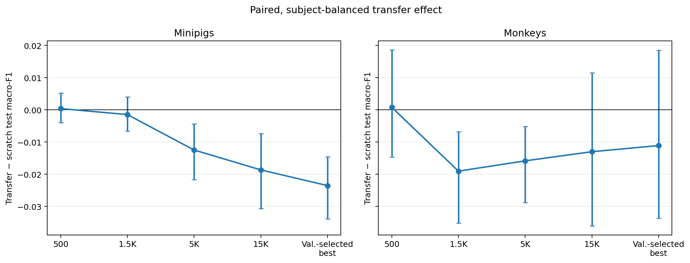

These checkpoints sample a broad, predeclared range but do not exhaust every
available source step. The result therefore does not prove that no better
checkpoint exists; it shows little evidence that a nearby checkpoint would
produce a large, robust gain.

## 3. Transfer was recipe-sensitive, but the gains were small

Resetting the source head did not reliably beat scratch. Frozen learned
features did not beat frozen random features, indicating that target backbone
adaptation was important. A bounded screen then compared four transfer
recipes at three base learning rates. High-LR discriminative finetuning could
recover small positive F1 effects, but adapter warmup was not consistently
useful and the stronger-F1 settings were generally slower than scratch.

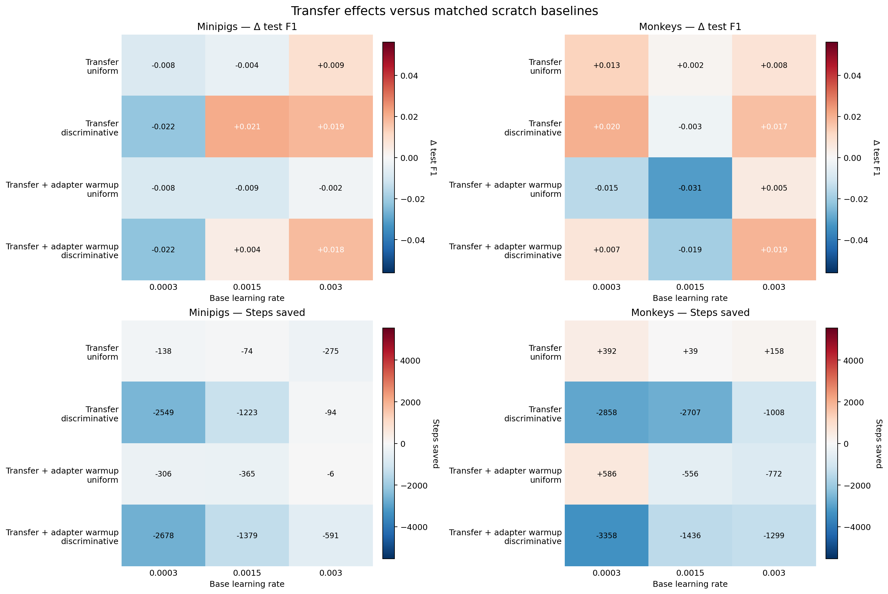

This screen motivated using the strongest observed recipe in the final,
fully replicated learning-curve experiment.

## 4. The final learning curves show no transfer advantage

The definitive test combined the most favorable lessons from the diagnostics:
source training was limited to 10,000 steps, the checkpoint was selected by
minimum source validation loss, and downstream adaptation used high-LR
discriminative finetuning. It covered all five target-data fractions with a
matched scratch control.

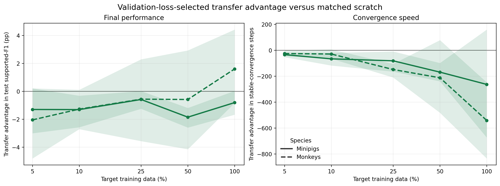

Pretraining did not improve low-data performance. Its mean F1 effect was
negative at every minipig fraction and at four of five monkey fractions. It
also generally reached stable near-peak validation performance later than
scratch. The isolated positive monkey estimate at 100% data was uncertain and
did not satisfy the prespecified complete hypothesis.

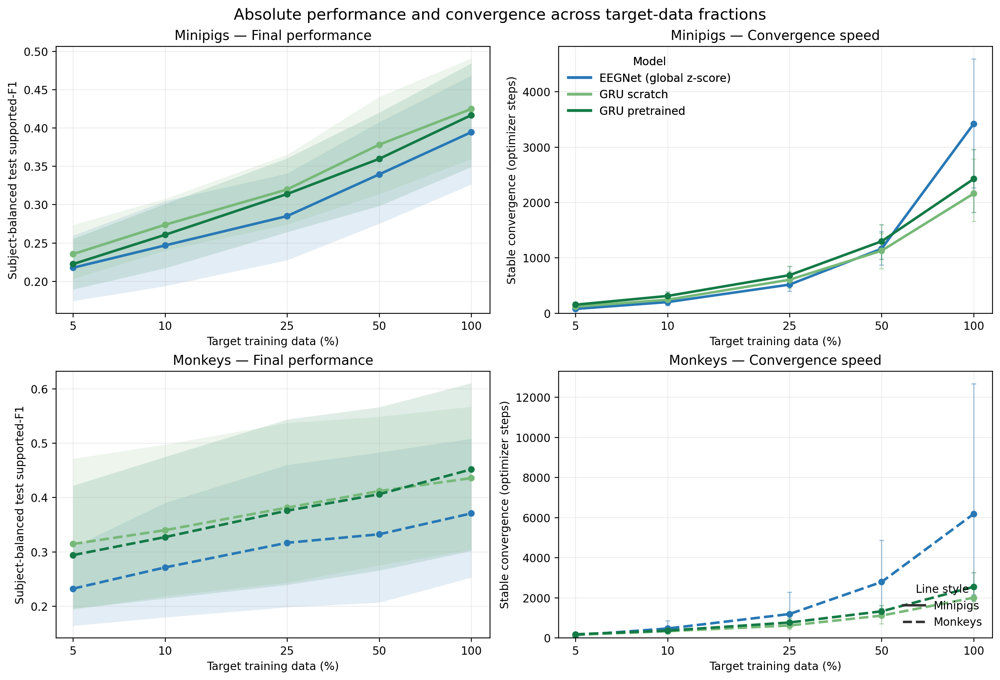

## Conclusion

Within the tested NeuroSoft setting, supervised same-species pretraining of
the Conv--BiGRU does not provide a demonstrated advantage over matched scratch
training. We find no consistent increase in final macro-F1, no advantage when
target labels are scarce, and no faster stable convergence. This remains true
after testing early and validation-selected source checkpoints, head reuse and
reset, frozen and adaptable backbones, several downstream learning rates,
adapter warmup, and a final validation-loss-selected 10K source protocol.

The appropriate decision is therefore not to expand this exact recipe into
the planned source-volume, diversity, or species-composition matrices without
changing the scientific premise.

## Shortcomings and unresolved explanations

1. **Supervised-objective mismatch.** Source classification may encourage
   subject- or session-specific decision boundaries rather than reusable
   neural features. Worsening transfer with checkpoint age is consistent with
   this explanation but does not prove it.
2. **Weak cross-session alignment.** Global normalization fixes signal scale,
   but not electrode placement, spatial correspondence, neural-response
   idiosyncrasy, or subject-specific label encoding.
3. **Checkpoint criteria remain indirect.** Source validation F1 and loss are
   not demonstrated measures of downstream transferability. Several ages were
   tested, but every possible checkpoint was not transferred.
4. **Transfer optimization was bounded.** The recipe screen covered four
   recipe families and three learning rates, with target seed 42 in the
   screening stage. It established sensitivity, not a global optimum.

## Supporting diagnostics

These figures preserve the operational and robustness evidence without
interrupting the main presentation.

### Why normalization was used

Raw signal scale interacted with the biased session adapter and LayerNorm,
collapsing the minipig representation. Train-only global z-scoring recovered
the GRU while preserving inter-electrode relative scale better than
channel-wise normalization.

### Original EEGNet reference

### Full-pool matched-LR transfer gate

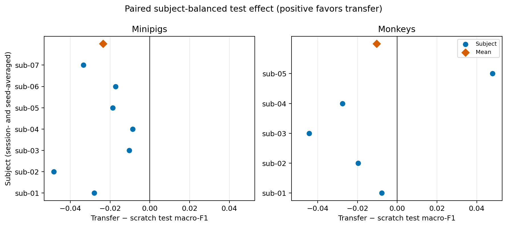

### Head-reset and frozen controls

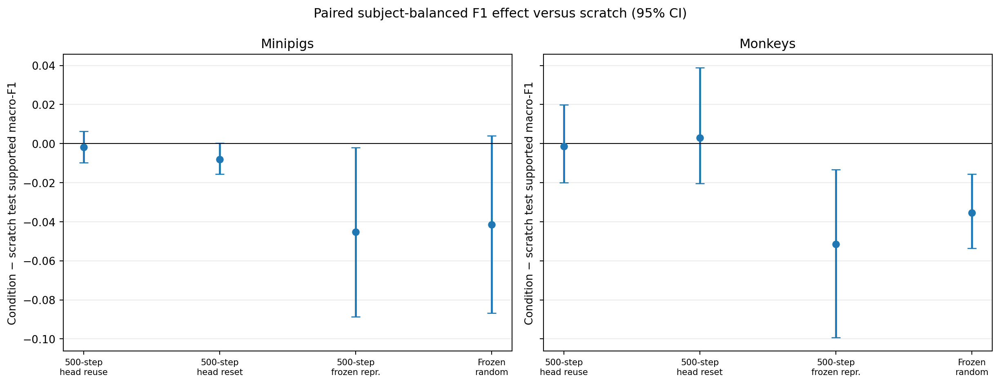

### Recipe-effect intervals

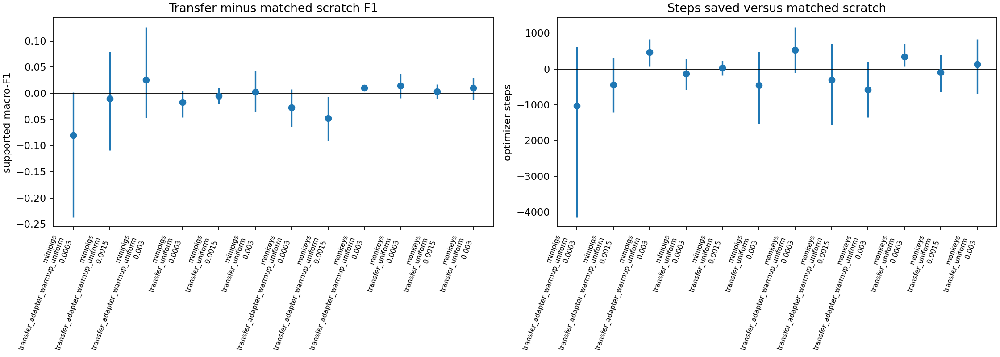

### Source validation-loss trajectories

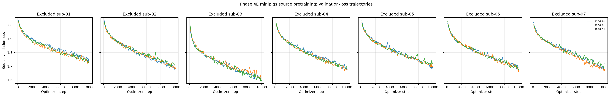

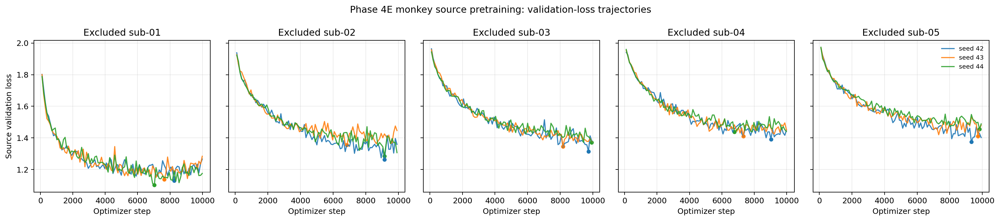

### Session heterogeneity and sensitivity analysis

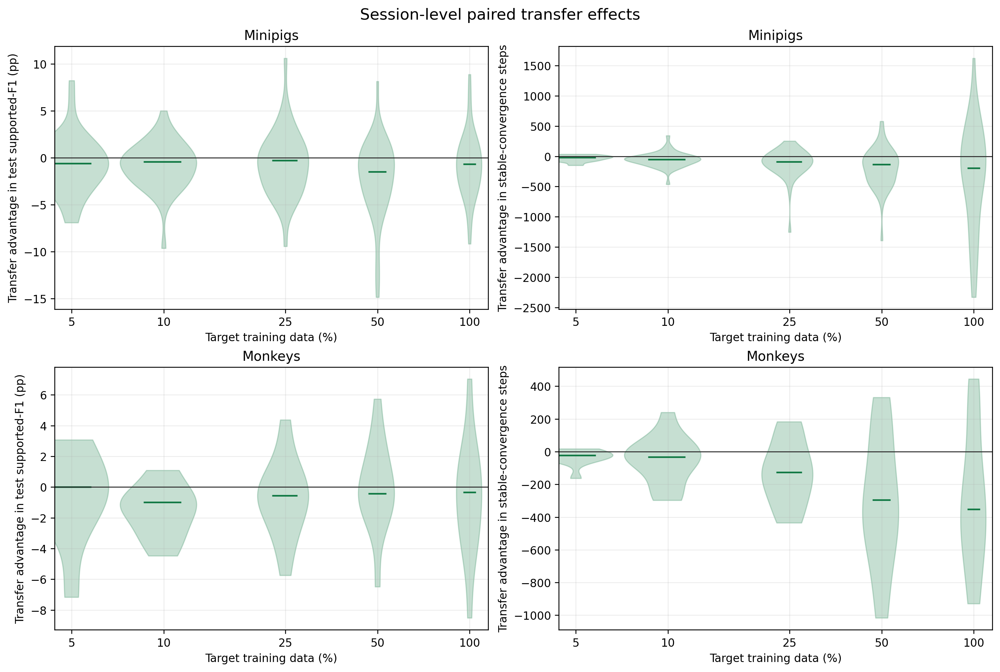

The top-half sensitivity analysis is post hoc and is not a confirmatory test;
it does not reveal a joint performance-and-speed advantage.

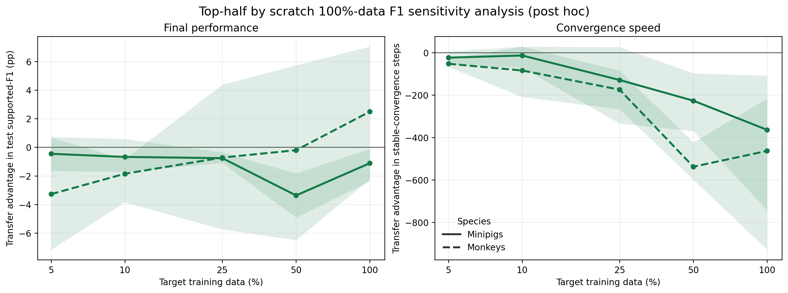

## Key takeaways

- The normalized Conv--BiGRU is a stronger scratch baseline than EEGNet across
  both species and all target-data fractions.
- Best-validation full-pool pretraining is detrimental for minipigs and has no
  demonstrated benefit for monkeys.
- Earlier checkpoints reduce the transfer deficit, but do not produce a
  robust advantage.
- Transfer-specific optimization can recover small effects, but does not
  establish an efficiency benefit.
- The final loss-selected learning curves show neither low-label nor
  optimization benefit.

## Experiment index

| # | Experiment | Verdict | Key result |
|---:|---|---|---|
| 1 | [Protocol and data audit](./20260826-neurosoft-supervised-pretraining-protocol.md) | Passed | 53 eligible recordings across 12 subjects |
| 2 | [EEGNet learning curves](./20260826-MS-neurosoft-eegnet-learning-curves.md) | Reference established | Test F1 rises with data; monkey curve plateaus after 25% |
| 3 | [Conv--BiGRU scratch pilot](./20260828-MS-neurosoft-conv-bigru-pilot.md) | Learnability gate failed | Raw minipig model collapsed to F1 0.041 |
| 4 | [Recipe recovery](./20260831-MS-neurosoft-conv-bigru-recipe-recovery.md) | Partially supported | Recipe changes rescued monkey but not minipig learning |
| 5 | [Compact-capacity screen](./20260831-MS-neurosoft-conv-bigru-compact-capacity.md) | Abandoned; superseded | Collapse traced to input scale, not capacity |
| 6 | [Normalization ablation](./20260831-MS-neurosoft-input-normalization-ablation.md) | Supported | Global z-score recovered GRU and preserved EEGNet better than channel z-score |
| 7 | [Normalization replication](./20260901-MS-neurosoft-input-normalization-replication.md) | Confirmed | Normalization ranking replicated across three seeds |
| 8 | [Matched scratch baselines](./20260901-MS-scratch-baselines-normalization.md) | Confirmed | Conv--BiGRU exceeded EEGNet at every fraction in both species |
| 9 | [Pretraining pipeline](./20260903-MS-neurosoft-supervised-pretraining-pipeline.md) | Infrastructure gate | Verified leakage-free, strict fresh-adapter transfer path |
| 10 | [Full-pool transfer gate](./20260904-MS-fullpool-finetune-transfer.md) | Not supported | Transfer − scratch: -2.35 pp minipig, -1.03 pp monkey |
| 11 | [Early-checkpoint transfer](./20260910-MS-early-checkpoint-transfer.md) | Partially supported | 500 steps neutral; later minipig checkpoints increasingly harmful |
| 12 | [Head-reset and frozen transfer](./20260911-MS-500step-head-reset-transfer.md) | Partially supported | Frozen learned representation did not beat frozen random |
| 13 | [Transfer LR and warmup screen](./20260911-MS-transfer-lr-warmup-screen.md) | Partially supported | High-LR discriminative transfer recovered small F1 effects, not speed |
| 14 | [Phase 4E runtime audit](./20260914-MS-phase4e-runtime-packing-audit.md) | Operational gate passed | Established safe packed execution for the final matrix |
| 15 | [Validation-loss checkpoint learning curves](./20260914-MS-validation-loss-checkpoint-transfer-learning-curves.md) | Not supported | No low-data or stable-convergence advantage |

## Open questions

The remaining uncertainty is whether the negative result is principally due
to the supervised source objective, insufficient cross-session alignment,
checkpoint selection that is poorly correlated with transfer, or an untested
part of the downstream optimization space. The present experiments do not
separate those four explanations.
