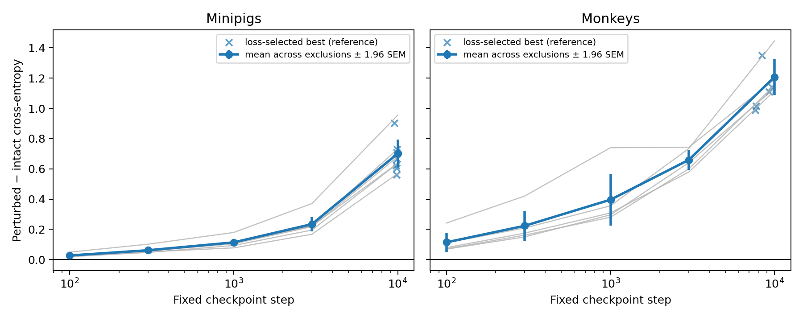
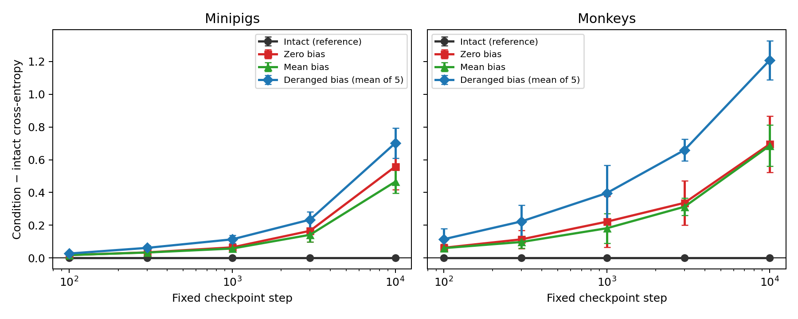
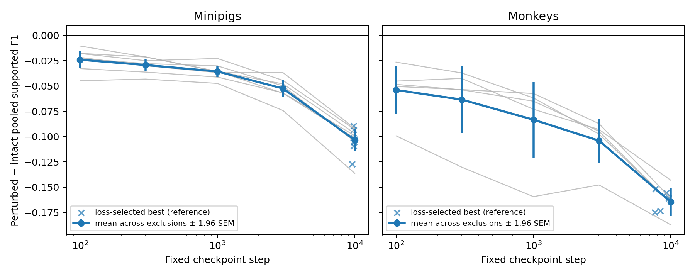
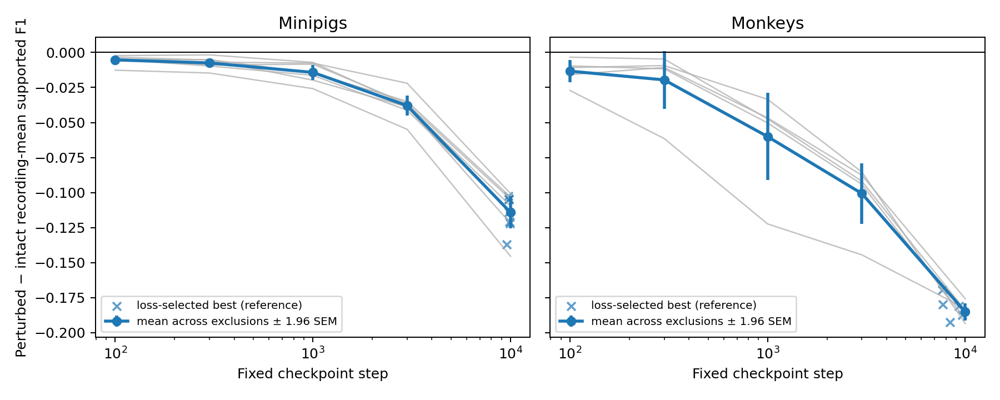

# Adapter-bias reliance across source-pretraining age

**Status:** Completed
**Date started:** 2026-09-15
**Parent experiment:** [NeuroSoft supervised pretraining: no demonstrated benefit under the tested recipe](../06-neurosoft-supervised-pretraining/README.md)
**Follow-up experiments:** [Source-validation performance versus downstream transfer](20260915-MS-source-validation-downstream-trajectory.md)
**Tags:** neurosoft, supervised-pretraining, source-evaluation, checkpoint-age, session-adapter, adapter-bias, perturbation, 8band, minipigs, monkeys

## Background

The [NeuroSoft supervised-pretraining study](../06-neurosoft-supervised-pretraining/README.md)
found no demonstrated transfer benefit for the recording-adapted Conv--BiGRU.
In the original checkpoint-age comparison, the 500-step source checkpoint was
approximately neutral to scratch, while later checkpoints became increasingly
harmful for minipigs; monkey results were less monotonic but likewise showed no
compelling benefit. The study left unresolved whether longer source training
encourages recording-specific solutions that do not transfer through a fresh
target adapter.

Each source recording has its own linear input adapter. The adapter bias is a
learned 64-dimensional vector added at every time point, so it can act as a
constant recording-identity signal. Because source validation uses held-out
intervals from the same recordings and the same learned adapters as source
training, ordinary source-validation performance cannot reveal whether the
shared backbone has become increasingly dependent on correctly matched
recording biases.

This experiment is a post hoc mechanistic diagnostic using the newer Phase 4E
source models. Those models use the final 10,000-step source recipe, validate
every 100 optimizer steps, disable early stopping, and retain fixed
checkpoints at 100, 300, 1,000, 3,000, and 10,000 steps plus a separately
retained minimum-validation-loss checkpoint. No model training or downstream
finetuning is part of this experiment.

## Question

Does the source Conv--BiGRU become increasingly dependent on the correct
recording-adapter bias as source-pretraining steps increase?

## Hypothesis

Replacing each recording's learned adapter bias with another recording's bias
will increase source-validation cross-entropy relative to the intact
checkpoint, and this permutation-induced loss penalty will grow with the
logarithm of source-pretraining step. The primary prediction is evaluated
separately for minipigs and monkeys: within a species, the hypothesis is
supported when the 95% bootstrap interval for the checkpoint-age slope is
strictly positive.

Zeroing every adapter bias and replacing every bias with the within-model mean
bias are secondary contrasts. They will help distinguish reliance on any
constant adapter offset from reliance on the correct recording-specific bias,
but they do not define the primary success criterion. Supported macro-F1 is a
secondary metric and is expected to decline as the loss penalty grows.

## Experiment

### Setup

- **Model:** Existing Phase 4E train-global-normalized
  `NeurosoftConvBiGRU` source checkpoints; model parameters remain frozen and
  no optimization is performed.
- **Data:** The original source-validation splits associated with the 36
  target-subject-excluded Phase 4E source runs: 21 minipig runs (seven target
  exclusions by three source seeds) and 15 monkey runs (five target exclusions
  by three source seeds).
- **Task:** NeuroSoft eight-band acoustic-stimulus classification.
- **Checkpoints:** Fixed milestones at 100, 300, 1,000, 3,000, and 10,000
  optimizer steps. The minimum-validation-loss checkpoint is evaluated as a
  secondary reference but excluded from the checkpoint-age slope because its
  step varies across source runs.
- **Primary metric:** Perturbed-minus-intact source-validation cross-entropy.
- **Secondary metric:** Perturbed-minus-intact source-validation supported
  macro-F1.
- **Training:** None; checkpoint perturbation and evaluation only.
- **WandB:** `20260915-MS-adapter-bias-perturbation` (`iajcilpx`), with
  definitive artifact
  `poyo-eeg/neurosoft_supervised_pretraining/20260915-MS-adapter-bias-perturbation-results:latest`

Each checkpoint is evaluated under eight conditions:

| Condition | Evaluations per checkpoint | Purpose |
|---|---:|---|
| Intact learned biases | 1 | Matched reference through the same evaluation path |
| All biases zeroed | 1 | Remove every constant adapter offset |
| All biases replaced by their within-model mean | 1 | Retain a common offset while removing recording identity |
| Recording biases deranged | 5 | Preserve the learned bias distribution while assigning every recording an incorrect bias |

The five derangements are deterministic and reproducible. Within each source
run, the same five recording-to-bias assignments are reused at every fixed
checkpoint and at the loss-selected reference so checkpoint-age comparisons
remain paired. Every derangement has no fixed points: no recording retains its
own bias.

The complete design contains 216 source checkpoints and 1,728 logical full
validation passes:

| Species | Source runs | Checkpoints per run | Conditions per checkpoint | Validation passes |
|---|---:|---:|---:|---:|
| Minipigs | 21 | 6 | 8 | 1,008 |
| Monkeys | 15 | 6 | 8 | 720 |
| **Total** | **36** | **6** | **8** | **1,728** |

For the primary analysis, the validation-loss penalty is first averaged over
the five derangements within each source run and checkpoint. Its slope against
log checkpoint step is then estimated separately by species. Source seeds are
treated as replicate initializations within a target-subject-excluded source
pool rather than as independent biological samples. The bootstrap resampling
unit is the excluded target subject after seed aggregation; because the source
pools overlap, intervals describe stability across the available exclusion
pools and must not be interpreted as inference from independent datasets.

### Launch command

```bash
# Validate all 36 source runs and all 216 checkpoint artifacts without loading data.
uv run python tools/evaluate_neurosoft_adapter_bias.py --dry-run

# Definitive single-process local evaluation (resumes by complete source run).
uv run python tools/evaluate_neurosoft_adapter_bias.py \
  --species all \
  --batch-size 128 \
  --wandb-mode online

# Exploratory primary-hypothesis pilot: seven minipig exclusions, one source
# model seed, and early/middle/late checkpoints (126 logical evaluations).
uv run python tools/evaluate_neurosoft_adapter_bias.py \
  --species minipigs \
  --source-model-seeds 42 \
  --checkpoints 100,1000,10000 \
  --conditions intact,derangement_0,derangement_1,derangement_2,derangement_3,derangement_4 \
  --batch-size 128 \
  --output-dir outputs/20260915-MS-adapter-bias-perturbation-pilot \
  --wandb-mode online
```

### Key config overrides

- `--source-root PATH` may be repeated to replace the two default Phase 4E
  species roots.
- `--data-root` defaults to `FOUNDRY_DATA_ROOT`; `--device` defaults to CUDA
  when available, and precision defaults to FP16 on CUDA and FP32 on CPU.
- `--checkpoints 100,300,1000,3000,10000,best` and
  `--conditions intact,zero,mean,derangement_0,derangement_1,derangement_2,derangement_3,derangement_4`
  select the evaluation matrix.
- `--max-source-runs` and `--max-batches` are diagnostic controls. Results
  produced with different matrix, precision, batch size, checkpoint identity,
  truncation, or evaluator code are provenance-incompatible and cannot be
  silently resumed together.
- Local incremental output is written under
  `outputs/20260915-MS-adapter-bias-perturbation`; `--overwrite` starts the
  selected matrix over without removing unrelated files.
- `--source-model-seeds 42` selects the same source initialization across all
  target-subject exclusions, which is useful for a compact exploratory pilot.
- `--progress-every-batches 5` controls within-source progress and ETA logging;
  the evaluator also reports a workload-weighted rolling ETA across source runs.

## Results

### Summary

The complete evaluation covered all 36 source runs, six checkpoints per run,
and eight bias conditions per checkpoint, for 1,728 logical evaluations. The
primary hypothesis was supported in both species: the cross-entropy penalty
from assigning every recording another recording's bias increased with the
logarithm of source-pretraining step. The 95% subject-bootstrap interval for
the slope was strictly positive for both minipigs and monkeys.

The trained models were strongly dependent on the bias associated with the
correct recording. At step 10,000, derangement increased mean cross-entropy by
0.701 for minipigs and 1.208 for monkeys. Zero and within-model mean
replacement were less damaging than derangement, showing that the specific
recording-to-bias assignment mattered beyond the presence of an arbitrary
constant offset. Both supported-F1 definitions declined as the loss penalty
grew.

### Metrics

Primary slopes were fit separately within each excluded target subject after
averaging the five derangements and the three source seeds. Confidence
intervals bootstrap excluded target subjects (10,000 replicates, seed
20260915).

| Species | Excluded subjects | Cross-entropy slope vs. `ln(step)` | 95% bootstrap interval | Strictly positive |
|---|---:|---:|---:|---:|
| Minipigs | 7 | 0.1327 | [0.1186, 0.1509] | Yes |
| Monkeys | 5 | 0.2284 | [0.2069, 0.2554] | Yes |

Secondary supported-F1 slopes were negative throughout:

| Species | Pooled supported-F1 slope | Recording-mean supported-F1 slope |
|---|---:|---:|
| Minipigs | -0.0159 | -0.0217 |
| Monkeys | -0.0228 | -0.0370 |

The step-10,000 effects summarize the practical magnitude of each
intervention. Derangement values average the five deterministic mappings.

| Species | Bias condition | Cross-entropy | Change from intact | Pooled F1 change | Recording-mean F1 change |
|---|---|---:|---:|---:|---:|
| Minipigs | Intact | 1.689 | 0.000 | 0.000 | 0.000 |
| Minipigs | Mean | 2.154 | +0.466 | -0.086 | -0.086 |
| Minipigs | Zero | 2.247 | +0.558 | -0.093 | -0.094 |
| Minipigs | Deranged | 2.390 | +0.701 | -0.103 | -0.114 |
| Monkeys | Intact | 1.381 | 0.000 | 0.000 | 0.000 |
| Monkeys | Mean | 2.066 | +0.686 | -0.103 | -0.107 |
| Monkeys | Zero | 2.076 | +0.696 | -0.101 | -0.107 |
| Monkeys | Deranged | 2.589 | +1.208 | -0.165 | -0.185 |

### Analysis

The self-contained analysis script fetches the definitive result artifact
through `wandb.Api()`, reproduces the subject-level aggregation and bootstrap,
writes intermediate tables under `analysis/csv/`, and regenerates all figures:

```bash
uv run python analysis/20260915-MS-adapter-bias-perturbation_analysis.py \
  --artifact 20260915-MS-adapter-bias-perturbation-results:latest
```

The fixed checkpoints alone define the slope. The separately
validation-loss-selected checkpoints are shown as secondary references and do
not enter the regression.

### Figures

Bias-derangement cross-entropy penalty across checkpoint age:



Comparison of intact, zero, mean, and deranged bias conditions:



Pooled supported-F1 change:



Recording-mean supported-F1 change, aligned with the existing source-session
checkpoint reporting metric:



## Conclusions

The primary hypothesis is supported: Phase 4E source models become
increasingly dependent on the correctly matched recording-specific adapter
bias as training proceeds. This is a causal statement about the effect of
changing the bias assignment in an already-trained, otherwise fixed model.
The growing penalty and the larger effect of derangement than zero or mean
replacement are consistent with progressive recording-specific
adapter--backbone co-adaptation.

The experiment does **not** establish that adapter biases caused the backbone
to overfit the source sessions or caused the previously observed degradation
in downstream transfer. A constant recording bias cannot directly encode the
window-level stimulus; it may instead provide calibration or a conditioning
signal that lets the backbone interpret the neural features. Its large
ablation effect therefore demonstrates functional importance in the learned
system, not how much task information resides in the bias itself. If biases
are removed during training, some of their function may also move into the
session-specific adapter weights or the backbone.

The source-validation data are held-out windows from known recordings, and
the excluded-source pools overlap. Consequently, the intervals quantify
stability across the available subject exclusions rather than population-level
biological uncertainty. Although the observed penalty was larger for monkeys,
no formal between-species contrast was performed.

## Notes for future experiments

1. Repeat the complete source-pretraining and downstream-transfer finetuning
   pipeline with a bias-free model. Compare it against the otherwise matched
   bias-enabled model to test whether preventing this bias pathway materially
   changes source performance or improves downstream transfer. This is the
   direct causal test of whether allowing adapter bias contributes to the
   transfer problem; a null result may indicate that its function migrated to
   other session-specific parameters.

2. Rerun downstream finetuning at 100% target data from every retained source
   checkpoint. This will test whether transfer performance becomes
   monotonically worse with increasing source-pretraining age, as observed in
   the previous pretraining run, rather than relying on a sparse subset of
   checkpoint ages.
