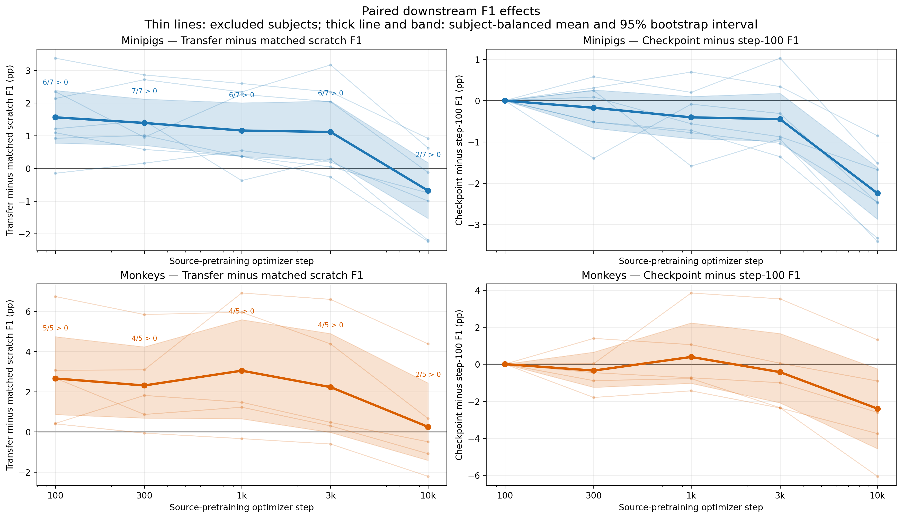
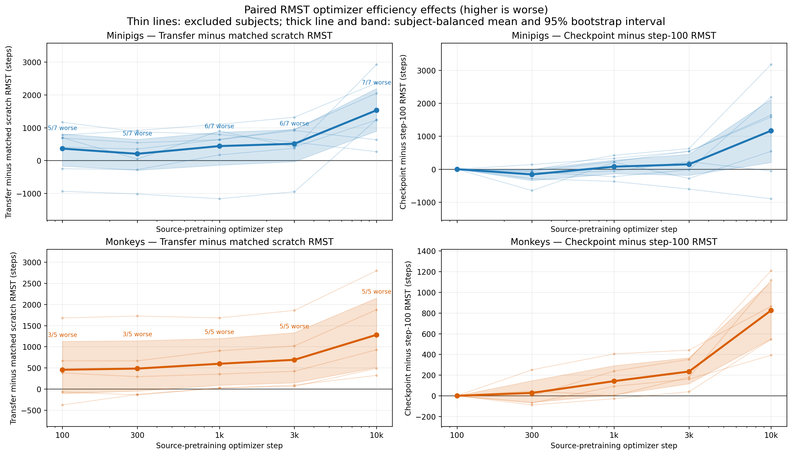
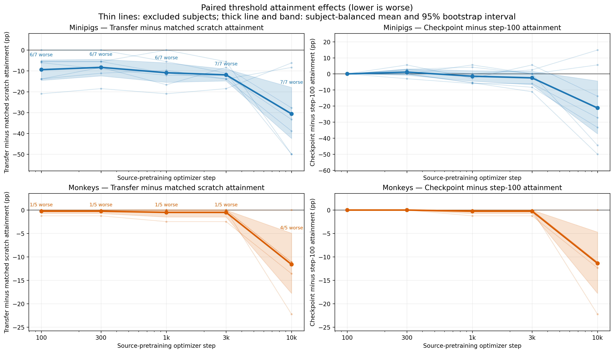
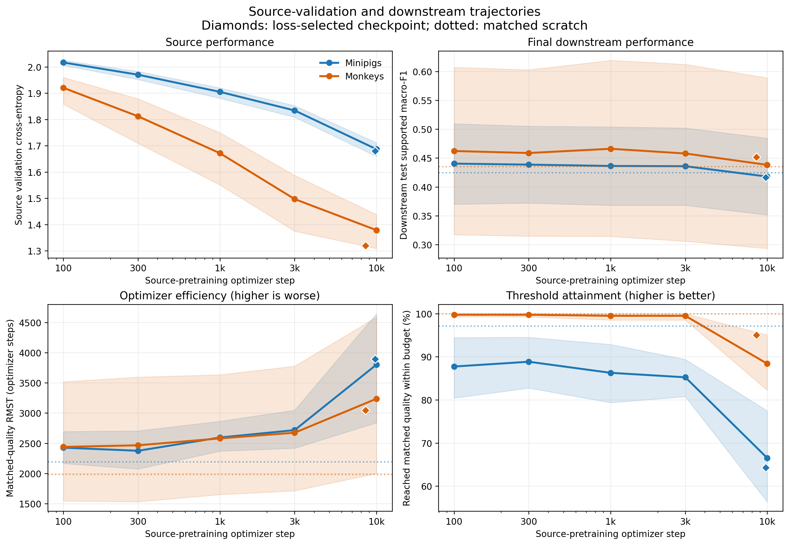
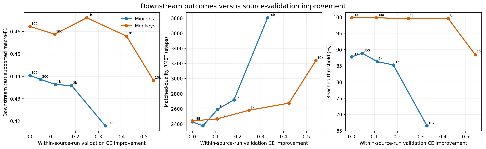
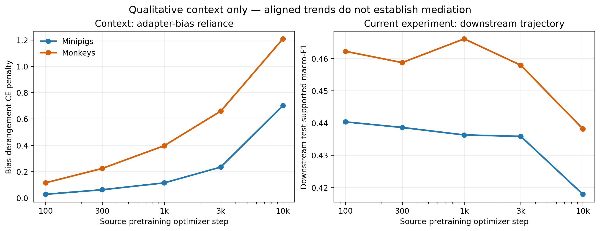

# Source-validation performance versus downstream transfer

**Status:** Completed
**Date started:** 2026-09-15
**Parent experiment:** [Adapter-bias reliance across source-pretraining age](20260915-MS-adapter-bias-perturbation.md)
**Follow-up experiments:** [Source-pretraining architecture viability](20260916-MS-pretraining-architecture-viability.md)
**Tags:** neurosoft, supervised-pretraining, checkpoint-age, source-validation, transfer, optimizer-efficiency, 8band, minipigs, monkeys, phase4f

## Background

The [Phase 4E validation-loss checkpoint study](../06-neurosoft-supervised-pretraining/20260914-MS-validation-loss-checkpoint-transfer-learning-curves.md)
trained 36 target-subject-excluded source models for 10,000 optimizer steps and
retained fixed checkpoints at steps 100, 300, 1,000, 3,000, and 10,000, plus a
minimum-source-validation-loss checkpoint. Only the loss-selected checkpoint
was transferred downstream in Phase 4E. Consequently, the study cannot show
how downstream performance changes over the source-validation trajectory.

The earlier [checkpoint-age experiment](../06-neurosoft-supervised-pretraining/20260910-MS-early-checkpoint-transfer.md)
found that a 500-step source checkpoint was approximately neutral to scratch,
while later checkpoints became increasingly harmful for minipigs. That result
used an earlier source-pretraining run, a different downstream optimization
recipe, and sparse checkpoints at 500, 1,500, 5,000, and 15,000 steps. The
relationship should therefore be tested directly using all retained Phase 4E
milestones and the final Phase 4E downstream recipe.

The parent [adapter-bias perturbation experiment](20260915-MS-adapter-bias-perturbation.md)
showed that reliance on the correct recording-specific adapter bias grows with
Phase 4E checkpoint age. That result motivates a qualitative comparison of
trajectories, but adapter-bias derangement is not an endpoint or confirmation
criterion here. This experiment tests whether improving source-validation
performance is associated with worsening downstream transfer; it cannot show
that source improvement or adapter-bias reliance causes the transfer change.

## Question

As Phase 4E source-validation performance improves across retained source
checkpoints, does downstream transfer degrade in both final held-out F1 and
the optimizer steps required to reach a matched level of useful performance?

## Hypothesis

Within each species, lower source-validation cross-entropy across the fixed
100-, 300-, 1,000-, 3,000-, and 10,000-step checkpoints will be associated
with (1) lower downstream held-out test supported macro-F1 and (2) a longer
time, or a lower probability within the downstream budget, of reaching 90% of
the matched scratch run's peak smoothed validation F1.

The joint hypothesis is supported for a species when all of the following
directional relationships hold over the five fixed checkpoints, with 95%
subject-bootstrap intervals excluding zero in the predicted direction:

1. source-validation cross-entropy decreases with `ln(source_step)`;
2. downstream test supported macro-F1 decreases as source-validation
   performance improves; and
3. matched-quality time-to-threshold worsens as source-validation performance
   improves.

If only one downstream dimension meets its criterion, the hypothesis is
partially supported. Minipigs and monkeys are evaluated separately; success
in one species is not treated as success in the other. The irregular
minimum-validation-loss checkpoint is a secondary reference and is excluded
from the ordered primary trend.

## Experiment

### Setup

- **Model:** Existing Phase 4E train-global-normalized
  `NeurosoftConvBiGRU` source checkpoints, transferred with
  `full_finetuning_reset_router`, a fresh target adapter and router, and the
  final Phase 4E high-LR discriminative recipe.
- **Source data:** Existing same-species, target-subject-excluded full source
  pools for seven minipig and five monkey exclusions. No new source training.
- **Target data:** All 53 eligible recordings (40 minipig and 13 monkey), each
  using 100% of its causal target-training split and its unchanged validation
  and test splits.
- **Task:** NeuroSoft eight-band acoustic-stimulus classification.
- **Ordered checkpoints:** Fixed source optimizer steps 100, 300, 1,000,
  3,000, and 10,000.
- **Secondary checkpoint:** The separately retained
  minimum-source-validation-loss checkpoint. Its optimizer step varies by
  source run, so it is shown as a reference but excluded from fixed-step slope
  tests.
- **Seeds:** Full crossing of source seeds `{42,43,44}` with target-finetuning
  seeds `{42,43,44}`.
- **Downstream checkpoint selection:** Maximum target-validation supported
  macro-F1 with the established patience-40 early-stopping recipe; target test
  is evaluated once after restoring that selected checkpoint.
- **Primary downstream performance endpoint:** Held-out target-test
  supported macro-F1.
- **Primary downstream efficiency endpoint:** First optimizer step at which a
  transfer run's trailing-three-evaluation-median validation F1 reaches and
  remains for three evaluations at or above 90% of the matched scratch run's
  smoothed peak validation F1. Matching is by target recording and target
  seed. Runs that do not reach the threshold are right-censored at their final
  validation step.
- **Primary source endpoint:** Source-validation cross-entropy at the exact
  retained checkpoint. Source-validation supported macro-F1 is secondary.
- **Baseline:** Existing Phase 4E scratch runs at 100% target data, matched by
  target recording and target seed.
- **WandB:** New fixed-checkpoint groups
  `20260915-MS-SOURCE_VALIDATION_DOWNSTREAM_TRAJECTORY_MINIPIGS` and
  `20260915-MS-SOURCE_VALIDATION_DOWNSTREAM_TRAJECTORY_MONKEYS`; reuse the audited Phase 4E
  groups for the loss-selected reference and scratch controls.

### Exact run matrix

Only the five fixed-checkpoint transfer cells are new:

| Species | Target recordings | Fixed checkpoints | Source seeds | Target seeds | New transfer runs |
|---|---:|---:|---:|---:|---:|
| Minipigs | 40 | 5 | 3 | 3 | 1,800 |
| Monkeys | 13 | 5 | 3 | 3 | 585 |
| **Total** | **53** | **5** | **3** | **3** | **2,385** |

The analysis additionally reuses 477 Phase 4E transfer runs at 100% target
data from the minimum-loss checkpoint (360 minipig and 117 monkey) and 159
matched scratch runs (120 minipig and 39 monkey). Thus the complete downstream
analysis contains 2,862 transfer observations across six checkpoint labels
and 159 scratch observations, while requiring exactly 2,385 new training
runs. The 36 existing source runs contribute 180 fixed-checkpoint source
measurements plus 36 loss-selected references.

No lower target-data fractions, new scratch controls, new source-pretraining
runs, bias perturbations, alternate transfer regimes, or hyperparameter sweeps
belong in this experiment.

### Analysis plan

For every target recording and target seed, derive the matched-quality
threshold exclusively from the corresponding scratch validation history.
Apply that fixed threshold to every source-seed/checkpoint transfer history
for the same recording and target seed. Test F1 never enters the efficiency
threshold or downstream checkpoint selection.

For each species and checkpoint, first average target-seed replicates within
recording and source seed, then average recordings within the excluded target
subject, and finally average source seeds. Subjects receive equal weight.
Estimate the ordered checkpoint trends and their 95% intervals by resampling
excluded target subjects with replacement. The efficiency analysis must
retain censoring; report both time-to-threshold and the proportion reaching
the threshold within budget. The implementation should use a censored
time-to-event or restricted-time estimator rather than treating a censored
final step as an observed crossing.

The primary association uses within-source-run improvement in validation
cross-entropy so stable differences in difficulty among exclusion pools do
not drive the result. Report the corresponding trends against
`ln(source_step)` as an interpretable checkpoint-age view. Show the
loss-selected checkpoints only as secondary points at their actual optimizer
steps.

As contextual visualization only, place the already measured species-level
adapter-bias derangement-penalty curve from the parent experiment beside the
new source-performance and downstream trajectories. Do not include that curve
in the statistical confirmation criterion and do not interpret aligned trends
as mediation or causation.

### Launch command

```bash
export FOUNDRY_DATA_ROOT=/network/scratch/s/sobralm/brainsets/processed
export FOUNDRY_SNAPSHOT_ROOT=/network/scratch/s/sobralm/foundry-launches
export FOUNDRY_CHECKPOINT_ROOT=/network/scratch/s/sobralm/foundry-checkpoints

# Production launch requires a clean, committed repository.
git status --short

# Generate and audit a hash-verified Phase 4E milestone registry. The compiler
# emits exactly 1,800 minipig and 585 monkey transfer cells and no scratch
# cells.
uv run python tools/generate_phase4f_milestone_registry.py \
  --checkpoint-root "$FOUNDRY_CHECKPOINT_ROOT"

uv run python tools/compile_downstream_cells.py \
  --registry launch/checkpoint_sets/phase4e-fixed-milestones.jsonl \
  --recipe configs/downstream_recipes/phase4f_checkpoint_trajectory.yaml \
  --audit docs/neurosoft-phase0-audit.json \
  --checkpoint-root "$FOUNDRY_CHECKPOINT_ROOT" \
  --output-dir launch/phase4f --check

# After the compiled cell lists pass their exact-count and provenance audit:
uv run python main.py \
  experiment=auditory_decoding/neurosoft_conv_bigru_transfer_minipigs \
  run.group=20260915-MS-SOURCE_VALIDATION_DOWNSTREAM_TRAJECTORY_MINIPIGS \
  hydra.sweep.dir=/network/scratch/s/sobralm/runs/20260915-MS-SOURCE_VALIDATION_DOWNSTREAM_TRAJECTORY_MINIPIGS \
  'hydra.sweep.subdir=${run.name}' \
  hydra/launcher=slurm_default hydra.launcher.partition=long \
  hydra.launcher.gres=gpu:rtx8000:1 \
  +hydra.launcher.additional_parameters.exclude=cn-c004 \
  hydra.launcher.cell_list=launch/phase4f/phase4f-checkpoint-trajectory-minipigs.jsonl \
  hydra.launcher.tasks_per_node=8 hydra.launcher.cpus_per_task=2 \
  hyperparameters.num_workers=1 hydra.launcher.mem_gb=32 -m

uv run python main.py \
  experiment=auditory_decoding/neurosoft_conv_bigru_transfer_monkeys \
  run.group=20260915-MS-SOURCE_VALIDATION_DOWNSTREAM_TRAJECTORY_MONKEYS \
  hydra.sweep.dir=/network/scratch/s/sobralm/runs/20260915-MS-SOURCE_VALIDATION_DOWNSTREAM_TRAJECTORY_MONKEYS \
  'hydra.sweep.subdir=${run.name}' \
  hydra/launcher=slurm_default hydra.launcher.partition=long \
  hydra.launcher.gres=gpu:rtx8000:1 \
  +hydra.launcher.additional_parameters.exclude=cn-c004 \
  hydra.launcher.cell_list=launch/phase4f/phase4f-checkpoint-trajectory-monkeys.jsonl \
  hydra.launcher.tasks_per_node=8 hydra.launcher.cpus_per_task=2 \
  hyperparameters.num_workers=1 hydra.launcher.mem_gb=32 -m
```

### Submission record

Submitted from clean commit
`8b933c9ff269b8561df81c48b215a35b9666b03d` on 2026-09-15.

| Species | Logical runs | Packed allocations | Slurm array | Snapshot bundle |
|---|---:|---:|---|---|
| Minipigs | 1,800 | 225 | `10807874` | `/network/scratch/s/sobralm/foundry-launches/20260915T233754_20260915-MS-SOURCE_VALIDATION_DOWNSTREAM_TRAJECTORY_MINIPIGS_be7b3737_fbc354a1` |
| Monkeys | 585 | 74 | `10807878` | `/network/scratch/s/sobralm/foundry-launches/20260915T233836_20260915-MS-SOURCE_VALIDATION_DOWNSTREAM_TRAJECTORY_MONKEYS_be7b3737_8da4ce50` |

Both arrays use the Phase 4E downstream hardware and packing configuration:
partition `long`, one RTX 8000 per packed allocation, eight tasks per node,
two CPUs per task, one dataloader worker per task, 32 GB memory, a three-hour
limit, requeue enabled, and `cn-c004` excluded.

The initial arrays `10807331` (minipigs) and `10807340` (monkeys), submitted
from commit `8b933c9`, were cancelled. Forty minipig packed allocations had
started and failed before training because scheduled milestone manifests have
no metric-selected `monitor_value`, while the transfer loader logged that
optional value with a floating-point-only formatter. No monkey allocation had
started. Commit `be7b373775c5bd0926337726ebdb28fec4579a5e` made the logging path
support metric-free scheduled milestones and added a regression test; the
complete matrices were then resubmitted as the replacement arrays above.

### Key config overrides

- `data.training_fraction=1.0` only.
- `run.pretrained_transfer_regime=full_finetuning_reset_router`.
- `hyperparameters.learning_rate=0.003` and
  `hyperparameters.backbone_learning_rate=0.0003` for
  `[temporal_frontend,gru]`.
- Phased step scheduler with `warmup_fraction=0.1`,
  `start_lr_factor=0.0001`, `hold=0`, and `decay=0`.
- Fresh target adapter and router; no adapter warmup.
- Target seeds `{42,43,44}` crossed with all three source seeds.
- Test evaluation enabled only after validation-based downstream checkpoint
  selection.
- Registry must verify every manifest self-hash, checkpoint SHA-256, excluded
  target subject, species, source-selection seed, source-model seed, fixed
  milestone step, and source Git provenance.

## Results

### Summary

All 2,385 new fixed-checkpoint transfer runs completed: 1,800 minipig runs
and 585 monkey runs. The analysis additionally resolved all 477 reused
Phase 4E minimum-loss transfer runs, all 159 matched 100%-data scratch runs,
and the 36 source histories. The five fixed checkpoints therefore have the
complete prespecified source-seed by target-seed crossing for all 53 target
recordings.

Source-validation cross-entropy improved strongly and monotonically with
checkpoint age in both species. Downstream behavior moved in the opposite
direction, especially at 10,000 source steps. For minipigs, better source
validation was associated with significantly lower final test F1, longer
matched-quality restricted mean time-to-threshold (RMST), and lower threshold
attainment. The complete joint hypothesis was therefore supported for
minipigs. For monkeys, both efficiency endpoints degraded significantly but
the prespecified five-checkpoint F1 association included zero; the joint
hypothesis was therefore only partially supported.

The paired view is more informative than the absolute-F1 view because target
subjects differ greatly in baseline difficulty. Early checkpoints transferred
better than matched scratch: the 100-step effect was `+1.56` F1 percentage
points for minipigs and `+2.66` points for monkeys, with both subject-bootstrap
intervals above zero. This benefit disappeared by 10,000 steps. Relative to
the 100-step checkpoint, 10,000-step F1 was lower by `2.24` points for
minipigs and `2.40` points for monkeys, with both paired intervals below zero.
Thus the central empirical pattern is not simply that pretraining is always
harmful: a real early-transfer benefit is progressively erased as source
validation improves.

The efficiency degradation was clearer still. At 10,000 steps, every minipig
subject and every monkey subject had worse RMST than matched scratch. Threshold
attainment was lower than scratch for all seven minipig subjects and four of
five monkey subjects. The loss-selected reference occurred late in source
training on average (step `9,802` for minipigs and `8,528` for monkeys) and
behaved like the late fixed checkpoints rather than the beneficial early
checkpoints.

### Metrics

The primary trends use 20,000 excluded-subject bootstrap draws. Source
improvement is the within-source-run reduction in validation cross-entropy
from the 100-step checkpoint. A negative F1 or attainment slope and a positive
RMST slope are in the predicted direction.

| Species | Trend | Slope | 95% bootstrap interval | Predicted direction excludes zero |
|---|---|---:|---:|---:|
| Minipigs | Source CE vs. `ln(step)` | -0.0693 | [-0.0729, -0.0658] | Yes |
| Minipigs | Test F1 vs. source improvement | -0.0653 | [-0.0835, -0.0475] | Yes |
| Minipigs | RMST vs. source improvement | +4,247 steps | [+1,556, +6,897] | Yes |
| Minipigs | Attainment vs. source improvement | -0.649 | [-1.136, -0.151] | Yes |
| Monkeys | Source CE vs. `ln(step)` | -0.1214 | [-0.1270, -0.1158] | Yes |
| Monkeys | Test F1 vs. source improvement | -0.0349 | [-0.0726, +0.0072] | No |
| Monkeys | RMST vs. source improvement | +1,281 steps | [+847, +1,712] | Yes |
| Monkeys | Attainment vs. source improvement | -0.162 | [-0.240, -0.071] | Yes |

Absolute subject-balanced checkpoint estimates are shown below. RMST is the
area under the Kaplan--Meier probability of not yet reaching matched scratch
quality, restricted to a common within-species horizon (`7,503` steps for
minipigs and `6,347` for monkeys); lower is better. Attainment is the fraction
that reached the threshold within its observed budget; higher is better.

| Species | Source step | Source val CE | Test F1 | RMST (steps) | Attainment |
|---|---:|---:|---:|---:|---:|
| Minipigs | 100 | 2.017 | 44.03% | 2,427 | 87.7% |
| Minipigs | 300 | 1.970 | 43.86% | 2,376 | 88.8% |
| Minipigs | 1,000 | 1.905 | 43.63% | 2,596 | 86.3% |
| Minipigs | 3,000 | 1.834 | 43.59% | 2,717 | 85.2% |
| Minipigs | 10,000 | 1.687 | 41.79% | 3,802 | 66.5% |
| Monkeys | 100 | 1.920 | 46.22% | 2,440 | 99.8% |
| Monkeys | 300 | 1.812 | 45.87% | 2,466 | 99.8% |
| Monkeys | 1,000 | 1.672 | 46.61% | 2,581 | 99.5% |
| Monkeys | 3,000 | 1.497 | 45.79% | 2,674 | 99.5% |
| Monkeys | 10,000 | 1.379 | 43.82% | 3,237 | 88.4% |

The paired F1 contrasts subtract the matched scratch score before subject
aggregation. The endpoint-age contrast subtracts the same subject's 100-step
score.

| Species | Source step | Transfer minus scratch F1 (pp) | Subjects above scratch | Checkpoint minus step-100 F1 (pp) |
|---|---:|---:|---:|---:|
| Minipigs | 100 | +1.56 [+0.77, +2.38] | 6/7 | 0.00 |
| Minipigs | 300 | +1.39 [+0.71, +2.12] | 7/7 | -0.17 [-0.67, +0.26] |
| Minipigs | 1,000 | +1.16 [+0.36, +2.00] | 6/7 | -0.40 [-0.92, +0.10] |
| Minipigs | 3,000 | +1.11 [+0.25, +2.06] | 6/7 | -0.45 [-0.99, +0.18] |
| Minipigs | 10,000 | -0.68 [-1.53, +0.17] | 2/7 | -2.24 [-2.87, -1.62] |
| Monkeys | 100 | +2.66 [+0.86, +4.73] | 5/5 | 0.00 |
| Monkeys | 300 | +2.31 [+0.69, +4.22] | 4/5 | -0.35 [-1.25, +0.65] |
| Monkeys | 1,000 | +3.04 [+0.65, +5.58] | 4/5 | +0.39 [-1.04, +2.23] |
| Monkeys | 3,000 | +2.23 [-0.03, +4.88] | 4/5 | -0.43 [-2.09, +1.65] |
| Monkeys | 10,000 | +0.25 [-1.41, +2.43] | 2/5 | -2.40 [-4.57, -0.26] |

The most decision-relevant paired efficiency contrasts are the two endpoints.
Positive RMST differences are worse; negative attainment differences are
worse. These subject-level RMST contrasts retain censoring within each subject,
so a run that ended without reaching threshold is never treated as an observed
crossing.

| Species | Contrast | 100-step checkpoint | 10,000-step checkpoint |
|---|---|---:|---:|
| Minipigs | RMST minus scratch | +362 [-170, +809] | +1,530 [+896, +2,192] |
| Minipigs | Attainment minus scratch | -9.4 pp [-14.6, -4.8] | -30.6 pp [-42.5, -18.0] |
| Minipigs | RMST minus step 100 | 0 | +1,167 [+202, +2,118] |
| Minipigs | Attainment minus step 100 | 0 | -21.2 pp [-37.3, -4.4] |
| Monkeys | RMST minus scratch | +455 [-108, +1,126] | +1,280 [+508, +2,149] |
| Monkeys | Attainment minus scratch | -0.2 pp [-0.7, 0.0] | -11.6 pp [-17.8, -4.9] |
| Monkeys | RMST minus step 100 | 0 | +825 [+548, +1,102] |
| Monkeys | Attainment minus step 100 | 0 | -11.4 pp [-17.8, -4.7] |

The secondary minimum-loss references were: minipig source CE `1.680`, test
F1 `41.66%`, RMST `3,896`, and attainment `64.3%`; monkey source CE `1.319`,
test F1 `45.17%`, RMST `3,048`, and attainment `95.1%`. Matched scratch had
test F1/RMST/attainment of `42.47%`/`2,194`/`97.2%` for minipigs and
`43.56%`/`1,985`/`100%` for monkeys.

### Analysis

The self-contained W&B analysis is reproducible with:

```bash
uv run python analysis/20260915-MS-source-validation-downstream-trajectory.py \
  --entity poyo-eeg
```

It audits the immutable compiled run identities, fetches source validation
histories and downstream validation histories through `wandb.Api()`, applies
each matched scratch threshold to all corresponding transfer histories, and
writes non-versioned tables under `analysis/csv/`. The exact human-readable
run names and eight-character W&B IDs for every cell are enumerated in
`launch/phase4f/phase4f-checkpoint-trajectory-{minipigs,monkeys}.jsonl` and
the reused Phase 4E cell lists.

All 3,021 downstream runs in the analysis were finished and had complete
validation histories. Two Phase 4F runs had complete synced W&B summary files
but their test namespace was absent from the public GraphQL summary object:
`phase4f-source-validation-downstream-trajectory__minipigs__sub-04_ses-01_task-AcousStim_acq-LH_desc-raw__phase4e-minipigs-sub-04-sel42-model42-step300__full_finetuning_reset_router__f1__t43`
(`b8d4beca`) and
`phase4f-source-validation-downstream-trajectory__monkeys__sub-01_ses-011_task-AcousStim_acq-RH_desc-raw__phase4e-monkeys-sub-01-sel43-model43-step300__full_finetuning_reset_router__f1__t43`
(`2a5dda7d`). The script recovers their exact final test metrics from each
run's synced `wandb-summary.json` through the W&B file API rather than
hardcoding them.

The intervals resample entire excluded target subjects with replacement, not
individual windows, recordings, or seed runs. Each sampled subject carries
its complete five-checkpoint trajectory. Because the target-excluded source
pools overlap, these intervals quantify stability across the available
exclusion pools and should not be read as inference from independent source
datasets.

### Figures

Primary paired downstream F1 effects. Thin lines are excluded subjects; the
thick trajectory and band are the subject-balanced mean and 95% bootstrap
interval. The left panels compare transfer with matched scratch, while the
right panels compare every checkpoint with step 100.



Paired censoring-aware RMST effects. Higher values are worse.



Paired threshold-attainment effects. Lower values are worse.



Absolute source and downstream trajectories are retained as descriptive
context. Diamonds are the irregular loss-selected references and dotted lines
are matched scratch.



The direct association view removes stable differences in source-pool
difficulty by plotting downstream outcomes against within-source-run
validation-CE improvement.



The parent adapter-bias derangement penalty and downstream F1 both worsen late
in source training. This is qualitative context only and is not evidence that
bias reliance mediates the downstream degradation.



## Conclusions

The complete joint hypothesis is **supported for minipigs**. Source-validation
cross-entropy decreased with checkpoint age, downstream held-out F1 decreased
as that source metric improved, and both censoring-aware efficiency endpoints
worsened in the predicted direction with 95% subject-bootstrap intervals
excluding zero.

The hypothesis is **partially supported for monkeys**. Source-validation loss
and both efficiency measures met their directional criteria, but the
prespecified five-checkpoint F1 slope included zero. Monkey F1 was not smoothly
monotonic: it improved at 1,000 steps before falling at 10,000. Nevertheless,
the paired 10,000-minus-100 contrast was negative, so the data support a loss
of early-checkpoint performance by the end of source training without meeting
the stricter ordered-slope criterion.

The relationship is clearest as erosion of an early benefit. At 100--1,000
steps, transfer was significantly better than scratch in both species. At
10,000 steps those paired advantages had disappeared, RMST was substantially
worse than scratch for every excluded subject, and threshold attainment had
fallen sharply. The late minimum-loss checkpoint reproduced this late-stage
behavior. Selecting the checkpoint with the best source-validation loss is
therefore actively misaligned with selecting the most transferable checkpoint
under this recipe.

The parallel increase in adapter-bias derangement penalty is consistent with
progressive recording-specific adapter--backbone co-adaptation, but this
experiment is associational with respect to source training and does not show
that bias reliance causes the transfer erosion. The evidence establishes a
clear practical warning: continued improvement on same-recording source
validation is not a reliable proxy for downstream transfer quality.

## Notes for future experiments

- Test an early-source checkpoint selection rule centered on the 100--1,000
  step region rather than minimum source-validation loss, using a criterion
  that does not consume target test information.
- Add denser fixed checkpoints between 3,000 and 10,000 steps to localize the
  transition where the early transfer advantage and threshold reliability
  collapse.
- Run a causal mitigation experiment that constrains, removes, or regularizes
  recording-adapter biases during source training, then repeats the same
  paired F1 and censoring-aware efficiency analysis. This would test whether
  reducing bias reliance preserves transfer rather than merely aligning with
  it descriptively.
- Prefer paired subject-level plots against matched scratch and the earliest
  checkpoint in future transfer studies. Absolute-F1 intervals should remain
  secondary because between-subject task difficulty can obscure a consistent
  within-subject effect.
- Treat the monkey final-F1 shape as unresolved: additional independent
  subjects or a replication with another source initialization family would
  be needed to distinguish a genuinely non-monotonic trajectory from sampling
  variability.
