# Batch-128 reference transfer replication

**Status:** Completed
**Date started:** 2026-09-16
**Parent experiment:** [Source-pretraining architecture viability](20260916-MS-pretraining-architecture-viability.md)
**Follow-up experiments:** [Model-scale transfer](20260916-MS-model-scale-transfer.md), [Adapter-bias transfer](20260916-MS-bias-free-transfer.md), [Shared-adapter transfer](20260916-MS-shared-adapter-transfer.md), [Recipe-matched scratch transfer control](20260918-MS-recipe-matched-scratch-control.md)
**Tags:** neurosoft, supervised-pretraining, transfer, replication, batch-128, checkpoint-age, 8band, minipigs, monkeys

## Background

The parent experiment established that the batch-128 reference architecture
learned a non-degenerate source solution and published fixed checkpoints at
steps 100, 300, 1,000, 3,000, and 10,000. The earlier
[Phase 4F trajectory](20260915-MS-source-validation-downstream-trajectory.md)
used batch 16 and multiple source seeds, so it is historical context rather
than the control for the architecture interventions.

## Question

Does the batch-128 reference reproduce the earlier qualitative result that
early source checkpoints provide positive downstream transfer and that this
benefit changes or erodes with continued source training?

## Hypothesis

The batch-128 reference will show positive transfer-minus-matched-scratch test
supported macro-F1 at early source checkpoints, followed by a smaller benefit
or deterioration later in the source trajectory. Its direction and trajectory
shape will be compared descriptively with Phase 4F without pooling the two
experiments.

## Experiment

### Setup

- Source checkpoints: batch-128 reference steps 100, 300, 1,000, 3,000, and
  10,000; source selection/model seed `(42,42)`.
- Target data: all 53 eligible recordings at 100% of the causal training split.
- Target seeds: `{42,43,44}`.
- Transfer: `full_finetuning_reset_router`; fresh ordinary target adapter and
  router, with temporal frontend and GRU transferred.
- Scratch comparator: exact reference-architecture scratch run matched by
  species, recording, target seed, and target fraction.
- Immutable matrices:
  `launch/architecture_transfer/reference-backbone-{minipigs,monkeys}.jsonl`
  and their adjacent locks.
- W&B groups and every human-readable run name/eight-character run ID are in
  `analysis/csv/20260916-MS-batch128-reference-transfer-replication_coverage.csv`.
- Expected/observed: 795/795 transfer and 159/159 scratch runs; all 954 were
  finished and passed identity, provenance, endpoint, and history audit.

### Launch command

The completed runs were launched from the immutable compiled matrices using
the normal snapshot-backed `python main.py ... -m` workflow documented in the
parent report.

### Key config overrides

- Target batch size 16, learning rate `0.003`, backbone learning rate `0.0003`.
- Phased step scheduler, target-validation supported-F1 checkpoint selection,
  maximum 200 epochs, and early stopping patience 40.

## Results

### Summary

The table reports subject-balanced means and pointwise 95% whole-subject
bootstrap intervals. Positive F1 values favor transfer; positive step values
would indicate fewer downstream optimizer steps than matched scratch.

### Metrics

| Species | Source step | Transfer − scratch F1 (pp) | Optimizer steps saved to 90% scratch quality |
|---|---:|---:|---:|
| Minipigs | 100 | +2.06 [+1.18, +2.98] | -492 [-984, +12] |
| Minipigs | 10,000 | -2.44 [-3.36, -1.33] | -3,322 [-5,085, -1,711] |
| Monkeys | 100 | +3.01 [+0.49, +5.77] | -606 [-1,264, -65] |
| Monkeys | 10,000 | -1.02 [-2.33, +0.84] | -6,083 [-11,898, -488] |

Complete five-checkpoint tables, attainment, absolute F1, 80%/95%
sensitivity, subject ranges, and subject counts are in the generated CSVs.

### Analysis

Reproduce with:

```bash
uv run python analysis/20260916-MS-batch128-reference-transfer-replication_analysis.py
```

The script uses the immutable run IDs, smooths validation F1 with a trailing
three-evaluation median, reconstructs recording-specific 200-epoch budgets,
detects crossings per target seed, and aggregates seed -> recording -> excluded
subject -> species. Pointwise intervals use 20,000 resamples of whole subjects
with complete checkpoint trajectories.

#### Main figures

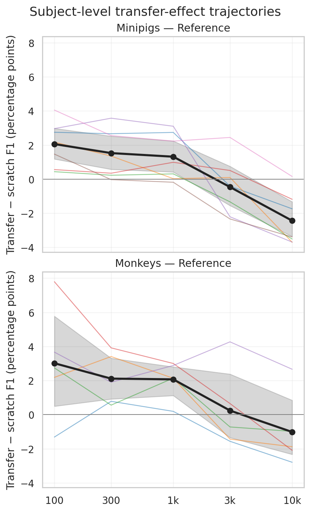

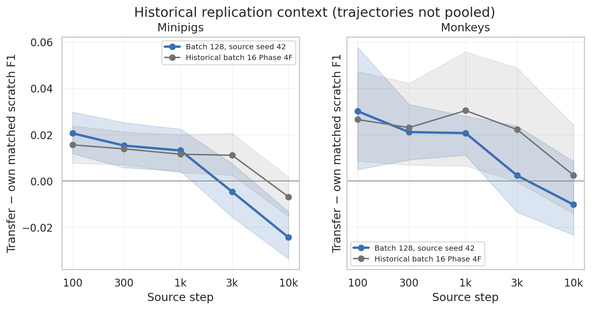

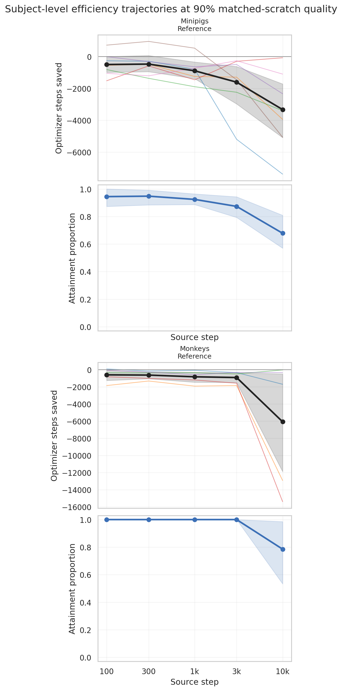

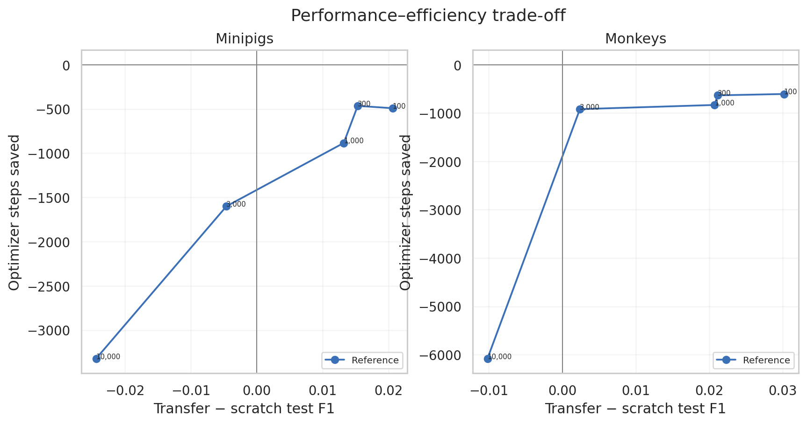

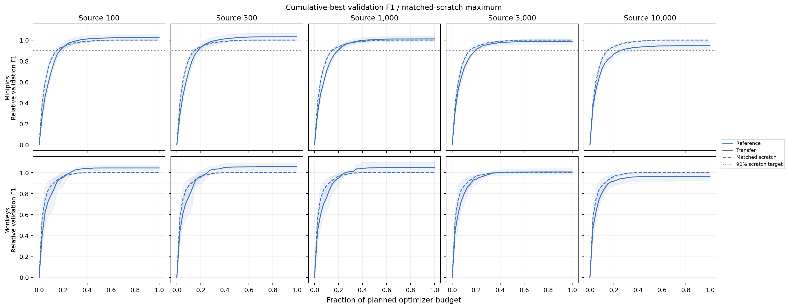

#### Annex and diagnostics

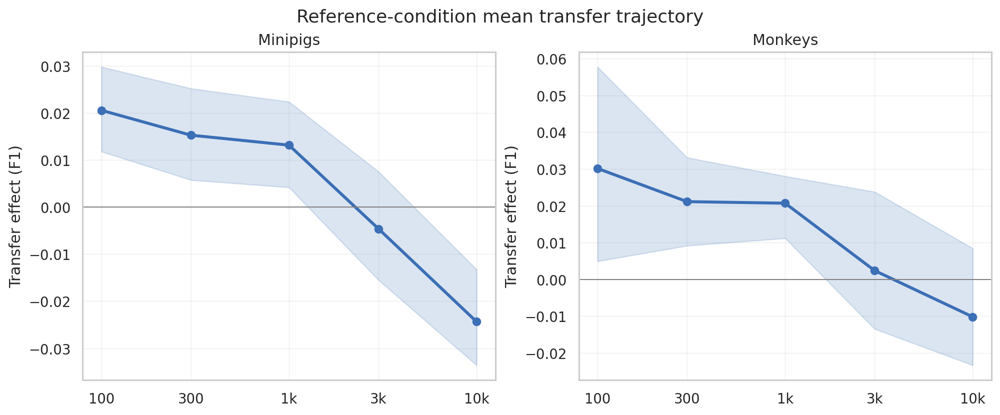

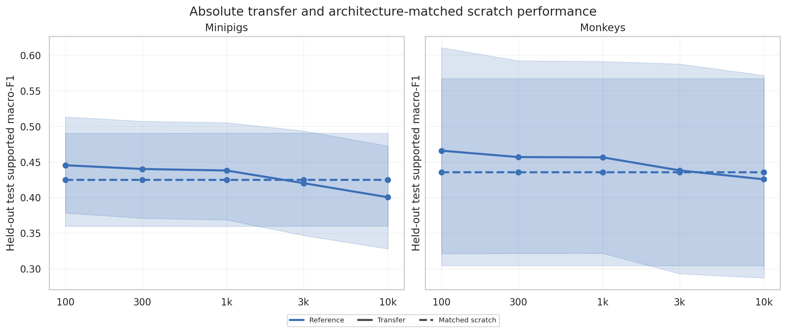

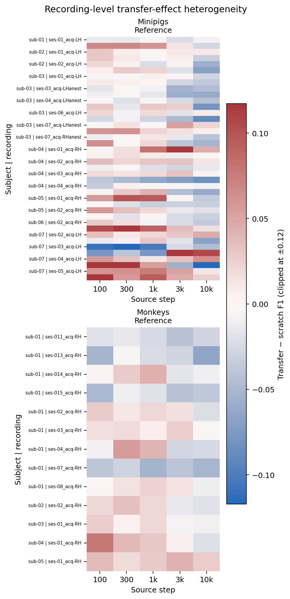

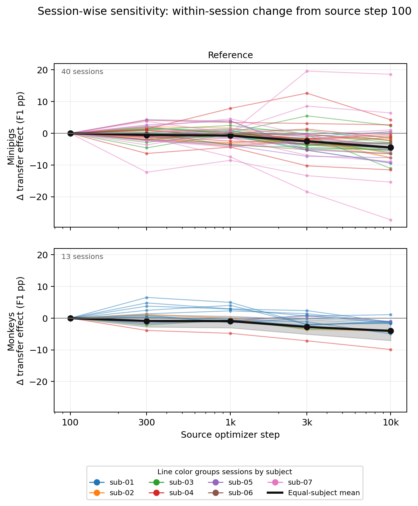

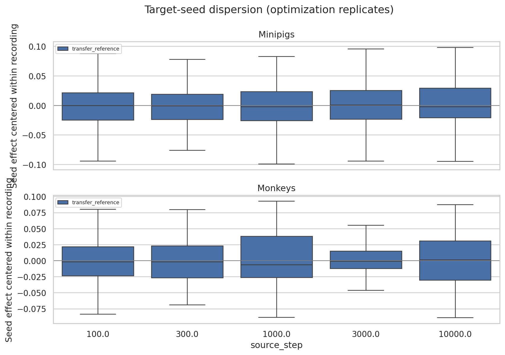

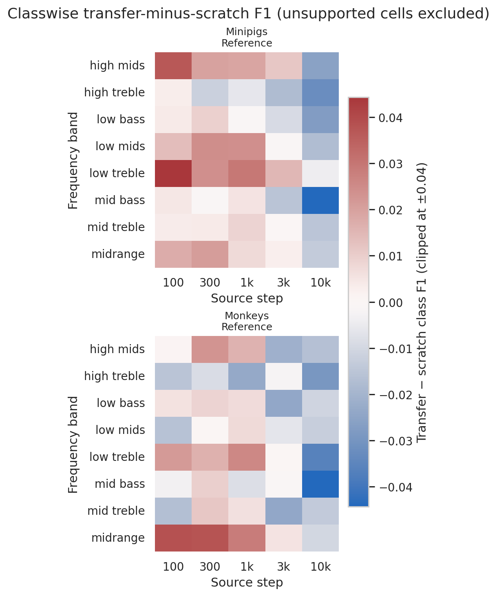


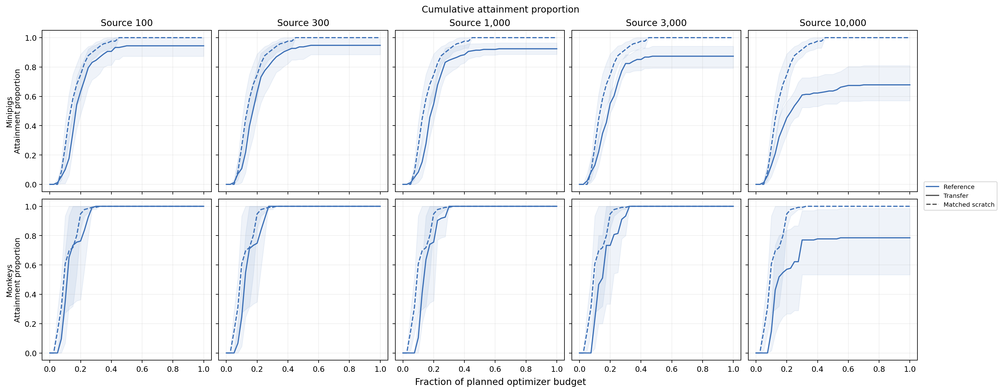

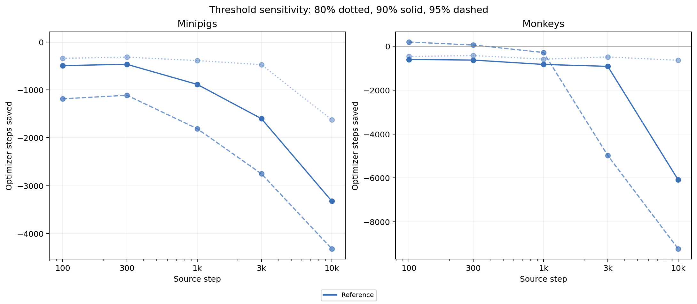

### Figures

All generated figures are referenced in the Analysis section above.

## Conclusions

The hypothesis was supported under this experiment's original scratch
comparison: the 100-step checkpoint improved test F1 in both species, but the
benefit disappeared with longer source training. Transfer did not improve
optimization efficiency, and the late checkpoints were neutral or harmful.

## Notes for future experiments

TBD
