# Model-scale transfer

**Status:** Completed
**Date started:** 2026-09-16
**Parent experiment:** [Batch-128 reference transfer replication](20260916-MS-batch128-reference-transfer-replication.md)
**Follow-up experiments:** TBD
**Tags:** neurosoft, supervised-pretraining, transfer, model-scale, checkpoint-age, efficiency, 8band, minipigs, monkeys

## Background

The [source-viability experiment](20260916-MS-pretraining-architecture-viability.md)
trained small (51,066 transferable parameters), reference (507,456), and large
(5,084,598) backbones under the same batch-128 source recipe. This experiment
treats scale as one ordered intervention and uses an architecture-matched
scratch comparator for every transfer run.

## Question

How does transferable-backbone scale change absolute target performance,
transfer benefit, and downstream optimization efficiency across source
checkpoint age?

## Hypothesis

Backbone scale will modify the complete checkpoint trajectory of
transfer-minus-architecture-matched-scratch supported macro-F1 and the number
of target optimizer steps required to reach matched scratch quality. Absolute
target performance, transfer contribution, and compute-adjusted efficiency are
analyzed separately.

## Experiment

### Setup

- Conditions: small, batch-128 reference, and large backbones.
- Source steps: 100, 300, 1,000, 3,000, and 10,000; source seed `(42,42)`.
- Target: all 53 recordings, 100% target training data, seeds `{42,43,44}`.
- Comparator: exact architecture-matched scratch run for each recording/seed.
- Immutable matrices: `small-backbone-*`, `reference-backbone-*`, and
  `large-backbone-*` JSONL/lock pairs under `launch/architecture_transfer/`.
- W&B names, groups, IDs, hashes, and states are in
  `analysis/csv/20260916-MS-model-scale-transfer_coverage.csv`.
- Expected/observed: 2,385/2,385 transfer and 477/477 scratch runs. All 2,862
  cells passed the coverage/provenance/history audit.

### Launch command

The completed matrices used the snapshot-backed compiled-cell launch workflow
documented in the source-viability report.

### Key config overrides

- Small/reference/large temporal and GRU widths were 38/128/410.
- Each condition used its matching target architecture and scratch family.
- Downstream optimizer policy was otherwise fixed across conditions.

## Results

### Summary

The table gives the first and final source checkpoints. F1 is percentage
points relative to architecture-matched scratch; step values are capped steps
saved at the primary 90% matched-scratch target.

### Metrics

| Species | Scale | Step 100: F1 pp / steps saved | Step 10,000: F1 pp / steps saved |
|---|---|---:|---:|
| Minipigs | Small | +1.26 / -1,827 | -1.80 / -3,163 |
| Minipigs | Reference | +2.06 / -492 | -2.44 / -3,322 |
| Minipigs | Large | +3.09 / -5 | -2.40 / -4,405 |
| Monkeys | Small | +1.33 / -1,140 | -0.89 / -3,103 |
| Monkeys | Reference | +3.01 / -606 | -1.02 / -6,083 |
| Monkeys | Large | +0.30 / -280 | -1.39 / -6,119 |

Whole-subject intervals and the complete trajectory are in the cached summary
tables and figures.

### Analysis

```bash
uv run python analysis/20260916-MS-model-scale-transfer_analysis.py
```

The shared analysis enforces exact scratch families, seed -> recording ->
subject aggregation, 20,000 whole-subject resamples, matched-target crossing
detection, and recording-specific planned-budget caps. Source step is the
primary axis; the scale-specific source-compute proxy and downstream
windows/FLOPs are annex views.

#### Main figures

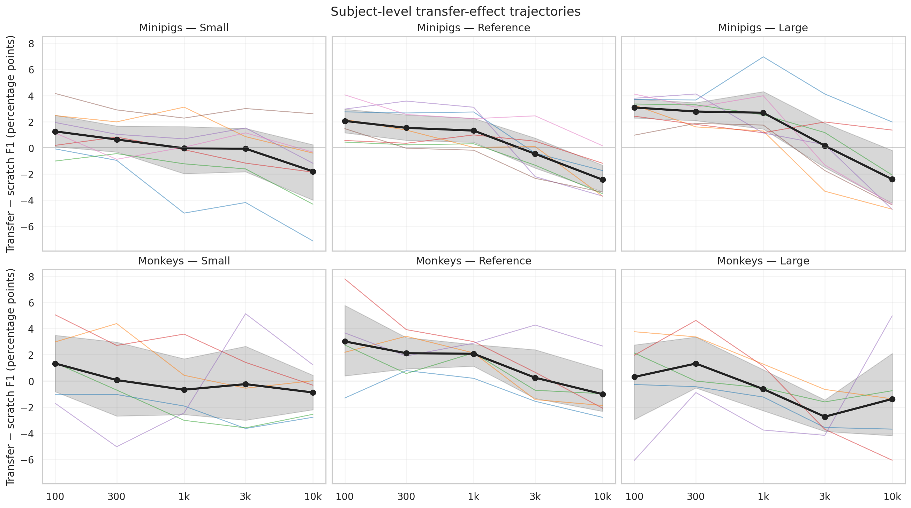

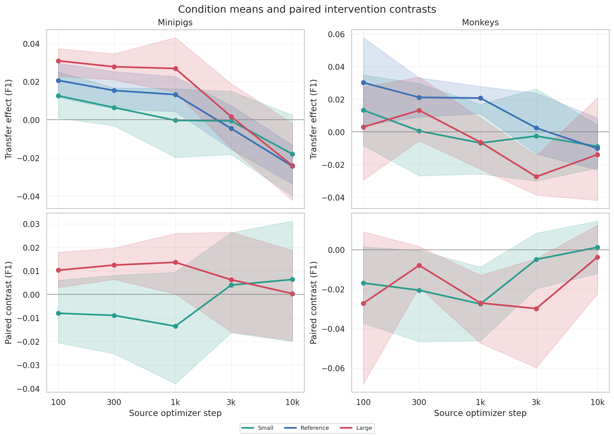

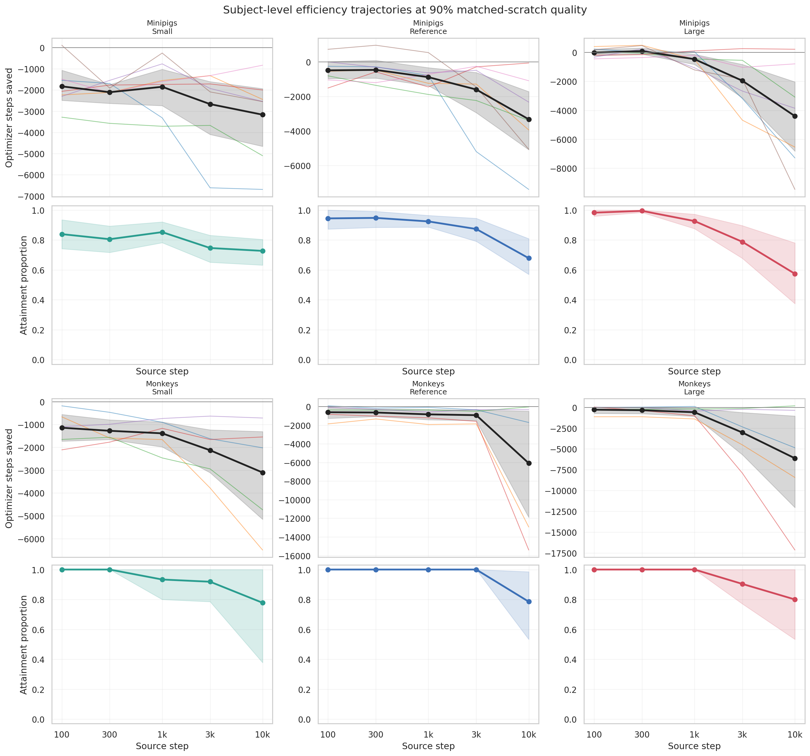

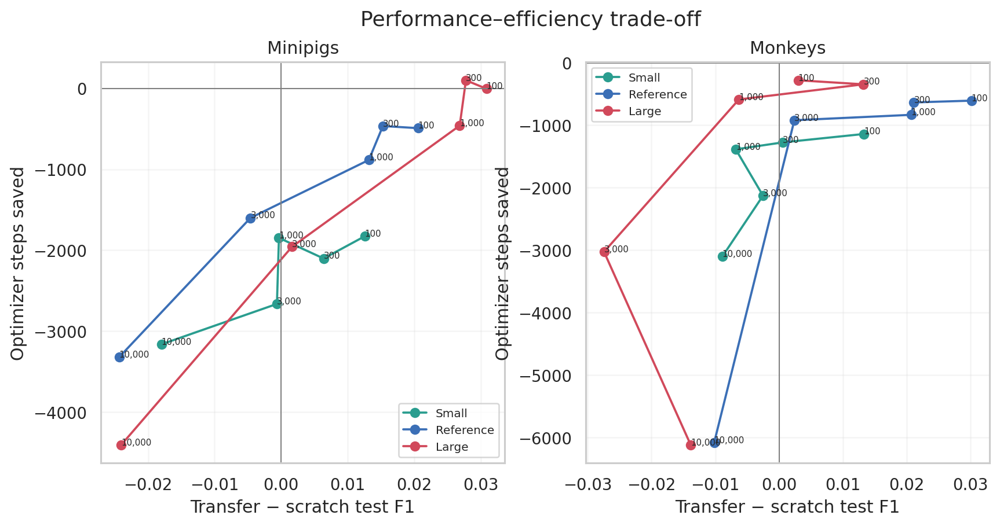

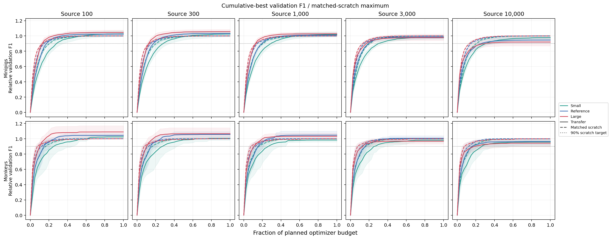

#### Annex and diagnostics

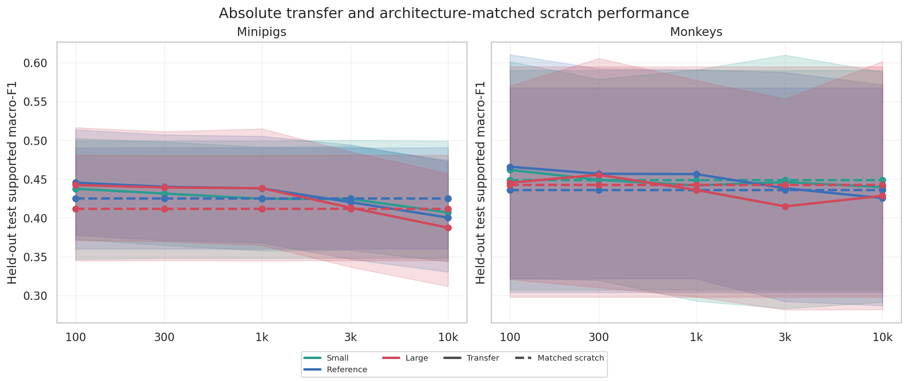

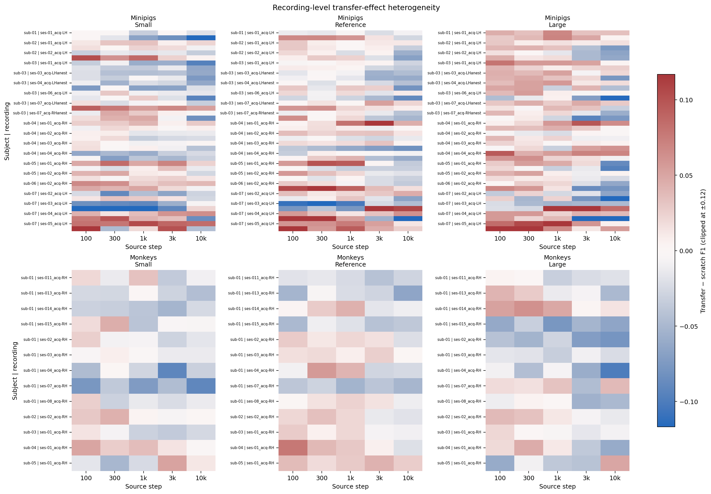

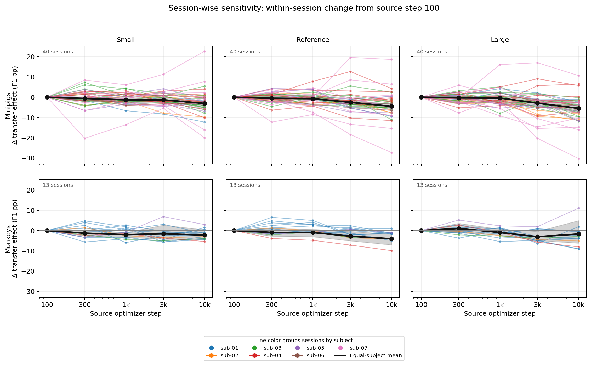

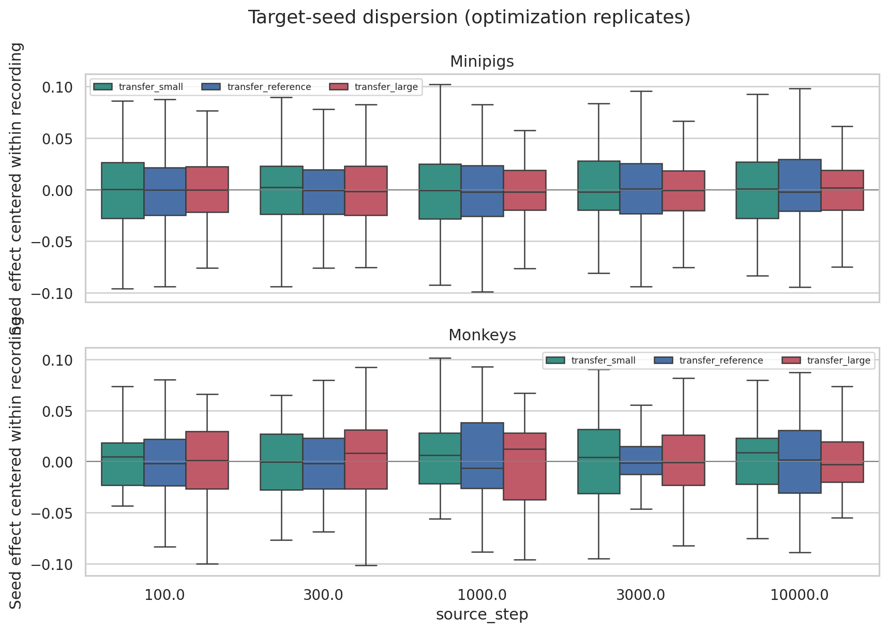

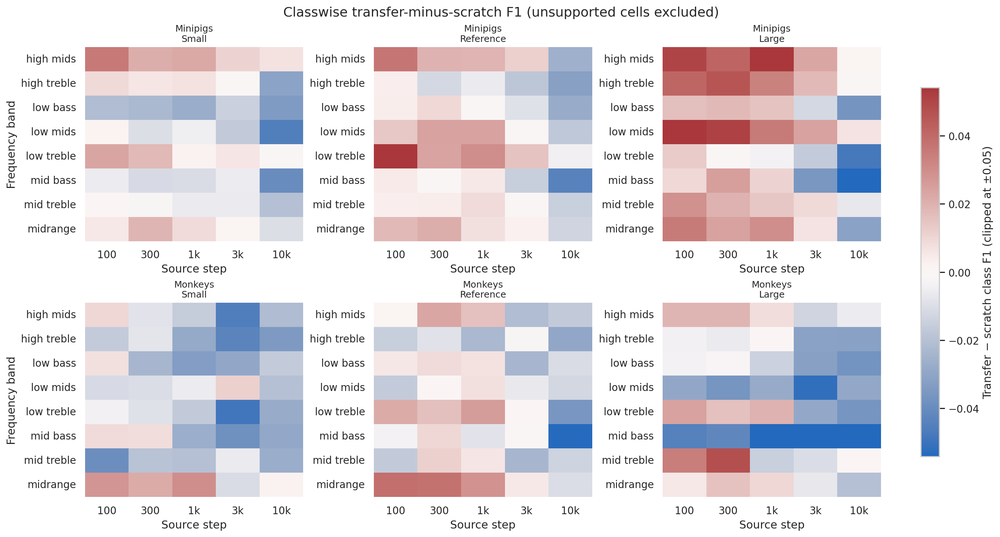

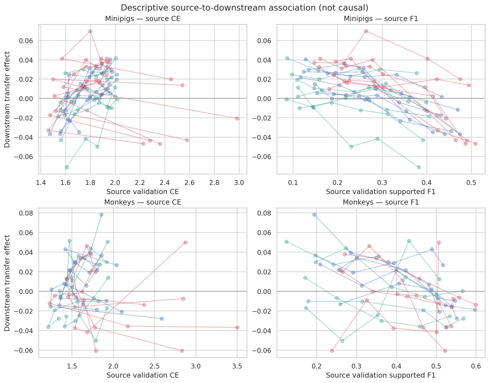

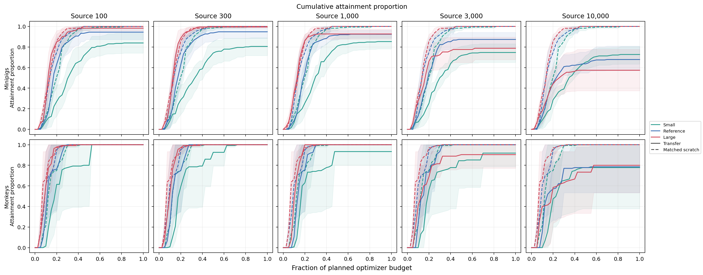

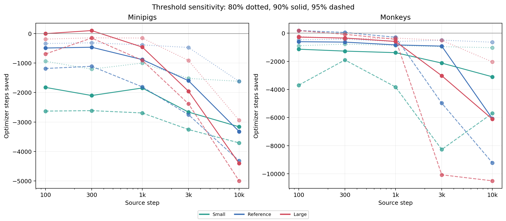

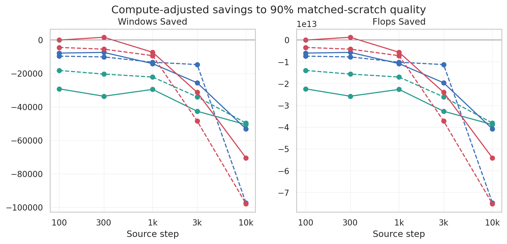

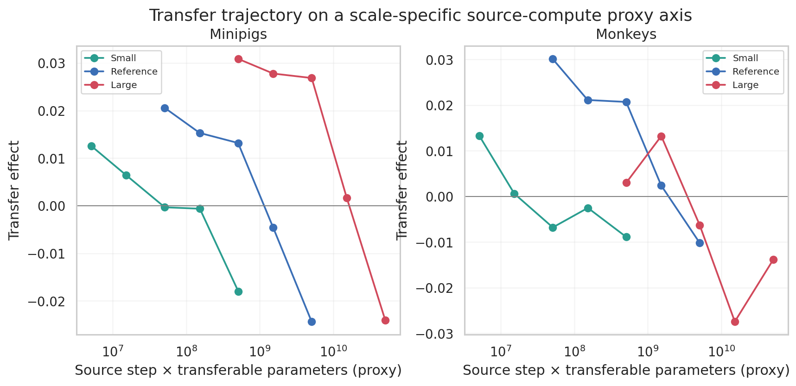

### Figures

All generated figures are referenced in the Analysis section above.

## Conclusions

Changing backbone scale did not rescue transfer. Every scale showed its best
relative performance at the earliest checkpoint and worse performance after
longer source training. None provided a consistent optimization-efficiency
benefit over its architecture-matched scratch control.

## Notes for future experiments

TBD
