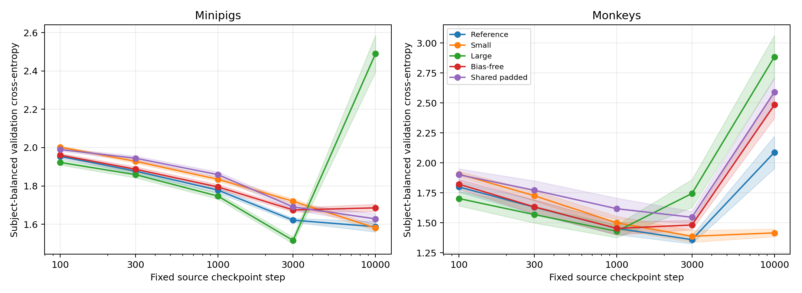
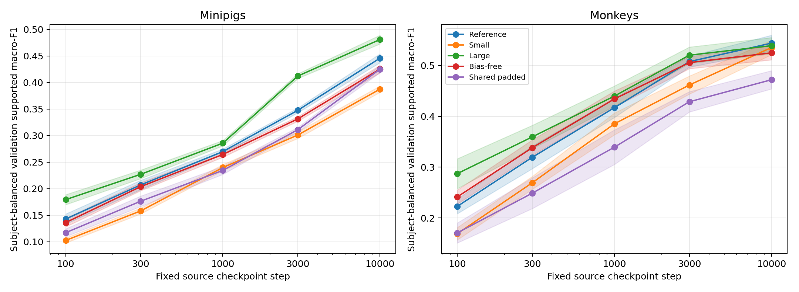
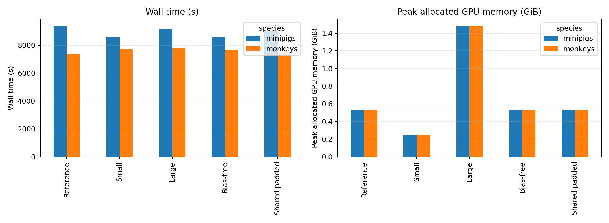
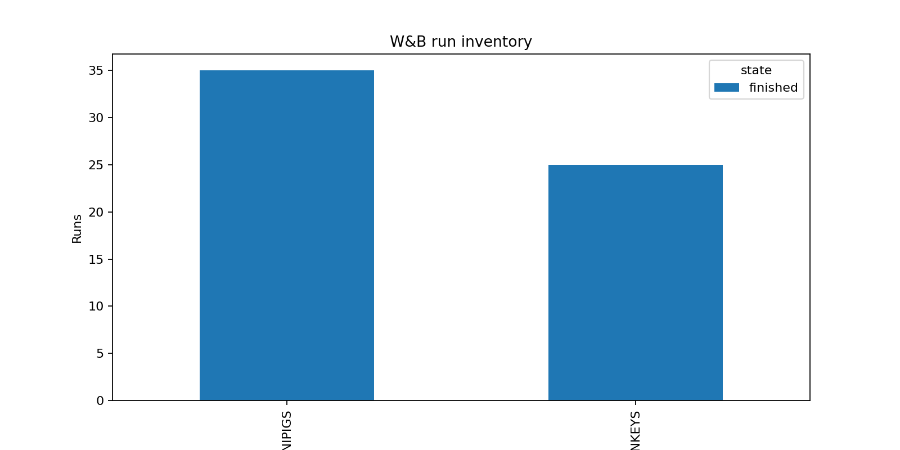

# Source-pretraining architecture viability

**Status:** Completed
**Date started:** 2026-09-16
**Parent experiment:** [Source-validation performance versus downstream transfer](20260915-MS-source-validation-downstream-trajectory.md)
**Follow-up experiments:** [Batch-128 reference transfer replication](20260916-MS-batch128-reference-transfer-replication.md)
**Tags:** neurosoft, supervised-pretraining, architecture, capacity, adapter-bias, shared-adapter, checkpoint-age, 8band, minipigs, monkeys

## Background

The parent [source-validation versus downstream-transfer experiment](20260915-MS-source-validation-downstream-trajectory.md)
showed that the default `NeurosoftConvBiGRU` has a genuine early transfer
benefit that erodes with continued source training. At source step 100,
transfer exceeded matched scratch in both species; by step 10,000 that benefit
had disappeared and downstream optimization efficiency had deteriorated.

The related [adapter-bias perturbation experiment](20260915-MS-adapter-bias-perturbation.md)
showed that reliance on correctly matched recording-specific adapter biases
increases with source-checkpoint age. That perturbation was causal for source
predictions but did not establish that the bias caused downstream transfer
erosion. Its proposed follow-up was to retrain the complete source pipeline
without adapter biases.

This experiment implements and source-trains four interventions plus a
batch-128 default-backbone reference before any new downstream matrix is launched:

1. an approximately ten-times-smaller transferable backbone;
2. an approximately ten-times-larger transferable backbone;
3. recording-specific input adapters without bias; and
4. one shared input adapter that right-pads the filtered channel sequence with
   zeros to a fixed width of 32 and deliberately ignores channel names.

The experiment is an implementation and viability gate. It asks whether all
four models learn non-degenerate source-task solutions under the matched Phase
batch-128 recipe, characterizes their learning dynamics, and publishes the fixed
checkpoint manifests required by the linked downstream experiments. It does
not test downstream transfer.

## Question

Can the batch-128 default-backbone reference, small-backbone, large-backbone,
bias-free-adapter, and shared-padded-adapter variants all be trained stably
and learn non-degenerate source-task solutions suitable for fixed-checkpoint
downstream evaluation?

## Hypothesis

All five conditions will complete 10,000 source optimizer steps with finite
metrics and will show meaningful non-degenerate source-task learning from step
100 to step 10,000: subject-balanced supported macro-F1 will increase and
late-checkpoint predictions will not collapse persistently to one class.
Source-validation cross-entropy is a characterization of fitting dynamics, not
a monotonic success criterion. In particular, source overfitting is expected
to emerge in some conditions after the early learning phase, and its earlier
or stronger appearance in the large-backbone condition is an informative
capacity-dependent outcome rather than a failure.

The joint hypothesis is fully supported if every condition satisfies the
completion, finiteness, non-collapse, and supported-F1-learning criteria in
both species. Differences in absolute source performance, cross-entropy
trajectory, learning speed, train-validation gap, compute, or channel-count
sensitivity are prespecified characterization outcomes. They do not create
separate hypothesis tests and a variant is not rejected merely for
underperforming the default source model.

## Experiment

### Setup

- **Model:** The batch-128 default `NeurosoftConvBiGRU` reference plus four
  architecture variants.
- **Data:** The existing same-species, target-subject-excluded full source
  pools: seven minipig exclusions and five monkey exclusions. Every new
  condition uses source-selection seed 42 and the exact corresponding
  `fraction-1.00/selection-42.json` manifest.
- **Task:** NeuroSoft eight-band acoustic-stimulus classification.
- **Source seed:** Model initialization seed 42 only. Source-selection and
  model seeds are deliberately paired as `(42, 42)` in every condition.
- **Training:** 10,000 optimizer steps, validation every 100 steps, no early
  stopping, batch size 128, learning rate `2.5e-4`, weight decay `0.018`, and
  the existing precision fallback policy. Epoch-based validation is disabled
  so the step cadence remains valid for short monkey epochs at batch 128.
- **Fixed checkpoints used by this program:** Steps 100, 300, 1,000, 3,000,
  and 10,000.
- **Saved but currently excluded checkpoint:** Each run must retain its
  minimum-source-validation-loss checkpoint and manifest. It is excluded from
  this experiment's ordered analyses, all initial downstream registries, and
  all confirmation criteria.
- **Historical reference:** The 12 batch-16 default-backbone Phase 4E source
  runs remain historical context; this matrix supplies the matched batch-128
  reference.
- **WandB:** Final groups
  `20260916-MS-PRETRAINING-ARCHITECTURE-VIABILITY-B128-FIX1-MINIPIGS` and
  `20260916-MS-PRETRAINING-ARCHITECTURE-VIABILITY-B128-FIX1-MONKEYS`. All 60
  human-readable run names and eight-character W&B run IDs are recorded in
  `analysis/csv/20260916-MS-pretraining-architecture-viability_run_inventory.csv`,
  generated directly from these two groups by the analysis script.
- **RTX8000 canary:** The worst-case large-backbone minipig recipe for
  `sub-01`, with the production source manifest and seed, completed 250 steps
  on a Quadro RTX 8000 using the intended `16-mixed` fallback. It produced all
  fixed, loss-selected, and final checkpoint artifacts with finite loss;
  validation-inclusive wall time was 55.1 seconds.
- **Batch-128 monkey canary:** The default-backbone `sub-01` monkey recipe
  completed its step-100 validation with epoch-based validation disabled and
  wrote all milestone, loss-selected, and final manifests. Peak active GPU
  use was below 0.8 GiB on the RTX8000.
- **Corrected shared-adapter canary:** After the `tokenize()` validation was
  made adapter-agnostic, the shared-padded monkey `sub-01` batch-128 recipe
  completed 100 steps, validation, all five fixed milestone manifests, a
  loss-selected manifest, and a final manifest on the local RTX8000 using
  `16-mixed` fallback. This specifically covers the data-loader path that
  failed in the initial matrix.
- **Superseded batch-128 production launch:** Submitted 2026-09-16 as packed array
  `10823892` (35 minipig cells in 9 four-worker allocations) from snapshot
  `/network/scratch/s/sobralm/foundry-launches/20260916T200036_NEUROSOFT_SOURCE_PRETRAINING_MINIPIGS_92362ddd_9ccc2c32`,
  and array `10823901` (25 monkey cells in 7 four-worker allocations) from
  snapshot
  `/network/scratch/s/sobralm/foundry-launches/20260916T200107_NEUROSOFT_SOURCE_PRETRAINING_MONKEYS_92362ddd_7cf79b9d`. The seven minipig
  shared-padded cells failed during validation because `tokenize()` assumed
  the per-session adapter's `.layers` attribute. Both arrays were then
  cancelled so the complete matrix can be rerun from one corrected snapshot;
  no output from these arrays is part of this experiment.
- **Corrected batch-128 production launch:** Submitted 2026-09-16 from commit
  `10627bc7699f8f92e0610a6606163d384b31d75c` as packed array `10824083` (35
  minipig cells in 9 four-worker allocations), snapshot
  `/network/scratch/s/sobralm/foundry-launches/20260916T202230_NEUROSOFT_SOURCE_PRETRAINING_MINIPIGS_10627bc7_6b042687`,
  and packed array `10824095` (25 monkey cells in 7 four-worker allocations),
  snapshot
  `/network/scratch/s/sobralm/foundry-launches/20260916T202301_NEUROSOFT_SOURCE_PRETRAINING_MONKEYS_10627bc7_6a3494d1`.
  Its output roots and run names are versioned (`B128-FIX1`, `-b128-fix1-`) to
  prevent collision with the superseded partial attempt. The checkpoint-registry
  builder uses the same canonical run-name function as the cell generator,
  including that version label.
- **Superseded launch:** The batch-16 arrays `10823721` and `10823722` were
  cancelled before relaunch. Their source snapshot paths were
  `/network/scratch/s/sobralm/foundry-launches/20260916T193629_NEUROSOFT_SOURCE_PRETRAINING_MINIPIGS_25c5f131_4fe32e20`,
  `/network/scratch/s/sobralm/foundry-launches/20260916T193702_NEUROSOFT_SOURCE_PRETRAINING_MONKEYS_25c5f131_2e814ba1`.

The new source matrix is:

| Condition | Adapter | Transferable backbone | Minipig runs | Monkey runs | Total |
|---|---|---:|---:|---:|---:|
| Batch-128 reference backbone | Recording-specific, bias enabled | 507,456 (1x) | 7 | 5 | 12 |
| Small backbone | Recording-specific, bias enabled | 51,066 (0.100631x) | 7 | 5 | 12 |
| Large backbone | Recording-specific, bias enabled | 5,084,598 (10.019781x) | 7 | 5 | 12 |
| Bias-free adapter | Recording-specific, no bias | 1x | 7 | 5 | 12 |
| Shared padded adapter | One shared `32 -> 64` biased projection | 1x | 7 | 5 | 12 |
| **Total new runs** |  |  | **35** | **25** | **60** |

Capacity is defined on the transferable `temporal_frontend + gru`, not on the
complete source model whose recording-specific adapter parameter count varies
with the source pool. The intended capacity configurations keep
`adapter_dim=64`, temporal kernel 64, stride 4, convolutional depth 1, and two
bidirectional GRU layers fixed. The default temporal/GRU widths of 128 contain
exactly 507,456 transferable parameters. Exact enumeration selected widths 38
for the small model (51,066 parameters, 0.100631x default) and 410 for the
large model (5,084,598 parameters, 10.019781x default).

The shared adapter takes the modality-filtered channels in their existing
order, right-pads missing trailing positions with zeros to exactly 32 channels,
and applies one `nn.Linear(32, 64, bias=True)` to every recording. It performs
no channel-name lookup, vocabulary construction, anatomical alignment, or
recording-specific parameter selection. Padding is applied after input
normalization and time padding is re-zeroed after the linear layer.

Every run must publish five fixed milestone manifests, one loss-selected
manifest, the normal final checkpoint, exact model and transferable parameter
counts, and compute metadata. The expected new fixed-checkpoint inventory is
`60 * 5 = 300` manifests. The expected saved-but-excluded loss-selected
inventory is 60 manifests.

#### Source analysis and readiness gate

The primary ordered analysis uses only the five fixed checkpoints. For each
condition and species, aggregate source metrics within excluded target subject
and estimate slopes against `ln(source_step)`. Bootstrap whole excluded target
subjects, preserving each subject's complete trajectory.

Each condition/species receives one readiness label:

- **Ready:** all runs and manifests are complete; metrics are finite;
  subject-balanced validation CE improves and supported F1 increases over the
  ordered trajectory; late predictions are not persistently single-class.
- **Ready with caveat:** training is finite and non-collapsed but source
  learning is weak, irregular, or concentrated in only part of the source
  pool. The condition may remain scientifically relevant for transfer.
- **Not ready:** numerical instability, implementation failure, corrupt or
  incomplete checkpoint provenance, or persistent task-learning collapse.

Characterization includes train and validation CE/F1 curves, train-validation
gaps, predicted-class counts, source performance by filtered channel count for
the shared adapter, parameter counts, FLOPs, throughput, memory, and wall time.
No target validation or test result enters this gate.

### Launch command

```bash
# Production launch must use the normal snapshot workflow from a clean
# committed repository. Generate and audit the immutable cells first.
export FOUNDRY_DATA_ROOT=/network/scratch/s/sobralm/brainsets/processed
export FOUNDRY_SNAPSHOT_ROOT=/network/scratch/s/sobralm/foundry-launches
export FOUNDRY_CHECKPOINT_ROOT=/network/scratch/s/sobralm/foundry-checkpoints
# The RTX 8000 source reference used FP16 through the configured precision
# fallback.  Pin it here so all new conditions use the same hardware/precision
# regime, and avoid the node that failed before interpreter initialization.
export FOUNDRY_ENV_FILE=/home/mila/s/sobralm/Foundry/.venv/bin/activate

git status --short  # must print nothing

uv run python tools/generate_architecture_viability_source_cells.py
uv run python tools/audit_architecture_viability_parity.py --json

uv run python main.py \
  experiment=pretraining/neurosoft_conv_bigru_supervised_minipigs \
  hydra.sweep.dir=/network/scratch/s/sobralm/runs/20260916-MS-PRETRAINING-ARCHITECTURE-VIABILITY-B128-FIX1-MINIPIGS \
  'hydra.sweep.subdir=${run.name}' \
  hydra/launcher=slurm_default hydra.launcher.partition=long \
  hydra.launcher.gres=gpu:rtx8000:1 hydra.launcher.timeout_min=480 \
  hydra.launcher.tasks_per_node=4 hydra.launcher.cpus_per_task=1 \
  +hydra.launcher.additional_parameters.exclude=cn-c004 \
  hydra.launcher.cell_list=launch/architecture_viability/source-minipigs.jsonl \
  -m

uv run python main.py \
  experiment=pretraining/neurosoft_conv_bigru_supervised_monkeys \
  hydra.sweep.dir=/network/scratch/s/sobralm/runs/20260916-MS-PRETRAINING-ARCHITECTURE-VIABILITY-B128-FIX1-MONKEYS \
  'hydra.sweep.subdir=${run.name}' \
  hydra/launcher=slurm_default hydra.launcher.partition=long \
  hydra.launcher.gres=gpu:rtx8000:1 hydra.launcher.timeout_min=480 \
  hydra.launcher.tasks_per_node=4 hydra.launcher.cpus_per_task=1 \
  +hydra.launcher.additional_parameters.exclude=cn-c004 \
  hydra.launcher.cell_list=launch/architecture_viability/source-monkeys.jsonl \
  -m
```

### Key config overrides

- Common: `trainer.max_steps=10000`, `trainer.val_check_interval=100`,
  `trainer.check_val_every_n_epoch=null`, `hyperparameters.batch_size=128`,
  `trainer.callbacks.early_stopping=null`, and validation-loss checkpoint
  selection retained for artifact creation only.
- Small/large: capacity-specific `model.temporal_channels` and
  `model.gru_hidden_size`, with `model.adapter_dim=64` and two GRU layers.
- Bias-free: planned `model.input_adapter_mode=per_session` and
  `model.input_adapter_bias=false`.
- Shared: planned `model.input_adapter_mode=shared_padded`,
  `model.input_adapter_bias=true`, and `model.shared_input_channels=32`.
- Every run and manifest must record `source_condition`, adapter mode, adapter
  bias, exact parameter counts, source-selection seed, model seed, excluded
  target subject, species, Git SHA, and snapshot bundle.

## Results

### Summary

All 60 source-pretraining runs finished: 35 minipig and 25 monkey runs, or
seven/five held-out target subjects respectively for each of the five model
conditions. All 300 prespecified fixed source checkpoints had finite
validation measurements. Every condition in both species improved
subject-balanced supported macro-F1 from step 100 to step 10,000, giving
evidence of non-degenerate source-task learning across the complete matrix.

Validation cross-entropy revealed a capacity- and species-dependent fitting
trajectory rather than a viability failure. The large backbone reached the
strongest late overfitting in both species, and monkey CE rose late for every
condition except the small backbone. This is consistent with the revised
hypothesis: CE is a characterization of source fitting, while supported F1
and completion establish viability.

### Metrics

Subject-balanced means at the first and final fixed checkpoints; F1 is
supported macro-F1.

| Species | Condition | CE: 100 -> 10,000 | F1: 100 -> 10,000 | Readiness |
|---|---|---:|---:|---|
| Minipigs | Reference | 1.954 -> 1.587 | 0.143 -> 0.446 | Ready |
| Minipigs | Small | 2.003 -> 1.581 | 0.102 -> 0.387 | Ready |
| Minipigs | Large | 1.922 -> 2.490 | 0.179 -> 0.481 | Ready |
| Minipigs | Bias-free | 1.961 -> 1.686 | 0.136 -> 0.425 | Ready |
| Minipigs | Shared padded | 1.990 -> 1.628 | 0.117 -> 0.425 | Ready |
| Monkeys | Reference | 1.799 -> 2.089 | 0.223 -> 0.544 | Ready |
| Monkeys | Small | 1.907 -> 1.417 | 0.169 -> 0.536 | Ready |
| Monkeys | Large | 1.703 -> 2.885 | 0.287 -> 0.539 | Ready |
| Monkeys | Bias-free | 1.823 -> 2.485 | 0.241 -> 0.525 | Ready |
| Monkeys | Shared padded | 1.901 -> 2.592 | 0.170 -> 0.472 | Ready |

The bootstrap confidence intervals for the F1 slope against `ln(source step)`
were positive for every condition/species cell. The corresponding CE slopes
identify the expected late-fitting behavior: negative for all minipig
conditions except large, and negative only for the monkey small backbone.

### Analysis

The W&B-backed analysis script is
`analysis/20260916-MS-pretraining-architecture-viability_analysis.py`:

```bash
uv run python analysis/20260916-MS-pretraining-architecture-viability_analysis.py
```

It fetches both final W&B groups, recovers the five fixed validation events
per run, bootstraps complete held-out-subject trajectories, and writes the run
inventory, fixed-milestone table, and readiness summary under `analysis/csv/`.









### Figures

All generated figures are referenced in the Analysis section above.

## Conclusions

**Hypothesis fully confirmed.** All five evaluated model conditions completed
the full source recipe with finite metrics and substantially increasing
supported macro-F1 in both minipigs and monkeys. The non-monotonic CE curves
are informative evidence about capacity-dependent source fitting: overfitting
appeared earliest and most strongly for the large backbone, particularly in
monkeys, without preventing substantial source-task learning. Every evaluated
condition is therefore suitable for the next downstream stage.

## Notes for future experiments

- Run downstream evaluation for every pretrained condition, beginning with all
  fixed source checkpoints at 100% downstream training-data percentage.

### Batch-128 reference-backbone downstream rerun

The new batch-128 reference source checkpoints require their own downstream
matrix; the historical batch-16 trajectory is not a substitute. This rerun is
**795 transfer + 159 matched-scratch = 954 jobs**: 600 + 120 minipig jobs and
195 + 39 monkey jobs. It uses the five fixed checkpoints only (steps 100,
300, 1,000, 3,000, and 10,000), source seed `(42,42)`, target seeds
`{42,43,44}`, and 100% target data.

Each logical cell uses the established Phase 4F downstream optimizer and
launcher envelope: target batch size 16, LR `0.003` with `0.1x` temporal/GRU
LR, phased step scheduler, no adapter warmup; one RTX 8000 packed with eight
tasks, two CPUs per task, one dataloader worker per task, 32 GB memory, and a
three-hour `long` allocation. This is 90 packed minipig allocations and 30
packed monkey allocations.

```bash
# Run from a clean, committed repository. The registry re-verifies every
# manifest/checkpoint hash before compiling the cell lists.
export FOUNDRY_DATA_ROOT=/network/scratch/s/sobralm/brainsets/processed
export FOUNDRY_SNAPSHOT_ROOT=/network/scratch/s/sobralm/foundry-launches
export FOUNDRY_CHECKPOINT_ROOT=/network/scratch/s/sobralm/foundry-checkpoints
git status --short  # must print nothing

uv run python tools/generate_architecture_viability_registry.py \
  --run-root /network/scratch/s/sobralm/runs \
  --checkpoint-root "$FOUNDRY_CHECKPOINT_ROOT"
uv run python tools/compile_downstream_cells.py \
  --registry launch/checkpoint_sets/architecture-reference_backbone-fixed.jsonl \
  --recipe configs/downstream_recipes/architecture_reference_backbone.yaml \
  --audit docs/neurosoft-phase0-audit.json \
  --checkpoint-root "$FOUNDRY_CHECKPOINT_ROOT" \
  --output-dir launch/architecture_transfer

uv run python main.py \
  experiment=auditory_decoding/neurosoft_conv_bigru_transfer_minipigs \
  run.group=20260916-MS-REFERENCE-BACKBONE-TRANSFER-MINIPIGS \
  hydra.sweep.dir=/network/scratch/s/sobralm/runs/20260916-MS-REFERENCE-BACKBONE-TRANSFER-MINIPIGS \
  'hydra.sweep.subdir=${run.name}' \
  hydra/launcher=slurm_default hydra.launcher.partition=long \
  hydra.launcher.gres=gpu:rtx8000:1 \
  +hydra.launcher.additional_parameters.exclude=cn-c004 \
  hydra.launcher.cell_list=launch/architecture_transfer/reference-backbone-minipigs.jsonl \
  hydra.launcher.tasks_per_node=8 hydra.launcher.cpus_per_task=2 \
  hyperparameters.num_workers=1 hydra.launcher.mem_gb=32 \
  -m

uv run python main.py \
  experiment=auditory_decoding/neurosoft_conv_bigru_transfer_monkeys \
  run.group=20260916-MS-REFERENCE-BACKBONE-TRANSFER-MONKEYS \
  hydra.sweep.dir=/network/scratch/s/sobralm/runs/20260916-MS-REFERENCE-BACKBONE-TRANSFER-MONKEYS \
  'hydra.sweep.subdir=${run.name}' \
  hydra/launcher=slurm_default hydra.launcher.partition=long \
  hydra.launcher.gres=gpu:rtx8000:1 \
  +hydra.launcher.additional_parameters.exclude=cn-c004 \
  hydra.launcher.cell_list=launch/architecture_transfer/reference-backbone-monkeys.jsonl \
  hydra.launcher.tasks_per_node=8 hydra.launcher.cpus_per_task=2 \
  hyperparameters.num_workers=1 hydra.launcher.mem_gb=32 \
  -m
```
