# Shared-adapter transfer

**Status:** Completed
**Date started:** 2026-09-16
**Parent experiment:** [Batch-128 reference transfer replication](20260916-MS-batch128-reference-transfer-replication.md)
**Follow-up experiments:** TBD
**Tags:** neurosoft, supervised-pretraining, transfer, shared-adapter, interface-continuity, zero-padding, checkpoint-age, 8band, minipigs, monkeys

## Background

The [source-viability experiment](20260916-MS-pretraining-architecture-viability.md)
trained a shared padded `Linear(32,64)` source adapter. Unlike a
recording-specific source adapter, this interface can be retained for an unseen
target. The analysis separates shared-interface source learning from retaining
the pretrained interface downstream.

## Question

Does pretraining through a shared padded input adapter preserve downstream
transfer, and is additional benefit obtained by retaining the pretrained
shared input interface during target finetuning?

## Hypothesis

Shared-source backbone transfer into a fresh ordinary target adapter will
change the full checkpoint trajectory relative to the batch-128 reference.
Retaining the shared adapter may add an interface-continuity benefit relative
to backbone-only transfer from the same source condition.

## Experiment

### Setup

- Conditions: batch-128 reference; shared source -> fresh ordinary target;
  shared source -> retained pretrained shared interface.
- Source steps `{100,300,1000,3000,10000}`, source seed `(42,42)`, target seeds
  `{42,43,44}`, all 53 recordings, and 100% target training data.
- Backbone-only transfer uses ordinary/reference scratch. Retained-interface
  transfer uses shared-padded scratch.
- Immutable inputs: `reference-backbone-*` and `shared-adapter-*` JSONL/locks.
- Exact names, groups, IDs, hashes, and states are in
  `analysis/csv/20260916-MS-shared-adapter-transfer_coverage.csv`.
- Expected/observed: 2,385/2,385 transfer plus 318/318 scratch runs. All 2,703
  cells passed coverage, provenance, endpoint, and history audit.

### Launch command

The completed matrices used the snapshot-backed compiled-cell workflow
documented in the source-viability report.

### Key config overrides

- Source adapter: shared padded width 32 with bias enabled.
- Backbone-only treatment reset the ordinary target adapter and router.
- Retained treatment transferred the shared adapter, temporal frontend, and
  GRU while resetting the router.

## Results

### Summary

The table reports subject-balanced point estimates at source steps 100 and
10,000. Positive values favor transfer under the stated sign conventions.

### Metrics

| Species | Condition | Step 100: F1 pp / steps saved | Step 10,000: F1 pp / steps saved |
|---|---|---:|---:|
| Minipigs | Reference | +2.06 / -492 | -2.44 / -3,322 |
| Minipigs | Shared source / ordinary target | +2.21 / -518 | +0.01 / -2,122 |
| Minipigs | Retained shared interface | +1.48 / -657 | +0.11 / -2,159 |
| Monkeys | Reference | +3.01 / -606 | -1.02 / -6,083 |
| Monkeys | Shared source / ordinary target | +1.44 / -493 | -1.07 / -3,999 |
| Monkeys | Retained shared interface | +1.27 / -723 | -1.44 / -7,492 |

Complete intervals, five-checkpoint trajectories, and threshold sensitivities
are in the generated tables and figures.

### Analysis

```bash
uv run python analysis/20260916-MS-shared-adapter-transfer_analysis.py
```

The analysis uses exact treatment-matched scratch controls, seed -> recording
-> subject aggregation, 20,000 whole-subject resamples, and per-seed matched
validation targets with planned-budget caps. The channel-count plot is
descriptive and keeps species separate.

#### Main figures

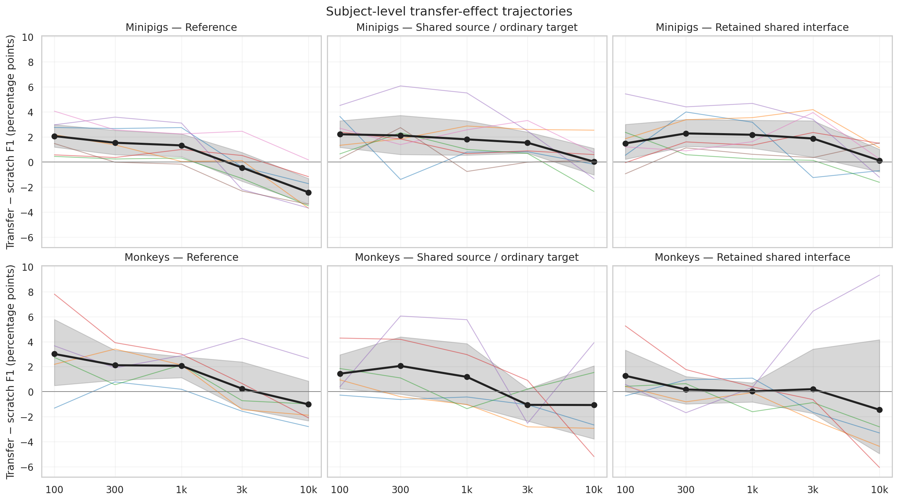

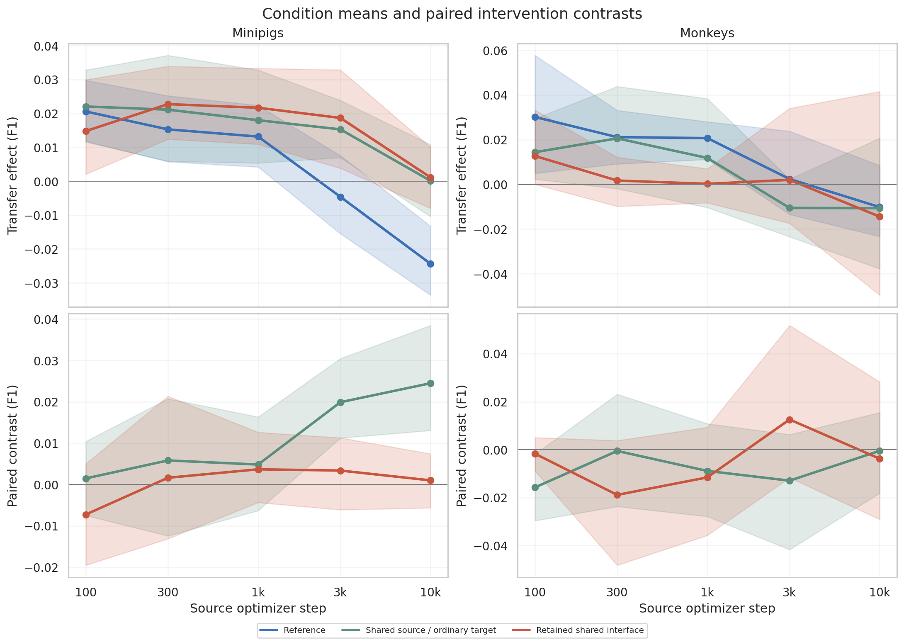

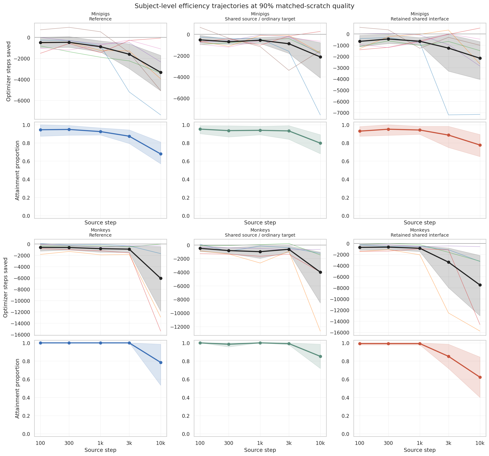

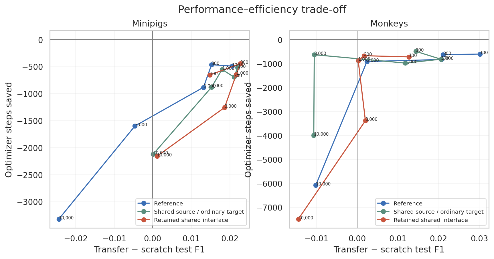

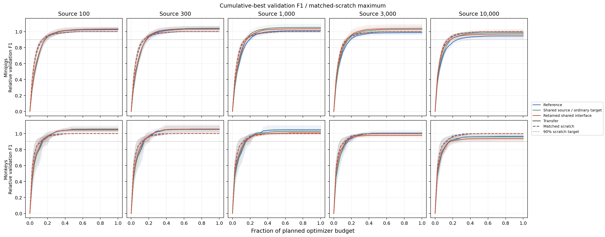

#### Annex and diagnostics

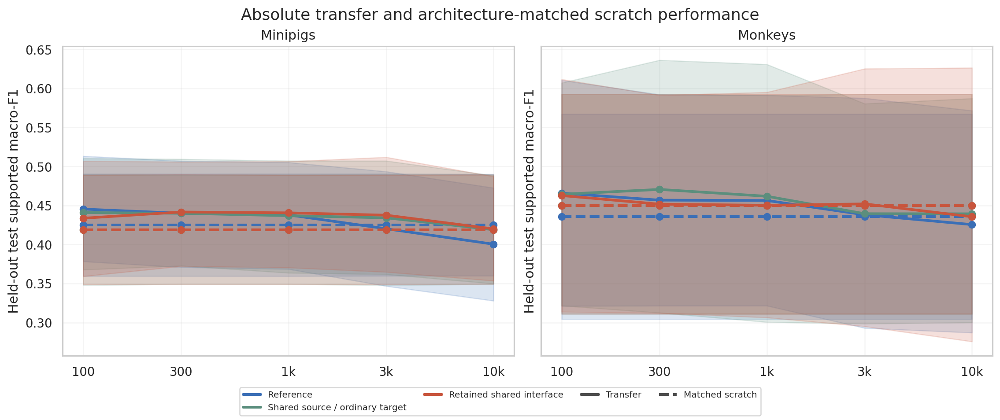

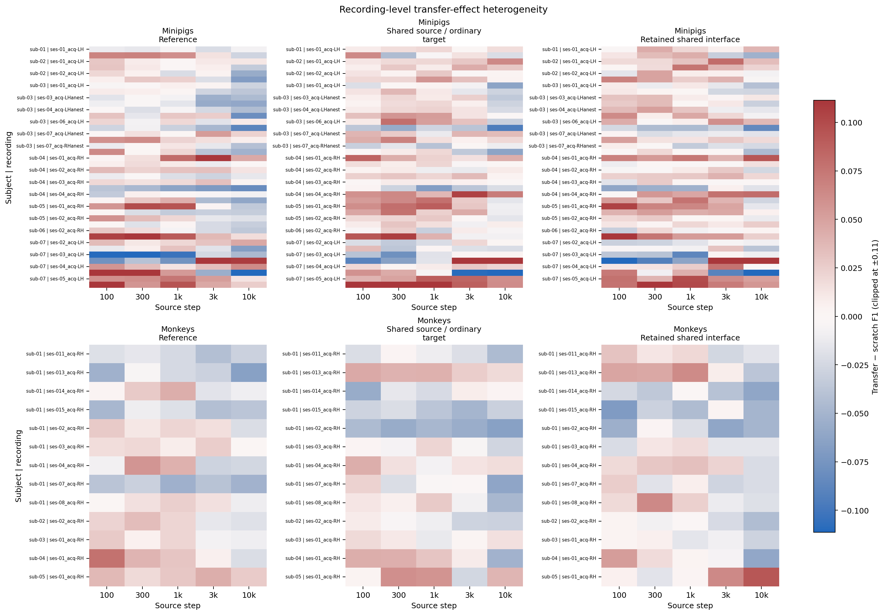

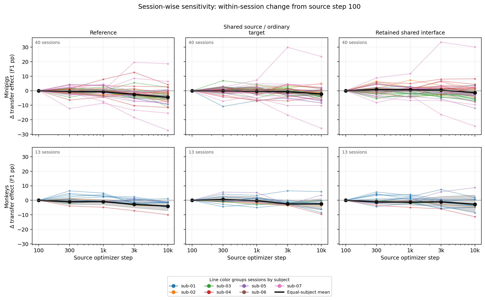

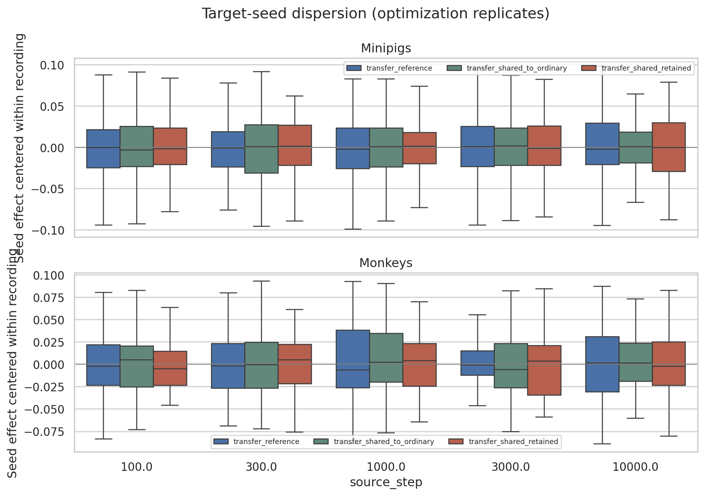

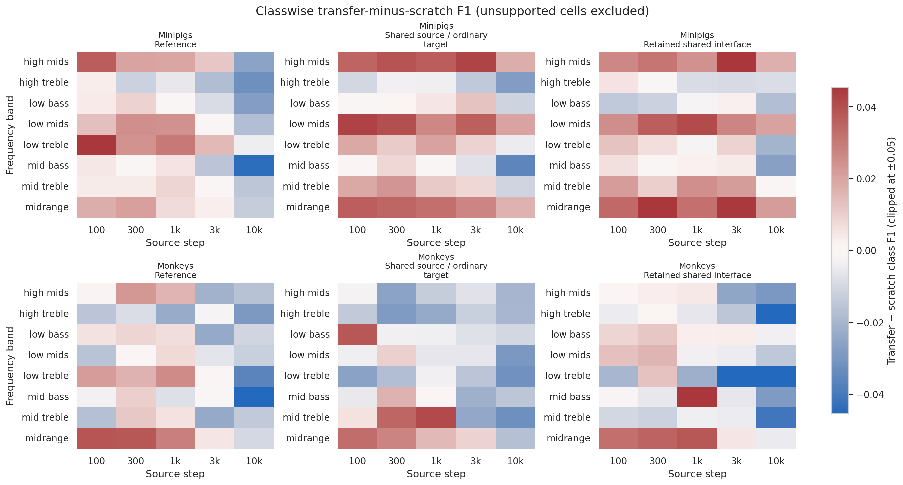


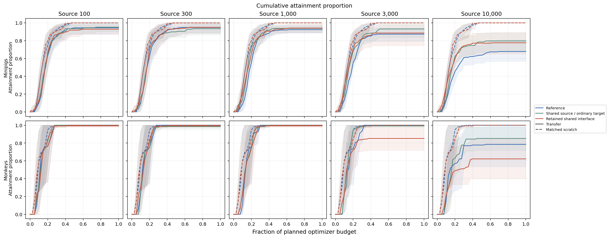

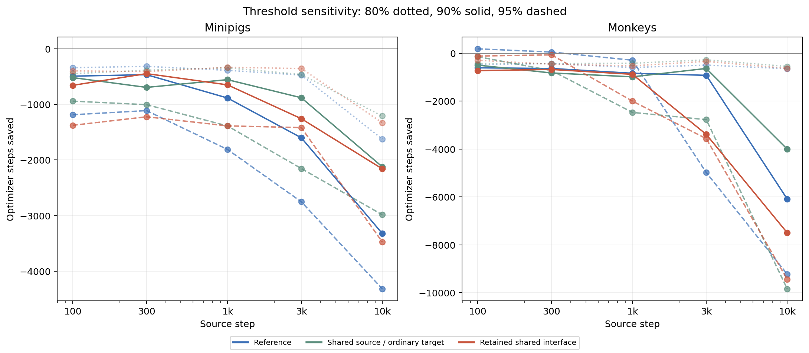

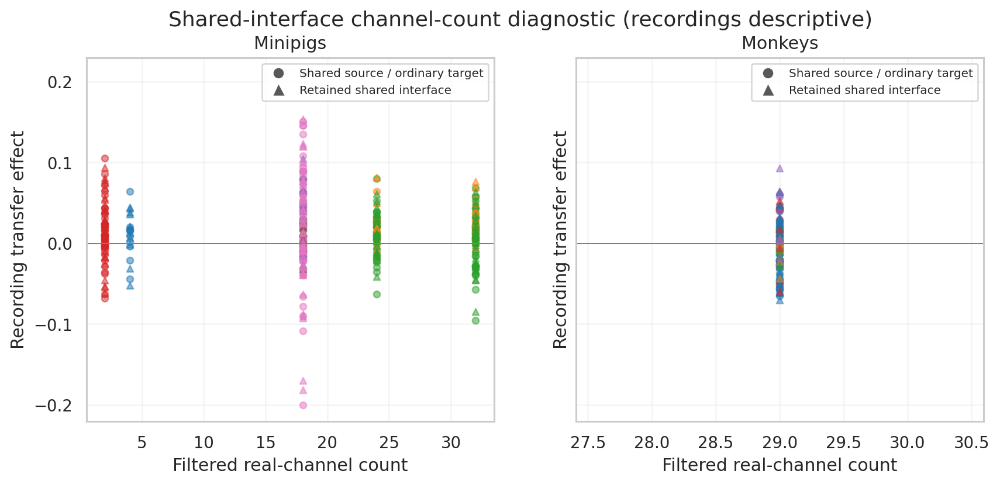

### Figures

All generated figures are referenced in the Analysis section above.

## Conclusions

The shared source adapter did not establish durable transfer, and retaining
that interface during target finetuning added no consistent benefit. Later
checkpoints were at best neutral in minipigs and harmful in monkeys, while
optimization efficiency remained worse than scratch.

## Notes for future experiments

TBD
