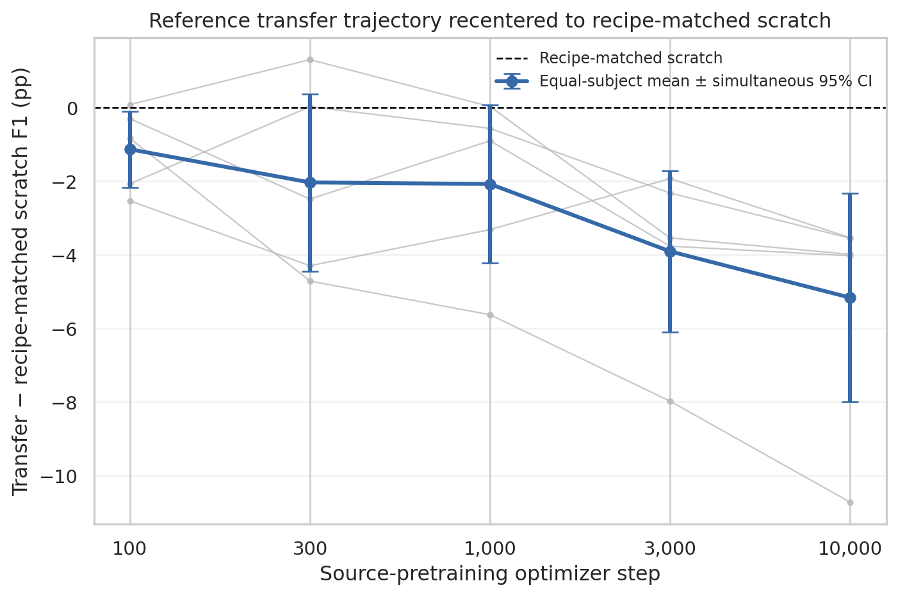
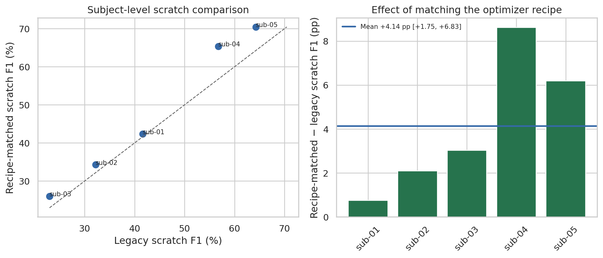
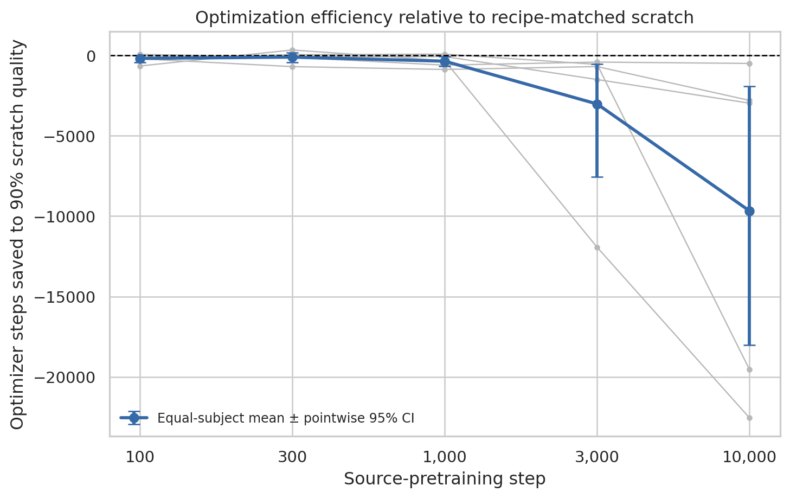
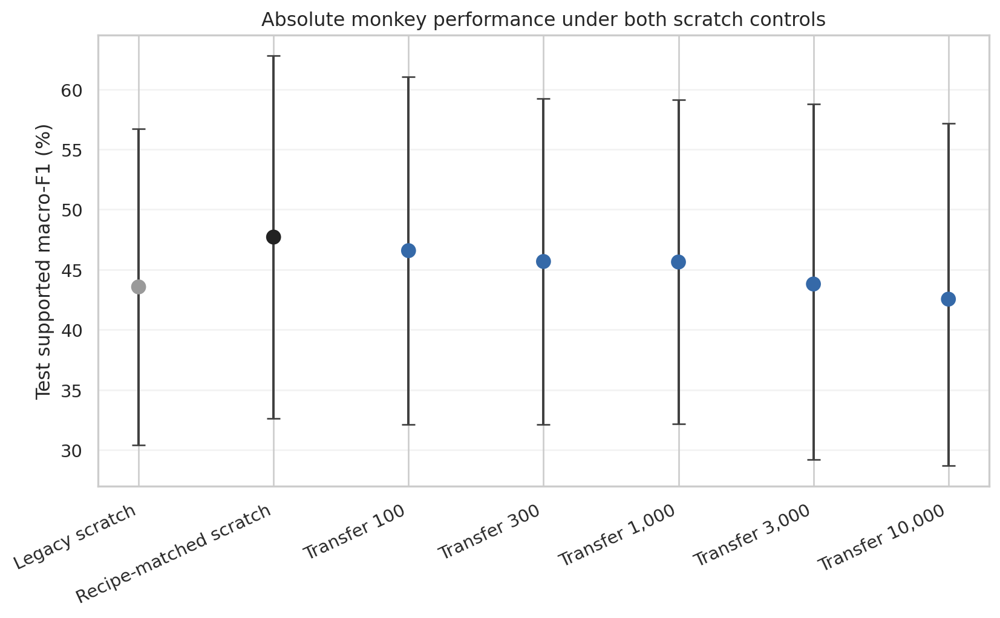
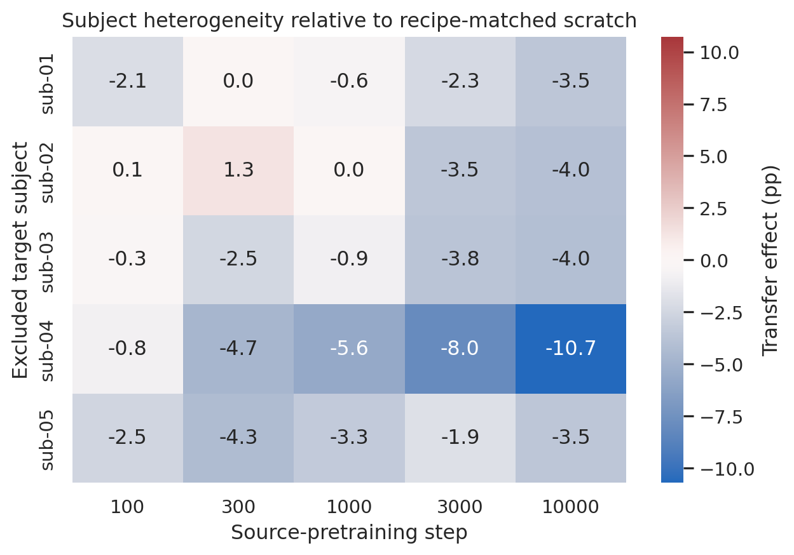
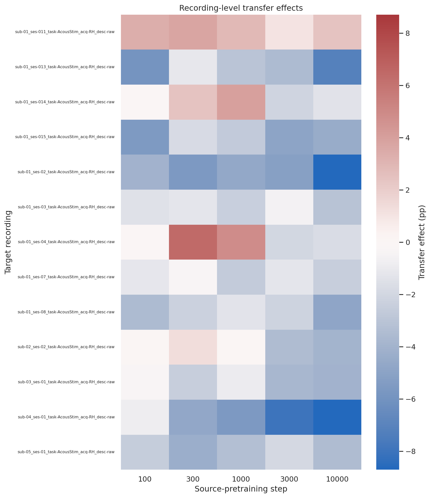
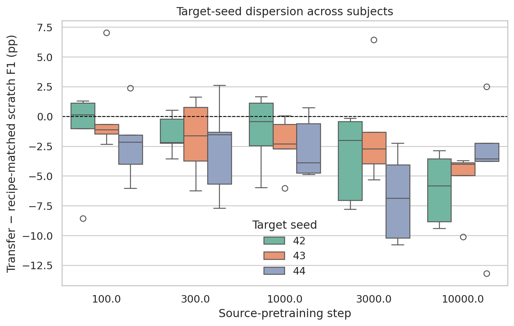
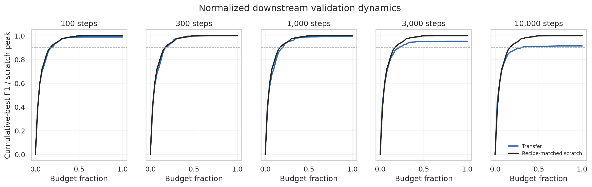
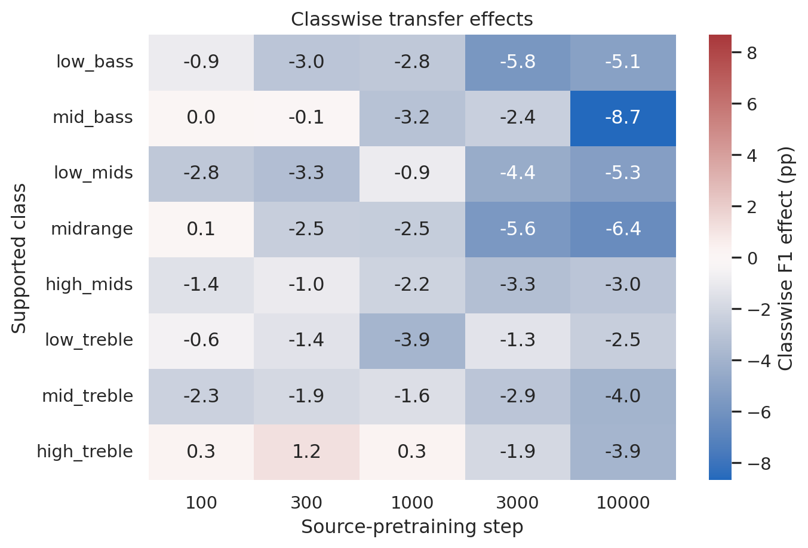

# Monkey recipe-matched scratch transfer control

**Status:** Completed
**Date started:** 2026-09-18
**Parent experiment:** [Recipe-matched scratch transfer control](20260918-MS-recipe-matched-scratch-control.md)
**Follow-up experiments:** TBD
**Tags:** neurosoft, supervised-pretraining, transfer, scratch-control, recipe-matching, discriminative-lr, checkpoint-age, 8band, monkeys

## Background

The [batch-128 reference transfer replication](20260916-MS-batch128-reference-transfer-replication.md)
compared reference-model checkpoints at source steps 100, 300, 1,000, 3,000,
and 10,000 against a scratch reference model in both species. Its downstream
transfer recipe used a base learning rate of `0.003` for newly initialized
target components and a tenfold lower learning rate of `0.0003` for the
transferred temporal frontend and GRU. The legacy scratch control instead
trained those randomly initialized components at `0.003`, confounding source
initialization with the discriminative learning-rate schedule.

The completed [minipig recipe-matched control](20260918-MS-recipe-matched-scratch-control.md)
showed that matching this optimizer recipe improved scratch by 1.84 F1 points
and erased the apparent early-checkpoint transfer advantage. This replication
tests whether the same confound explains the parent's larger early advantage
in monkeys. It trains only a new monkey scratch control; the five completed
transfer checkpoint conditions will be reused.

## Question

After replacing the legacy scratch baseline with a scratch reference model
trained under the exact downstream transfer recipe, does any pretrained source
checkpoint yield statistically higher monkey test supported macro-F1?

## Hypothesis

At least one of the five pretrained checkpoints will outperform the new
recipe-matched scratch control. In particular, the early 100- or 300-step
checkpoint is expected to retain higher subject-balanced test supported
macro-F1 because the parent monkey effect at step 100 was larger than the
corresponding minipig effect, even though recipe matching may reduce it.

The confirmatory criterion is that at least one transfer-minus-new-scratch
contrast has a family-wise simultaneous 95% whole-subject bootstrap interval
entirely above zero across the five checkpoint comparisons. Failure of every
simultaneous interval to exclude zero will provide no evidence of transfer
improvement under the matched comparison; it will not establish equivalence.

## Experiment

### Setup

- **Model:** Batch-128 reference `NeurosoftConvBiGRU` architecture
  (`temporal_channels=128`, `gru_hidden_size=128`), initialized entirely from
  scratch for the new control.
- **Data:** All 13 eligible monkey recordings, each at 100% of its causal
  target training split with its existing validation and test partitions.
- **Task:** NeuroSoft 8-band acoustic-stimulus decoding.
- **Training:** Target seeds `{42,43,44}`; base learning rate `0.003` and
  backbone learning rate `0.0003` for `[temporal_frontend,gru]`; the same
  phased step scheduler, 200-epoch maximum, early-stopping patience, validation
  checkpoint selection, and one-time test evaluation as the parent transfer
  cells. The only intended difference from transfer is random initialization
  with no source checkpoint. Expected new matrix: 13 recordings x 3 seeds =
  39 scratch runs.
- **Comparators:** Reuse the parent's completed monkey reference-transfer runs
  at source steps `{100,300,1000,3000,10000}` without relaunching them.
- **Primary metric:** Subject-balanced test supported macro-F1. Average target
  seeds within recording, recordings within subject, and weight the five
  monkey subjects equally.
- **Primary inference:** Five paired transfer-minus-scratch contrasts with
  simultaneous 95% whole-subject bootstrap intervals controlling family-wise
  error across checkpoints.
- **Secondary analysis:** Pointwise intervals, absolute F1, subject-level
  trajectories, and optimization-efficiency endpoints are descriptive.
- **Main plot:** Recenter the parent's monkey checkpoint trajectory on the new
  recipe-matched scratch control at zero. Show subject-level trajectories plus
  the equal-subject mean and simultaneous 95% intervals; retain the legacy-
  scratch comparison only as a clearly labeled sensitivity analysis.
- **WandB:** Group `20260918-MS-RECIPE-MATCHED-SCRATCH-MONKEYS`; every
  human-readable run name and deterministic eight-character run ID is recorded
  in the immutable compiled matrix and will be copied into the analysis
  coverage CSV.

### Launch command

```bash
export FOUNDRY_DATA_ROOT=/network/scratch/s/sobralm/brainsets/processed
export FOUNDRY_SNAPSHOT_ROOT=/network/scratch/s/sobralm/foundry-launches
export FOUNDRY_CHECKPOINT_ROOT=/network/scratch/s/sobralm/foundry-checkpoints

git status --short  # must print nothing

uv run python tools/compile_downstream_cells.py \
  --registry launch/checkpoint_sets/architecture-reference_backbone-fixed.jsonl \
  --recipe configs/downstream_recipes/architecture_reference_recipe_matched_scratch.yaml \
  --audit docs/neurosoft-phase0-audit.json \
  --checkpoint-root "$FOUNDRY_CHECKPOINT_ROOT" \
  --output-dir launch/recipe_matched_scratch

uv run python main.py \
  experiment=auditory_decoding/neurosoft_conv_bigru_transfer_monkeys \
  run.group=20260918-MS-RECIPE-MATCHED-SCRATCH-MONKEYS \
  hydra.sweep.dir=/network/scratch/s/sobralm/runs/20260918-MS-RECIPE-MATCHED-SCRATCH-MONKEYS \
  'hydra.sweep.subdir=${run.name}' \
  hydra/launcher=slurm_default hydra.launcher.partition=long \
  hydra.launcher.gres=gpu:rtx8000:1 \
  +hydra.launcher.additional_parameters.exclude=cn-c004 \
  hydra.launcher.cell_list=launch/recipe_matched_scratch/recipe-matched-scratch-monkeys.jsonl \
  hydra.launcher.tasks_per_node=8 hydra.launcher.cpus_per_task=2 \
  hyperparameters.num_workers=1 hydra.launcher.mem_gb=32 \
  -m
```

### Submission record

Submitted on 2026-09-18 from clean commit
`cb1aaed40749188c5b2418db336ad6479e7c3bfd`.

| Logical runs | Packed allocations | Slurm array | Snapshot bundle |
|---:|---:|---|---|
| 39 | 5 | `10849114_[0-4]` | `/network/scratch/s/sobralm/foundry-launches/20260918T185758_20260918-MS-RECIPE-MATCHED-SCRATCH-MONKEYS_cb1aaed4_d56ed07a` |

The launch used the same envelope as the minipig control: legacy `long`, one
RTX 8000 per allocation, eight cells per GPU (with seven cells in the final
allocation), two CPUs per cell, one data-loader worker per cell, 32 GB
allocation memory, the standard three-hour limit, and `cn-c004` excluded.

### Key config overrides

- `model.temporal_channels=128`
- `model.gru_hidden_size=128`
- `hyperparameters.learning_rate=0.003`
- `hyperparameters.backbone_learning_rate=0.0003`
- `hyperparameters.backbone_components=[temporal_frontend,gru]`
- `hyperparameters.warmup_fraction=0.1`
- `hyperparameters.start_lr_factor=0.0001`
- `hyperparameters.scheduler_name=phased`
- `hyperparameters.scheduler_interval=step`
- `hyperparameters.hold=0`
- `hyperparameters.decay=0`
- `hyperparameters.adapter_warmup_steps=0`
- `data.training_fraction=1.0`
- `run.pretrained_transfer_regime=null`
- `run.evaluate_test=true`

## Results

### Summary

All 39 recipe-matched monkey scratch runs finished and passed identity,
endpoint, history, and compiled-provenance checks. The joint analysis audited
all 195 reused reference-transfer runs and all 39 legacy scratch runs, for 273
exact W&B runs total.

No checkpoint met the preregistered criterion for positive transfer. Every
point estimate favored recipe-matched scratch. The 100-step checkpoint was
`-1.13` F1 percentage points below it, with a simultaneous 95% interval
entirely below zero. The 300- and 1,000-step estimates were about `-2` points,
although their simultaneous intervals included zero. The 3,000- and
10,000-step checkpoints were significantly worse after family-wise adjustment.

Recipe matching materially improved scratch itself. Recipe-matched scratch
exceeded legacy scratch by `+4.14` points, with a 95% whole-subject bootstrap
interval of `[+1.75, +6.83]`; all five monkey subjects improved. This shift
reversed the apparent 100-step advantage from the parent comparison. Transfer
also became slower than recipe-matched scratch from 1,000 source steps onward;
the disadvantage grew sharply at the two latest checkpoints.

### Metrics

Subject-balanced test supported macro-F1. Transfer effects are percentage
points relative to recipe-matched scratch; simultaneous intervals control
family-wise error across the five checkpoint comparisons.

| Source step | Absolute F1 | Transfer effect (pp) | Pointwise 95% CI (pp) | Simultaneous 95% CI (pp) | Subjects positive |
|---:|---:|---:|---:|---:|---:|
| 100 | 46.58% | -1.13 | [-2.00, -0.25] | [-2.16, -0.10] | 1/5 |
| 300 | 45.68% | -2.03 | [-4.10, +0.04] | [-4.44, +0.38] | 2/5 |
| 1,000 | 45.63% | -2.07 | [-4.15, -0.39] | [-4.22, +0.07] | 1/5 |
| 3,000 | 43.80% | -3.90 | [-6.00, -2.37] | [-6.10, -1.71] | 0/5 |
| 10,000 | 42.55% | -5.16 | [-7.94, -3.63] | [-8.00, -2.32] | 0/5 |

The recipe-matched scratch absolute F1 was `47.71%`, compared with `43.56%`
for legacy scratch. For the secondary 90%-of-scratch-quality endpoint, mean
optimizer steps saved were `-187`, `-113`, `-364`, `-3,026`, and `-9,677` at
source steps 100 through 10,000 respectively; negative values mean transfer
was slower. The pointwise intervals excluded zero in the unfavorable direction
from 1,000 source steps onward.

### Analysis

The reproducible analysis is
[`analysis/20260918-MS-recipe-matched-scratch-monkeys_analysis.py`](../../analysis/20260918-MS-recipe-matched-scratch-monkeys_analysis.py).
It hash-audits both immutable matrices, fetches exact run IDs through
`wandb.Api()`, validates completion and provenance, pairs at recording and
target-seed level, aggregates seed -> recording -> subject, and bootstraps the
five whole subjects. The simultaneous intervals use the maximum absolute
studentized statistic across the five checkpoint effects with 20,000
whole-subject bootstrap draws.

```bash
uv run python analysis/20260918-MS-recipe-matched-scratch-monkeys_analysis.py
```

The stem-matched CSV caches under `analysis/csv/` contain the exact 273-run
coverage audit, endpoints, histories, paired tables, subject aggregates, and
simultaneous-interval summary. CSV caches are intentionally gitignored.

### Figures

#### Main figures







#### Additional figures













## Conclusions

**Hypothesis refuted.** No pretrained checkpoint had statistically higher
monkey test supported macro-F1 than recipe-matched scratch under the
preregistered family-wise criterion. All five point estimates were negative;
the 100-, 3,000-, and 10,000-step checkpoints were significantly worse after
family-wise adjustment. From 1,000 source steps onward, transfer also reached
matched scratch quality significantly more slowly in the descriptive
pointwise analysis.

The legacy scratch recipe was an even larger confound for monkeys than for
minipigs. Applying the transfer arm's discriminative learning-rate schedule to
the randomly initialized reference model improved scratch by `+4.14` F1
points across all five subjects and changed the parent's apparent early
transfer benefit into a disadvantage. Together with the minipig replication,
the result provides no evidence that these source checkpoints improve full-
data downstream performance or optimization under a recipe-matched comparison.
This conclusion remains specific to the reference model, supervised source
objective, checkpoint family, full-data targets, and tested downstream recipe.

## Notes for future experiments

None requested.
