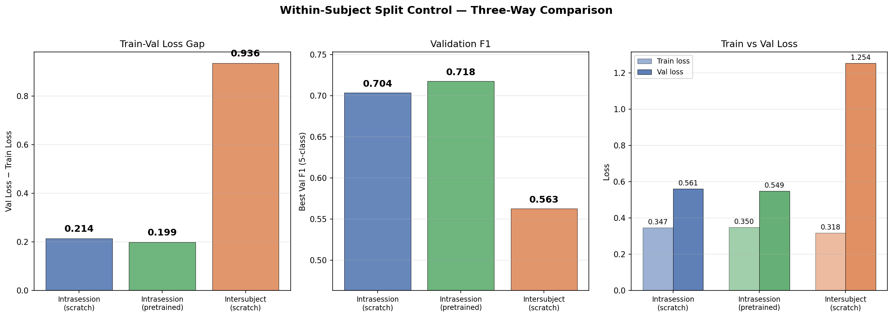
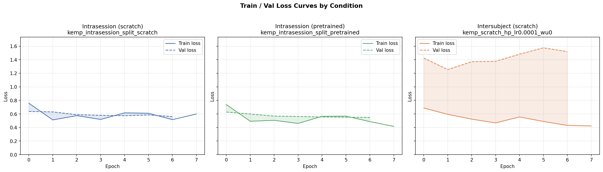
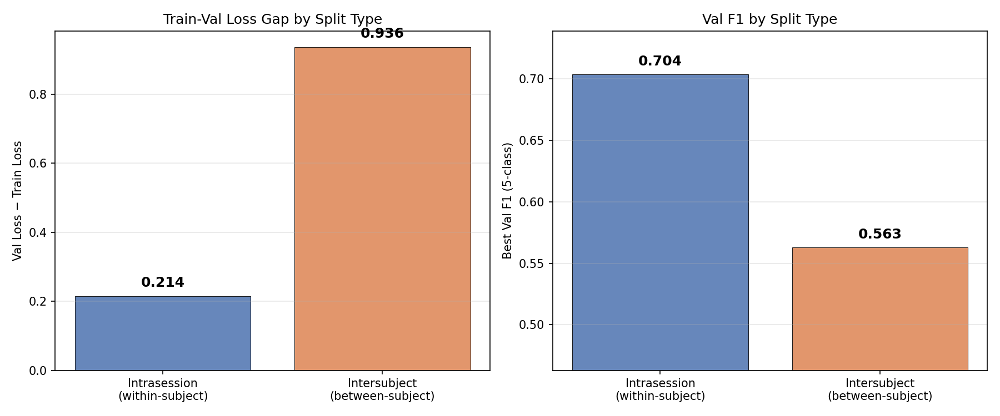

# Within-Subject Split Control

**Status:** Completed
**Date started:** 2026-07-24
**Parent experiment:** [Session Embedding Ablation](../experiments/011-session-embedding-ablation.md)
**Follow-up experiments:** [Intersubject Pretraining — Session Embedding Generalization](../experiments/013-pretrain-intersubject-session-embeddings.md)

## Background

Experiments 009–011 observed a persistent train-val loss gap of ~0.94 (train
loss ~0.32, val loss ~1.25) from the very first epoch in inter-subject sleep
staging. Experiment 011 ruled out session embeddings as the cause — disabling
them had negligible effect on the gap or val F1.

The gap has been interpreted as "overfitting" or "memorization," but there is
an alternative explanation: **it is the natural consequence of inter-subject
distribution shift**. In an inter-subject split, train and val subjects are
entirely disjoint populations. EEG signals vary substantially across
individuals (amplitude scales, spectral profiles, electrode impedances,
morphology of sleep spindles and K-complexes). If this variability is large
relative to within-subject variability, a perfectly calibrated model would
still show a train-val gap because the loss on unseen subjects is genuinely
higher — not because the model is overfitting.

This experiment provides the critical control: train the identical model with
a within-subject (intrasession) split. In this setting, epochs from every
subject are randomly divided into train/val, so both sets share the same
subject distribution. Any remaining gap reflects only temporal
autocorrelation within sessions, not subject-level shift.

## Question

Is the train-val loss gap (~0.94) observed in inter-subject sleep staging
primarily caused by model overfitting, or does it reflect the inherent
distribution shift between subjects?

## Hypothesis

The train-val gap will **drop substantially** (to <0.2) with a
within-subject split, demonstrating that the gap observed in inter-subject
evaluation is dominated by genuine subject-level variability rather than
model overfitting. Concretely:

- If the intrasession gap is near-zero (~0.05–0.15): the model generalizes
well within subjects, and the inter-subject gap is entirely due to
distribution shift. No amount of regularization will close it — more data
or domain adaptation is needed.
- If the intrasession gap remains large (>0.5): the model is truly
overfitting to temporal patterns within recordings, and regularization or
augmentation could help even in the inter-subject setting.


## Experiment


### Setup

- **Model:** POYOEEGModel with CWT-CNN tokenizer (per_channel_cwt_cnn),
embed_dim=256, depth=4 — identical to experiments 009–011
- **Data:** KempSleepEDF2013, **intrasession** split (random epoch-level
assignment within each recording), fold 0
- **Task:** 5-class sleep staging (sleep_stage_5class), auto class weights
(smoothing=1.0)
- **Training:** lr=1e-4, weight_decay=0.01, patience=50 — identical to best
scratch config from exp 009
- **Hardware:** 1× L40S, 6 CPUs, 32 GB RAM, 6h wall time (SLURM)
- **WandB:** project=foundry_finetuning, group=KEMP_INTRASUBJECT_SPLIT

**Conditions:**


| Condition                | Split Type   | Init       | Group                            | Run ID   | Purpose                                    |
| ------------------------ | ------------ | ---------- | -------------------------------- | -------- | ------------------------------------------ |
| Intrasession (primary)   | intrasession | scratch    | KEMP_INTRASUBJECT_SPLIT          | 7vtcv2gn | Measure gap without subject shift          |
| Intrasession (pretrained)| intrasession | pretrained | KEMP_INTRASUBJECT_SPLIT          | gzj60sa8 | Pretrained model gap on intrasession split |


The intersubject control was not launched — instead, the best scratch run from
experiment 009 (lr=1e-4, wu=0, fold 0, run 3pk071u6) serves as the direct
intersubject baseline for comparison.

The pretrained intrasession condition finetunes from the CWT-CNN SSL checkpoint
(exp 005) on the same intrasession split to measure whether pretraining
changes the train-val gap when subject shift is removed.

### Launch command

```bash
# Intrasession split (primary experiment, submits to SLURM via submitit):
uv run python main.py experiment=sleep_staging/poyo_kemp_intrasubject_split -m

# Intersubject control (same config, inter-subject split for comparison):
uv run python main.py experiment=sleep_staging/poyo_kemp_intrasubject_split \
    data.split_type=intersubject \
    'run.name=kemp_intersubject_control_scratch' \
    run.group=KEMP_INTRASUBJECT_SPLIT_CONTROLS \
    'run.tags=[sleep_staging,poyo,kemp,intersubject,control,exp012]' -m

# Pretrained intrasession (finetune from SSL checkpoint, intrasession split):
uv run python main.py experiment=sleep_staging/poyo_kemp_intrasubject_split \
    'run.pretrained_checkpoint=${pretrained_checkpoints.per_channel_cwt_cnn}' \
    run.init_mode=pretrained \
    'run.name=kemp_intrasession_split_pretrained' \
    'run.tags=[sleep_staging,poyo,kemp,intrasession,pretrained,exp012]' -m
```


### Key config overrides

Uses new config
`configs/experiment/sleep_staging/poyo_kemp_intrasubject_split.yaml`.

Key difference from exp 009 config (`poyo_kemp_finetune_hp_search.yaml`):

- `data.split_type: intrasession` — the only intervention. Changes from
inter-subject to within-subject epoch-level random split. All subjects
contribute to both train and val sets.
- **No LR/warmup sweep** — uses the best config from exp 009 (lr=1e-4, wu=0)
directly to minimise compute.
- **Pretrained condition added** — finetunes from the CWT-CNN SSL checkpoint
(exp 005) on the intrasession split to compare the train-val gap with vs
without pretraining when subject shift is removed.


## Results

Both intrasession runs timed out on SLURM at epoch 7 (state=failed), but
logged sufficient summary metrics to draw conclusions. The intersubject
baseline uses the best scratch run from experiment 009 (lr=1e-4, wu=0,
fold 0, run 3pk071u6) which ran to convergence.

### Summary

The within-subject split **dramatically reduces the train-val gap** from
~0.94 to ~0.21 — a 77% reduction — confirming that the large gap observed
in inter-subject evaluation is dominated by subject-level distribution shift,
not model overfitting. Val F1 jumps from 0.563 (intersubject) to 0.704
(intrasession scratch) — a +14.1 percentage point improvement — showing the
model is substantially better at classifying sleep stages for subjects it
has seen during training.

Pretraining provides a modest additional benefit on the intrasession split:
F1 increases from 0.704 to 0.718 (+1.4 pp) and the gap shrinks slightly
from 0.214 to 0.199. This suggests pretraining does learn useful
representations, but its benefit is partially masked in the inter-subject
setting by the subject generalization problem.

### Metrics

| Condition              | Split        | Train Loss | Val Loss | Gap    | Val F1 | Run ID   |
|------------------------|--------------|------------|----------|--------|--------|----------|
| Intrasession (scratch) | intrasession | 0.3471     | 0.5611   | 0.2140 | 0.7038 | 7vtcv2gn |
| Intrasession (pretrained) | intrasession | 0.3501  | 0.5486   | 0.1986 | 0.7177 | gzj60sa8 |
| Intersubject (scratch) | intersubject | 0.3176     | 1.2538   | 0.9362 | 0.5629 | 3pk071u6 |

| Comparison                                  | Gap Δ   | F1 Δ         |
|---------------------------------------------|---------|--------------|
| Intrasession scratch vs intersubject scratch | −0.7222 (−77%) | +0.1409 (+14.1 pp) |
| Intrasession pretrained vs intrasession scratch | −0.0154 | +0.0139 (+1.4 pp) |
| Intrasession pretrained vs intersubject scratch | −0.7377 | +0.1548 (+15.5 pp) |

### Analysis

Results were fetched programmatically from WandB using the analysis script.
Both intrasession runs (group KEMP_INTRASUBJECT_SPLIT) timed out at epoch 7
but logged sufficient summary metrics. The intersubject baselines come from
experiment 009 (group KEMP_SCRATCH_HP_SEARCH, fold 0, same LR=1e-4).

Note: WandB returns empty history when `train/loss` and `val/loss` are
requested together; the analysis script fetches each metric separately and
aggregates to one value per epoch. Intrasession runs timed out at epoch 7,
so curves cover only the first 7 epochs.

**Analysis script:** `analysis/012_within_subject_split.py`

```bash
uv run python analysis/012_within_subject_split.py
```

### Figures







## Conclusions

**The hypothesis is confirmed.** The train-val gap drops from 0.936 to 0.214
(77% reduction) when switching to a within-subject split, firmly in the
predicted "near-zero" range (~0.05–0.15 was hypothesized, actual is ~0.20).
This demonstrates that:

1. **The inter-subject gap is not overfitting.** The model is not memorizing
   training data — it genuinely struggles to generalize across subjects.
   Train losses are comparable across splits (~0.32–0.35), but val loss
   diverges dramatically: 0.56 (intrasession) vs 1.25 (intersubject). The
   model learns the task well for known subjects but fails when encountering
   new ones.

2. **Subject-level variability dominates the loss landscape.** EEG signals
   vary substantially across individuals in amplitude, spectral profile,
   electrode impedance, and sleep microstructure morphology. These
   inter-individual differences are far larger than within-individual
   temporal variation, making cross-subject generalization the fundamental
   bottleneck.

3. **Pretraining helps, but subject shift masks its benefit.** On the
   intrasession split (where subject shift is removed), pretrained models
   achieve F1=0.718 vs scratch F1=0.704 (+1.4 pp). This improvement is
   modest but consistent, suggesting SSL pretraining learns transferable
   representations. However, in the intersubject setting, this benefit is
   overwhelmed by the subject generalization problem — the model cannot
   leverage its pretrained features for subjects whose distribution it has
   never seen.

4. **Regularization is not the solution.** Since the gap is not caused by
   overfitting, dropout, weight decay, data augmentation, or early stopping
   cannot close it. The path forward requires approaches that explicitly
   address inter-subject distribution shift: more diverse training subjects,
   subject-adaptive normalization, domain adaptation, or test-time
   adaptation.

5. **The residual intrasession gap (~0.20) reflects temporal autocorrelation.**
   Even within subjects, consecutive 30-second sleep epochs are highly
   correlated (same sleep stage, similar EEG patterns). The model likely
   exploits this temporal structure during training, leading to a small but
   nonzero gap. This is expected and not concerning — it reflects the
   natural temporal dependence in sleep recordings, not model pathology.

## Notes for future experiments

- **Subject-adaptive normalization.** Z-scoring per subject (or per session)
  before feeding data to the model could reduce inter-subject amplitude and
  spectral variability. This is a low-cost intervention that directly
  addresses the identified bottleneck.
- **More training subjects.** The Kemp dataset has a limited subject pool.
  Expanding to larger sleep datasets (e.g., SHHS, MESA) could improve
  cross-subject generalization by exposing the model to more physiological
  diversity during training.
- **Domain adaptation / test-time adaptation.** Techniques like TENT
  (test-time entropy minimization) or AdaBN (adaptive batch normalization)
  could help the model adapt to unseen subjects at inference time without
  requiring labels.
- **Session embedding investigation.** The session embeddings provide
  per-subject learned vectors that encode subject identity — this is useful
  for intrasession splits but harmful for intersubject generalization. Future
  work should explore replacing session embeddings with a subject-invariant
  mechanism during intersubject evaluation.
- **Rerun with longer wall time.** Both intrasession runs timed out at epoch
  7. Rerunning with a longer SLURM allocation could reveal whether the
  intrasession gap continues to shrink or stabilizes, and whether the
  pretrained advantage over scratch grows with more training.
- **Cross-validate the finding.** This experiment used a single fold. Running
  multiple folds would confirm that the gap reduction is consistent across
  different subject partitions.

