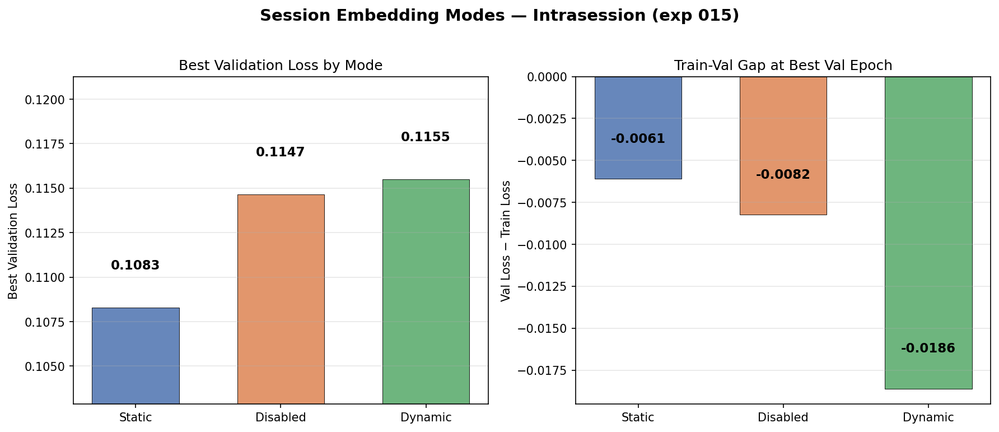
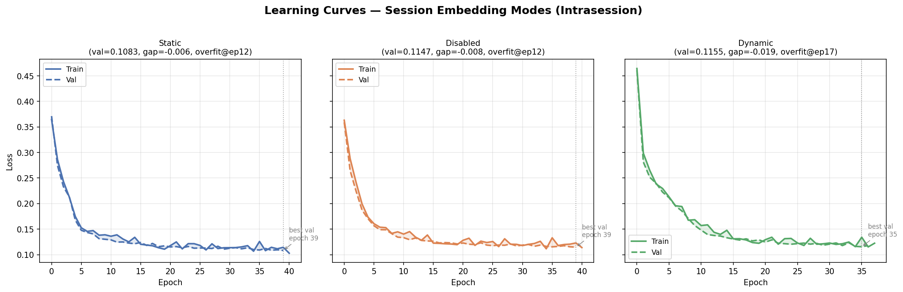
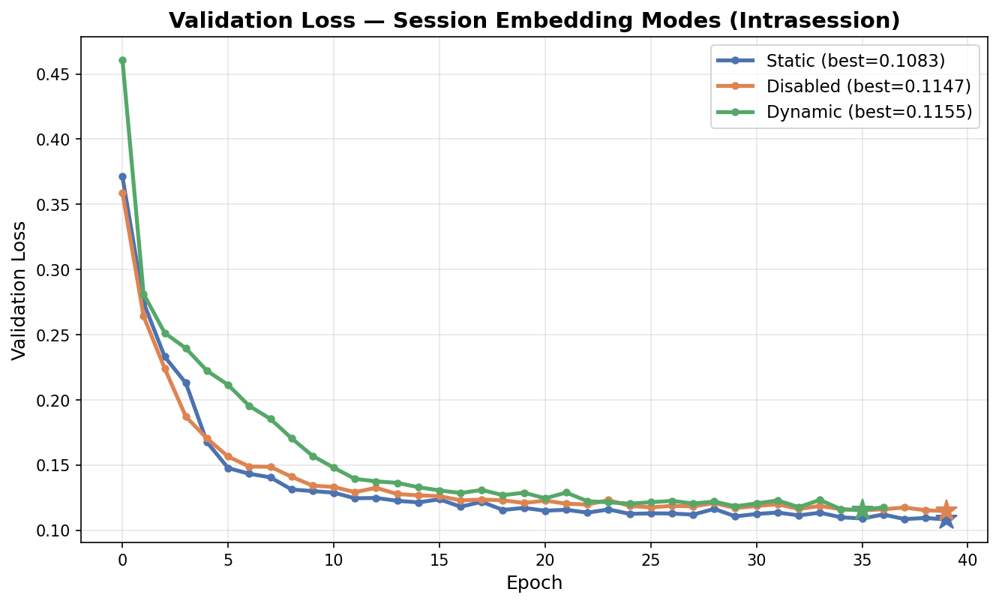

# Session Embedding Mode Comparison — Intrasession Sanity Check

**Status:** Completed
**Date started:** 2026-07-27
**Parent experiment:** [Session Embedding Mode Comparison](../experiments/014-session-emb-mode-comparison.md)
**Follow-up experiments:** [Channel Embedding Ablation](../experiments/016-channel-emb-ablation.md)

## Background

Experiment 014 compared static, disabled, and dynamic session embedding
modes under **intersubject** pretraining. Disabled mode achieved the best
validation loss, consistent with the expectation that static per-session
embeddings provide no useful signal for unseen subjects. However, the
differences were small (0.42–0.43 range), raising the question of whether
session embeddings matter at all or whether the intersubject regime simply
masks their contribution.

This experiment repeats the same comparison under **intrasession**
splitting, where train and validation windows come from the same
recordings. In this regime, static session embeddings should have a clear
advantage: the lookup table sees every session during training, so the
embedding can encode session-specific calibration information (amplitude
scale, electrode impedance, artifact profile) that directly helps
reconstruction.

## Question

Does the relative ranking of session embedding modes change when
switching from intersubject to intrasession splitting, confirming that
static embeddings are primarily useful for seen-session reconstruction?

## Hypothesis

1. **Static will clearly outperform Disabled and Dynamic** because every
  validation session was seen during training — the embedding can
   specialise to each session without encountering the padding-embedding
   mismatch that dominated exp 014.
2. **Dynamic may slightly outperform Disabled** because its
  signal-conditioned representation provides useful session-level
   calibration even when the session is seen, while Disabled throws away
   all session identity.
3. The **train-val gap will be smaller** across all modes compared to
  exp 014, since intrasession splitting removes the cross-subject
   generalization bottleneck.


## Experiment


### Setup

- **Model:** MaskedPOYOEEGModel, embed_dim=256, depth=4, 8 cross/self
heads, dim_head=128, TemporalBlockMasking (block_size=10,
mask_ratio=0.5), `zero_output_timestamps: false`,
`normalize_inputs: true`
- **Data:** Balanced Klinzing subset (`sleep_brainset_small`) — 14
subjects, 28 recordings, **intrasession** split, fold 0,
sequence_length=2.0s
- **Task:** Masked reconstruction (MSE loss), mask_ratio=0.5
- **Training:** batch_size=512, lr=1e-4, weight_decay=0.01,
max_epochs=200, bf16-mixed precision, warmup_epochs=0
- **Hardware:** 1× L40S per run, 6 CPUs, 32 GB RAM (SLURM)
- **WandB:** project=foundry_pretraining,
group=PRETRAIN_SESSION_EMB_INTRASESSION
  - `pretrain_sessemb_intra_static` — run ID `2uwt0wso`
  - `pretrain_sessemb_intra_disabled` — run ID `047ibbdv`
  - `pretrain_sessemb_intra_dynamic` — run ID `d0pfka3a`

**Conditions:**


| Condition | session_emb mode | split_type   | Purpose                               |
| --------- | ---------------- | ------------ | ------------------------------------- |
| Static    | `static`         | intrasession | Expected best: no embedding mismatch  |
| Disabled  | `disabled`       | intrasession | Ablation: can model do without?       |
| Dynamic   | `dynamic`        | intrasession | Test: does signal-based help on seen? |


### Launch command

```bash
# SLURM sweep (3 session_emb modes, intrasession split):
uv run python main.py experiment=pretraining/poyo_pretrain_dynamic_session_emb \
    data.split_type=intrasession \
    run.group=PRETRAIN_SESSION_EMB_INTRASESSION \
    'run.name=pretrain_sessemb_intra_${model.session_emb.session_emb_mode}' \
    'run.tags=[pretraining,mae,masked,session_emb_comparison,intrasession,exp015]' \
    -m
```


### Key config overrides

Base config:
`configs/experiment/pretraining/poyo_pretrain_dynamic_session_emb.yaml`
(same as exp 014)

Overrides from exp 014:

- `data.split_type: intrasession` (was `intersubject`)
- `run.group: PRETRAIN_SESSION_EMB_INTRASESSION`
- `run.name` includes `intra_` prefix
- Tags include `intrasession` and `exp015` instead of `intersubject`
and `exp014`

The Hydra sweeper in the base config still varies `model/session_emb`
over `static`, `disabled`, `dynamic` (3 runs).

## Results

### Summary

Static session embeddings clearly outperform both Disabled and Dynamic modes
under intrasession splitting, reversing the ranking seen in exp 014
(intersubject). All three runs were terminated early by SLURM timeout at
37–40 epochs (of planned 200), but the ranking is already stable and the
losses are still improving slowly. The validation losses (0.108–0.116) are
dramatically lower than exp 014's intersubject regime (0.42–0.43), confirming
that the intrasession split removes the cross-subject generalization
bottleneck.

Notably, train-val gaps are *negative* (train loss > val loss), likely because
the validation windows within each session are easier to reconstruct than
the full training distribution covering all sessions simultaneously.

### Metrics

| Metric                       | Static | Disabled | Dynamic |
| ---------------------------- | ------ | -------- | ------- |
| Best val/loss                | 0.1083 | 0.1147   | 0.1155  |
| Train loss at best val epoch | 0.1144 | 0.1229   | 0.1341  |
| Train-val gap at best val    | -0.0061| -0.0082  | -0.0186 |
| Epoch of best val            | 39     | 39       | 35      |
| Max epoch reached            | 40     | 40       | 37      |

### Analysis

Results extracted programmatically from WandB via the analysis script.
All runs show state=failed (SLURM timeout) but have sufficient data for
comparison. The ranking was stable over the last 10+ epochs.

**Analysis script:** `analysis/015_session_emb_intrasession.py`

```bash
uv run python analysis/015_session_emb_intrasession.py
```

### Figures







## Conclusions

**Hypothesis 1 confirmed:** Static session embeddings clearly outperform
Disabled (0.1083 vs 0.1147, Δ=0.0064) and Dynamic (0.1083 vs 0.1155,
Δ=0.0072) under intrasession splitting. When every validation session was
seen during training, the learned per-session embedding provides useful
calibration information.

**Hypothesis 2 partially confirmed:** Dynamic slightly outperforms Disabled
is NOT observed — Disabled (0.1147) is marginally better than Dynamic
(0.1155). The signal-conditioned dynamic representation does not add value
over simply omitting session identity when sessions are seen.

**Hypothesis 3 confirmed:** The train-val gap is dramatically smaller (and
actually negative) compared to exp 014's intersubject regime, confirming
that intrasession splitting removes the cross-subject generalization
bottleneck.

**Key insight:** The reversal of Static vs Disabled rankings between
exp 014 (intersubject: Disabled wins) and exp 015 (intrasession: Static
wins) confirms that static session embeddings are useful specifically for
*seen-session* reconstruction but harmful for *unseen-session*
generalization. This validates that exp 014's Disabled advantage was driven
by embedding mismatch on novel sessions, not by session identity being
inherently useless.

## Notes for future experiments

- Runs were cut short at ~40 epochs — losses were still decreasing. A
  rerun with longer SLURM allocation (or checkpointing) could show larger
  absolute differences.
- The negative train-val gap is worth investigating: intrasession val
  windows may be inherently easier (e.g., more structured sleep segments).
- Static embeddings with intrasession splitting could serve as a strong
  upper bound for session-specific finetuning after intersubject
  pretraining.
- These results motivate exp 016's investigation into whether channel
  embeddings (which are session-scoped) absorb session identity when
  session embeddings are disabled.

