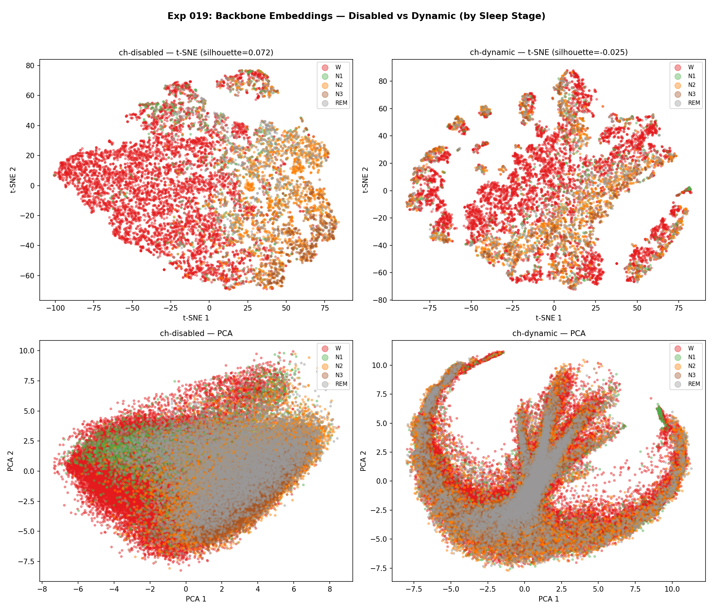
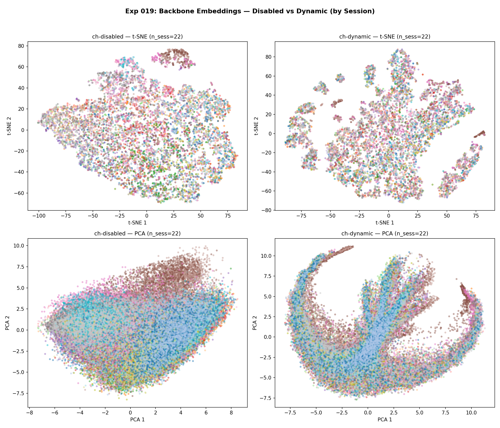
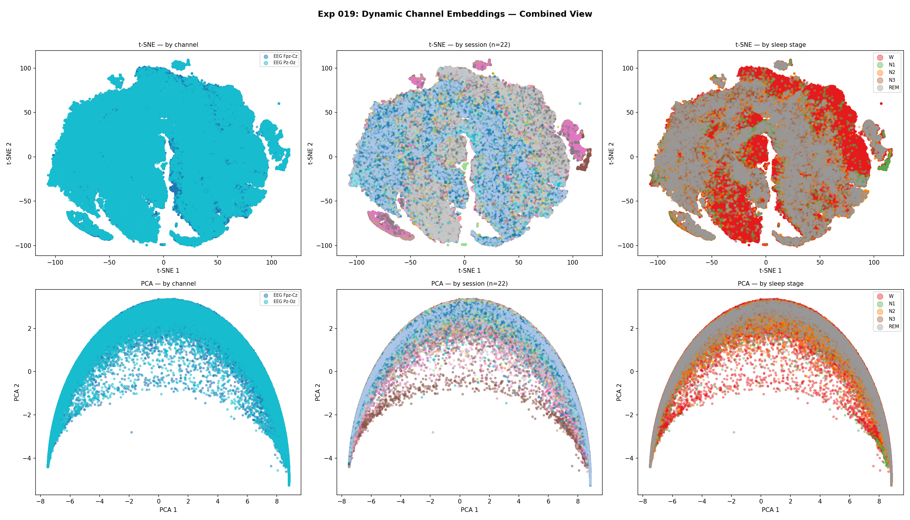
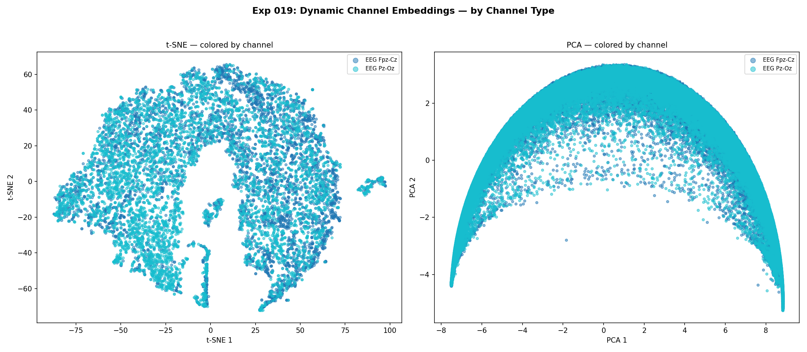
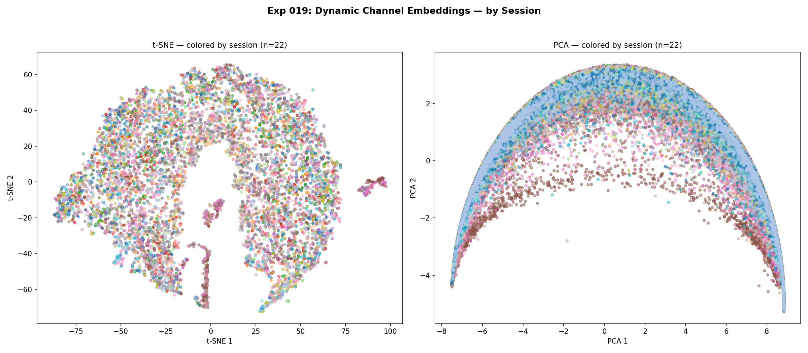
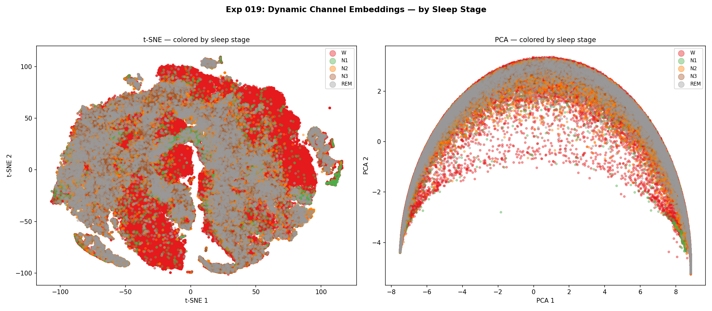

# Dynamic Channel Embedding Analysis: Visualization and Structure

**Status:** Completed
**Date started:** 2026-07-28
**Parent experiment:** [Dynamic Channel Embeddings via Relative Inter-Channel Attention](../experiments/018-dynamic-channel-embeddings.md)
**Follow-up experiments:** [Linear Probing: Dynamic Channel Embeddings](../experiments/020-linear-probe-dynamic-channel-emb.md)

## Background

Experiment 018 introduced `channel_emb_mode="dynamic"` using a
`RelativeChannelEncoder` that computes channel embeddings from the signal
itself via cross-channel attention. Early results show that dynamic channel
embeddings massively improve reconstruction performance (val loss ~0.12 vs
~0.40 for disabled) while avoiding the overfitting seen with static
session-scoped embeddings.

Before proceeding to downstream finetuning or further architectural changes,
we need to understand *what* these dynamic channel embeddings are actually
learning. Specifically:

1. **Backbone embedding structure:** Does the dynamic model produce backbone
   representations with more discriminative structure (e.g., for sleep stages)
   than the disabled baseline? Better reconstruction loss should correlate
   with richer learned features.
2. **Channel embedding structure:** Do the dynamic channel embeddings capture
   meaningful channel identity? Since Kemp Sleep-EDF has consistent channel
   types across sessions (EEG Fpz-Cz, EEG Pz-Oz), channel embeddings
   should cluster by channel type if the encoder learns electrode identity.
3. **Session vs channel separation:** Are channel embeddings organized
   primarily by channel type (desired) or by session identity (would indicate
   session memorization)?

This analysis mirrors the approach of experiment 008 (embedding
visualization) but extends it to examine the internal channel embeddings
produced by the RelativeChannelEncoder.

## Question

Do the dynamic channel embeddings from exp 018 exhibit meaningful structure —
specifically, do they cluster by channel type rather than session identity,
and does the dynamic backbone show better sleep-stage separability than the
disabled baseline?

## Hypothesis

1. The **dynamic model's backbone embeddings** will show clearer sleep-stage
   clustering (higher silhouette score, more visually separated t-SNE clusters)
   than the disabled baseline, reflecting its substantially better reconstruction.
2. The **dynamic channel embeddings** will cluster primarily by channel type
   (EEG Fpz-Cz vs EEG Pz-Oz) rather than by session, confirming that the
   RelativeChannelEncoder learns electrode identity from signal statistics.
3. Channel embeddings colored by sleep stage may show some stage-dependent
   modulation, reflecting that the channel encoder captures state-dependent
   signal characteristics (e.g., delta power in N3 vs alpha in Wake).

## Experiment

### Setup

- **Model:** Pretrained checkpoints from experiment 018
  (MaskedPOYOEEGModel, embed_dim=256, depth=4, ResampleCNN tokenizer,
  channel_encoder_heads=4)
- **Data:** KempSleepEDF2013, intersubject split, fold 0 (validation set
  only — no training in this experiment)
- **Task:** Embedding extraction only (no training). Sleep stage labels from
  `sleep_stage_5class` task config used for coloring.
- **Conditions:**

| Condition    | channel_emb_mode | Source checkpoint (exp 018)                     |
| ------------ | ---------------- | ------------------------------------------------ |
| ch-disabled  | `disabled`       | `pretrain_dynch_ch-disabled/checkpoints/best-*.ckpt` |
| ch-dynamic   | `dynamic`        | `pretrain_dynch_ch-dynamic/checkpoints/best-*.ckpt`  |

- **Extraction:** backbone embeddings (pool processed latents) + dynamic
  channel embeddings (hook on RelativeChannelEncoder)
- **Visualization:** t-SNE and PCA for backbone embeddings colored by sleep
  stage; t-SNE and PCA for channel embeddings colored by channel type,
  session, and sleep stage

### Launch command

```bash
# --- Embedding extraction ---

# Disabled condition (backbone embeddings only):
uv run python scripts/extract_embeddings.py \
    experiment=sleep_staging/poyo_kemp_allsess \
    model/tokenizer=per_channel_resample_cnn \
    model.channel_emb_mode=disabled \
    model/session_emb=disabled \
    'run.pretrained_checkpoint=runs/runs/PRETRAIN_DYNAMIC_CHANNEL_EMB/pretrain_dynch_ch-disabled/checkpoints/best-epoch024-val_loss_0.4000.ckpt' \
    run.pretrained_transfer_mode=permissive \
    extract.output_dir=outputs/embeddings/019_disabled \
    extract.max_batches=200

# Dynamic condition (backbone + channel embeddings):
uv run python scripts/extract_embeddings.py \
    experiment=sleep_staging/poyo_kemp_allsess \
    model/tokenizer=per_channel_resample_cnn \
    model.channel_emb_mode=dynamic \
    model/session_emb=disabled \
    'run.pretrained_checkpoint=runs/runs/PRETRAIN_DYNAMIC_CHANNEL_EMB/pretrain_dynch_ch-dynamic/checkpoints/best-epoch027-val_loss_0.1214.ckpt' \
    run.pretrained_transfer_mode=permissive \
    extract.output_dir=outputs/embeddings/019_dynamic \
    extract.extract_channel_emb=true \
    extract.max_batches=200

# --- Visualization ---
uv run python analysis/019_dynamic_channel_emb_viz.py
```

### Key config overrides

- Base experiment: `sleep_staging/poyo_kemp_allsess` (provides Kemp data
  pipeline + sleep stage labels)
- `model/tokenizer=per_channel_resample_cnn` (matches exp 018 architecture)
- `model/session_emb=disabled` (matches exp 018)
- `model.channel_emb_mode` swept over `disabled` / `dynamic`
- `run.pretrained_transfer_mode=permissive` (checkpoint from
  MaskedPOYOEEGModel loaded into POYOEEGModel; non-matching keys skipped)
- `extract.extract_channel_emb=true` (for dynamic condition only)

## Results

### Summary

The dynamic model's backbone embeddings show more structured geometry (curved
manifold visible in PCA, more fragmented t-SNE clusters) compared to the
disabled baseline, but this structure does not clearly align with sleep stage
boundaries. The disabled model actually has a slightly higher silhouette
score (0.072 vs −0.025), suggesting its embedding space is not worse at
stage separability despite much worse reconstruction loss.

The dynamic channel embeddings form a striking arch/half-moon shape in PCA.
However, contrary to expectations, the two electrode types (EEG Fpz-Cz and
EEG Pz-Oz) are completely entangled along this arch rather than forming
distinct clusters. Sessions are also spread across the space without tight
clustering, which is the desired anti-memorization behavior. Interestingly,
sleep stage labels do show some band-like organization along the arch,
with different stages occupying partially distinct regions.

### Metrics

| Condition    | n_samples | embed_dim | Silhouette Score |
| ------------ | --------- | --------- | ---------------- |
| ch-disabled  | 102,400   | 256       | 0.072            |
| ch-dynamic   | 102,400   | 256       | −0.025           |

| Channel Embedding Stats | Value            |
| ----------------------- | ---------------- |
| Total channel embs      | 204,800          |
| Channel emb dim         | 64               |
| Unique channels         | EEG Fpz-Cz, EEG Pz-Oz |
| Unique sessions (val)   | 22               |

### Analysis

**Analysis script:** `analysis/019_dynamic_channel_emb_viz.py`

```bash
uv run python analysis/019_dynamic_channel_emb_viz.py
```

### Figures

**Backbone embeddings by sleep stage (disabled vs dynamic):**



**Backbone embeddings by session (disabled vs dynamic):**



**Dynamic channel embeddings — combined view (by channel, session, stage):**



**Dynamic channel embeddings — by channel type:**



**Dynamic channel embeddings — by session:**



**Dynamic channel embeddings — by sleep stage:**



## Conclusions

### Hypothesis 1: **Partially refuted.**

The dynamic model's backbone embeddings show more geometric structure
(a curved manifold in PCA, more fragmented clusters in t-SNE) compared to
the disabled baseline, but this increased structure does not conclusively
translate into better sleep-stage alignment. The disabled model actually
achieves a higher silhouette score (0.072 vs −0.025). The massive
improvement in reconstruction performance (val loss 0.12 vs 0.40) does not
straightforwardly lead to embeddings with more discriminative structure for
downstream classification. It is not evident from the visualizations alone
that the dynamic model will produce better downstream performance.

### Hypothesis 2: **Refuted.**

The dynamic channel embeddings do *not* cluster by channel type. Both
electrodes (EEG Fpz-Cz and EEG Pz-Oz) are completely entangled along the
arch structure visible in PCA. The RelativeChannelEncoder is not learning to
distinguish electrode identity — instead, it appears to capture some other
signal property that is shared across channels within a given time window
(likely related to brain state or signal amplitude/frequency content).

### Hypothesis 3: **Partially supported.**

There is suggestive evidence of stage-dependent modulation in the channel
embeddings. The PCA arch shows band-like regions that partially correspond
to different sleep stages — Wake occupying one region, NREM stages
(particularly N2/N3) occupying another. This suggests the
RelativeChannelEncoder captures signal statistics that covary with brain
state, even though it was never explicitly trained on stage labels.

## Notes for future experiments

- **Linear probing is needed to quantify downstream value.** The
  visualization alone cannot determine whether the dynamic model's
  representations are better for sleep staging. A linear probe comparison
  (pretrained disabled vs pretrained dynamic vs random) will give a
  definitive answer. → See [Experiment 020](../experiments/020-linear-probe-dynamic-channel-emb.md).
- The channel embeddings' failure to separate electrode types may not
  matter if the backbone captures electrode-specific patterns internally.
  The channel encoder may simply provide a "brain state summary" that
  helps reconstruction without needing electrode specificity.
- Consider whether the arch structure in channel embedding PCA is an
  artifact of the 2-channel setup (with only 2 channels, the
  cross-channel attention is degenerate — each channel only attends to
  one other).
