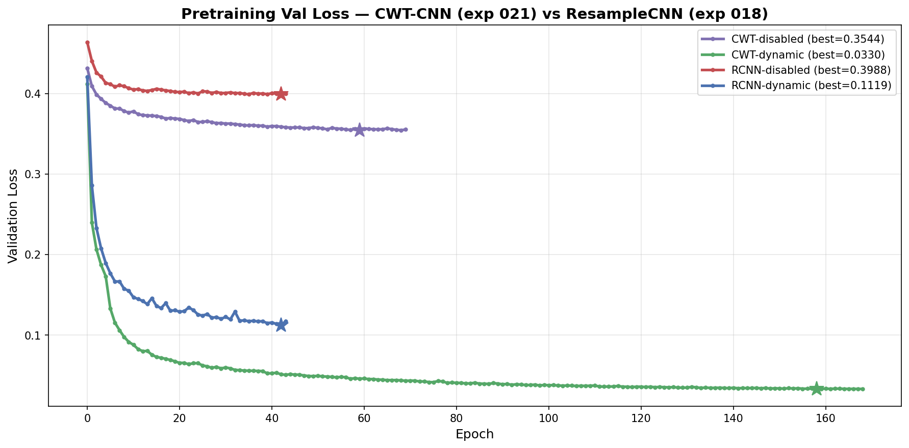
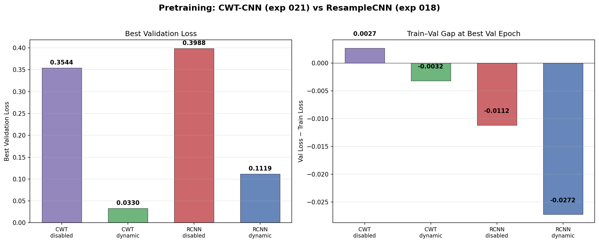
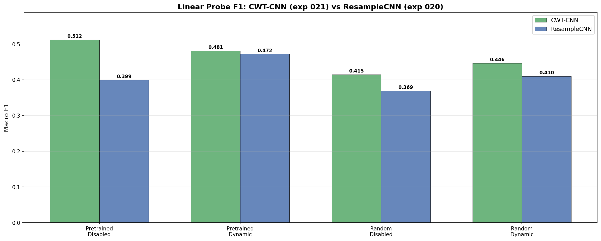
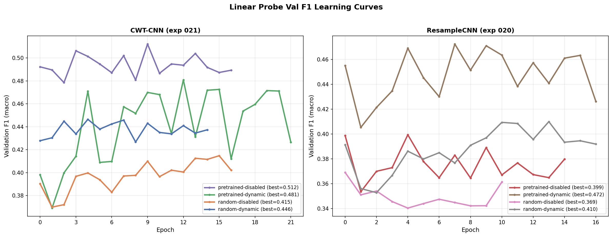
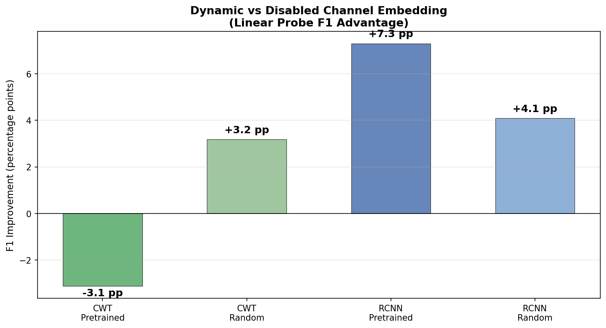
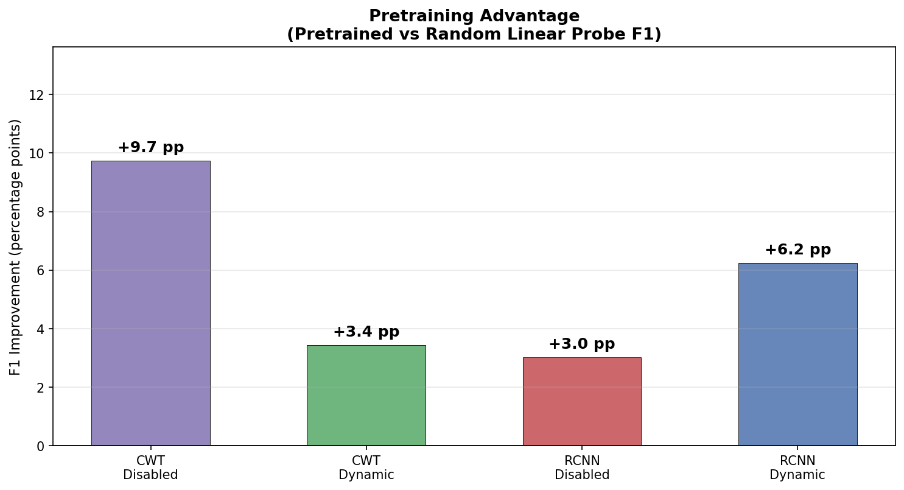
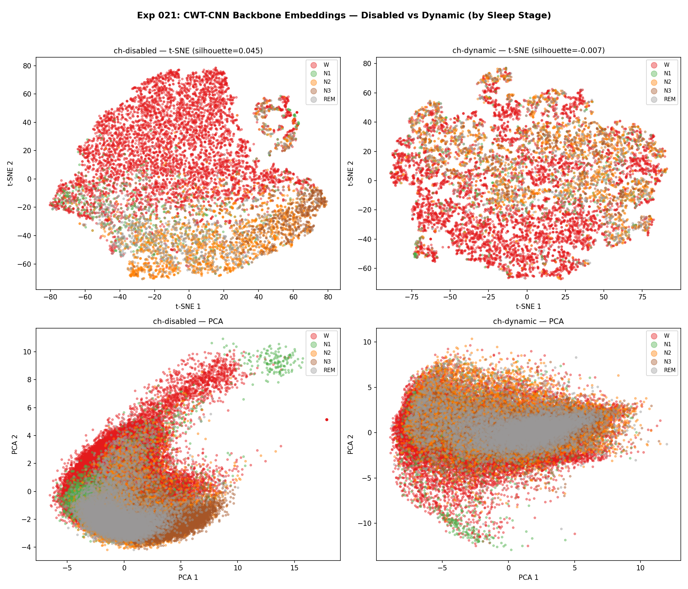
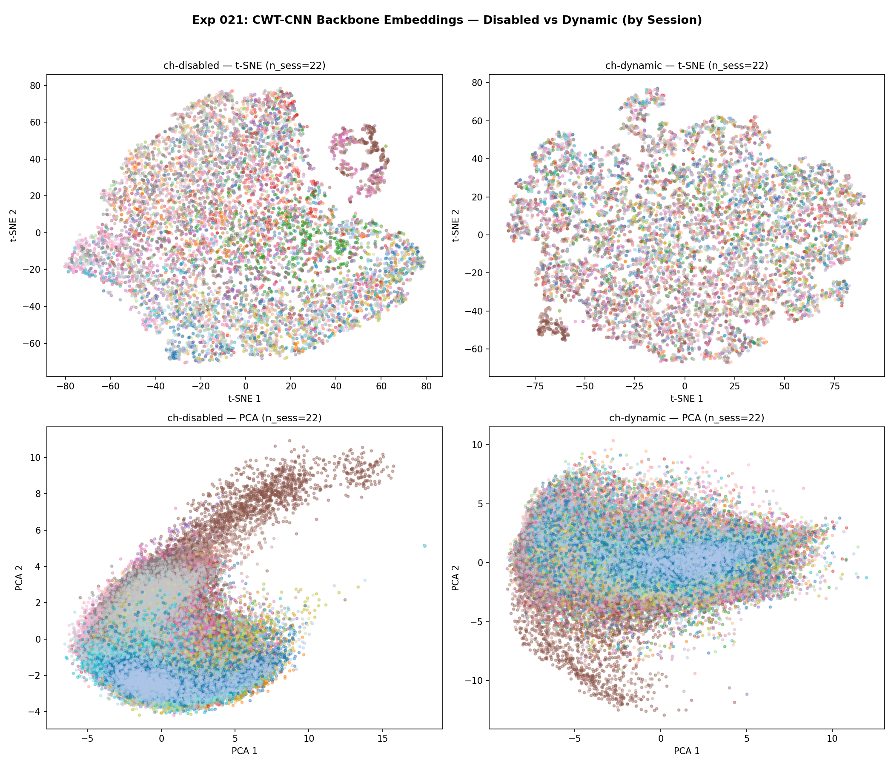
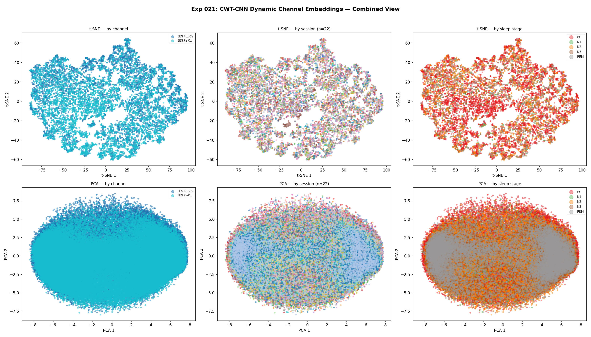

# CWT CNN with Dynamic Channel Embeddings: Pretraining, Linear Probing, and Embedding Analysis

**Status:** Completed
**Date started:** 2026-07-28
**Parent experiment:** [Dynamic Channel Embeddings via Relative Inter-Channel Attention](../experiments/018-dynamic-channel-embeddings.md)
**Follow-up experiments:** [KempSleep Baselines and Finetuning: CWT-CNN with Dynamic Channel Embeddings](../experiments/022-kemp-baselines-finetune-cwt-dynch.md)

## Background

Experiment 018 introduced `channel_emb_mode="dynamic"` via a `RelativeChannelEncoder`
and showed it massively outperforms the disabled baseline in reconstruction loss
(0.11 vs 0.40, a 72% relative reduction) using a ResampleCNN tokenizer. The
follow-up experiments (019, 020) analyzed the learned embeddings and evaluated
downstream performance via linear probing.

Separately, experiment 008 compared CWT-CNN vs ResampleCNN tokenizers in a linear
probing setting and found that the CWT-CNN pretrained backbone gives a much larger
advantage over random init (+15 pp F1) compared to ResampleCNN (+2.2 pp). This
suggests that CWT-CNN's frequency-domain decomposition (wavelet transform) better
captures the spectral features relevant for downstream EEG tasks like sleep staging.

However, all dynamic channel embedding experiments (018, 019, 020) used
ResampleCNN. This experiment repeats the full pipeline — pretraining, linear
probing, and embedding analysis — using the CWT-CNN tokenizer instead, to
determine whether the tokenizer choice interacts with the dynamic channel
embedding mechanism.

## Question

Does the CWT-CNN tokenizer produce the same dynamic channel embedding behaviour
as ResampleCNN (channel embeddings not clustering by electrode type), while
yielding better downstream linear probing performance?

## Hypothesis

1. **CWT-CNN dynamic channel embeddings will show the same structural patterns
   as ResampleCNN** — i.e., channel embeddings will *not* cluster by electrode
   type (as found in exp 019), because the RelativeChannelEncoder operates on
   the signal statistics rather than electrode identity regardless of tokenizer.
2. **CWT-CNN will outperform ResampleCNN in linear probing** for both the
   disabled and dynamic pretrained conditions, consistent with exp 008's finding
   that CWT-CNN pretraining captures more sleep-stage-relevant features (+15 pp
   F1 advantage for CWT-CNN vs +2.2 pp for ResampleCNN).
3. **The dynamic channel embedding will still outperform disabled for CWT-CNN**
   in reconstruction loss, though the gap may differ in magnitude from
   ResampleCNN since CWT-CNN may already capture some frequency-domain channel
   identity in its wavelet decomposition.

## Experiment

This experiment has three phases. Phase 1 (pretraining) is the priority and
should be launched immediately.

---

### Phase 1: Pretraining (CWT-CNN × disabled/dynamic)

#### Setup

- **Model:** MaskedPOYOEEGModel, embed_dim=256, depth=4, 8 cross/self heads,
  dim_head=128, TemporalBlockMasking (block_size=10, mask_ratio=0.5),
  `zero_output_timestamps: false`, `normalize_inputs: true`,
  **CWT-CNN tokenizer** (`per_channel_cwt_cnn`), channel_encoder_heads=4
- **Data:** Balanced Klinzing subset (`sleep_brainset_small`) — 14 subjects,
  28 recordings, **intersubject** split, fold 0, sequence_length=2.0s
- **Task:** Masked reconstruction (MSE loss), mask_ratio=0.5
- **Training:** batch_size=512, lr=1e-4, weight_decay=0.01, max_epochs=200,
  bf16-mixed precision, warmup_epochs=0
- **Hardware:** 1× L40S per run, 6 CPUs, 32 GB RAM (SLURM)
- **WandB:** project=foundry_pretraining,
  group=PRETRAIN_CWT_DYNAMIC_CHANNEL_EMB

**Conditions:**

| Condition    | channel_emb_mode | session_emb_mode | tokenizer           | Purpose                                |
| ------------ | ---------------- | ---------------- | ------------------- | -------------------------------------- |
| ch-disabled  | `disabled`       | `disabled`       | `per_channel_cwt_cnn` | CWT-CNN baseline (no channel identity) |
| ch-dynamic   | `dynamic`        | `disabled`       | `per_channel_cwt_cnn` | CWT-CNN + dynamic channel attention    |

#### Launch command

```bash
uv run python main.py experiment=pretraining/poyo_pretrain_dynamic_session_emb \
    model/tokenizer=per_channel_cwt_cnn \
    model/session_emb=disabled \
    'model.channel_emb_mode=disabled,dynamic' \
    run.group=PRETRAIN_CWT_DYNAMIC_CHANNEL_EMB \
    'run.name=pretrain_cwt_dynch_ch-${model.channel_emb_mode}' \
    'run.tags=[pretraining,mae,masked,cwt_cnn,dynamic_channel_emb,intersubject,exp021]' \
    hydra.launcher.timeout_min=1440 \
    -m
```

#### Key config overrides

Base config:
`configs/experiment/pretraining/poyo_pretrain_dynamic_session_emb.yaml`
(same as exp 018)

Overrides vs exp 018:

- `model/tokenizer=per_channel_cwt_cnn` (CWT-CNN instead of ResampleCNN)
- `run.group: PRETRAIN_CWT_DYNAMIC_CHANNEL_EMB`
- `run.name` includes `cwt` prefix
- `hydra.launcher.timeout_min=1440` (24h — exp 018 timed out at 3h/44 epochs)
- Tags include `cwt_cnn` and `exp021`

---

### Phase 2: Linear Probing (after pretraining completes)

#### Setup

Same as exp 020, but with CWT-CNN tokenizer and pointing to the exp 021
pretrained checkpoints. 4 conditions: 2 channel_emb_mode × {pretrained, random}.

A new config file `configs/experiment/sleep_staging/poyo_kemp_linear_probe_cwt_dynch.yaml`
will be created when Phase 1 completes, mirroring `poyo_kemp_linear_probe_dynch.yaml`
but with `per_channel_cwt_cnn` tokenizer and updated checkpoint paths.

#### Launch command (to be finalized after pretraining)

```bash
# Pretrained backbone conditions (2 jobs: ch-disabled, ch-dynamic):
uv run python main.py experiment=sleep_staging/poyo_kemp_linear_probe_cwt_dynch \
    run.init_mode=pretrained -m

# Random-init backbone conditions (2 jobs: ch-disabled, ch-dynamic):
uv run python main.py experiment=sleep_staging/poyo_kemp_linear_probe_cwt_dynch \
    run.init_mode=random run.pretrained_checkpoint=null -m
```

---

### Phase 3: Embedding Analysis (after pretraining completes)

#### Setup

Same as exp 019, but using CWT-CNN pretrained checkpoints from Phase 1.
Extract backbone and channel embeddings, visualize with t-SNE/PCA colored by
sleep stage, channel type, and session.

#### Launch command (to be finalized after pretraining)

```bash
# Disabled condition (backbone only):
uv run python scripts/extract_embeddings.py \
    experiment=sleep_staging/poyo_kemp_allsess \
    model/tokenizer=per_channel_cwt_cnn \
    model.channel_emb_mode=disabled \
    model/session_emb=disabled \
    '++run.pretrained_checkpoint=/network/scratch/s/sobralm/runs/PRETRAIN_CWT_DYNAMIC_CHANNEL_EMB/pretrain_cwt_dynch_ch-disabled/checkpoints/last.ckpt' \
    ++run.pretrained_transfer_mode=permissive \
    extract.output_dir=outputs/embeddings/021_disabled \
    extract.max_batches=200

# Dynamic condition (backbone + channel embeddings):
uv run python scripts/extract_embeddings.py \
    experiment=sleep_staging/poyo_kemp_allsess \
    model/tokenizer=per_channel_cwt_cnn \
    model.channel_emb_mode=dynamic \
    model/session_emb=disabled \
    '++run.pretrained_checkpoint=/network/scratch/s/sobralm/runs/PRETRAIN_CWT_DYNAMIC_CHANNEL_EMB/pretrain_cwt_dynch_ch-dynamic/checkpoints/last.ckpt' \
    ++run.pretrained_transfer_mode=permissive \
    extract.output_dir=outputs/embeddings/021_dynamic \
    +extract.extract_channel_emb=true \
    extract.max_batches=200

# Visualization:
uv run python analysis/021_cwt_dynamic_channel_emb_viz.py
```

### WandB

**Pretraining (Phase 1):**

- **Project:** `foundry_pretraining`
- **Group:** `PRETRAIN_CWT_DYNAMIC_CHANNEL_EMB`

| Condition    | Run name                            | Run ID     |
| ------------ | ----------------------------------- | ---------- |
| ch-disabled  | `pretrain_cwt_dynch_ch-disabled`    | `v6yoko4h` |
| ch-dynamic   | `pretrain_cwt_dynch_ch-dynamic`     | `i069k3tx` |

**Linear Probe (Phase 2):**

- **Project:** `foundry_finetuning`
- **Group:** `KEMP_LINEAR_PROBE_DYNCH`

| Condition              | Run name                             | Run ID     |
| ---------------------- | ------------------------------------ | ---------- |
| pretrained-ch-disabled | `kemp_lp_021_pretrained_ch_disabled` | `dzkfguc3` |
| pretrained-ch-dynamic  | `kemp_lp_021_pretrained_ch_dynamic`  | `l3eafwx5` |
| random-ch-disabled     | `kemp_lp_021_random_ch_disabled`     | `3pnhsc9j` |
| random-ch-dynamic      | `kemp_lp_021_random_ch_dynamic`      | `fpso1m3b` |

Note: several runs show `state=failed` (SLURM timeout) but completed
enough epochs to reach early-stopping-quality results and are usable.

## Results

### Summary

**Phase 1 (Pretraining):** CWT-CNN dynamic achieves a 90.7% relative
reduction in reconstruction loss over disabled (0.033 vs 0.354), an even
larger improvement than the 71.9% seen with ResampleCNN in exp 018
(0.112 vs 0.399). Both CWT-CNN conditions also outperform their
ResampleCNN counterparts in absolute reconstruction loss.

**Phase 2 (Linear Probe):** The CWT-CNN results reveal a **surprising
reversal**: pretrained-disabled (F1=0.512) beats pretrained-dynamic
(F1=0.481) by +3.1 pp — the opposite of the ResampleCNN result where
dynamic won by +7.3 pp. The CWT-CNN pretrained-disabled model is the
best linear probe model across both tokenizers, outperforming
RCNN-pretrained-disabled (0.399) by +11.3 pp and even
RCNN-pretrained-dynamic (0.472) by +4.0 pp. In the random-init
condition, dynamic still helps (+3.2 pp), consistent with RCNN.

**Phase 3 (Embedding Analysis):** CWT-CNN dynamic channel embeddings
show similar structural patterns to ResampleCNN (exp 019): channels do
not cluster by electrode type, and there is band-like sleep stage
organization. However, the backbone silhouette score for dynamic
(-0.007) is lower than disabled (0.045), consistent with the linear
probe finding that the disabled backbone is more discriminative.

### Metrics

**Phase 1 — Pretraining loss:**

| Condition     | Best Val Loss | Train@BV | Gap     | BV Epoch | Max Epoch | Run ID     |
| ------------- | ------------: | -------: | ------: | -------: | --------: | ---------- |
| CWT-disabled  |        0.3544 |   0.3517 | +0.0027 |       59 |        69 | `v6yoko4h` |
| CWT-dynamic   |        0.0330 |   0.0362 | -0.0032 |      158 |       168 | `i069k3tx` |
| RCNN-disabled |        0.3988 |   0.4100 | -0.0112 |       42 |        44 | `zmxyua36` |
| RCNN-dynamic  |        0.1119 |   0.1391 | -0.0272 |       42 |        44 | `hggeonah` |

**Dynamic improvement by tokenizer:**

| Tokenizer | Disabled | Dynamic | Relative change |
| --------- | -------: | ------: | --------------: |
| CWT-CNN   |   0.3544 |  0.0330 |          -90.7% |
| RCNN      |   0.3988 |  0.1119 |          -71.9% |

**Phase 2 — Linear probe:**

| Condition              | Val F1 | Val Acc | Val Loss | BF1 Ep | Max Ep | Run ID     |
| ---------------------- | -----: | ------: | -------: | -----: | -----: | ---------- |
| CWT-pretrained-disabled  | 0.5121 | 0.6670 |   1.1161 |      9 |     17 | `dzkfguc3` |
| CWT-pretrained-dynamic   | 0.4809 | 0.6429 |   1.2206 |     12 |     22 | `l3eafwx5` |
| CWT-random-disabled      | 0.4147 | 0.5262 |   1.3044 |     15 |     17 | `3pnhsc9j` |
| CWT-random-dynamic       | 0.4465 | 0.6881 |   1.3955 |      4 |     14 | `fpso1m3b` |
| RCNN-pretrained-disabled | 0.3994 | 0.6319 |   1.5246 |      4 |     14 | `zmg07ep4` |
| RCNN-pretrained-dynamic  | 0.4724 | 0.6782 |   1.2356 |      7 |     17 | `osqqcdrj` |
| RCNN-random-disabled     | 0.3691 | 0.5550 |   1.4031 |      0 |     10 | `t54gr0yj` |
| RCNN-random-dynamic      | 0.4100 | 0.5829 |   1.3971 |     13 |     17 | `ip8xktxl` |

**Pairwise F1 comparisons:**

| Comparison                                    | ΔF1 (pp) |
| --------------------------------------------- | -------: |
| CWT disabled vs dynamic (pretrained)          |    +3.1  |
| CWT disabled vs dynamic (random)              |    -3.2  |
| RCNN disabled vs dynamic (pretrained)         |    -7.3  |
| RCNN disabled vs dynamic (random)             |    -4.1  |
| CWT vs RCNN pretrained disabled               |   +11.3  |
| CWT vs RCNN pretrained dynamic                |    +0.8  |
| CWT vs RCNN random disabled                   |    +4.6  |
| CWT vs RCNN random dynamic                    |    +3.7  |

**Phase 3 — Embedding analysis:**

| Condition   | Silhouette (by stage) | n samples |
| ----------- | --------------------: | --------: |
| ch-disabled |               0.0449  |   102,400 |
| ch-dynamic  |              -0.0069  |   102,400 |

Channel embeddings: 204,800 vectors, dim=64, channels={EEG Fpz-Cz, EEG Pz-Oz}.

### Analysis

**Analysis scripts:**

- `analysis/021_cwt_dynamic_channel_emb.py` — pretraining and linear probe
- `analysis/021_cwt_dynamic_channel_emb_viz.py` — embedding visualization

```bash
uv run python analysis/021_cwt_dynamic_channel_emb.py
uv run python analysis/021_cwt_dynamic_channel_emb_viz.py
```

### Figures

**Pretraining validation loss — CWT-CNN vs ResampleCNN:**



**Pretraining bar comparison (best val loss + train-val gap):**



**Linear probe F1 — CWT-CNN vs ResampleCNN (all 8 conditions):**



**Linear probe F1 learning curves:**



**Dynamic vs disabled F1 advantage (by tokenizer × init):**



**Pretraining advantage (pretrained vs random F1, by tokenizer × channel):**



**Backbone embeddings — disabled vs dynamic (by sleep stage):**



**Backbone embeddings — disabled vs dynamic (by session):**



**Dynamic channel embeddings — combined view (channel, session, stage):**



## Conclusions

**Hypothesis 1 — PARTIALLY REFUTED.** The CWT-CNN dynamic channel embeddings
show qualitatively similar structural patterns to ResampleCNN (channels do
not cluster by electrode type, sleep stages show band-like organization).
However, the quantitative behaviour is strikingly different: the CWT-CNN
backbone silhouette score is negative for the dynamic condition (-0.007 vs
+0.045 for disabled), and the linear probe shows the pretrained-disabled
model outperforming pretrained-dynamic — the exact opposite of the
ResampleCNN result.

**Hypothesis 2 — PARTIALLY SUPPORTED.** CWT-CNN strongly outperforms
ResampleCNN for the disabled condition (+11.3 pp F1 in pretrained, +4.6 pp
in random), consistent with exp 008. However, for the dynamic condition the
CWT-CNN advantage is negligible (+0.8 pp pretrained, +3.7 pp random). The
CWT-CNN pretrained-disabled model (F1=0.512) is the best overall, even
beating RCNN-pretrained-dynamic (F1=0.472).

**Hypothesis 3 — STRONGLY SUPPORTED (for reconstruction).** The dynamic
channel embedding achieves a 90.7% relative reduction in reconstruction loss
with CWT-CNN (0.033 vs 0.354), even larger than the 71.9% reduction with
ResampleCNN. However, this massive reconstruction improvement does NOT
translate into better linear probe performance — it actually hurts
it (-3.1 pp F1).

**Key insight:** The CWT-CNN tokenizer and the RelativeChannelEncoder are
**partially redundant**. CWT-CNN's wavelet decomposition already captures
frequency-domain channel characteristics, so the dynamic channel encoder's
signal-statistics-based channel identity adds little downstream value and
may even be detrimental. The dynamic encoder helps the decoder reconstruct
signals better (by providing fine-grained channel identity), but this
reconstruction benefit does not reflect what the backbone learns. In
contrast, the ResampleCNN backbone relies on the dynamic encoder to learn
channel-relevant features, so the reconstruction improvement translates
directly into better backbone representations.

## Notes for future experiments

- The CWT-CNN disabled pretrained model (F1=0.512) is the strongest
  single linear probe result — consider using it as the backbone for
  full finetuning on KempSleep and other downstream tasks.
- The partial redundancy between CWT-CNN and dynamic channel embeddings
  suggests investigating whether a simpler channel encoding (e.g., a
  learned static embedding per channel type, not per session) could
  complement CWT-CNN without the overhead of the RelativeChannelEncoder.
- CWT-CNN's massive pretraining advantage for disabled (+11.3 pp over
  RCNN) confirms that tokenizer choice is a larger factor than channel
  embedding for this dataset and task.
- The negative silhouette score for CWT-CNN dynamic suggests the dynamic
  encoder may be pushing channel-specific information into the channel
  embedding space rather than the backbone — investigate whether the
  channel embeddings alone can predict sleep stage.
- Consider whether the dynamic channel encoder's reconstruction benefit
  (90.7% reduction) could be leveraged differently — e.g., using it only
  during pretraining and discarding the channel encoder for downstream.
