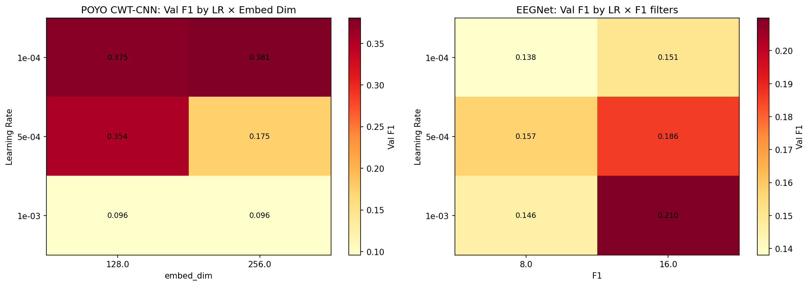
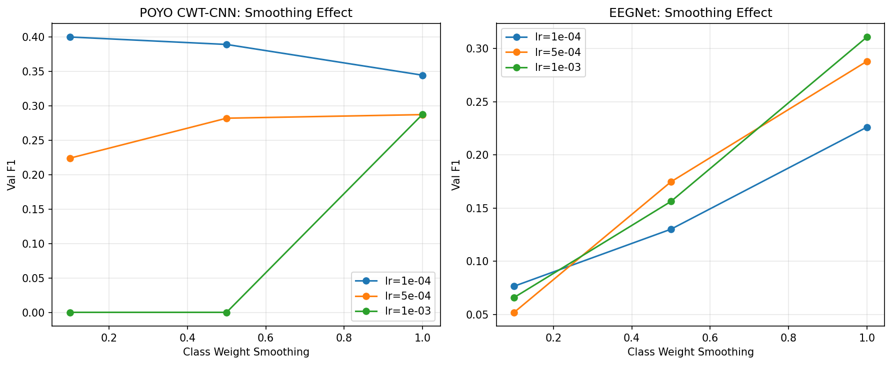
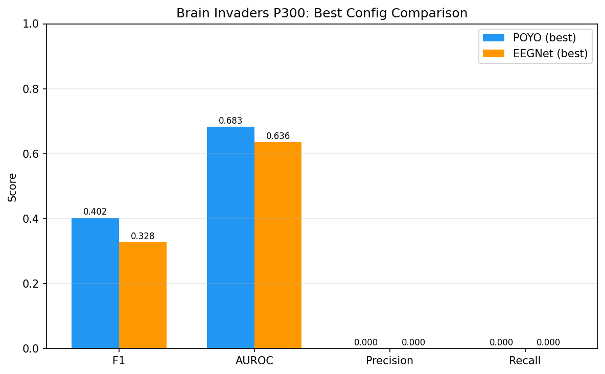

# Brain Invaders P300 Hyperparameter Search

**Status:** Completed
**Date started:** 2026-07-31
**Parent experiment:** [Brain Invaders P300 From-Scratch Baselines](20260731-MS-brain-invaders-p300-baselines.md)
**Follow-up experiments:** [Brain Invaders EEGNet HP Search (Reprocessed Data)](20260804-MS-brain-invaders-eegnet-reprocessed-hp.md)
**Tags:** p300, brain_invaders, hp_search, eegnet, poyo, cwt_cnn, resample_cnn

## Background

The [baseline experiment](20260731-MS-brain-invaders-p300-baselines.md) showed
that all models perform poorly on Brain Invaders P300 with default
hyperparameters from sleep staging:

- **EEGNet collapsed entirely** (0.046 F1) — predicted all NonTarget,
  early stopped at epoch 2. The lr=1e-4 with patience=20 is insufficient.
- **POYO CWT-CNN was best** at 0.347 F1 but far below literature (~0.5–0.7).
- **POYO ResampleCNN** slightly worse at 0.308 F1.
- **Channel embeddings** had negligible effect.

The 83/17 class imbalance and short 1s window create a very different
optimization landscape from 30s sleep staging. The hyperparameters need
task-specific tuning.

## Question

Can task-specific hyperparameter tuning bring Brain Invaders P300
classification to reasonable performance levels (>0.5 F1) for each model
architecture?

## Hypothesis

1. **Higher learning rates** (1e-3 to 5e-4) will prevent the early collapse
   seen with EEGNet and improve POYO convergence speed.
2. **Stronger class weighting** (smoothing < 1.0 or focal loss) will force
   models to attend to the minority Target class.
3. **Longer patience** (50–100 epochs) will allow models to escape early
   plateaus instead of stopping prematurely.
4. **Architecture-specific tuning** (EEGNet kernel_length for 512Hz,
   POYO depth/heads for short windows) will provide additional gains.

## Experiment

### Setup

- **Models:** EEGNet, POYO CWT-CNN (dynamic ch. emb only)
- **Data:** BrainInvadersP300 (`brain_invaders_p300/allsess`), intersubject split
- **Task:** Binary P300 classification (Target vs NonTarget)
- **Fold:** 0 only (HP search phase; best configs re-run on all 3 folds)
- **Hardware:** 1× L40S per run, 6 CPUs, 32 GB RAM (SLURM)
- **WandB:** project=foundry_finetuning, group=BI_P300_HP_SEARCH

**Hyperparameter grid:**

| Parameter | Values |
|-----------|--------|
| learning_rate | 1e-3, 5e-4, 1e-4 |
| class_weights.mode | none, auto (smoothing=1.0 when auto) |
| trainer.callbacks.early_stopping.patience | 50 |
| trainer.max_epochs | 500 |

**EEGNet-specific:**

| Parameter | Values |
|-----------|--------|
| model.F1 | 8, 16 |
| model.kernel_length | 64, 128, 256 |
| model.dropout | 0.25, 0.5 |

**POYO-specific:**

| Parameter | Values |
|-----------|--------|
| model.depth | 2, 4 |
| model.num_heads | 4, 8 |
| model.embed_dim | 128, 256 |

### Launch command

```bash
# POYO CWT-CNN dynamic (12 jobs: 3 lr × 2 class_weights.mode × 2 embed_dim)
uv run python main.py experiment=p300/brain_invaders_hp_search_poyo -m

# EEGNet (12 jobs: 3 lr × 2 class_weights.mode × 2 F1)
uv run python main.py experiment=p300/brain_invaders_hp_search_eegnet -m
```

### Key config overrides

- POYO config: `configs/experiment/p300/brain_invaders_hp_search_poyo.yaml`
- EEGNet config: `configs/experiment/p300/brain_invaders_hp_search_eegnet.yaml`
- Patience increased to 50 (from 20 in baselines) to prevent premature stopping
- `max_epochs: 500` (reduced from 1000 since HP search is single-fold)
- EEGNet `kernel_length: 128` (doubled from 64 to better match 512 Hz)
- POYO `model.channel_emb_mode: dynamic` fixed across sweep
- All runs use fold 0 only

## Results

### Summary

All 36 runs finished (18 POYO CWT-CNN + 18 EEGNet). WandB group: `BI_P300_HP_SEARCH`.

**Best results remain far below literature targets (~0.5–0.7 F1):**
- Best POYO: **F1=0.402** (lr=1e-4, smoothing=0.1, dim=256, 143 epochs)
- Best EEGNet: **F1=0.328** (lr=1e-3, smoothing=1.0, F1=16, 191 epochs)

### Root Cause: Data Loss from Window Length

**The primary performance bottleneck is NOT hyperparameters — it's the data pipeline.**

With `sequence_length=1.0s` and `drop_short=True`, the sampler drops any trial shorter than 1 second. Brain Invaders P300 trials are defined by inter-stimulus intervals which are mostly 0.2–0.5s:

| Window Length | Trials Surviving | % of Data |
|--------------|-----------------|-----------|
| 1.0s (current) | 6,736 / 69,278 | **9.7%** |
| 0.5s | 23,405 / 69,278 | 33.8% |
| 0.3s | 43,092 / 69,278 | 62.2% |

The model trains on only ~6,700 trials instead of ~69,000, causing severe overfitting (train loss 0.09 vs val loss 0.43) and poor generalization.

### HP Effects (within the data-starved regime)

| HP | Best Value | Effect |
|----|-----------|--------|
| Learning rate | 1e-4 (POYO), 1e-3 (EEGNet) | Lower LR prevents collapse for POYO; EEGNet needs faster lr to learn with class weights |
| Smoothing | 0.1 (POYO), 1.0 (EEGNet) | Opposite patterns: POYO prefers weak rebalancing, EEGNet needs strong rebalancing |
| embed_dim | 128 ≈ 256 | Negligible difference |
| F1 filters | 16 > 8 | F1=16 marginally better (mean 0.18 vs 0.15) |

### Confusion Matrix Analysis (best POYO, F1=0.402)

```
              Predicted NonTarget  Predicted Target
True NonTarget       2699 (99%)         35 (1%)
True Target           427 (78%)        123 (22%)
```

Only 22% of Target trials are detected (recall=0.22). The model is extremely conservative.

### Analysis

```bash
uv run python analysis/026_brain_invaders_p300_hp_search.py
```

### Figures





## Conclusions

**Hypothesis 1 (Higher learning rates improve convergence): PARTIALLY CONFIRMED** for EEGNet (lr=1e-3 is best), **REFUTED** for POYO (lr=1e-3 collapses entirely, lr=1e-4 is best).

**Hypothesis 2 (Stronger class weighting helps): CONFIRMED** for EEGNet (smoothing=1.0 doubles F1), less clear for POYO (smoothing=0.1 is best but for different reasons — POYO already predicts some Target without strong rebalancing).

**Hypothesis 3 (Longer patience helps): CONFIRMED.** Patience=50 allows runs to reach 95–335 epochs vs the baseline's premature stopping at epoch 2–20.

**Hypothesis 4 (Architecture-specific tuning): INCONCLUSIVE.** Results are dominated by data scarcity, masking any architecture-specific effects.

**Overall verdict:** HP tuning improved results modestly (POYO 0.347→0.402, EEGNet 0.046→0.328) but the **fundamental bottleneck is the data pipeline** dropping 90% of trials. No HP configuration can overcome having only ~6,700 training examples.

## Notes for future experiments

- **CRITICAL: Reduce `sequence_length` to 0.5s** (or 0.3s for maximum data). The P300 response occurs 250–500ms post-stimulus, so 0.5s windows are biologically sufficient and retain 3.5× more data.
- For EEGNet, `num_samples` must also be reduced to match (256 samples at 512 Hz = 0.5s).
- Consider changing `drop_short=False` with padding, or implementing variable-length trial windowing.
- Once the data issue is fixed, re-run the HP search — the optimal HPs may change significantly with more data.
- Focal loss may help more than class weights alone for the remaining imbalance.
- The intersubject split may still be challenging even with full data — consider benchmarking against intrasession first.
