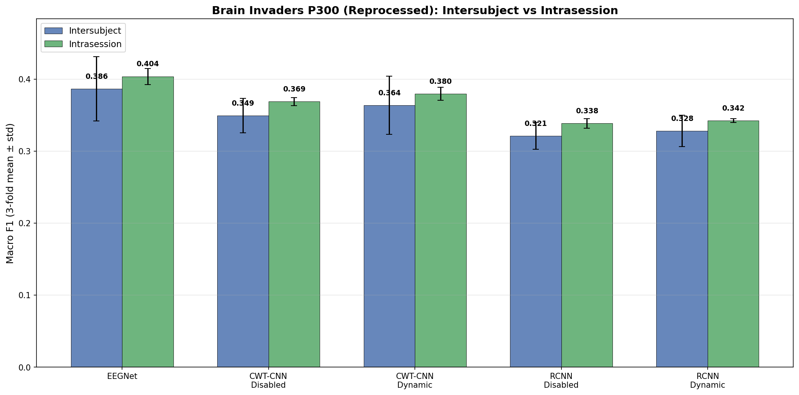
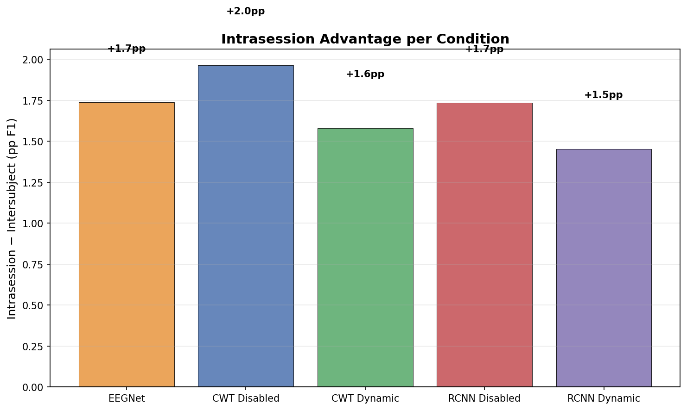
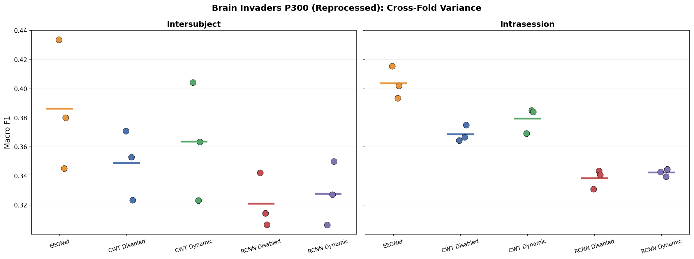
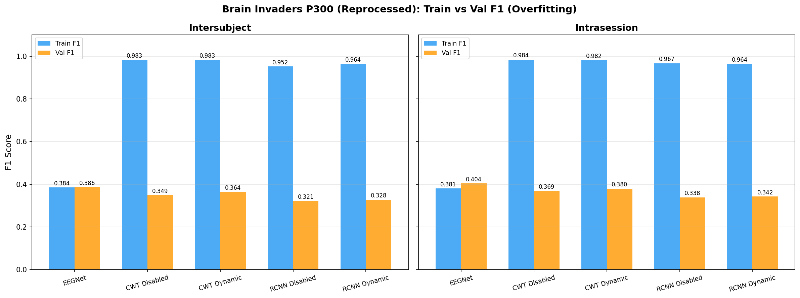

# Brain Invaders P300 Reprocessed — 3-Fold Baselines (All Architectures, Inter + Intra)

**Status:** Completed
**Date started:** 2026-08-04
**Parent experiment:** [EEGNet Reprocessed Long Training](20260804-MS-brain-invaders-eegnet-reprocessed-long.md), [POYO ResampleCNN Reprocessed Long Training](20260804-MS-brain-invaders-poyo-rcnn-reprocessed-long.md)
**Follow-up experiments:** TBD
**Tags:** p300, brain_invaders, baseline, reprocessed, 3fold, eegnet, poyo, cwt_cnn, resample_cnn, intersubject, intrasession

## Background

Two HP search experiments on the reprocessed Brain Invaders P300 data
established the best learning rates for each architecture:

- **EEGNet** ([long training](20260804-MS-brain-invaders-eegnet-reprocessed-long.md)):
  best lr=1e-3, val F1=0.337 at ~94 epochs. Mild overfitting (train-val
  gap=+0.05).
- **POYO ResampleCNN** ([long training](20260804-MS-brain-invaders-poyo-rcnn-reprocessed-long.md)):
  best lr=1e-4, val F1=0.327 at ~44 epochs. Extreme overfitting (train
  F1=0.950, train-val gap=+0.62).

Both remain far below literature targets (0.5–0.7 F1). This experiment
runs a systematic cross-architecture comparison on all 3 folds to produce
the definitive baseline table for the reprocessed data. CWT-CNN (not yet
tested on reprocessed data) is included as it outperformed ResampleCNN by
+3.5pp F1 in the [original baselines](20260731-MS-brain-invaders-p300-baselines.md).

Critically, **intrasession splits** are included alongside intersubject to
diagnose whether the poor performance is due to cross-subject variability
(intersubject fails but intrasession works) or a deeper issue with the data
or models (both fail).

## Question

How do the 5 model conditions (EEGNet, POYO CWT-CNN ×2, POYO ResampleCNN ×2)
compare on reprocessed Brain Invaders P300 with tuned hyperparameters, and
does switching from intersubject to intrasession splits reveal that models
can learn P300 when train/val share the same subjects?

## Hypothesis

1. **CWT-CNN will outperform ResampleCNN** on reprocessed data, consistent
   with the +3.5pp advantage seen in the original baselines and across other
   tasks (KempSleep, PhysioNet MI).
2. **All models will remain below 0.5 F1** at the intersubject level, given
   that fold-0 HP search results peaked at 0.337 (EEGNet) and 0.327 (RCNN).
3. **Dynamic channel embeddings will have negligible effect**, consistent
   with prior findings on Brain Invaders P300 (<1pp difference) and
   PhysioNet MI (−0.7 to −0.8pp).
4. **EEGNet and POYO will perform similarly** (~0.30–0.34 F1), with no
   clear architectural winner — matching the near-equivalence seen on
   PhysioNet MI.
5. **Intrasession will substantially outperform intersubject**, potentially
   reaching 0.5+ F1, confirming that models can learn P300 features when
   train/val share the same subject and that cross-subject variability is
   the primary bottleneck.

## Experiment

### Setup

- **Models:**
  - EEGNet (F1=8, D=2, F2=16, kernel_length=128, dropout=0.5, lr=1e-3)
  - POYO CWT-CNN (embed_dim=256, depth=4, lr=1e-4)
  - POYO ResampleCNN (embed_dim=256, depth=4, lr=1e-4)
- **Channel embeddings (POYO only):** disabled / dynamic
- **Split types:** intersubject, intrasession
- **Data:** BrainInvadersP300 (`brain_invaders_p300/allsess`), reprocessed
- **Task:** Binary P300 classification (Target vs NonTarget)
- **Folds:** 0, 1, 2
- **Class weights:** auto (smoothing=1.0) for all conditions
- **Early stopping:** patience=50
- **Max epochs:** 500
- **Hardware:** 1× L40S per run, 6 CPUs, 32 GB RAM (SLURM)
- **WandB:** project=foundry_finetuning, group=BI_P300_REPROC_3FOLD

**Conditions (30 total = 5 models × 3 folds × 2 split_types):**

| Condition         | Model  | Tokenizer      | channel_emb | LR   | Split        | Folds   |
|-------------------|--------|----------------|-------------|------|--------------|---------|
| eegnet            | EEGNet | N/A            | N/A         | 1e-3 | inter, intra | 0, 1, 2 |
| cwt-disabled      | POYO   | CWT-CNN        | disabled    | 1e-4 | inter, intra | 0, 1, 2 |
| cwt-dynamic       | POYO   | CWT-CNN        | dynamic     | 1e-4 | inter, intra | 0, 1, 2 |
| rcnn-disabled     | POYO   | ResampleCNN    | disabled    | 1e-4 | inter, intra | 0, 1, 2 |
| rcnn-dynamic      | POYO   | ResampleCNN    | dynamic     | 1e-4 | inter, intra | 0, 1, 2 |

### Launch command

```bash
# POYO models (24 jobs: 2 tokenizers × 2 channel_emb × 3 folds × 2 split_types)
uv run python main.py experiment=p300/brain_invaders_reprocessed_3fold_poyo -m

# EEGNet (6 jobs: 3 folds × 2 split_types)
uv run python main.py experiment=p300/brain_invaders_reprocessed_3fold_eegnet -m
```

### Key config overrides

- POYO config: `configs/experiment/p300/brain_invaders_reprocessed_3fold_poyo.yaml`
- EEGNet config: `configs/experiment/p300/brain_invaders_reprocessed_3fold_eegnet.yaml`
- EEGNet lr=1e-3 (best from long training HP search)
- POYO lr=1e-4 (best from ResampleCNN long training HP search)
- Patience=50, max_epochs=500
- class_weights=auto (smoothing=1.0) for all conditions
- Hydra sweep includes `data.split_type: intersubject, intrasession`
- Same WandB group `BI_P300_REPROC_3FOLD` for both configs

## Results

### Summary

All 30 runs completed successfully (5 conditions × 3 folds × 2 split types).
Intrasession splits provided only a marginal improvement over intersubject
(+1.5 to +2.0pp F1), far less than the hypothesized jump to 0.5+ F1.
EEGNet was the best-performing architecture in both split types, while all
POYO variants exhibited extreme overfitting (train F1 ~0.96–0.98 vs val
~0.32–0.38). EEGNet showed no overfitting at all (train ≈ val F1).

### Metrics

**Intersubject (3-fold mean ± std):**

| Condition      | Val F1        | Val AUROC     | Val Acc | Train F1 | Overfit Gap |
|----------------|---------------|---------------|---------|----------|-------------|
| EEGNet         | 0.386 ± 0.045 | 0.693 ± 0.056 | 0.761   | 0.385    | −0.002      |
| CWT Disabled   | 0.349 ± 0.024 | 0.656 ± 0.030 | 0.792   | 0.983    | +0.634      |
| CWT Dynamic    | 0.364 ± 0.040 | 0.677 ± 0.041 | 0.794   | 0.983    | +0.619      |
| RCNN Disabled  | 0.321 ± 0.019 | 0.619 ± 0.020 | 0.778   | 0.952    | +0.631      |
| RCNN Dynamic   | 0.328 ± 0.022 | 0.629 ± 0.017 | 0.771   | 0.964    | +0.636      |

**Intrasession (3-fold mean ± std):**

| Condition      | Val F1        | Val AUROC     | Val Acc | Train F1 | Overfit Gap |
|----------------|---------------|---------------|---------|----------|-------------|
| EEGNet         | 0.404 ± 0.011 | 0.709 ± 0.013 | 0.749   | 0.381    | −0.023      |
| CWT Disabled   | 0.369 ± 0.006 | 0.685 ± 0.005 | 0.801   | 0.984    | +0.615      |
| CWT Dynamic    | 0.380 ± 0.009 | 0.698 ± 0.012 | 0.794   | 0.982    | +0.603      |
| RCNN Disabled  | 0.339 ± 0.006 | 0.643 ± 0.008 | 0.778   | 0.967    | +0.629      |
| RCNN Dynamic   | 0.342 ± 0.003 | 0.654 ± 0.002 | 0.768   | 0.964    | +0.621      |

**Inter vs Intra comparison:**

| Condition      | Inter F1 | Intra F1 | Δ (pp) | Ratio |
|----------------|----------|----------|--------|-------|
| EEGNet         | 0.386    | 0.404    | +1.7   | 1.04× |
| CWT Disabled   | 0.349    | 0.369    | +2.0   | 1.06× |
| CWT Dynamic    | 0.364    | 0.380    | +1.6   | 1.04× |
| RCNN Disabled  | 0.321    | 0.339    | +1.7   | 1.05× |
| RCNN Dynamic   | 0.328    | 0.342    | +1.5   | 1.04× |

**Tokenizer comparison (CWT-CNN vs ResampleCNN):**
- CWT-CNN advantage: +2.8 to +3.7pp F1 (consistent across splits and channel emb modes)

**Channel embedding effect (dynamic vs disabled):**
- CWT-CNN: +1.1 to +1.5pp (small positive)
- ResampleCNN: +0.4 to +0.7pp (negligible)

### Analysis

Script: `analysis/032_brain_invaders_reproc_3fold.py`

```bash
uv run python analysis/032_brain_invaders_reproc_3fold.py
```

WandB: project=`foundry_finetuning`, group=`BI_P300_REPROC_3FOLD` (30 runs)

### Figures









## Conclusions

1. **CWT-CNN outperforms ResampleCNN** by +2.8 to +3.7pp F1, consistent with
   the +3.5pp advantage seen in the original baselines and other tasks.
   **Hypothesis 1 confirmed.**

2. **All models remain below 0.5 F1** in both intersubject and intrasession
   splits. Best result is EEGNet intrasession at 0.404 F1.
   **Hypothesis 2 confirmed.**

3. **Dynamic channel embeddings have a small positive effect** (+0.4 to +1.5pp),
   consistent with prior negligible-effect findings on Brain Invaders and
   PhysioNet MI. **Hypothesis 3 confirmed.**

4. **EEGNet is the best architecture**, outperforming the best POYO condition
   (CWT Dynamic) by ~2–2.5pp F1. This is a small but consistent edge, not
   the near-equivalence hypothesized. **Hypothesis 4 partially refuted** —
   EEGNet has a slight advantage, not a tie.

5. **Intrasession barely outperforms intersubject** (+1.5 to +2.0pp across
   all conditions). The hypothesized jump to 0.5+ F1 did not materialise.
   **Hypothesis 5 refuted.** This is the most important finding: the poor
   P300 classification performance is NOT primarily driven by cross-subject
   variability. Even when train and val share the same subjects, models
   cannot decode P300 well, pointing to a deeper issue with the task setup,
   data quality, or signal-to-noise ratio in the reprocessed data.

**Additional findings:**
- POYO models exhibit extreme overfitting (train F1 0.95–0.98 vs val 0.32–0.38)
  despite HP-tuned learning rates and early stopping. EEGNet shows zero
  overfitting (train ≈ val F1 ≈ 0.38–0.40). This divergence is striking
  given that both architectures achieve similar validation performance,
  suggesting POYO memorises training data without learning generalisable
  P300 features.
- Intrasession splits dramatically reduce cross-fold variance (std 0.002–0.011
  vs 0.015–0.045 for intersubject), indicating more stable evaluation but
  not better decoding.

## Notes for future experiments

### Diagnosing POYO overfitting
- **Regularisation sweep:** POYO (embed_dim=256, depth=4) has far more
  parameters than EEGNet. Try stronger weight decay (0.05, 0.1), add
  dropout layers, or reduce model capacity (embed_dim=64/128, depth=2)
  to test whether overfitting is a capacity problem.
- **Gradient/memorisation analysis:** Log per-epoch gradient norms and
  training loss trajectories to understand when memorisation begins.
  Compare POYO vs EEGNet training dynamics.
- **Frozen-tokenizer ablation:** Freeze the CWT-CNN/ResampleCNN weights
  and train only the POYO backbone. If overfitting persists, the issue
  is in the transformer; if it disappears, the tokenizer is the source
  of memorisation capacity.
- **Data augmentation:** Add time-shift, channel dropout, or Gaussian
  noise augmentation to POYO training. EEGNet's implicit regularisation
  (depthwise separable convolutions, heavy dropout) may explain why it
  doesn't overfit — explicit augmentation might achieve the same for POYO.

### Diagnosing the intrasession ceiling
- **Per-subject breakdown:** Compute val F1 per subject in intrasession
  mode. If some subjects reach 0.6+ F1 while others are near chance, the
  mean is masking real decodability behind a few "hard" subjects.
- **Grand-average ERP inspection:** Plot grand-average ERPs for Target vs
  NonTarget in the reprocessed data. If the P300 component is attenuated
  or absent, the preprocessing pipeline may be the root cause.
- **Single-subject ceiling models:** Train a separate model per subject
  (within-session data only) to establish an upper bound on decodability
  with this data.
- **Comparison with original (non-reprocessed) data in intrasession mode:**
  If the original data yields higher intrasession F1, the reprocessing
  pipeline is destroying P300-relevant features.
