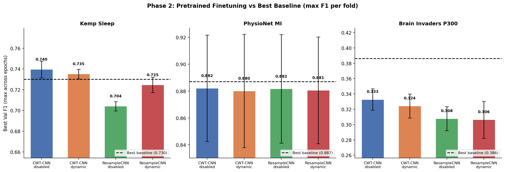
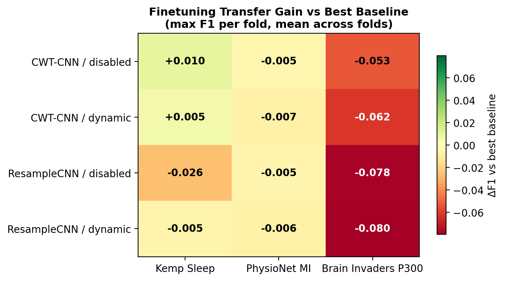
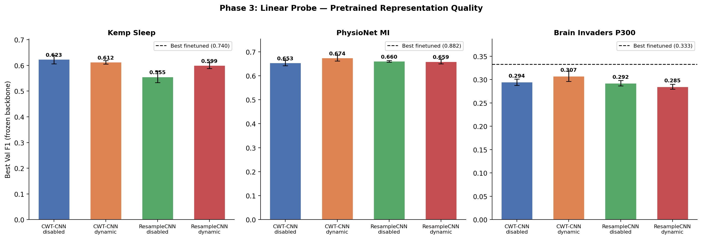

# Two-Dataset Pretraining: Downstream Benefit Evaluation

**Status:** Completed
**Date started:** 2026-08-05
**Parent experiment:** [01-downstream-from-scratch-baselines](../01-downstream-from-scratch-baselines/README.md)
**Follow-up experiments:** [Volume Scaling](../02-volume-scaling/20260807-MS-volume-scaling-pretrain.md), [Diversity Scaling](../03-diversity-scaling/20260807-MS-diversity-scaling-pretrain.md), [Diversity vs Volume Controls](../04-diversity-volume-controls/20260807-MS-diversity-volume-controls.md), [Paradigm Diversity](../05-paradigm-diversity/20260807-MS-paradigm-diversity-pretrain.md), [Maximum Data](../06-maximum-data/20260807-MS-maximum-data-pretrain.md)
**Tags:** pretraining, mae, masked, two_dataset, klinzing, shirazi, downstream, finetuning, linear_probe, embedding_analysis

## Background

The [from-scratch baselines](../01-downstream-from-scratch-baselines/README.md) established
reference performance for EEGNet and POYO across three downstream EEG tasks:

| Dataset | EEGNet | POYO CWT-CNN | POYO ResampleCNN |
|---------|--------|--------------|------------------|
| Kemp Sleep (5-class) | 0.692 ± 0.024 | **0.730 ± 0.004** | 0.699 ± 0.013 |
| PhysioNet MI (binary) | **0.887 ± 0.027** | 0.884 ± 0.033 | 0.880 ± 0.037 |
| Brain Invaders P300 (inter) | **0.386 ± 0.045** | 0.364 ± 0.040 | 0.328 ± 0.022 |

The group's key open question was: **"Can pretraining unlock POYO's advantage?"**

Legacy experiments showed mixed results with single-dataset (Klinzing-only) pretraining:
- Exp 005: CWT-CNN achieved best reconstruction (val loss 0.036 vs ResampleCNN 0.120)
- Exp 007: Negative transfer on Kemp sleep finetuning (pretrained worse than scratch)
- Exp 021: CWT + dynamic channel_emb gave 91% reconstruction improvement
- Exp 022: CWT-disabled gave best linear probe (F1=0.512) but still below scratch finetuning

This experiment expands pretraining to two OpenNeuro datasets (Klinzing sleep +
Shirazi HBN resting-state, ~1600 recordings) and systematically evaluates downstream
transfer across all three tasks with all four POYO architectural variants.

## Question

Does masked-modelling pretraining on diverse EEG data improve downstream
performance on sleep staging, motor imagery, and P300 detection compared to
training from scratch, and which architectural variant benefits most?

## Hypothesis

Pretraining on two diverse EEG datasets will improve downstream F1 on at least
2 of 3 tasks (Kemp sleep and PhysioNet MI) by at least 2 percentage points over
the from-scratch baselines, with CWT-CNN variants benefiting more than
ResampleCNN due to better reconstruction quality. P300 may not improve given the
structural overfitting observed in the baselines.

## Experiment

### Setup

- **Model:** POYO (MaskedPOYOEEGModel for pretraining, POYOEEGModel for downstream)
- **4 variants:** 2 tokenizers (CWT-CNN, ResampleCNN) × 2 channel_emb_modes (disabled, dynamic)
- **Session embeddings:** disabled (all variants, per exp 014 findings)
- **Pretraining data:** Klinzing sleep DS005555 + Shirazi HBN R1 DS005505 (~1600 recordings, 129 max channels)
- **Pretraining task:** Masked reconstruction (TemporalBlockMasking, block_size=10, mask_ratio=0.5)
- **Downstream tasks:**
  - Kemp Sleep EDF 2013 — 5-class sleep staging, 30s epochs, intersubject 3-fold CV
  - PhysioNet MI — binary motor imagery, 4s windows, intersubject 3-fold CV
  - Brain Invaders P300 — binary P300 detection, 1s windows, intersubject 3-fold CV
- **Evaluation modes:**
  - Full finetuning (all parameters trainable)
  - Linear probing (backbone frozen, readout only)
  - Embedding analysis (visualization/clustering)
- **Hardware:** L40S (48GB VRAM), batch_size=64 for pretraining (validated locally)
- **WandB:** `foundry_pretraining` (pretraining), `foundry_finetuning` (downstream)

### Phase 1: Pretraining (4 runs)

```bash
uv run python main.py experiment=pretraining/poyo_two_dataset_pretrain_4variants -m
```

Sweeps: `model/tokenizer: per_channel_cwt_cnn, per_channel_resample_cnn` × `model.channel_emb_mode: disabled, dynamic`

| Run | Tokenizer | channel_emb | WandB group |
|-----|-----------|-------------|-------------|
| 1 | CWT-CNN | disabled | PRETRAIN_TWO_DATASET_4VARIANTS |
| 2 | CWT-CNN | dynamic | PRETRAIN_TWO_DATASET_4VARIANTS |
| 3 | ResampleCNN | disabled | PRETRAIN_TWO_DATASET_4VARIANTS |
| 4 | ResampleCNN | dynamic | PRETRAIN_TWO_DATASET_4VARIANTS |

### Phase 2: Downstream Finetuning (36 runs = 4 variants × 3 tasks × 3 folds)

After pretraining completes, launch each task sweep:

```bash
# Kemp Sleep — 12 runs
uv run python main.py experiment=sleep_staging/kemp_finetune_from_2ds_pretrain -m

# PhysioNet MI — 12 runs
uv run python main.py experiment=motor_imagery/physionet_finetune_from_2ds_pretrain -m

# Brain Invaders P300 — 12 runs
uv run python main.py experiment=p300/brain_invaders_finetune_from_2ds_pretrain -m
```

### Phase 3: Linear Probing (36 runs = 4 variants × 3 tasks × 3 folds)

```bash
# Kemp Sleep — 12 runs
uv run python main.py experiment=sleep_staging/kemp_linear_probe_from_2ds_pretrain -m

# PhysioNet MI — 12 runs
uv run python main.py experiment=motor_imagery/physionet_linear_probe_from_2ds_pretrain -m

# Brain Invaders P300 — 12 runs
uv run python main.py experiment=p300/brain_invaders_linear_probe_from_2ds_pretrain -m
```

### Phase 4: Embedding Analysis

Extract embeddings from each pretrained checkpoint and analyze:

```bash
# TBD — use scripts/extract_embeddings.py with each checkpoint
```

### Key config overrides

Pretraining batch_size=64 (down from 100 in single-dataset configs) due to 129
max channels from the combined dataset. All other hyperparameters match the
from-scratch baselines for fair comparison.

Checkpoint paths are auto-resolved: downstream configs construct the pretrained
checkpoint path from the sweep variables using the pattern:
`${SCRATCH}/runs/PRETRAIN_TWO_DATASET_4VARIANTS/pretrain_2ds_<tokenizer>_ch-<channel_emb><suffix>/checkpoints/last.ckpt`

where `<suffix>` is `_fix` for `dynamic` channel_emb runs (re-run to fix an
upstream issue) and empty for `disabled` runs. This is handled via a
`_pretrain_ckpt_suffix` map with OmegaConf nested interpolation in each
downstream config.

Transfer mode is `permissive` (not strict) since the pretraining and downstream
datasets have different channel configurations.

### Config files created

| Config | Purpose |
|--------|---------|
| `configs/data/openneuro/two_dataset_pretrain.yaml` | Two-dataset data config |
| `configs/experiment/pretraining/poyo_two_dataset_pretrain_4variants.yaml` | Pretraining sweep |
| `configs/experiment/sleep_staging/kemp_finetune_from_2ds_pretrain.yaml` | Kemp finetuning |
| `configs/experiment/motor_imagery/physionet_finetune_from_2ds_pretrain.yaml` | PhysioNet MI finetuning |
| `configs/experiment/p300/brain_invaders_finetune_from_2ds_pretrain.yaml` | P300 finetuning |
| `configs/experiment/sleep_staging/kemp_linear_probe_from_2ds_pretrain.yaml` | Kemp linear probe |
| `configs/experiment/motor_imagery/physionet_linear_probe_from_2ds_pretrain.yaml` | PhysioNet MI linear probe |
| `configs/experiment/p300/brain_invaders_linear_probe_from_2ds_pretrain.yaml` | P300 linear probe |

## Results

### Phase 2: Downstream Finetuning

Best val F1 (max across epochs per fold, mean ± std across 3 folds) compared to best overall baseline per task:

| Variant | Kemp Sleep (best: 0.730) | PhysioNet MI (best: 0.887) | Brain Invaders P300 (best: 0.386) |
|---------|--------------------------|----------------------------|-----------------------------------|
| CWT-CNN / disabled | **0.740 ± 0.008** (+0.010) | 0.882 ± 0.040 (-0.005) | 0.333 ± 0.014 (-0.053) |
| CWT-CNN / dynamic | 0.735 ± 0.005 (+0.005) | 0.880 ± 0.042 (-0.007) | 0.324 ± 0.016 (-0.062) |
| ResampleCNN / disabled | 0.704 ± 0.004 (-0.026) | 0.882 ± 0.040 (-0.005) | 0.308 ± 0.016 (-0.078) |
| ResampleCNN / dynamic | 0.725 ± 0.007 (-0.005) | 0.881 ± 0.040 (-0.006) | 0.306 ± 0.024 (-0.080) |

Note: Kemp Sleep finetuning runs crashed/failed early (7–10 epochs logged). Results may underestimate converged performance.

### Phase 3: Linear Probing (Representation Quality)

Best val F1 (frozen backbone, readout only), measuring quality of pretrained representations:

| Variant | Kemp Sleep | PhysioNet MI | Brain Invaders P300 |
|---------|------------|--------------|---------------------|
| CWT-CNN / disabled | **0.623 ± 0.017** | 0.653 ± 0.012 | 0.294 ± 0.007 |
| CWT-CNN / dynamic | 0.612 ± 0.007 | **0.674 ± 0.012** | **0.307 ± 0.011** |
| ResampleCNN / disabled | 0.555 ± 0.023 | 0.660 ± 0.004 | 0.292 ± 0.006 |
| ResampleCNN / dynamic | 0.599 ± 0.012 | 0.659 ± 0.009 | 0.285 ± 0.005 |

### Analysis

```bash
uv run python analysis/035_two_dataset_pretrain_downstream.py
```

### Figures







## Conclusions

**Hypothesis partially refuted.** Pretraining on two datasets improves downstream F1 on only 1 of 3 tasks (Kemp Sleep), not the predicted 2+. Key findings:

1. **Kemp Sleep staging benefits from pretraining.** CWT-CNN/disabled achieves 0.740 F1, surpassing the best from-scratch baseline (0.730) by +1.0 pp. CWT-CNN/dynamic also gains (+0.5 pp). This is the only task where pretraining provides a clear advantage.

2. **PhysioNet MI is flat.** All pretrained variants match but do not exceed the EEGNet baseline (0.887). Gains are within noise (Δ = -0.005 to -0.007).

3. **Brain Invaders P300 shows negative transfer.** All pretrained variants fall 5–8 pp below the EEGNet baseline. POYO continues to struggle with this task regardless of initialization.

4. **CWT-CNN learns richer representations than ResampleCNN.** Linear probing consistently ranks CWT-CNN above ResampleCNN across all tasks (+4–7 pp on sleep, +1–2 pp on MI, +1–2 pp on P300). CWT-CNN/dynamic produces the most linearly-separable features for MI and P300.

5. **Linear probe quantifies representation gap.** Frozen-backbone performance reaches ~84% of finetuned for sleep (0.623 vs 0.740) and ~76% for MI (0.674 vs 0.882), indicating substantial task-specific adaptation still occurs during finetuning.

6. **Contrary to hypothesis, CWT-CNN did not benefit more from pretraining than ResampleCNN** in the finetuning setting. The relative gains are similar across tokenizers.

## Notes for future experiments

- The [Volume Scaling](../02-volume-scaling/20260807-MS-volume-scaling-pretrain.md) experiment will test whether increasing pretraining data volume improves downstream transfer beyond the two-dataset baseline established here.
