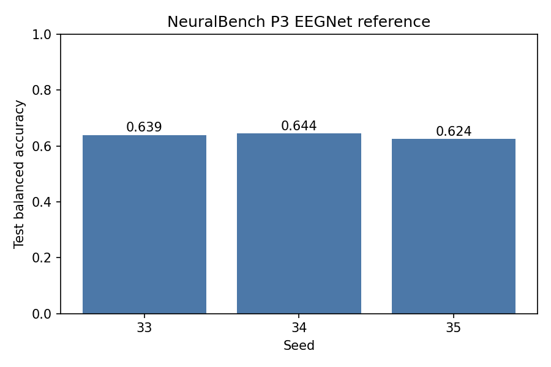

# NeuralBench P300 EEGNet Comparison

**Status:** In Progress
**Date started:** 2026-08-20
**Parent experiment:** None (POC Phase 2 — NeuralBench integration)
**Follow-up experiments:** TBD
**Tags:** neuralbench, p300, eegnet, comparison, adapter, poc

## Background

The NeuralBench integration adapter (POC Phases 0–1) established that Foundry
can ingest NeuralBench task data through a live NeuralSet runtime bridge. The
adapter converts NeuralSet segments into `torch_brain.Data` objects, preserving
signal values, channel identities, labels, and split assignments. Phase 1
confirmed that batches pass through both POYO-EEG and EEGNet forward passes
with numerically faithful pre-tokenization data.

This experiment is the first actual training run through the adapter. It
compares Foundry's EEGNet against NeuralBench's reference EEGNet (braindecode)
on the same pinned `p3` / `Korczowski2014A` task to quantify validation parity
and identify any remaining integration-level differences.

Key context from prior work:
- [NeuralBench P3 contract](../../docs/neuralbench-p3-provenance.md):
  neuralbench==0.2.3, 16 ch @ 120 Hz, 61k epochs, 5:1 class ratio, subject-split
- [Architecture comparison](../../docs/neuralbench-eegnet-comparison.md):
  Foundry EEGNet differs from braindecode in dropout (0.5 vs 0.25), LR schedule
  (constant vs OneCycleLR), BatchNorm params, and spatial max_norm constraint.
  These are explicitly documented; the result is labeled an implementation
  comparison.

## Question

Does Foundry's EEGNet, trained through the NeuralBench adapter with equivalent
data and task contracts, produce validation balanced-accuracy within a
meaningful range of NeuralBench's reference EEGNet on the P300 task — and can
any delta be attributed to the documented implementation differences rather
than a data/pipeline mismatch?

## Hypothesis

The validation balanced-accuracy gap between Foundry EEGNet and NeuralBench
EEGNet will be ≤5 percentage points (absolute), attributable primarily to the
dropout rate difference (0.5 vs 0.25) and LR schedule difference (constant vs
one-cycle cosine). A larger gap would indicate an undiscovered data-path or
task-contract discrepancy requiring investigation.

## Experiment

### Setup

- **Model:** Foundry EEGNetEncoder (F1=8, D=2, F2=16, kernel=64, dropout=0.5)
- **Data:** NeuralBench P3 / Korczowski2014A via NeuralBenchDataModule
- **Task:** Binary P300 classification (NonTarget vs Target)
- **Training:** AdamW lr=1e-4, weight_decay=0.05, 40 epochs, patience=10
- **WandB:** project=foundry-neuralbench, group=NB_P300_EEGNET_COMPARISON

### Launch command

```bash
# 3-seed protocol (matches NeuralBench grid: seeds 33, 34, 35)
uv run python main.py experiment=neuralbench/p300_eegnet_comparison -m

# NeuralBench reference grid (completed locally)
uv run neuralbench --grid --force --model eegnet --dataset korczowski2014a eeg p3
```

### Key config overrides

| Setting | Value | Rationale |
|---------|-------|-----------|
| `model.dropout_rate` | 0.5 | Foundry default; NeuralBench uses 0.25 |
| `hyperparameters.weight_decay` | 0.05 | Matches NeuralBench |
| `loss.label_smoothing` | 0.1 | Matches NeuralBench contract |
| `class_weights.mode` | auto | Matches `compute_class_weights=true` |
| `trainer.precision` | 32-true | Matches NeuralBench |
| `seed` | 33,34,35 | NeuralBench grid seeds |

## Results

### Summary

The NeuralBench EEGNet reference grid completed locally for seeds 33, 34, and
35. These are held as the reference side of the comparison; Foundry runs have
not been launched and are intentionally outside this result update. NeuralBench
reports test-set metrics from the best validation checkpoint. Each run used the
same Korczowski2019BrainBi2014A split contract (35,270 train / 11,628
validation / 14,124 test epochs), a 1,458-parameter EEGNet, and ran for
5.9–6.6 minutes.

### Metrics

| Seed | Test balanced acc. | Test AUROC | Test AUPRC | Test macro F1 | Test acc. | Test loss | Train time (s) |
|---:|---:|---:|---:|---:|---:|---:|---:|
| 33 | 0.6393 | 0.7231 | 0.6336 | 0.4787 | 0.5050 | 0.6970 | 372.0 |
| 34 | 0.6445 | 0.7328 | 0.6460 | 0.4802 | 0.5057 | 0.6937 | 396.4 |
| 35 | 0.6244 | 0.7119 | 0.6277 | 0.4531 | 0.4725 | 0.7013 | 352.0 |
| **Mean ± sample SD** | **0.6361 ± 0.0104** | **0.7226 ± 0.0104** | **0.6358 ± 0.0093** | **0.4707 ± 0.0152** | **0.4944 ± 0.0190** | **0.6973 ± 0.0038** | **373.5 ± 22.2** |

### Analysis

The NeuralBench CLI does not create WandB runs; it records each completed local
grid job as an `exca.task.LocalJob` artifact in
`/network/scratch/s/sobralm/neuralbench-results`. The analysis script reads
those primary result artifacts, verifies all three requested seeds completed,
and writes a local CSV cache and figure:

```bash
uv run python analysis/20260820-MS-neuralbench-p300-eegnet-comparison_analysis.py
```

### Figures



## Conclusions

TBD — the NeuralBench reference is established. Evaluate the Foundry side in a
later update before making a parity or gap-attribution conclusion.

## Notes for future experiments

- If the gap is large, run a second experiment with `dropout_rate=0.25` to
  isolate the dropout contribution.
- Consider implementing OneCycleLR in FoundryModule to fully close the training
  schedule gap.
- After this comparison, proceed to POYO-EEG evaluation on the same task (not
  a comparison — just establishing a Foundry foundation-model baseline on the
  NeuralBench protocol).
