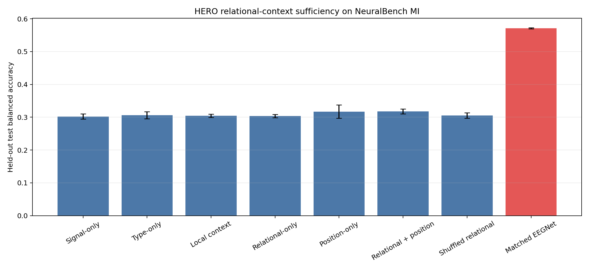

# HERO relational-context sufficiency for Motor Imagery

**Status:** Completed
**Date started:** 2026-08-25
**Parent experiment:** [HERO spatial-slot ablation: 1-factor vs 8-slot fusion in a flat temporal control](20260824-MS-hero-spatial-slots.md)
**Follow-up experiments:** [Causal delayed fusion for HERO Motor Imagery learnability](20260826-MS-hero-delayed-fusion-mi-learnability.md)
**Tags:** neuralbench, hero, motor_imagery, relational_context, spatial_routing, absolute_position, ablation, from_scratch

## Background

The [HERO spatial-slot ablation](20260824-MS-hero-spatial-slots.md) tests
whether eight spatial slots improve on one-factor pooling before introducing
the temporal hierarchy. Motor Imagery (MI) is the key high-channel target: the
earlier [NeuralBench POYO tokenizer baselines](../04-neuralbench-from-scratch-baselines/20260821-MS-neuralbench-poyo-tokenizer-baselines.md)
found that flat POYO was 19--23 percentage points behind EEGNet on MI and
attributed the failure partly to the absence of an effective spatial inductive
bias across 64 channels. The matched [NeuralBench EEGNet test-parity
experiment](../04-neuralbench-from-scratch-baselines/20260821-MS-neuralbench-matched-test-parity.md)
provides the external absolute-performance comparator under the same dataset,
split, and best-validation-checkpoint test protocol.

This experiment implements Phase 4 of the [HERO sample-derived relational
context plan](../../docs/hero-measurement-context-plan.md). It asks whether a
low-bandwidth, permutation-equivariant context derived from the same
unnormalized sample can give spatial slots enough information to route MI
channel content without relying on absolute electrode coordinates. This
builds on the legacy [dynamic channel embedding
analysis](../_legacy/019-dynamic-channel-embedding-analysis.md), which found
that signal-conditioned cross-channel embeddings captured sample properties
rather than stable electrode identity, and its [linear-probe
follow-up](../_legacy/020-linear-probe-dynamic-channel-emb.md), which showed
that such cross-channel processing can nevertheless improve downstream
representations.

Phase 4 was not launch-gated on the parent result: all HERO conditions use
eight spatial slots regardless. The completed parent experiment subsequently
found no 8-versus-1-slot gain on MI, so this null result must be interpreted in
that context.

## Question

On NeuralBench Motor Imagery, is same-sample relational channel context
sufficient to improve eight-slot HERO spatial routing without useful
incremental information from known absolute electrode position?

## Hypothesis

Relational context is sufficient if all of the following pre-registered
criteria hold for held-out test balanced accuracy:

1. relational-only exceeds both signal-only and local-context by at least
   0.02 in the three-seed mean;
2. relational-only is no more than 0.02 below relational + position;
3. shuffled relational is at least 0.02 below correctly bound
   relational-only; and
4. relational-only exceeds both signal-only and local-context for at least two
   of the three matched seeds, with no seed more than 0.02 below signal-only.

Failure of any criterion refutes the full sufficiency hypothesis. The
condition matrix remains useful for distinguishing whether any gain comes
from local raw-signal summaries, correct cross-channel binding, absolute
position, channel type, or added capacity.

## Experiment

### Setup

- **Model:** HERO from scratch with `temporal_mode=flat`, eight spatial slots,
  `embed_dim=64`, two local attention blocks, eight attention heads, context
  width 32, three shared local-context convolution blocks, and two
  four-head relational blocks. Context affects spatial-routing logits only;
  normalized channel content remains the value stream.
- **Data:** NeuralBench v0.2.3 / NeuralSet `Schalk2004Bci2000`, 64 channels,
  4.0-second trials, canonical NeuralBench subject split, and the same target
  contract as the matched EEGNet baseline.
- **Task:** Four-class Motor Imagery classification.
- **Independent variable:** Spatial-routing context source: signal-only,
  type-only, local-context, relational-only, position-only, relational +
  position, or shuffled relational.
- **Seeds:** 33, 34, and 35 for all seven conditions (21 HERO runs).
- **Training:** Match `mi_hero_spatial_slots`: AdamW (`lr=1e-4`,
  `weight_decay=0.05`), step-wise cosine OneCycleLR with `pct_start=0.1`, batch
  size 64, `16-mixed` precision, gradient clipping 1.0, `torch.compile`,
  40-epoch cap, and early-stopping patience 10.
- **Evaluation:** Evaluate the best-validation-balanced-accuracy checkpoint on
  the held-out test split. The primary metric is three-seed mean test balanced
  accuracy. Also report per-seed values, standard deviation, per-class recall,
  the left-fist/right-fist confusion, train/validation curves, selected epoch,
  context gates, relational and spatial-slot attention summaries, parameter
  count, peak memory, and wall-clock time.
- **Controlled baseline:** Eight-slot signal-only HERO using the same
  refactored one-resample path as every context condition.
- **External comparator:** Matched EEGNet group `NB_MI_EEGNET_MATCHED`. This
  measures absolute task performance but is not used to attribute the effect
  of relational context because architecture and parameter count differ.
- **WandB:** Project `foundry-neuralbench`; planned HERO group
  `NB_MI_HERO_RELATIONAL_CONTEXT`.

The seven conditions are:

| Condition | Local raw summary | Cross-channel relations | Type | Absolute position |
|---|:---:|:---:|:---:|:---:|
| Signal-only | No | No | No | No |
| Type-only | No | No | Yes | No |
| Local-context | Yes | No | Yes | No |
| Relational-only | Yes | Yes | Yes | No |
| Position-only | No | No | Yes | Yes |
| Relational + position | Yes | Yes | Yes | Yes |
| Shuffled relational | Yes | Yes, misassigned | Yes | No |

### Launch command

```bash
FOUNDRY_SNAPSHOT_ROOT=/network/scratch/s/sobralm/foundry-launches \
  uv run python main.py experiment=neuralbench/mi_hero_relational_context -m
```

Production launch requirements from `AGENTS.md`: the repository must be clean
and committed, `FOUNDRY_SNAPSHOT_ROOT` must be
`/network/scratch/s/sobralm/foundry-launches`, the Hydra launcher must use the
`long` partition, and the normal `python main.py ... -m` snapshot workflow must
be retained.

**Slurm job array:** `10499135_[0-20]` (21 jobs)
**Snapshot bundle:** `/network/scratch/s/sobralm/foundry-launches/20260825T211631_NB_MI_HERO_RELATIONAL_CONTEXT_f0e61ea2_8032ba63`
**Git SHA:** `f0e61ea268d6b3f3173a88222c164a270ad4e7c9`

### Key config overrides

Planned Hydra config:
`configs/experiment/neuralbench/mi_hero_relational_context.yaml`, derived from
`configs/experiment/neuralbench/mi_hero_spatial_slots.yaml`. Only the
condition-specific non-default model settings should vary:

| Condition | `model.channel_context_mode` | `model.channel_type_enabled` | `model.absolute_position_enabled` | Shuffle hook |
|---|---|:---:|:---:|:---:|
| Signal-only | `disabled` | `false` | `false` | off |
| Type-only | `disabled` | `true` | `false` | off |
| Local-context | `local` | `true` | `false` | off |
| Relational-only | `relational` | `true` | `false` | off |
| Position-only | `position` | `true` | `true` | off |
| Relational + position | `relational_position` | `true` | `true` | off |
| Shuffled relational | `relational` | `true` | `false` | on |

Fixed overrides relative to the model defaults:

| Setting | Value |
|---|---|
| `model.temporal_mode` | `flat` |
| `model.num_spatial_slots` | `8` |
| `seed` | sweep: `33,34,35` |
| `run.evaluate_test` | `true` |

Before launch, the experiment config must provide a stable condition label in
the W&B config, plumb the experimental relational permutation hook through the
training path, and log routing diagnostics plus test confusion counts. The
shuffle must be a non-identity channel permutation, fixed per seed and applied
only to relational vectors after their correct computation; signal, targets,
type, positions, masks, and content values must not be permuted.

## Results

### Summary

The relational-context sufficiency hypothesis was not supported. Across the
three matched seeds, relational-only HERO reached 0.3037 held-out test
balanced accuracy, essentially tied with signal-only (0.3021), local-context
(0.3042), and shuffled relational context (0.3054). Therefore the experiment
does not show either a useful relational gain or sensitivity to correct
channel--relational-vector binding. Adding absolute position produced a small
mean lift (position-only: 0.3172; relational + position: 0.3176), but neither
reached the pre-registered 0.02 margin over relational-only.

The result is better interpreted as a failure of the flat eight-slot HERO
control to learn Motor Imagery, rather than as a context-specific performance
dip. Its validation losses across conditions remained around 1.38, close to
the 1.386 cross-entropy of a uniform four-class predictor, and its test
balanced accuracy stayed near chance. Under the same data and optimizer
schedule, matched EEGNet reached 0.5713 ± 0.0016. (Precision and
early-stopping patience differ between the two model configurations.) The
parent slot ablation also found no benefit from eight versus one spatial slot
on MI. This points to an architectural/learnability bottleneck before context
can be meaningfully evaluated.

### Metrics

Three-seed held-out test balanced accuracy (mean ± SD):

| Condition | Balanced accuracy | Per-seed test balanced accuracy (33, 34, 35) |
|---|---:|---:|
| Signal-only | 0.3021 ± 0.0078 | 0.3006, 0.2951, 0.3104 |
| Type-only | 0.3058 ± 0.0109 | 0.3026, 0.2969, 0.3179 |
| Local context | 0.3042 ± 0.0051 | 0.3026, 0.3000, 0.3099 |
| Relational-only | 0.3037 ± 0.0050 | 0.3002, 0.3017, 0.3094 |
| Position-only | 0.3172 ± 0.0204 | 0.3046, 0.3407, 0.3063 |
| Relational + position | 0.3176 ± 0.0072 | 0.3190, 0.3240, 0.3098 |
| Shuffled relational | 0.3054 ± 0.0082 | 0.3056, 0.3135, 0.2971 |
| Matched EEGNet (external comparator) | 0.5713 ± 0.0016 | 0.5717, 0.5727, 0.5696 |

Pre-registered sufficiency checks:

| Criterion | Result |
|---|---|
| Relational-only ≥ signal-only + 0.02 | Fail (+0.0016) |
| Relational-only ≥ local-context + 0.02 | Fail (−0.0005) |
| Relational-only within 0.02 of relational + position | Pass (0.0138 below) |
| Relational-only ≥ shuffled relational + 0.02 | Fail (−0.0017) |
| At least two matched-seed wins over both signal-only and local-context, with no >0.02 regression vs signal-only | Fail |

Representative seed-33 learning curves corroborate underfitting: signal-only,
relational-only, and position-only achieved best training losses of 1.3267,
1.3393, and 1.3332 respectively, versus 0.9704 for matched EEGNet. Their best
validation balanced accuracies were 0.2953, 0.2954, and 0.2973, versus 0.5102
for EEGNet.

### Analysis

Run
[`analysis/20260825-MS-hero-relational-context-sufficiency_analysis.py`](../../analysis/20260825-MS-hero-relational-context-sufficiency_analysis.py)
to fetch the HERO and matched EEGNet groups through the W&B API, cache the
per-run table, print the pre-registered sufficiency checks, and generate the
balanced-accuracy comparison figure:

```bash
uv run python analysis/20260825-MS-hero-relational-context-sufficiency_analysis.py
```

The runs did not contain the planned routing-gate, routing-attention,
test-confusion, parameter-count, peak-memory, or wall-clock diagnostics, and
no checkpoint artifact was retained in W&B. Consequently, the final gate
values cannot be inspected retrospectively; this is an observability gap, not
evidence of a routing implementation bug.

### Figures



## Conclusions

**Verdict: refuted / not supported.** Relational context was not sufficient to
improve eight-slot HERO routing on Motor Imagery: it failed four of the five
pre-registered criteria, including the correct-binding control. The lack of a
correct-versus-shuffled relational difference means this study cannot
attribute any MI gain to relational routing.

There is no confirmed condition-selection or routing implementation defect:
the W&B-stored configurations match the intended conditions, the immutable
launch snapshot matches the reviewed implementation, and focused HERO model
tests pass. However, the experiment does expose a more fundamental problem:
the flat HERO control underfits MI across every context condition, while EEGNet
learns the same task substantially better. Early spatial fusion, the limited
two-block local temporal encoder, and routing-only (rather than value-stream)
context are plausible architectural contributors. The exactly zero-initialized
context gates may also make the context branch slow to activate under this
weak learning signal; their final values were unfortunately not logged.

## Notes for future experiments

- Establish MI learnability before another relational ablation: overfit a
  small fixed training subset, then compare train and validation curves against
  EEGNet under the same split.
- Test an MI-appropriate temporal front end or postpone spatial fusion until
  after channel-wise temporal feature extraction, preserving channel-specific
  rhythmic information before the 64-channel bottleneck.
- Log every routing source's gate magnitude and gradient norm, source-logit
  RMS, spatial attention summaries, test confusion/per-class recall,
  parameter count, peak memory, and wall-clock time. Save the best checkpoint
  as a W&B artifact so a failed context branch can be inspected.
- Once the base model learns MI, test whether nonzero/warm-started context
  gates or separate optimizer settings for context sources are needed before
  increasing relational-context capacity.
