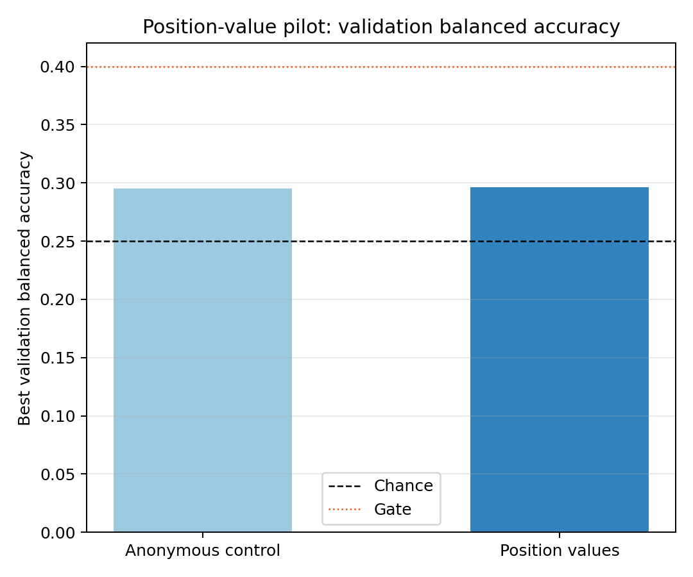
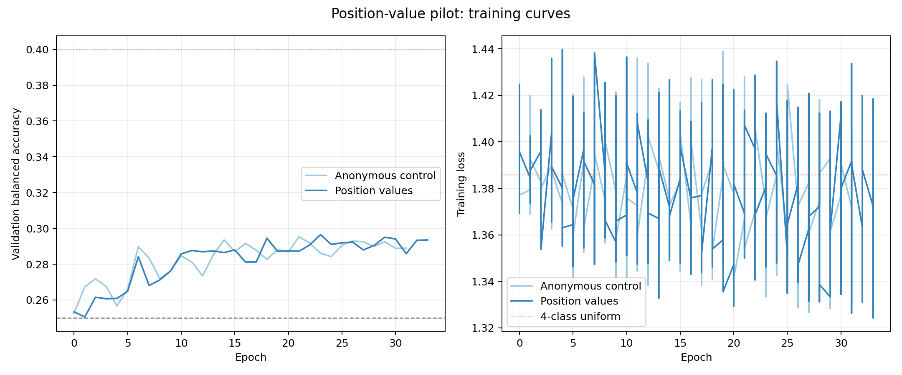

# Position-conditioned channel values for HERO Motor Imagery learnability

**Status:** Completed
**Date started:** 2026-08-26
**Parent experiment:** [Causal delayed fusion for HERO Motor Imagery learnability](20260826-MS-hero-delayed-fusion-mi-learnability.md)
**Follow-up experiments:** None — the pilot did not satisfy every required gate; no full experiment authorized.
**Tags:** neuralbench, hero, motor_imagery, absolute_position, channel_identity, spatial_fusion, learnability, validation_only, from_scratch

## Background

The [spatial-slot](20260824-MS-hero-spatial-slots.md),
[relational-context](20260825-MS-hero-relational-context-sufficiency.md), and
[delayed-fusion](20260826-MS-hero-delayed-fusion-mi-learnability.md)
experiments all found flat HERO near chance on four-class NeuralBench Motor
Imagery (MI), while matched EEGNet learned the task. Delayed fusion showed
that extending the shared channel encoder improves training-set fit but not
validation performance. That result does not test the more basic possibility
that the model loses task-relevant electrode identity at spatial fusion.

The signal-only HERO spatial mixer is permutation-invariant over channels. In
MI, lateralized sensorimotor rhythms can require knowing whether a feature
came from a left or right electrode. The prior position conditions supplied
absolute position only as an additive routing-logit source, behind a gate; the
channel values themselves therefore remained anonymous. A routing-only null
does not rule out the hypothesis that position must be part of each channel
value before fusion.

This local pilot isolates that change. It compares the exact anonymous,
flat, eight-slot HERO control against the same model with correctly bound
absolute electrode position projected into the channel value stream before
the permutation-invariant spatial mixer. It deliberately excludes
position-routing, relational context, delayed fusion, and hierarchy.

## Question

On full-split NeuralBench MI, does adding correctly bound absolute electrode
position to HERO channel values before spatial fusion make the flat model
meaningfully more learnable than the anonymous-channel control?

## Hypothesis

The position-value condition will outperform the anonymous control on the
single matched seed because it breaks the channel-identity symmetry before
fusion. The local pilot supports this hypothesis, and authorizes a later
three-seed full experiment, **if and only if all three gates hold**:

1. best validation balanced accuracy is at least 0.40;
2. best validation balanced accuracy improves by at least 0.05 over the
   anonymous matched control; and
3. peak training balanced accuracy is at least 0.10 higher than the anonymous
   control, with training cross-entropy clearly below the uniform four-class
   loss of 1.386.

Failure of any gate means that no full position-value sweep will be launched
from this pilot. A position mismatch control and delayed-fusion or hierarchy
interactions are explicitly deferred until a base position-value effect has
been established.

## Experiment

### Setup

- **Model:** HERO from scratch with `temporal_mode=flat`, eight spatial slots,
  `embed_dim=64`, two local temporal-attention blocks, and the existing task
  decoder. The shared causal channel encoder remains the current three-layer,
  kernel-7 early-fusion encoder.
- **Primary independent variable:** whether the `AbsolutePositionEncoder`
  output is linearly projected and added to every channel-local value at every
  timestamp before `SpatialSlotMixer`.
  - **Anonymous control:** no position in values or routing logits.
  - **Position values:** correctly bound valid electrode positions are in the
    value stream; position is deliberately absent from routing logits.
- **Data:** complete canonical NeuralBench train and validation splits for
  `Schalk2004Bci2000`; no train or validation subset is used. This permits a
  direct seed-33 comparison with prior full-data HERO and EEGNet runs without
  repeating EEGNet.
- **Task:** four-class Motor Imagery, seed 33 only.
- **Training:** matched to the earlier full HERO runs: AdamW (`lr=1e-4`,
  `weight_decay=0.05`), step-wise cosine OneCycleLR (`pct_start=0.1`), batch
  size 64, gradient clipping 1.0, 40-epoch cap, and validation-balanced-
  accuracy early stopping with patience 10.
- **Evaluation:** validation only. `run.evaluate_test=false`; no held-out test
  metric may be fetched, logged, or used to select this architecture.
- **Diagnostics:** log train and validation loss/balanced accuracy, selected
  epoch, per-class validation recall/confusion, parameter count, peak memory,
  wall-clock time, and the fraction of valid channel positions. The model unit
  test verifies that rebinding positions while holding signals fixed changes
  representations, whereas a joint signal-position permutation remains
  invariant. **Post-run audit:** the planned position-validity fraction was
  not present in the W&B run summaries, so coordinate coverage was not
  independently confirmed from these runs.
- **WandB:** project `foundry-neuralbench`, group
  `NB_MI_HERO_POSITION_VALUE_PILOT`.

This is exactly one two-condition local comparison. No third condition,
second seed, or Slurm/full configuration is included in this experiment.

### Launch command

Before launching, require a clean, committed repository and use the normal
immutable snapshot workflow:

```bash
git status --short
export FOUNDRY_SNAPSHOT_ROOT=/network/scratch/s/sobralm/foundry-launches

uv run python main.py \
  experiment=neuralbench/mi_hero_position_value_pilot -m
```

This uses the local GPU launcher. Record the two W&B run names/IDs and the
snapshot bundle path in this report after it completes. Do not create or
launch a full experiment unless every pilot gate in **Hypothesis** passes.

### Key config overrides

Implemented pilot config:

- `configs/experiment/neuralbench/mi_hero_position_value_pilot.yaml`
- `configs/hero_position_value_condition/anonymous.yaml`
- `configs/hero_position_value_condition/position_values.yaml`

| Setting | Anonymous control | Position values |
|---|---:|---:|
| `model.temporal_mode` | `flat` | `flat` |
| `model.num_spatial_slots` | `8` | `8` |
| `model.position_value_enabled` | `false` | `true` |
| `model.absolute_position_enabled` | `false` | `false` |
| `model.channel_context_mode` | `disabled` | `disabled` |
| `data.train_subset_size` / `val_subset_size` | `null` / `null` | `null` / `null` |
| seed | `33` | `33` |
| `run.evaluate_test` | `false` | `false` |
| launcher | `local_gpu` | `local_gpu` |

## Results

### Summary

Both conditions remained near chance on four-class MI validation. Adding
correctly bound absolute electrode position to the channel value stream
before spatial fusion produced no measurable improvement over the anonymous
control. The two runs are functionally indistinguishable in both training
and validation dynamics.

### Metrics

| Condition | Seed | Run name | Run ID | Val Bal. Acc | Train Bal. Acc | Min Train Loss | Last logged epoch |
|---|---|---|---|---:|---:|---:|---:|
| anonymous | 33 | nb_mi_hero_position_value_pilot_anonymous_seed33 | `h051ctmv` | 0.2953 | 0.3049 | 1.3267 | 31 |
| position_values | 33 | nb_mi_hero_position_value_pilot_position_values_seed33 | `5o9glkt1` | 0.2965 | 0.3054 | 1.3243 | 33 |

**Pre-registered pilot gates:**

| Gate | Criterion | Observed | Result |
|---|---|---|---|
| 1 | position-values best val balanced acc >= 0.40 | 0.2965 | **FAIL** |
| 2 | val balanced acc improvement >= 0.05 over anonymous | +0.0012 | **FAIL** |
| 3a | peak train balanced acc >= 0.10 above anonymous | +0.0005 | **FAIL** |
| 3b | min train CE < 1.386 | 1.3243 | PASS |

Snapshot bundle:
`20260826T154323_NB_MI_HERO_POSITION_VALUE_PILOT_5c4c2257_355bea02`
(Git SHA `5c4c225737b54537c0b43a80719f8116d50062c7`, branch `milo/hierarchical`)

### Analysis

```bash
uv run python analysis/20260826-MS-hero-position-value-mi-learnability_analysis.py
```

### Figures





## Conclusions

**Pilot decision: hypothesis not supported; no full experiment authorized.**
The position-value condition failed three of the four pre-registered pilot
gates, so this single-seed pilot provides no evidence that adding correctly
bound electrode position to the HERO channel value stream makes the flat
model meaningfully more learnable on NeuralBench MI:

- Both conditions plateau at ~0.295 validation balanced accuracy, far below
  the 0.40 gate.
- The position-values condition improves over the anonymous control by only
  +0.0012 in validation and +0.0005 in training balanced accuracy — both
  negligible, well below the required +0.05 and +0.10 thresholds.
- Only gate 3b (train CE < 1.386) passes, confirming the model can fit
  slightly below the uniform four-class loss, but this is insufficient on
  its own.

This is sufficient to reject the proposed pilot progression, but not to rule
out channel identity as a bottleneck in every setting: the comparison has one
seed and tests only this additive value-stream implementation in the flat
model. The supported conclusion is narrower: it did not rescue learnability
under this pre-registered pilot design. No full position-value experiment is
authorized.

## Notes for future experiments

- Do not broaden this position-value sweep or add a position-mismatch control
  from this pilot. A future experiment may revisit channel identity only with
  a materially different, independently motivated design.
- Reassess whether the remaining bottleneck is temporal processing (the flat
  temporal mode may lack sufficient temporal resolution for sensorimotor
  rhythm discrimination), optimization dynamics, or a data/target contract
  issue in the MI task.
- Consider testing position in combination with delayed fusion or hierarchy,
  where the interaction might matter more than either intervention alone.
