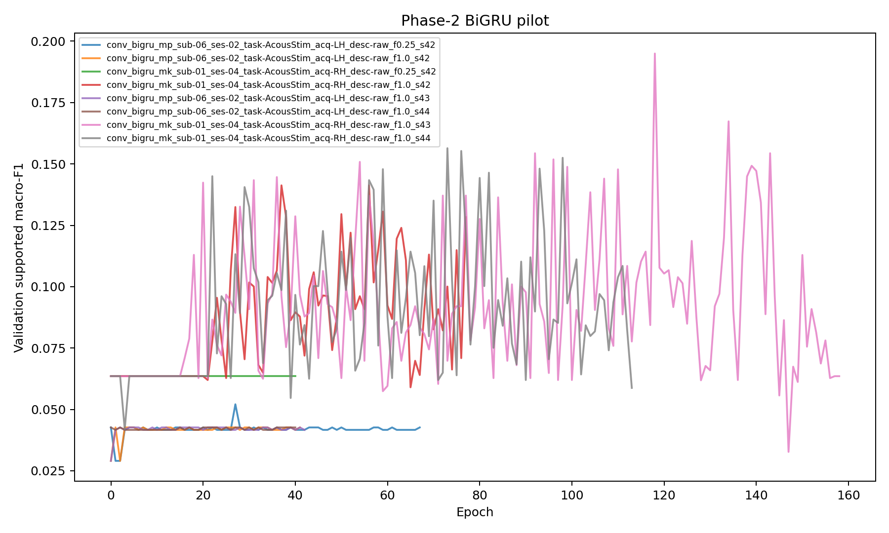

# Phase 2 -- Convolution--BiGRU Scratch Pilot

**Status:** In Progress
**Date started:** 2026-08-28
**Parent experiment:** [Phase 1 -- EEGNet Single-Session Learning Curves](20260826-MS-neurosoft-eegnet-learning-curves.md)
**Follow-up experiments:** TBD
**Tags:** neurosoft, phase2, convolution-bigru, scratch, pilot, intrasession-causal

## Background

The completed Phase-0 audit fixed causal splits, eligibility, nested fraction
manifests, and seeds for NeuroSoft supervised-pretraining experiments. The
ongoing Phase-1 EEGNet experiment has produced canonical results for all but
one planned cell using that protocol. The new
[convolution--BiGRU implementation](../../docs/neurosoft-conv-bigru-implementation.md)
now supplies the architecture that must become the matched scratch control for
later transfer claims. Before launching its 765-cell Phase-2 matrix, this
pilot checks the actual scratch training path and locks or rejects its one
starting recipe. It makes no architecture comparison or scientific performance
claim.

## Question

Does the exact Phase-2 convolution--BiGRU scratch pathway train end to end on
representative minipig and monkey sessions, with non-degenerate learning curves
and stable full-data behavior across the declared seeds?

## Hypothesis

With the fixed GRU-reference recipe, the BiGRU will (1) memorize a small,
balanced training-only diagnostic batch, and (2) complete the causal
train/validation/best-checkpoint/test loop for both species without non-finite
values, collapsed predictions, or an epoch-zero validation peak in every run.
The three 100%-data seeds for each species will show qualitatively consistent
learning rather than a recipe-level instability.

## Experiment

### Setup

- **Model:** `NeurosoftConvBiGRU` with the fixed base architecture in
  `configs/model/neurosoft_conv_bigru.yaml`: 64-dimensional adapter, one
  separable temporal block, 2-layer bidirectional GRU with 128 hidden units per
  direction, 0.3 external dropout, and an 8-logit shared router.
- **Data protocol:** `intrasession-causal`, 0.5-second raw 2-kHz windows,
  Phase-0 audit and deterministic fraction-manifest machinery. The exact
  Phase-1 split hashes must be reproduced.
- **Pilot sessions:**

  | Species | Recording ID | Classes | Channels | Causal-train windows |
  |---|---|---:|---:|---:|
  | Minipig | `sub-06_ses-02_task-AcousStim_acq-LH_desc-raw` | 8 | 32 | 1,082 |
  | Monkey | `sub-01_ses-04_task-AcousStim_acq-RH_desc-raw` | 8 | 32 | 1,117 |

  These are 8-class, fully fraction-supported, completed Phase-1 sessions
  nearest the median causal-training size among their species' 8-class
  candidates. Both have 32 channels, so variable-channel behavior remains
  covered by the focused model tests rather than this data pilot.
- **Recipe under test:** batch size 16, learning rate 0.0015, weight decay
  0.018, maximum 200 epochs, and early-stopping patience 40. Monitor and select
  checkpoints on `val/neurosoft_acoustic_stim_8band_supported_f1`; evaluate the
  test split exactly once from that restored checkpoint.
- **Precision:** `bf16-mixed` when the local GPU supports BF16; otherwise use
  `32-true` and record the fallback. Precision is not a pilot axis.
- **Tracking:** The eight protocol-semantic runs use WandB group
  `PHASE2_CONV_BIGRU_PILOT`; the two isolated diagnostics use
  `PHASE2_CONV_BIGRU_PILOT_OVERFIT`. Each run logs resolved config, parameter
  and trainable-parameter counts, split/fraction manifest hashes, steps,
  processed windows/signal seconds, validated training-step FLOPs, wall time,
  peak memory, validation history, selected-checkpoint identity, and test
  metrics where applicable.
- **FLOP prerequisite:** before the first fit, profile the realized 32-channel,
  1,000-sample forward-plus-training step and document coverage of both
  convolution and GRU operations. Put its measured `flops_per_window` and method
  identifier in the Phase-2 config. Do not reuse EEGNet's value.

### Sequential run plan

All work runs sequentially on the local GPU through the snapshot-enabled
`local_gpu` launcher; no Slurm submission and no parallel execution.

1. **Two training-only overfit diagnostics** — one per pilot session. Use a
   fixed balanced set of 16 causal-training windows (two per class), disable
   dropout only for this diagnostic, and never construct or evaluate validation
   or test data. Run 500 optimizer steps. Success requires finite values,
   cross-entropy below 0.1, and 16/16 correct predictions in evaluation mode.
2. **Four curve diagnostics** — both sessions at 25% and 100%, seed 42, with
   the production recipe and all train/validation/checkpoint/test semantics.
3. **Four stability completions** — both sessions at 100%, seeds 43 and 44,
   with the same production recipe. Together with step 2, this yields three
   full-data seeds per species.

The ten local executions are intentionally not a learning-curve estimate:
only the eight production-semantic runs are retained for this pilot's gate.

### Launch command

The pilot config must be added and committed before executing this record. Run
one command at a time; replace the shown session/fraction/seed values according
to the sequence above.

```bash
git status --short  # must print nothing
export FOUNDRY_SNAPSHOT_ROOT=/network/scratch/s/sobralm/foundry-launches

python main.py \
  experiment=auditory_decoding/neurosoft_conv_bigru_8band_pilot_minipigs \
  phase2_pilot_recording_id=sub-06_ses-02_task-AcousStim_acq-LH_desc-raw \
  data.training_fraction=0.25 \
  run.seed=42 \
  hydra/launcher=local_gpu \
  -m
```

Use the analogous monkey experiment config and only one multirun element at a
time. Record each local launcher snapshot path and WandB run ID in Results.

### Key config overrides

- `model=neurosoft_conv_bigru` with a target-only `session_configs` mapping;
- causal target split, Phase-0 audit, and `training_fraction_task` identical to
  Phase 1;
- `run.evaluate_test=true`; no pretrained checkpoint or frozen components;
- supported-class validation macro-F1 for early stopping and checkpointing;
- `ComputeTrackingCallback(require_flops=true)` with the measured BiGRU value;
- local snapshot launcher with `FOUNDRY_SNAPSHOT_ROOT` set; and
- one sequential local task at a time, despite use of Hydra's normal `-m`
  snapshot workflow.

### Gate criteria

Proceed to the Phase-2 scientific matrix only if all conditions hold:

1. Both overfit diagnostics meet their declared finite-loss and 16/16 criteria.
2. All eight protocol-semantic runs finish and retain distinct resolved
   manifests/configurations matching the Phase-1 causal splits.
3. Every run has finite train loss and metrics, produces more than one predicted
   class on validation, improves supported validation macro-F1 after epoch 0,
   and uses the best-validation checkpoint for its sole test evaluation.
4. Each species' three 100% runs has an improving training trajectory and no
   seed exhibits persistent divergence, all-one-class prediction, or a
   checkpoint selected solely at epoch 0. Review seed variability
   descriptively; this pilot does not set a performance threshold.
5. Required compute/provenance fields are present and the FLOP method explicitly
   covers the convolution and recurrent portions of the training step.

Any failed gate pauses the 765-job sweep. First diagnose a single cause; if a
recipe change is needed, create a separate targeted recipe experiment rather
than tuning individual sessions, fractions, or seeds.

## Results

### Summary

All eight production-semantic pilot runs finished successfully. The two
overfit diagnostics (step 1 in the sequential plan) were skipped; production
runs proceeded directly.

All runs produced finite losses, used `bf16-mixed` precision on a Quadro RTX
8000, and logged the required compute/provenance fields with
`flops_per_window=768098304` (`torch-flop-counter-v1`). Every run selected a
best checkpoint via early stopping and evaluated the test split exactly once
from that checkpoint.

**Minipig session** (`sub-06_ses-02`): The BiGRU collapsed to near-chance
performance across all conditions. The three 100%-data seeds converged to
identical test F1 (0.041) with best checkpoints selected very early
(steps 67--201). In all cases the model predicted only a single class
(`high_treble`). The 25% run barely edged above (0.053 test F1).

**Monkey session** (`sub-01_ses-04`): The BiGRU learned meaningful
representations. The three 100%-data seeds showed seed variability
(test F1 0.122--0.150) with improving training trajectories and best
checkpoints at later steps (2,622--8,211). The 25% run was lower (0.063)
as expected.

**EEGNet comparison** (same sessions, same protocol from Phase 1): The BiGRU
substantially underperforms EEGNet on both sessions. The minipig 100% test F1
(0.041) is 30% of EEGNet's (0.135). The monkey 100% test F1 (0.134) is 64%
of EEGNet's (0.208).

### Metrics

#### BiGRU pilot runs

| Species | Recording ID | Frac | Seed | Best Val F1 | Test F1 | Best Step | Run name (ID) |
|---------|-------------|-----:|-----:|------------:|--------:|----------:|---------------|
| Minipig | `sub-06_ses-02_…_acq-LH_desc-raw` | 0.25 | 42 | 0.052 | 0.053 | 476 | `conv_bigru_mp_…_f0.25_s42` (`bllrxdk0`) |
| Minipig | `sub-06_ses-02_…_acq-LH_desc-raw` | 1.00 | 42 | 0.043 | 0.041 | 134 | `conv_bigru_mp_…_f1.0_s42` (`gfq4bwpz`) |
| Minipig | `sub-06_ses-02_…_acq-LH_desc-raw` | 1.00 | 43 | 0.043 | 0.041 | 201 | `conv_bigru_mp_…_f1.0_s43` (`stwk7pnh`) |
| Minipig | `sub-06_ses-02_…_acq-LH_desc-raw` | 1.00 | 44 | 0.043 | 0.041 | 67 | `conv_bigru_mp_…_f1.0_s44` (`if60yvwy`) |
| Monkey | `sub-01_ses-04_…_acq-RH_desc-raw` | 0.25 | 42 | 0.064 | 0.063 | 17 | `conv_bigru_mk_…_f0.25_s42` (`j4sm8f00`) |
| Monkey | `sub-01_ses-04_…_acq-RH_desc-raw` | 1.00 | 42 | 0.141 | 0.131 | 2,622 | `conv_bigru_mk_…_f1.0_s42` (`kpjzkpux`) |
| Monkey | `sub-01_ses-04_…_acq-RH_desc-raw` | 1.00 | 43 | 0.195 | 0.150 | 8,211 | `conv_bigru_mk_…_f1.0_s43` (`st6qasjj`) |
| Monkey | `sub-01_ses-04_…_acq-RH_desc-raw` | 1.00 | 44 | 0.156 | 0.122 | 5,106 | `conv_bigru_mk_…_f1.0_s44` (`rfn7o5bg`) |

#### BiGRU vs EEGNet -- same sessions, same protocol (test supported macro-F1)

Per-seed comparison at matching fractions:

| Species | Frac | Seed | BiGRU | EEGNet | Ratio |
|---------|-----:|-----:|------:|-------:|------:|
| Minipig | 0.25 | 42 | 0.053 | 0.104 | 0.51 |
| Minipig | 1.00 | 42 | 0.041 | 0.111 | 0.37 |
| Minipig | 1.00 | 43 | 0.041 | 0.149 | 0.28 |
| Minipig | 1.00 | 44 | 0.041 | 0.146 | 0.28 |
| Monkey | 0.25 | 42 | 0.063 | 0.171 | 0.37 |
| Monkey | 1.00 | 42 | 0.131 | 0.199 | 0.66 |
| Monkey | 1.00 | 43 | 0.150 | 0.213 | 0.70 |
| Monkey | 1.00 | 44 | 0.122 | 0.213 | 0.57 |

Seed-averaged summary at 100% data:

| Species | BiGRU test F1 | EEGNet test F1 | BiGRU / EEGNet |
|---------|:-------------:|:--------------:|:--------------:|
| Minipigs | 0.041 ± 0.000 | 0.135 ± 0.021 | 0.30 |
| Monkeys | 0.134 ± 0.014 | 0.208 ± 0.008 | 0.64 |

### Analysis

```bash
uv run python analysis/20260828-MS-neurosoft-conv-bigru-pilot_analysis.py
```

### Figures

Validation learning curves for all eight production runs:



## Conclusions

TBD

## Notes for future experiments

If the gate passes, create the committed Phase-2 minipig and monkey production
configs by mirroring the Phase-1 matrix exactly. This pilot's results must not
be pooled with that scientific matrix or used for pretraining-effect claims.
