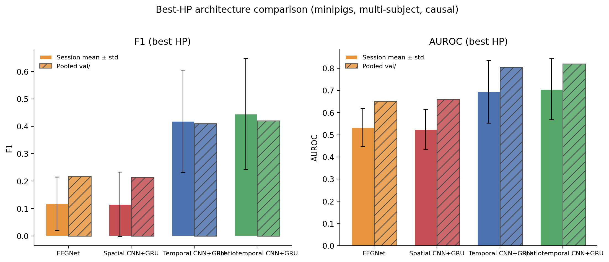
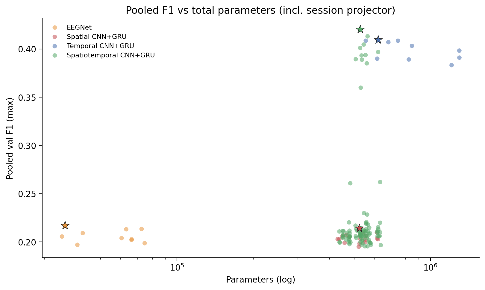
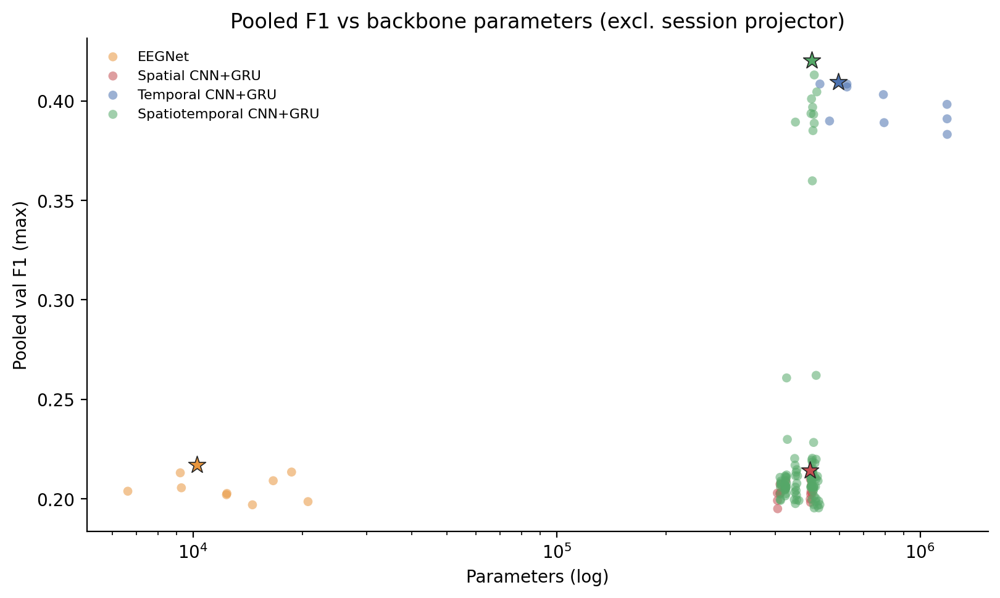
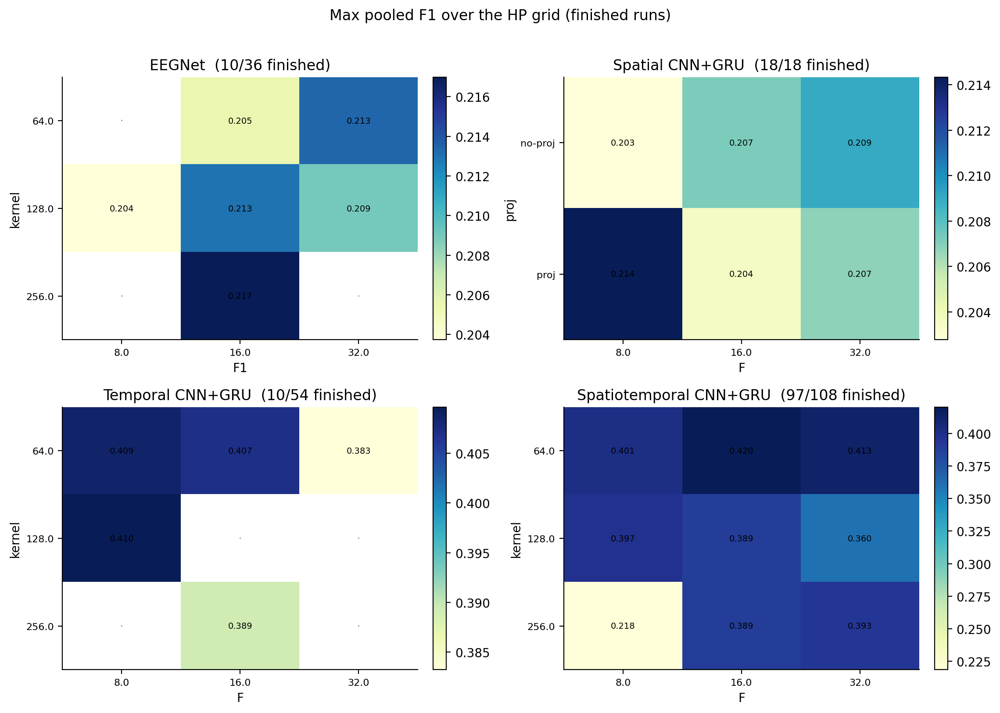
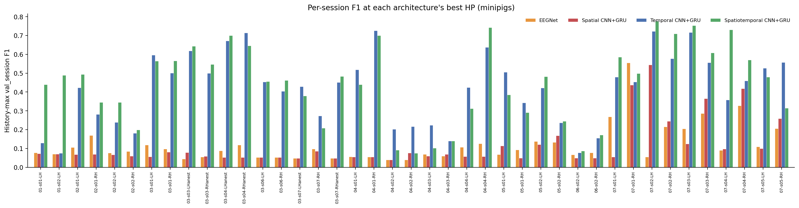
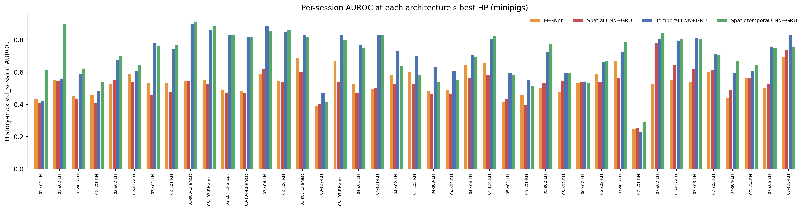

# Multi-subject EEGNet / GRU-CNN HP Search (Minipigs)

**Status:** Completed
**Date started:** 2026-08-31
**Parent experiment:** [Session-Level EEGNet / GRU vs POYO (8-band)](../02-neurosoft-intrasession-multisubj/20260818-LS-singlesess-eegnet-gru-baselines.md)
**Follow-up experiments:** TBD
**Tags:** neurosoft, 8band, hp_search, eegnet, gru, temporal_cnn, spatial_cnn, spatiotemporal_cnn, intrasession, multisubject, causal, minipigs, auditory_decoding

## Background

The [session-level EEGNet / GRU baselines](../02-neurosoft-intrasession-multisubj/20260818-LS-singlesess-eegnet-gru-baselines.md)
put fold-0 session EEGNet (minipigs F1 **0.578**) and GRU (monkeys
**0.565**) at or above the best multi-subject POYO when scored as a
session mean. Those CNN/RNN models were trained **one recording at a
time**, with HPs taken from an earlier search. An open question in that
report was whether EEGNet / GRU at **multi-subject** pooling can match
or beat that session-level F1.

This search trains **one model per architecture on all minipig
sessions** (`intrasession-causal`, fold 0) and sweeps the convolutional
frontend: EEGNet vs GRU with a spatial, temporal, or spatiotemporal
(EEGNet block-1) CNN. The four grids share the same data, split,
optimizer (`lr=2.5e-4`, `wd=0.01`, `bs=128`), and session-projection
channel strategy. They do **not** share parameter count: a 2-layer
bidirectional GRU (hidden 128) is ~0.4–1.2M backbone parameters, while
EEGNet is ~7–21k before the shared session projector. Spatial CNN+GRU
sits in the same ~0.4–0.6M band as spatiotemporal CNN+GRU, so capacity
and architecture can be separated.

## Question

Which hyperparameters maximize validation F1 for EEGNet and for each
GRU+CNN frontend, and how do those **best-HP** models compare on
session-mean vs pooled F1 / AUROC after accounting for parameter count?

## Hypothesis

Temporal structure is required for this 8-band task, so **temporal**
and **spatiotemporal** CNN+GRU should beat **spatial** CNN+GRU and
EEGNet on both pooled and session-mean F1 / AUROC. Parameter count
alone should not explain the ranking: spatial CNN+GRU is
capacity-matched to spatiotemporal CNN+GRU but lacks a temporal
frontend, so it should remain near EEGNet.

## Experiment

### Setup

- **Entity / project:** `neurosoft-bioelectronics` / `suarez_auditory_decoding`
- **Group:** `HYPER-PARAM-SEARCH`
- **Species:** minipigs only
- **Split:** `intrasession-causal` (fold 0)
- **Task / metric:** `val/neurosoft_acoustic_stim_8band_*` (sweep
  maximizes pooled `val/` F1)
- **Channel strategy:** per-session linear projector to `num_sources`,
  plus a shared `num_sources → num_sources` layer (41 sessions, 736
  electrode channels in total)

| Architecture | Sweep ID | Name | Expected | Finished |
|--------------|----------|------|----------|----------|
| EEGNet | `d52nj3w1` | `eegnet_intrasession_multisubj` | 36 | 10 (28%) |
| Spatial CNN+GRU | `qbyn137w` | `gru_spatialcnn_intrasession_multisubj` | 18 | 18 (100%) |
| Temporal CNN+GRU | `ewm1u7vj` | `gru_temporalcnn_intrasession_multisubj` | 54 | 10 (19%) |
| Spatiotemporal CNN+GRU | `lj06lx64` | `gru_spatiotemporalcnn_intrasession_multisubj` | 108 | 97 finished + 11 crashed (90%) |

Refreshed 2026-09-04 after the remaining spatiotemporal jobs finished
or crashed (was 83 finished + 16 running). EEGNet and temporal sweeps
are still marked **FINISHED** in WandB despite incomplete grids —
best-HP claims for those two are over the runs that exist, not the
full design. Ten of the 11 spatiotemporal crashes are `num_sources=128`.

**Shared training HPs:** `lr=2.5e-4`, `wd=0.01`, `bs=128`, patience 20
on pooled val F1. GRU backbone is fixed: 2-layer bidirectional,
`hidden=128`, `input_proj_dim=128`. EEGNet `F2=16` (not swept).

**Varied parameters:**

| Architecture | Swept knobs |
|--------------|-------------|
| EEGNet | `F1 ∈ {8,16,32}`, `kernel_length ∈ {64,128,256}`, `D ∈ {2,4}`, `num_sources ∈ {32,64}` |
| Spatial CNN+GRU | `use_input_proj`, `conv_filters ∈ {8,16,32}`, `num_sources ∈ {32,64,128}` |
| Temporal CNN+GRU | `use_input_proj`, `conv_filters ∈ {8,16,32}`, `conv_kernel ∈ {64,128,256}`, `num_sources ∈ {32,64,128}` |
| Spatiotemporal CNN+GRU | `use_input_proj`, `conv_filters ∈ {8,16,32}`, `conv_kernel ∈ {64,128,256}`, `D ∈ {2,4}`, `num_sources ∈ {32,64,128}` |

### Launch command

```bash
# EEGNet
wandb sweep configs/sweep/eegnet_auditory_decoding_8band_hp.yaml
WANDB_SWEEP_EXPERIMENT=auditory_decoding/eegnet_neurosoft_8band_intrasession_multisubj \
    uv run python -m foundry.wandb_sweep_agent_worker neurosoft-bioelectronics/suarez_auditory_decoding/d52nj3w1

# GRU + temporal / spatial / spatiotemporal CNN
WANDB_SWEEP_EXPERIMENT=auditory_decoding/gru_neurosoft_8band_intrasession_multisubj \
    uv run python -m foundry.wandb_sweep_agent_worker neurosoft-bioelectronics/suarez_auditory_decoding/<sweep-id>
```

Sweep IDs: `ewm1u7vj` (temporal), `qbyn137w` (spatial), `lj06lx64`
(spatiotemporal).

### Key config overrides

See the sweep YAMLs under `configs/sweep/` and the multisubject
experiment YAMLs
`configs/experiment/auditory_decoding/eegnet_neurosoft_8band_intrasession_multisubj.yaml`
/
`gru_neurosoft_8band_intrasession_multisubj.yaml`. Relative to the
session-level YAMLs: `data=neurosoft_minipigs/multisess_raw`, session
channel strategy, `split_type=intrasession-causal`, `bs=128`,
`lr=2.5e-4`, `wd=0.01`.

## Results

### Summary

On the **finished** runs, **spatiotemporal CNN+GRU** is the best
architecture and **temporal CNN+GRU** is a close second. **EEGNet** and
**spatial CNN+GRU** sit together at ~0.21 pooled F1 (session-mean F1
~0.12) — about half the temporal/spatiotemporal scores.

That gap is **not** explained by parameter count. Spatial CNN+GRU
(430k–621k total params) is in the same band as spatiotemporal CNN+GRU
(438k–638k) and far larger than EEGNet (35k–75k), but it matches EEGNet
rather than the temporal models. Within each architecture, pooled F1
is uncorrelated or **negatively** correlated with parameter count
(temporal: r = −0.57). All four best-HP winners use the **smallest**
`num_sources` (32).

Spatiotemporal CNN+GRU is **bimodal**: only **11 / 97** finished
configs reach F1 ≥ 0.35; the other 86 collapse to the EEGNet/spatial
band (~0.21). The high cluster prefers `use_input_proj=true` (8/11),
mostly `num_sources ∈ {32,64}` (one ns=128 exception), and shorter
kernels (`k=64` on the top four).

Primary scoreboard below is the unweighted **session mean ± std** of
history-max `val_session/` F1 / AUROC on each architecture's best-HP
run (n=41 sessions), plus the true **pooled** `val/` max from the same
run (5,038 val trials).

### Metrics

#### Best configuration per architecture

Selected by **max pooled val F1** among finished runs.

| Architecture | HPs | Total params | Backbone | Projector | Pooled F1 | Pooled AUROC | Session F1 | Session AUROC | Run |
|--------------|-----|--------------|----------|-----------|-----------|--------------|------------|---------------|-----|
| EEGNet | F1=16, k=256, D=2, ns=32 | 36,168 | 10,248 | 25,920 | 0.2170 | 0.6516 | 0.1184±0.0974 | 0.5331±0.0863 | `ks62xe0k` |
| Spatial CNN+GRU | proj, F=8, ns=32 | 523,992 | 498,072 | 25,920 | 0.2143 | 0.6606 | 0.1156±0.1184 | 0.5242±0.0906 | `qrdm58m0` |
| Temporal CNN+GRU | no-proj, k=128, F=8, ns=32 | 621,912 | 595,992 | 25,920 | 0.4097 | 0.8053 | 0.4190±0.1864 | 0.6949±0.1416 | `16ccgyps` |
| Spatiotemporal CNN+GRU | proj, k=64, F=16, D=2, ns=32 | 528,936 | 503,016 | 25,920 | 0.4203 | 0.8204 | 0.4453±0.2028 | 0.7057±0.1372 | `4qxx5kfz` |

Session metrics are history-max `val_session/` (same convention as
the [parent](../02-neurosoft-intrasession-multisubj/20260818-LS-singlesess-eegnet-gru-baselines.md)
multi-subject POYO tables). Pooled F1 / AUROC are the run `val/`
maxima — one multi-subject model, so these are true mixed-trial
scores, not n-weighted estimates.

**Δ vs EEGNet (pooled F1 / AUROC):** spatial −0.003 / +0.009;
temporal **+0.193 / +0.154**; spatiotemporal **+0.203 / +0.169**.

**Efficiency (pooled F1 per million total params):** EEGNet 6.00,
spatial 0.41, temporal 0.66, spatiotemporal 0.79. EEGNet is the
most parameter-efficient but at a much lower ceiling. Among models
that actually decode, spatiotemporal is both best and cheapest.

#### Parameter ranges (finished runs)

| Architecture | n | Total params | Backbone | Best pooled F1 |
|--------------|---|--------------|----------|-----------------|
| EEGNet | 10 | 35,208–74,600 | 6,616–20,712 | 0.2170 |
| Spatial CNN+GRU | 18 | 430,680–621,000 | 404,760–505,032 | 0.2143 |
| Temporal CNN+GRU | 10 | 555,992–1,301,784 | 530,072–1,186,888 | 0.4097 |
| Spatiotemporal CNN+GRU | 97 | 437,624–637,512 | 411,704–529,864 | 0.4203 |

The session projector is **identical** at a given `num_sources`
(25,920 params at ns=32; it is 72% of the EEGNet winner and ~5% of
the GRU winners). Temporal CNN+GRU without `input_proj` inflates GRU
`input_size` to `F × num_sources` (up to ~1.3M total params) without
improving over the ~0.41 F1 of the smaller temporal configs.

#### Top-5 per architecture (pooled F1)

| Architecture | HPs | Params | F1 | AUROC | Run |
|--------------|-----|--------|------|-------|-----|
| EEGNet | F1=16, k=256, D=2, ns=32 | 36,168 | 0.2170 | 0.6516 | `ks62xe0k` |
| EEGNet | F1=32, k=64, D=4, ns=64 | 72,552 | 0.2134 | 0.6564 | `kw6mrdf5` |
| EEGNet | F1=16, k=128, D=2, ns=64 | 63,112 | 0.2130 | 0.6522 | `mhjjh7dj` |
| EEGNet | F1=32, k=128, D=4, ns=32 | 42,536 | 0.2090 | 0.6502 | `abtmjgdt` |
| EEGNet | F1=16, k=64, D=4, ns=32 | 35,208 | 0.2055 | 0.6480 | `vnjx83j1` |
| Spatial CNN+GRU | proj, F=8, ns=32 | 523,992 | 0.2143 | 0.6606 | `qrdm58m0` |
| Spatial CNN+GRU | proj, F=8, ns=128 | 614,808 | 0.2098 | 0.6562 | `6i6wm4sg` |
| Spatial CNN+GRU | no-proj, F=32, ns=128 | 543,048 | 0.2090 | 0.6557 | `qjbqf6h4` |
| Spatial CNN+GRU | no-proj, F=16, ns=64 | 465,576 | 0.2072 | 0.6549 | `r6te3qmm` |
| Spatial CNN+GRU | proj, F=32, ns=32 | 527,880 | 0.2068 | 0.6589 | `wwmbyzkm` |
| Spatiotemporal CNN+GRU | proj, k=64, F=16, D=2, ns=32 | 528,936 | 0.4203 | 0.8204 | `4qxx5kfz` |
| Spatiotemporal CNN+GRU | proj, k=64, F=32, D=2, ns=64 | 565,192 | 0.4131 | 0.8163 | `noy6etck` |
| Spatiotemporal CNN+GRU | proj, k=64, F=32, D=4, ns=32 | 545,544 | 0.4046 | 0.8161 | `l0lhd95s` |
| Spatiotemporal CNN+GRU | proj, k=64, F=8, D=4, ns=32 | 528,408 | 0.4011 | 0.8183 | `a8gk7m8a` |
| Spatiotemporal CNN+GRU | proj, k=128, F=8, D=4, ns=128 | 622,040 | 0.3969 | 0.8098 | `8hzlo9rb` |
| Temporal CNN+GRU | no-proj, k=128, F=8, ns=32 | 621,912 | 0.4097 | 0.8053 | `16ccgyps` |
| Temporal CNN+GRU | proj, k=64, F=8, ns=32 | 555,992 | 0.4085 | 0.8155 | `ms7halk2` |
| Temporal CNN+GRU | proj, k=128, F=8, ns=128 | 744,856 | 0.4085 | 0.8084 | `v7ma8p2j` |
| Temporal CNN+GRU | proj, k=64, F=16, ns=64 | 682,792 | 0.4070 | 0.8127 | `3xxxou09` |
| Temporal CNN+GRU | no-proj, k=64, F=8, ns=64 | 845,976 | 0.4032 | 0.8086 | `vuo39y10` |

EEGNet and spatial CNN+GRU are tightly packed (F1 0.195–0.217) —
there is no high-performing island in those grids. Temporal's ten
finished runs all sit in 0.383–0.410. Spatiotemporal's top five are
all `use_input_proj=true` with `k=64` or `128`; four use `ns∈{32,64}`,
and fifth place (`8hzlo9rb`) is the one finished high-F1 ns=128
config. The previous fifth (`uj4nu36d`, 0.3937) is now sixth.

### Analysis

```bash
uv run python analysis/20260831-LS-eegnet-gru-multisubj-hp.py
# optional: reuse cached CSVs
uv run python analysis/20260831-LS-eegnet-gru-multisubj-hp.py --cached
```

Parameter counts are computed from the architecture (session projector
from WandB `session_configs`; EEGNet / GRU backbones in closed form).
They are not logged on the runs.

### Figures



Solid bars: unweighted mean ± std of per-session history-max F1 /
AUROC. Hatched bars: pooled `val/` max from the same run.





Stars mark each architecture's pooled-F1 winner. Spatial CNN+GRU
occupies the same parameter band as spatiotemporal CNN+GRU but
stays on the EEGNet performance floor. Spatiotemporal is bimodal at
nearly constant size: most configs fail, a minority reach ~0.40.



**Supplementary — per-session metrics on the four winners**
(history-max `val_session/`, n=41):





Temporal / spatiotemporal lead on most recordings. Session 06 is hard
for every model. Several sub-07 sessions are the high-F1 tail;
`07-s01-RH` is an AUROC outlier (~0.25–0.29) even when F1 looks
reasonable — the same F1/AUROC disagreement noted in the parent
report.

## Conclusions

The hypothesis is **supported** on the finished runs.

- **Best HPs (carry these forward).** Spatiotemporal CNN+GRU:
  `use_input_proj=true`, `conv_filters=16`, `conv_kernel=64`, `D=2`,
  `num_sources=32` (`4qxx5kfz`). Temporal CNN+GRU: `use_input_proj=false`,
  `conv_filters=8`, `conv_kernel=128`, `num_sources=32` (`16ccgyps`);
  the `proj, k=64, F=8, ns=32` run (`ms7halk2`) is essentially tied
  (0.4085 vs 0.4097) at fewer params. EEGNet: `F1=16`, `kernel_length=256`,
  `D=2`, `num_sources=32` (`ks62xe0k`). Spatial CNN+GRU: `proj, F=8,
  ns=32` (`qrdm58m0`).
- **Architecture ranking (best HP).** Spatiotemporal ≥ temporal ≫
  EEGNet ≈ spatial, on both pooled and session-mean F1 and AUROC.
  Session-mean F1: 0.445 / 0.419 / 0.118 / 0.116. Pooled F1: 0.420 /
  0.410 / 0.217 / 0.214. Pooled AUROC: 0.820 / 0.805 / 0.652 / 0.661.
- **Parameter count is a confound for EEGNet vs GRU, not for spatial
  vs spatiotemporal.** Spatial CNN+GRU has ~15× EEGNet's parameters
  and essentially the same F1. Spatiotemporal CNN+GRU has essentially
  the same parameter count as spatial CNN+GRU and roughly **2×** the
  F1. The temporal frontend (and then the GRU over those features) is
  the lever; stacking a larger GRU on spatial-only features is not.
- **Larger `num_sources` and larger GRU inputs did not help.** Every
  winner used ns=32. Temporal configs that drop `input_proj` at
  F=32 / ns=128 (~1.3M params) are the *worst* temporal runs. Prefer
  `input_proj=true` for spatiotemporal (8/11 high-F1 configs).
- **Caveats.** EEGNet (10/36) and temporal (10/54) grids were stopped
  incomplete. Spatiotemporal is now a complete 108-job grid: 97
  finished, 11 crashed (10 of those crashes are ns=128; some logged
  F1 ~0.37–0.39 before crashing and are excluded because they are
  not `finished`). This is minipigs-only, **causal** split, fold 0 —
  not protocol-matched to the parent's block-split session EEGNet
  (F1 0.578) or block-split multi-subject POYO (session-mean F1
  0.432, pooled 0.394). Multi-subject causal EEGNet at 0.217 is a
  different regime from session-level block EEGNet, not a
  contradiction of the parent.

## Notes for future experiments

- **Re-run or finish the incomplete grids**, especially temporal
  (`F∈{16,32}`, all kernels × ns) and EEGNet (`F1=8` with k=256, and
  the missing `num_sources` cells). Do not treat current EEGNet /
  temporal optima as exhaustively searched.
- **Drop `num_sources=128` as a default** from further GRU grids.
  Spatiotemporal ns=128 is still mostly collapse (26 finished,
  median F1 0.209) and 10/11 crashes. One finished exception
  (`8hzlo9rb`, F1 0.3969) does not beat the ns=32 winner.
- **Carry `4qxx5kfz` (spatiotemporal) and `16ccgyps` / `ms7halk2`
  (temporal)** into a **block-split** multi-subject comparison against
  session-level EEGNet/GRU and the best multi-subject POYO, so the
  protocol matches the parent scoreboard.
- **Keep `use_input_proj=true` as the spatiotemporal default**; it
  caps GRU input at 128 and is over-represented in the high-F1 cluster.
- EEGNet's `F2=16` was not swept and the spatial-then-pool path may
  be too lossy for this task even if F1/D grow. A fairer EEGNet
  capacity match would sweep `F2` (or skip pooling) rather than only
  F1/D.
- Inspect sessions with **high F1 and low AUROC** (e.g. `07-s01-RH`)
  before using session F1 as a sole scoreboard, same warning as the
  parent.
- Monkeys were not part of this search; do not assume the same
  frontend ranking or HPs.
