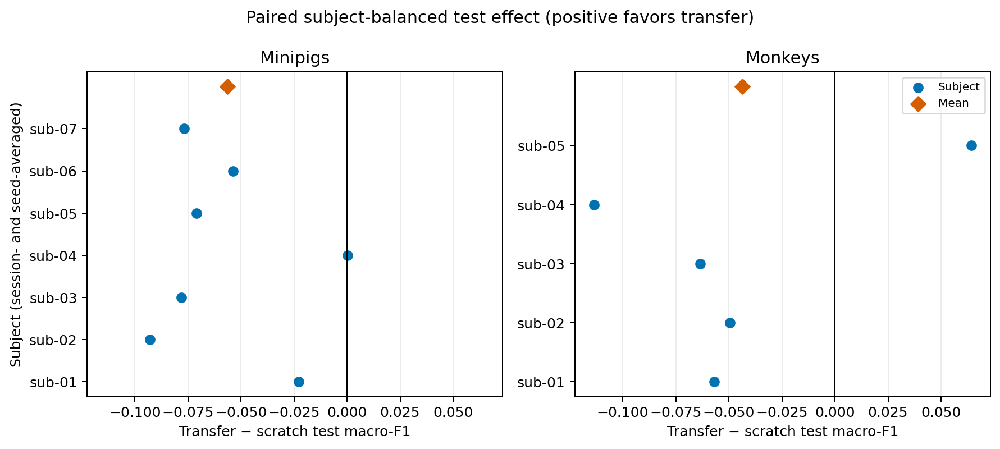
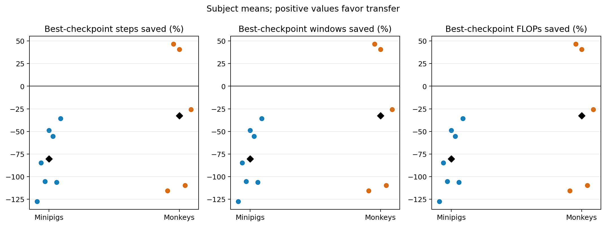

# Phase 4A -- Full-Pool Pretraining Full-Finetuning Transfer Gate

**Status:** In Progress
**Date started:** 2026-09-04
**Parent experiment:** [NeuroSoft Supervised Pretraining Pipeline](20260903-MS-neurosoft-supervised-pretraining-pipeline.md)
**Follow-up experiments:** Frozen-representation transfer gate (TBD); Phase 4 source-volume study (TBD)
**Tags:** neurosoft, supervised-pretraining, transfer, full-finetuning, full-pool, phase4, 8band, intrasession-causal, clariden

## Background

The [Phase 3 pipeline experiment](20260903-MS-neurosoft-supervised-pretraining-pipeline.md)
establishes the scientific and operational prerequisites for transfer: target-
excluded source manifests, source-test prohibition, recording-level train-global
normalization, strict shared-component loading into a fresh target adapter, and
hash-verified checkpoint manifests.  Phase 2 provides the matched normalized
Conv--BiGRU scratch full-finetuning runs; it is the control for this experiment,
not EEGNet or an unpaired historical run.

On 2026-09-10, a post-run audit found that the first downstream matrix did
not use that matched optimizer recipe. Commit `ec06969` had changed both
transfer configs from the Phase-2 learning rate `0.0015` to the source-
pretraining learning rate `0.00025`. That matrix is retained as an invalidated
low-LR diagnostic arm and is not evidence for or against the primary transfer
hypothesis. The corrected matrix restores and explicitly pins `0.0015`.

The roadmap's full Phase 4 study varies source volume (10/25/50/100%) and
eventually evaluates intermediate compute checkpoints and lower target-data
fractions.  That is too large to be the first scientific claim.  This gate fixes
the source condition at the complete same-species, target-excluded pool and
uses only the source-validation-selected best checkpoint.  It asks whether full
finetuning benefits at all before expanding the matrix.

Phase 4A intentionally excludes frozen-representation transfer.  That is a
separate follow-up hypothesis requiring its own frozen-random control.  It also
does not select source checkpoints by target outcomes.

## Question

When every target subject is pretrained on all eligible same-species source
data excluding that subject, does initialization from the source
validation-selected checkpoint improve full, 100%-data target-session
finetuning relative to the existing matched Conv--BiGRU scratch baseline?

## Hypothesis

For both species, full finetuning from a target-excluded full-pool checkpoint
will have a positive paired, subject-balanced test supported macro-F1 effect
relative to scratch and will reach its own validation convergence threshold in
fewer optimizer steps, processed windows, FLOPs, and wall-clock time on
average.  The final-F1 effect may be modest; faster optimization is an
independent expected benefit.

## Experiment

### Setup

- **Model:** The Phase-2 train-global-normalized `NeurosoftConvBiGRU` recipe,
  including downstream learning rate `0.0015`; no Phase-4-specific
  hyperparameter tuning. The source-pretraining optimizer is independent.
- **Source data:** The audited `source_volume` manifests at `fraction-1.00`,
  same species as the target, with every recording of the target subject
  excluded.  Source training sees causal train/validation intervals only; its
  test loader must remain forbidden.
- **Target data:** Every Phase-0-eligible BIDS recording -- the established
  Phase-1 downstream unit -- comprising 40 minipig and 13 monkey targets.
  Each is adapted independently with its full causal train split; validation
  and test intervals remain fixed.  This gate does not split a recording's
  disjoint domain segments into additional downstream targets.
- **Seeds:** Source selection/model seeds are paired as `42`, `43`, and `44`.
  For every source checkpoint, independently run target finetuning seeds `42`,
  `43`, and `44`; do not pair the two seed axes downstream.
- **Transfer:** `full_finetuning` only.  Strictly load the declared shared
  temporal frontend/GRU/router components, exclude every source adapter, and
  initialize a new target adapter.
- **Checkpoint selection:** Select each source checkpoint only by
  `val/source_session_mean_supported_f1`.  Retain all compute milestones for
  provenance, but transfer only the best checkpoint in this gate.  Select each
  target checkpoint by
  `val/neurosoft_acoustic_stim_8band_supported_f1`, then evaluate target test
  exactly once.
- **WandB:** `poyo-eeg/neurosoft_supervised_pretraining`. On 2026-09-09,
  the user selected the completed **Mila** source runs in
  `NEUROSOFT_SOURCE_PRETRAINING_MINIPIGS` and
  `NEUROSOFT_SOURCE_PRETRAINING_MONKEYS` for downstream transfer; exact run
  identities are recorded below. Exclude earlier pilots in those groups and
  the separate Clariden `PHASE4A_FULLPOOL_SOURCE_*` runs. The invalidated
  low-LR downstream groups are `PHASE4A_FULL_FINETUNE_MINIPIGS` and
  `PHASE4A_FULL_FINETUNE_MONKEYS`. The corrected primary groups are
  `PHASE4A_FULL_FINETUNE_LR1P5E3_MINIPIGS` and
  `PHASE4A_FULL_FINETUNE_LR1P5E3_MONKEYS`.
- **Actual source execution:** Mila Slurm arrays `10711898` (minipigs,
  tasks 0–5) and `10711900` (monkeys, tasks 0–3), Git
  `979b1c859fa848fa8f988a1e54e5bcd6862bb79a`, Quadro RTX 8000,
  `16-mixed` precision. Snapshot bundles:
  `/network/scratch/s/sobralm/foundry-launches/20260908T183529_NEUROSOFT_SOURCE_PRETRAINING_MINIPIGS_979b1c85_6bd6a06b`
  and
  `/network/scratch/s/sobralm/foundry-launches/20260908T183607_NEUROSOFT_SOURCE_PRETRAINING_MONKEYS_979b1c85_655c02cf`.
- **Source artifacts:** Best manifests are under
  `/network/scratch/s/sobralm/runs/<source-group>/<run-name>/manifests/best-*.json`;
  checkpoint paths in these manifests resolve relative to
  `/network/scratch/s/sobralm/foundry-checkpoints`. Each run's
  `provenance.json` and `.hydra/config.yaml` preserve the submitted overrides
  and model seed. These are the selected source artifacts even if downstream
  execution later uses another cluster.

### Run matrix

The Phase-0 audit fixes seven minipig and five monkey target subjects, and 40
and 13 eligible target sessions respectively.

| Stage | Minipigs | Monkeys | Total new runs |
|---|---:|---:|---:|
| Source pretraining: target subject x paired source seed | 7 x 3 = 21 | 5 x 3 = 15 | 36 |
| Full finetuning: target session x source seed x target seed | 40 x 3 x 3 = 360 | 13 x 3 x 3 = 117 | 477 |
| **New Phase 4A work** | **381** | **132** | **513** |

The matched 100%-fraction scratch full-finetuning baseline is reused, not
rerun: 53 sessions x 3 target seeds = 159 completed Phase-2 controls.  This
design therefore estimates each session/target-seed effect from three source
pretraining replicates.  Analyses must average those three source-seed effects
before treating the session/target-seed pair as an inferential replicate.

### Pipeline and infrastructure requirements

1. Generate or verify the 36 immutable `fraction-1.00` manifests, including
   target exclusion, nested-selection hash, represented-class summary, and
   source train/validation interval identities.  Do not use the source-pool
   catalog as training input.
2. Submit source cells first.  A source cell writes best and milestone
   checkpoint manifests under a shared `/capstor` checkpoint root, with source
   manifest hash, checkpoint SHA-256, source model/selection seed, source
   compute counters, Git SHA, and snapshot bundle path.
3. Validate all 36 best manifests before fan-out: finite non-collapsed source
   validation, no target leakage, matching manifest/source hash, and readable
   checkpoint path from Clariden workers.
4. Compile the 477 downstream cells from those validated manifests.  Every
   cell record must explicitly carry target species/subject/session, source
   target subject, source selection/model seed, target finetuning seed,
   checkpoint-manifest path/hash, and `full_finetuning` regime.  The fan-out
   must not infer provenance from a W&B run name.
5. Run those cells in the Clariden durable node pool.  Queue source and target
   stages separately; a target cell may not be claimed until its declared
   source manifest has passed validation.  Resume from the original snapshot
   and queue state without rerunning successful source or target cells.
6. Before production, use a `debug` canary to validate container/venv, four
   GPU bindings, data and checkpoint access, W&B authentication, and one real
   source-to-target handoff.  On `normal`, benchmark per-model concurrency,
   beginning at `jobs_per_gpu=1`; use MPS only at a separately validated value.
7. Use a pinned ARM64 EDF, compute-node-built persistent venv, and same-path
   read-only mounts for `/capstor` data, snapshot root, checkpoint root,
   output root, and the mode-0600 W&B application env file.  The snapshot and
   checkpoint roots must be visible both at submission and on workers.

### Launch command

The reusable Mila fan-out implementation is documented in
[`docs/downstream-checkpoint-fanout.md`](../../docs/downstream-checkpoint-fanout.md).
Its selected checkpoint registry is
`launch/checkpoint_sets/phase4a-mila-best.jsonl`. The original low-LR recipe
and cell lists are retained for provenance. The corrected recipe is
`configs/downstream_recipes/phase4a_full_finetuning_lr1p5e3.yaml`; its new,
non-colliding cell lists contain 360 minipig and 117 monkey cells under
`launch/phase4a/`, with `hyperparameters.learning_rate=0.0015` embedded in
every cell.
These artifacts use the existing packed Submitit cell-list launcher. No
downstream jobs were submitted while creating or validating them.

For a later Mila launch, use one normal Hydra multirun per species with
`hydra/launcher=slurm_default`, the corresponding compiled `cell_list`, and
the legacy `long` partition. `tasks_per_node` runs independent cell processes
concurrently on one GPU; it does not share an in-process checkpoint/model.
Benchmark one, then two and optionally four concurrent cells before selecting
the production packing value. A later manual retry requires an explicitly
filtered cell list because a static packed array is not a durable completion
queue.

The Clariden commands below describe the original plan, not the completed
Mila source submission. Use the actual source provenance above when preparing
downstream cells. No downstream jobs were launched during the 2026-09-09 check.

The job graph has a true dependency, so this is two normal Hydra multiruns,
not one static sweep.  A committed cell-list generator should emit exact
source and downstream override vectors and preserve the paired source seeds.
It must be run only after the Phase-4A config, generator, manifests, and this
report are committed and `git status --short` is empty.

```bash
# Clariden production environment; paths are mounted and visible to workers.
export CSCS_ACCOUNT=<project-account>
export PROJECT=/capstor/store/cscs/swissai/a0091
export SCRATCH=/capstor/scratch/cscs/${USER}
export FOUNDRY_DATA_ROOT=${PROJECT}/processed
export FOUNDRY_SNAPSHOT_ROOT=<shared-capstor-path>/foundry-launches
export FOUNDRY_CHECKPOINT_ROOT=<shared-capstor-path>/foundry-checkpoints
export FOUNDRY_CLARIDEN_VENV=<shared-capstor-path>/foundry-venv
export FOUNDRY_ENV_FILE=<absolute-path>/clariden.env
export FOUNDRY_CLARIDEN_EDF=<absolute-path>/clariden-foundry.toml

git status --short  # must print nothing before every production submission

# Stage A: one source multirun per species and paired source seed.
# The generated comma-separated list contains one fraction-1.00 manifest for
# every target subject of the indicated species.  Repeat for seed 42, 43, 44.
python main.py \
  experiment=pretraining/neurosoft_conv_bigru_supervised_minipigs \
  cluster=cscs \
  hydra/launcher=slurm_clariden \
  source_manifest=<generated-minipig-manifest-list-for-seed-42> \
  run.seed=42 \
  run.group=PHASE4A_FULLPOOL_SOURCE_MINIPIGS \
  trainer.max_steps=<phase3-calibrated-full-pool-budget> \
  trainer.val_check_interval=<phase3-calibrated-validation-interval> -m

# After the source queue has succeeded and every best manifest is verified,
# compile the 477 target cells.  Each cell contains one manifest path, target
# recording, source seed, and target seed; it performs exactly one test pass.
python main.py \
  experiment=auditory_decoding/neurosoft_conv_bigru_transfer_minipigs \
  cluster=cscs \
  hydra/launcher=slurm_clariden \
  data.dataset_kwargs.recording_ids=[<target-recording>] \
  data.training_fraction=1.0 \
  run.seed=<target-finetuning-seed> \
  +run.source_selection_seed=<source-pretraining-seed> \
  run.pretrained_checkpoint_manifest=<verified-best-manifest.json> \
  run.pretrained_transfer_regime=full_finetuning \
  run.evaluate_test=true \
  run.group=PHASE4A_FULL_FINETUNE_MINIPIGS -m
```

Run the symmetric monkey source/target configs with their dedicated groups.
The placeholders are deliberate: Phase 3 must supply the measured full-pool
step/validation budget and the fan-out generator must supply checkpoint paths;
hard-coding either before Phase-3 calibration would make the Phase-4 scientific
matrix irreproducible.

### Key config overrides

- `source_manifest`: only audited, target-specific
  `source_volume/.../fraction-1.00/selection-<seed>.json` files.
- `run.seed`: source seed in Stage A; independent target finetuning seed in
  Stage B.
- The completed Mila source runs used `trainer.max_steps=50000`,
  `trainer.val_check_interval=500`, `trainer.log_every_n_steps=500`,
  `hyperparameters.batch_size=128`, `hyperparameters.learning_rate=0.00025`,
  and `hyperparameters.weight_decay=0.01`.
- The original source plan set `trainer.enable_progress_bar=false`; actual
  Mila configs retained `true` but removed the rich progress callback.
  The completed source runs disabled
  early stopping and the
  `rich_progress_bar`, `session_metrics`, `confusion_matrix`,
  `reconstruction_visualization`, `parameter_watcher`, and
  `embedding_visualization` callbacks.  The source-session checkpoint metric,
  model checkpoint, compute tracking, milestone checkpoint, vocabulary
  initialization, and epoch-level learning-rate monitor remain enabled.
- `data.training_fraction=1.0` and `training_fraction_seed=${run.seed}` for
  all target cells.
- Corrected target cells explicitly set
  `hyperparameters.learning_rate=0.0015`, matching the Phase-2 scratch
  controls. The completed invalidated matrix used `0.00025`.
- `run.pretrained_checkpoint_manifest`: the verified best manifest produced
  by the matching target-excluded source cell.
- `run.pretrained_transfer_regime=full_finetuning` and
  `run.evaluate_test=true` for all target cells.
- Clariden: `hydra/launcher=slurm_clariden`, production `normal` partition,
  immutable snapshots enabled, and only benchmark-validated `jobs_per_gpu`.

## Results

### Summary

**Pretraining complete; first downstream matrix invalidated; corrected matched-
LR downstream relaunch pending (updated 2026-09-10).**
The selected Mila batch covers all 36 planned full-pool source cells: seven
minipig and five monkey excluded target subjects, each with paired
source-selection/model seeds 42, 43, and 44. All 36 W&B runs are `finished`.
All 36 best checkpoint manifests and all 36 final 50,000-step milestone
manifests passed manifest-hash and checkpoint SHA-256 verification against
the files on shared Mila storage. Source-manifest hashes matched the referenced
local source manifests, whose recording lists matched the checkpoint manifests;
all use fraction 1.00 and exclude the target subject within the same species.
Saved Hydra configs confirm the paired model seeds and `run.evaluate_test=false`.
All selected source-validation scores are finite and positive.

One logging exception: `src_mp_sub-07_s44_m44` (`9gv2glg2`) has only 99
validation records, ends its W&B compute summary at 49,500 steps, and lacks
the `compute/best_*` summary fields. Its best manifest records F1 0.457977
at step 48,500, consistent with the available history. Its hash-verified
`milestone-100pct-step50000.json` and checkpoint, plus the local W&B
`output.log` reporting final checkpoint publication and six emitted manifests,
confirm completion at 50,000 steps. This is an incomplete W&B record, not
evidence that the source training must be rerun.

The original dedicated Clariden groups are not the selected transfer source.
At inspection they contained 20 minipig and 15 monkey runs, with model seed
42 throughout, including selection-seed 43/44 cells. Do not merge these with
the Mila replicates or select runs solely by the originally planned group names.

### Metrics

Descriptive source-run summaries; F1 is
`val/source_session_mean_supported_f1` on a 0–1 scale. Best-checkpoint
metrics come from the verified manifests; loss and within-budget comparisons
come from W&B validation histories.

| Pretraining check / metric | Minipigs | Monkeys |
|---|---:|---:|
| Planned cells / finished selected runs | 21 / 21 | 15 / 15 |
| Verified best / final-50K checkpoints | 21 / 21 | 15 / 15 |
| W&B runs with all 100 validation records | 20 / 21 | 15 / 15 |
| Best source F1, mean | 0.492576 | 0.559896 |
| Best source F1, range | 0.441784–0.525322 | 0.523000–0.604386 |
| Selected best step, median (range) | 45,000 (23,000–50,000) | 35,500 (5,500–48,500) |
| Validation-loss minimum step, range | 4,500–9,500 | 1,500–4,500 |
| Runs with validation-loss minimum by 10K | 21 / 21 | 15 / 15 |
| Mean validation loss at 10K → last logged validation | 1.577811 → 2.981983 | 2.162789 → 3.650650 |
| Mean best-F1 gain after 10K, percentage points | +5.60 | +2.49 |
| Runs whose selected best F1 occurs after 10K | 21 / 21 | 14 / 15 |

The last logged validation for `9gv2glg2` is at 49,500 steps; the other
35 runs end at 50,000. Validation history uses `trainer/global_step + 1`
to recover the completed optimizer-step count at validation. The F1 gain
compares the maximum over all available validations with the maximum through
10,000 steps, separately for each run, then averages within species.

Exact selected W&B runs are below. Human-readable names follow
`src_mp_<subject>_s<seed>_m<seed>` for minipigs and
`src_mk_<subject>_s<seed>_m<seed>` for monkeys; each column supplies the
paired selection/model seed. Links identify the machine-readable run IDs.

| Species / excluded target | Seed 42 | Seed 43 | Seed 44 |
|---|---|---|---|
| Minipigs / sub-01 | [r0gtf121](https://wandb.ai/poyo-eeg/neurosoft_supervised_pretraining/runs/r0gtf121) | [lkiyj2k0](https://wandb.ai/poyo-eeg/neurosoft_supervised_pretraining/runs/lkiyj2k0) | [yxta4xzm](https://wandb.ai/poyo-eeg/neurosoft_supervised_pretraining/runs/yxta4xzm) |
| Minipigs / sub-02 | [3mza7zam](https://wandb.ai/poyo-eeg/neurosoft_supervised_pretraining/runs/3mza7zam) | [mtzqp9gr](https://wandb.ai/poyo-eeg/neurosoft_supervised_pretraining/runs/mtzqp9gr) | [vz9zkqro](https://wandb.ai/poyo-eeg/neurosoft_supervised_pretraining/runs/vz9zkqro) |
| Minipigs / sub-03 | [dp02wmlx](https://wandb.ai/poyo-eeg/neurosoft_supervised_pretraining/runs/dp02wmlx) | [fmakmjku](https://wandb.ai/poyo-eeg/neurosoft_supervised_pretraining/runs/fmakmjku) | [cjjw7kqe](https://wandb.ai/poyo-eeg/neurosoft_supervised_pretraining/runs/cjjw7kqe) |
| Minipigs / sub-04 | [gznd7udy](https://wandb.ai/poyo-eeg/neurosoft_supervised_pretraining/runs/gznd7udy) | [fzxnk9qm](https://wandb.ai/poyo-eeg/neurosoft_supervised_pretraining/runs/fzxnk9qm) | [uv3v4qwp](https://wandb.ai/poyo-eeg/neurosoft_supervised_pretraining/runs/uv3v4qwp) |
| Minipigs / sub-05 | [qb0wham8](https://wandb.ai/poyo-eeg/neurosoft_supervised_pretraining/runs/qb0wham8) | [8ylinpgd](https://wandb.ai/poyo-eeg/neurosoft_supervised_pretraining/runs/8ylinpgd) | [f2kooeea](https://wandb.ai/poyo-eeg/neurosoft_supervised_pretraining/runs/f2kooeea) |
| Minipigs / sub-06 | [l0bxriwc](https://wandb.ai/poyo-eeg/neurosoft_supervised_pretraining/runs/l0bxriwc) | [18c37yrr](https://wandb.ai/poyo-eeg/neurosoft_supervised_pretraining/runs/18c37yrr) | [vxaxrw7t](https://wandb.ai/poyo-eeg/neurosoft_supervised_pretraining/runs/vxaxrw7t) |
| Minipigs / sub-07 | [7jl8yhvl](https://wandb.ai/poyo-eeg/neurosoft_supervised_pretraining/runs/7jl8yhvl) | [ze3cj4hw](https://wandb.ai/poyo-eeg/neurosoft_supervised_pretraining/runs/ze3cj4hw) | [9gv2glg2](https://wandb.ai/poyo-eeg/neurosoft_supervised_pretraining/runs/9gv2glg2) |
| Monkeys / sub-01 | [xqlorudd](https://wandb.ai/poyo-eeg/neurosoft_supervised_pretraining/runs/xqlorudd) | [oalhvwze](https://wandb.ai/poyo-eeg/neurosoft_supervised_pretraining/runs/oalhvwze) | [4ufexa4o](https://wandb.ai/poyo-eeg/neurosoft_supervised_pretraining/runs/4ufexa4o) |
| Monkeys / sub-02 | [xirc3ujl](https://wandb.ai/poyo-eeg/neurosoft_supervised_pretraining/runs/xirc3ujl) | [au20wit8](https://wandb.ai/poyo-eeg/neurosoft_supervised_pretraining/runs/au20wit8) | [1kcff6li](https://wandb.ai/poyo-eeg/neurosoft_supervised_pretraining/runs/1kcff6li) |
| Monkeys / sub-03 | [29be61gt](https://wandb.ai/poyo-eeg/neurosoft_supervised_pretraining/runs/29be61gt) | [yzvi964a](https://wandb.ai/poyo-eeg/neurosoft_supervised_pretraining/runs/yzvi964a) | [ky1i3aec](https://wandb.ai/poyo-eeg/neurosoft_supervised_pretraining/runs/ky1i3aec) |
| Monkeys / sub-04 | [adochvjq](https://wandb.ai/poyo-eeg/neurosoft_supervised_pretraining/runs/adochvjq) | [vwohtaxd](https://wandb.ai/poyo-eeg/neurosoft_supervised_pretraining/runs/vwohtaxd) | [r3vclvri](https://wandb.ai/poyo-eeg/neurosoft_supervised_pretraining/runs/r3vclvri) |
| Monkeys / sub-05 | [t6qjxb4j](https://wandb.ai/poyo-eeg/neurosoft_supervised_pretraining/runs/t6qjxb4j) | [s2zw618u](https://wandb.ai/poyo-eeg/neurosoft_supervised_pretraining/runs/s2zw618u) | [y6hxic6g](https://wandb.ai/poyo-eeg/neurosoft_supervised_pretraining/runs/y6hxic6g) |

### Invalidated downstream matrix and repair audit

All 477 originally planned downstream cells produced scientifically readable
results: 473 W&B runs finished normally and four minipig runs were recovered
from complete, allowlisted first-attempt local summaries after their restart
hit an infrastructure failure. The comparison had 158 of 159 matched scratch
session/seed controls; monkey
`sub-01_ses-014_task-AcousStim_acq-RH_desc-raw`, seed 43, lacks its historical
scratch result.

The first downstream matrix is nevertheless **invalid for the primary
initialization comparison**. The Phase-2 scratch controls used learning rate
`0.0015`, while all 477 transfer cells inherited `0.00025`. The mismatch was
introduced by commit `ec06969`, which changed the source and downstream
learning rates together. A test named
`test_source_and_transfer_use_same_hyperparameters` encoded the incorrect
invariant that source pretraining and target finetuning must share an optimizer
recipe; the purported Phase-2 matching test was updated to the same incorrect
value. This escaped review even though the Phase-3 execution notes explicitly
said that the `0.00025` overrides were source-only.

The invalidated arm produced the following descriptive results. They are
recorded to preserve work and diagnose learning-rate sensitivity, not as a
verdict on pretraining:

| Species | Scratch test F1 (`lr=0.0015`) | Transfer test F1 (`lr=0.00025`) | Difference | Subject bootstrap 95% CI |
|---|---:|---:|---:|---:|
| Minipigs | 0.420634 | 0.364189 | -0.056445 | [-0.077643, -0.032149] |
| Monkeys | 0.453742 | 0.409961 | -0.043781 | [-0.089379, 0.015860] |

The repair restores both transfer base configs to `0.0015`, replaces the
source/target optimizer-equality test with explicit independent source and
matched-target assertions, and adds a corrected recipe that pins the LR in
every compiled cell. New recipe, cell, run, and W&B group identities prevent
the corrected jobs from resuming or overwriting the invalidated runs.

### Analysis

This pretraining-only check used read-only `wandb.Api()` queries and
`run.scan_history()` for the exact Mila runs above, plus local JSON/config
reads and SHA-256 checks of best and final checkpoint files. No figures were
generated.

The analysis script selects the Mila source runs through the committed
checkpoint registry and identifies target runs by explicit `run.cell_id`,
`run.checkpoint_id`, and source-seed fields; it does not infer source checkpoint
provenance from run names or the old Clariden source groups. By default it now
targets the corrected `lr=0.0015` matrix. Set
`PHASE4A_TRANSFER_CONDITION=invalid_lr2p5e4` to reproduce the invalidated arm.

On 2026-09-09, the downstream fan-out review independently revalidated all 36
selected best checkpoint and source-selection manifests, regenerated 360
minipig and 117 monkey cells byte-for-byte, and composed representative compiled
overrides for both species. The required targeted suite passed 106 tests after
review fixes. The review added duplicate scientific-checkpoint rejection,
source-selection semantic validation, content-addressed compiler provenance in
lock files, stricter resume/W&B identity guards, exact compiled-cell filtering
in this analysis script, and the RTX 8000 `16-mixed` fallback. It did not change
the scientific training budget, target fraction, optimizer recipe, or transfer
regime.

Controlled launch inputs are preserved under `launch/phase4a/canaries/`: one
cell per species for `tasks_per_node=1`, followed by distinct matched two-cell
lists for `tasks_per_node=2`. The successful two-cell measurements left enough
GPU and memory headroom to prepare distinct four-cell lists for
`tasks_per_node=4`. All benchmark lists contain real compiled cells and are
mutually disjoint within a species, so successful cells are not rerun.

The first one-cell submissions on Mila `unkillable` used 4 CPUs and 32 GB:
minipig job `10725026`, snapshot
`20260909T190543_NEUROSOFT_TRANSFER_MINIPIGS_0499da75_3838ee53`; monkey job
`10725050`, snapshot
`20260909T190720_NEUROSOFT_TRANSFER_MONKEYS_0499da75_3ebc2c4b`. Both failed
before model construction because the snapshot workers resolved
`data.root=./data/processed/`, while the checkout's ignored `data/processed`
symlink is not part of a Git archive. Peak GPU memory was only 166 MiB, so
these failures provide no packing evidence. The logs also showed CUDA 13
reporting BF16 support on the compute-7.5 RTX 8000; native-BF16 detection must
therefore include the compute capability. The retry fix makes the data root
explicitly environment-backed and requires compute capability 8.0 or newer
for BF16. Only the two explicit failed cells may be retried.

The corrected one-cell retries used Git
`dfb2e05475ea108f684f57f7836f9a132efb4a21`, 4 CPUs, 32 GB, and the
`unkillable` partition. Minipig job `10725160` (snapshot
`20260909T191307_NEUROSOFT_TRANSFER_MINIPIGS_dfb2e054_d88267b0`)
completed in 19:02, for 3.15 valid cells/GPU-hour; its accounted process peak
was 342 MiB at 19% GPU utilization. Monkey job `10735375` (snapshot
`20260910T013101_NEUROSOFT_TRANSFER_MONKEYS_dfb2e054_797e538c`)
completed in 17:22, for 3.45 valid cells/GPU-hour; its accounted process peak
was 342 MiB at 22% GPU utilization. Both performed strict fresh transfer,
wrote best and last checkpoints, ran validation and test, preserved compiled
provenance and deterministic W&B identity, and completed without requeue.

The two-cell benchmarks retained 4 CPUs and 32 GB per allocation by assigning
2 CPUs to each independent process. Minipig job `10735674` (snapshot
`20260910T015123_NEUROSOFT_TRANSFER_MINIPIGS_dfb2e054_bc837b37`)
completed both cells in 17:55: 6.70 valid cells/GPU-hour, 2.13 times its
one-cell throughput. The two processes accounted for 26--28% GPU utilization
and 342 MiB peak memory each. Monkey job `10735678` (snapshot
`20260910T015214_NEUROSOFT_TRANSFER_MONKEYS_dfb2e054_64f83cde`)
completed both cells in 13:01: 9.22 valid cells/GPU-hour, 2.67 times its
one-cell throughput. Its processes accounted for 29% and 28% GPU utilization
and 342 MiB each. All four cells wrote best/last checkpoints, completed test
evaluation and W&B sync, and had strict-transfer reports with 26 shared tensors
loaded and zero missing, unexpected, shape-mismatched, or dtype-mismatched
tensors. The deliberate adapter exclusions were 170 tensors per minipig cell
and 62 per monkey cell.

The four-cell benchmarks used 1 CPU per independent process, retaining 4 CPUs
and 32 GB per allocation. Minipig job `10736056`, Git
`a61319012a727acc3d04362d9ae1a0c347008803`, snapshot
`20260910T023456_NEUROSOFT_TRANSFER_MINIPIGS_a6131901_e1e7f3ed`,
completed all four cells in 20:11: 11.89 valid cells/GPU-hour, 1.77 times
two-cell throughput and 3.77 times one-cell throughput. Its four processes
accounted for 16--17% GPU utilization and 342 MiB peak memory each. Monkey job
`10736064`, from the same Git revision, snapshot
`20260910T023638_NEUROSOFT_TRANSFER_MONKEYS_a6131901_e6ea5b7d`,
completed all four cells in 41:42: 5.76 valid cells/GPU-hour, 38% below
two-cell throughput. Its processes accounted for approximately 14--17% GPU
utilization and 342 MiB each; one late-improving cell determined allocation
wall time. All eight cells produced exact compiled provenance, matching W&B
IDs, best/last checkpoints, test results, and zero-mismatch strict-transfer
reports without requeue. The measured production packing choice is therefore
four minipig processes per GPU and two monkey processes per GPU.

One attempted two-cell submission requested 4 CPUs per process and was rejected
by `QOSMaxCpuPerUserLimit` before receiving a Slurm job ID; its unused snapshot
was
`20260910T015003_NEUROSOFT_TRANSFER_MINIPIGS_dfb2e054_08fbe414`.
The four-cell benchmark therefore uses 1 CPU per independent process, retaining
the user-requested 4 CPUs and 32 GB for the allocation. On 2026-09-09 the user
also authorized launching all remaining downstream production cells on Mila
`long` after benchmarking; production lists must exclude every successful
canary cell and must be committed before submission.

The production inputs are
`launch/phase4a/production/minipigs-remaining-after-canaries.jsonl` (353 cells,
SHA-256 `dea880821132c910bd301e8c619a823c2fd204d46fd6ea9449419ca153a31fc6`)
and `launch/phase4a/production/monkeys-remaining-after-canaries.jsonl` (110
cells, SHA-256
`7fee822520e06c5a88e1bf9116c0ce93db959900f382bbaa492b58b195d471a6`).
Each list has unique cell, run, and W&B identities, has zero overlap with its
seven successful canary cells, and its union with those canaries exactly
reconstructs the committed 360- or 117-cell species matrix.

Production was submitted from clean Git revision
`8a5ac28b581849ccb89e5cec142d2a8c709ef49c` after the user's explicit
2026-09-09 instruction to launch the complete downstream work. The minipig
command used the 353-cell production list above with `tasks_per_node=4`,
`cpus_per_task=1`, `mem_gb=32`, and `partition=long`. It submitted Slurm array
`10736352_[0-88]` (89 allocations; the final allocation contains one cell)
from snapshot
`/network/scratch/s/sobralm/foundry-launches/20260910T034356_NEUROSOFT_TRANSFER_MINIPIGS_8a5ac28b_1dd150a2`:

```bash
FOUNDRY_DATA_ROOT=/network/scratch/s/sobralm/brainsets/processed \
FOUNDRY_SNAPSHOT_ROOT=/network/scratch/s/sobralm/foundry-launches \
FOUNDRY_CHECKPOINT_ROOT=/network/scratch/s/sobralm/foundry-checkpoints \
uv run python main.py \
  experiment=auditory_decoding/neurosoft_conv_bigru_transfer_minipigs \
  hydra/launcher=slurm_default hydra.launcher.partition=long \
  hydra.launcher.cell_list=launch/phase4a/production/minipigs-remaining-after-canaries.jsonl \
  hydra.launcher.tasks_per_node=4 hydra.launcher.cpus_per_task=1 \
  hydra.launcher.mem_gb=32 -m
```

The monkey command used the 110-cell production list with
`tasks_per_node=2`, `cpus_per_task=2`, `mem_gb=32`, and `partition=long`.
It submitted Slurm array `10736373_[0-54]` (55 allocations) from snapshot
`/network/scratch/s/sobralm/foundry-launches/20260910T034532_NEUROSOFT_TRANSFER_MONKEYS_8a5ac28b_404e9e5b`:

```bash
FOUNDRY_DATA_ROOT=/network/scratch/s/sobralm/brainsets/processed \
FOUNDRY_SNAPSHOT_ROOT=/network/scratch/s/sobralm/foundry-launches \
FOUNDRY_CHECKPOINT_ROOT=/network/scratch/s/sobralm/foundry-checkpoints \
uv run python main.py \
  experiment=auditory_decoding/neurosoft_conv_bigru_transfer_monkeys \
  hydra/launcher=slurm_default hydra.launcher.partition=long \
  hydra.launcher.cell_list=launch/phase4a/production/monkeys-remaining-after-canaries.jsonl \
  hydra.launcher.tasks_per_node=2 hydra.launcher.cpus_per_task=2 \
  hydra.launcher.mem_gb=32 -m
```

Scheduler inspection immediately after submission confirmed one RTX 8000 GPU,
4 CPUs, 32 GB, the `long` partition, requeue enabled, and a three-hour limit
for every allocation. Exact cell and deterministic W&B run identities are the
records in the two hash-pinned production JSONLs. At that check, 11 minipig
allocations were running and the remaining minipig and monkey array tasks were
queued; no task failure had been reported.

Subsequently, minipig array allocations 12 and 13 failed for node-level
infrastructure reasons. Allocation 12 (Slurm job `10736380`, node `cn-c019`)
encountered an uncorrectable GPU ECC error in all four workers during CUDA
device setup. Allocation 13 (Slurm job `10736381`, node `cn-c034`) failed all
four workers during Python initialization with `LookupError: unknown encoding:
UTF-8`, consistent with transient access to the shared uv Python installation.
None of the eight cells wrote `last.ckpt`, and other production packs continued
training normally. The exact affected cells are preserved in
`launch/phase4a/retries/minipigs-production-array12-13.jsonl` (8 unique cells,
SHA-256 `caa10d496fe3f953d882af35b25e0e026ea3df6b9e9673f1765361ec521fd086`).
Only that explicit list may be retried; completed or still-running production
cells must not be resubmitted.

The eight-cell retry was submitted from clean Git revision
`dc8cfb945b4880fc7f6c1f2347b0979bbfb56ebd` on `long` with
`tasks_per_node=4`, `cpus_per_task=1`, and `mem_gb=32`. Slurm array
`10736403_[0-1]` contains exactly two packed allocations and uses snapshot
`/network/scratch/s/sobralm/foundry-launches/20260910T035223_NEUROSOFT_TRANSFER_MINIPIGS_dc8cfb94_deda359f`.
The exact command was:

```bash
FOUNDRY_DATA_ROOT=/network/scratch/s/sobralm/brainsets/processed \
FOUNDRY_SNAPSHOT_ROOT=/network/scratch/s/sobralm/foundry-launches \
FOUNDRY_CHECKPOINT_ROOT=/network/scratch/s/sobralm/foundry-checkpoints \
uv run python main.py \
  experiment=auditory_decoding/neurosoft_conv_bigru_transfer_minipigs \
  hydra/launcher=slurm_default hydra.launcher.partition=long \
  hydra.launcher.cell_list=launch/phase4a/retries/minipigs-production-array12-13.jsonl \
  hydra.launcher.tasks_per_node=4 hydra.launcher.cpus_per_task=1 \
  hydra.launcher.mem_gb=32 -m
```

Four later minipig allocations failed on the same two unhealthy nodes before
the node exclusion was applied: array tasks 18 and 23 (Slurm jobs `10736394`
and `10736408`) on ECC-failing `cn-c019`, and array tasks 19 and 25 (Slurm
jobs `10736395` and `10736410`) on Python-initialization-failing `cn-c034`.
Their 16 cells also wrote no `last.ckpt`. The exact second retry list is
`launch/phase4a/retries/minipigs-production-array18-19-23-25.jsonl` (SHA-256
`211bca8f2ce8c16e16efb618a6450c684184fd97590820d265658924e20e3fb1`).
`cn-c019` and `cn-c034` were then added to the pending-task exclusion lists for
production arrays `10736352` and `10736373` and retry array `10736403` using
`scontrol update`; running work on other nodes was left untouched. Subsequent
retry submissions carry the same exclusion as a snapshot-recorded Hydra
launcher override.

The 16-cell second retry was submitted from clean Git revision
`3facaa3266809837a7297f0f4390d7fc78c29138` as Slurm array
`10736446_[0-3]` on `long`, with four cells, 4 CPUs, and 32 GB per allocation.
Its immutable snapshot is
`/network/scratch/s/sobralm/foundry-launches/20260910T035954_NEUROSOFT_TRANSFER_MINIPIGS_3facaa32_97a49c2d`.
The launch included
`+hydra.launcher.additional_parameters.exclude=cn-c019\,cn-c034`; all other
arguments matched the first retry except for the exact second retry list.

### Figures

These figures describe only the invalidated mismatched-LR arm and must not be
used as evidence for the primary hypothesis:





## Conclusions

The Mila source-pretraining stage remains valid: all 36 expected best and final
checkpoints were verified on shared storage, and no source rerun is required.
The first 477-cell downstream matrix is invalidated as a test of initialization
because its `0.00025` target learning rate did not match the `0.0015` scratch
controls. Its apparent negative transfer must not be interpreted causally.
The full scientific transfer hypothesis remains untested pending completion
and paired analysis of the corrected `0.0015` downstream matrix.

**User-confirmed interpretation (2026-09-09):** All source slices show
validation-loss overfitting by 10K steps with the current model and
hyperparameters. Future pretraining will use 10,000 steps with validation
every 100 steps as a compute-saving policy. This is a tradeoff: source F1
continues improving after 10K in 35/36 runs, by an average 5.60 percentage
points for minipigs and 2.49 for monkeys. The loss evidence therefore supports
early overfitting, but does not establish that 10K preserves the best source
F1 or downstream transfer quality.

Keep the overall status `In Progress` until the corrected 477 downstream
finetunings are evaluated against the matched scratch controls.

## Notes for future experiments

- For all future source-pretraining experiments with the current model and
  hyperparameters, use `trainer.max_steps=10000` and
  `trainer.val_check_interval=100`, replacing the completed batch's 50,000/500
  schedule. This reduces the optimizer-step budget by 80% while preserving
  100 scheduled validation evaluations. Wall-clock savings have not been
  benchmarked. This step records the policy; it does not modify configs.
- Use the verified Mila best manifests for the upcoming full-finetuning
  matrix. The future 10K policy does not retroactively replace these checkpoints
  or change the current gate's source-F1 selection rule.
- Never require source-pretraining and downstream-finetuning optimizer
  hyperparameters to match. Require downstream transfer to match its scratch
  control, and pin critical scientific overrides in compiled cells.
- Advance to the frozen-representation experiment only as a separately
  controlled hypothesis, with a frozen-random representation baseline.
- Advance to the 10/25/50/100% source-volume study only if this gate passes
  source/target provenance and produces an interpretable transfer estimate.
- If pretrained full finetuning fails to match scratch at 100% target data,
  stop the low-data and checkpoint-milestone expansion and diagnose the
  transfer recipe first.
