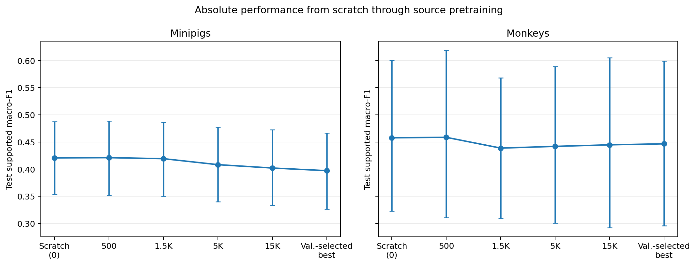
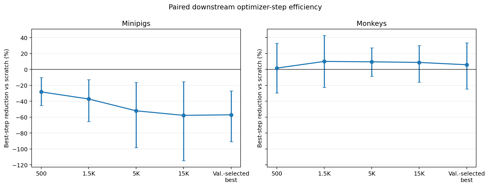
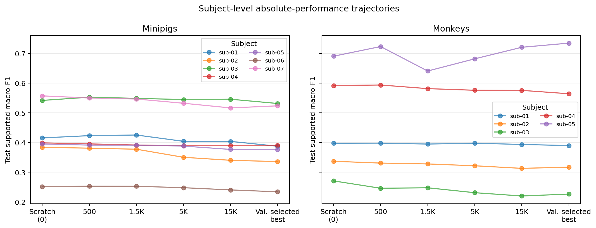

# Phase 4B -- Early Source-Checkpoint Transfer

**Status:** Completed
**Date started:** 2026-09-10
**Parent experiment:** [Phase 4A -- Full-Pool Pretraining Full-Finetuning Transfer Gate](20260904-MS-fullpool-finetune-transfer.md)
**Follow-up experiments:** TBD
**Tags:** neurosoft, supervised-pretraining, transfer, full-finetuning, checkpoint-milestone, phase4, 8band, mila

## Background

The [Phase 4A full-pool transfer gate](20260904-MS-fullpool-finetune-transfer.md)
established the audited source provenance, target-subject exclusion, strict
shared-component transfer, and corrected downstream finetuning recipe.  Its
36 selected Mila source runs have immutable, SHA-256-verified checkpoint
manifests at 500, 1,500, 5,000, 15,000, and 50,000 steps.  Phase 4A's source
audit found validation loss reaches its minimum by 10K steps in every source
run, while source validation F1 often continues to improve later.  That makes
checkpoint age a distinct, unresolved transfer question rather than a reason
to select a checkpoint by downstream outcome.

This child holds the source data, target recipe, target split, model, and seed
axes fixed.  It compares only the four predeclared earlier source milestones.
The Phase 4A source-validation-selected best-checkpoint and the Phase-2
matched-LR scratch results are reused as controls; neither is resubmitted.
The invalidated Phase 4A `0.00025` downstream arm is excluded entirely.

## Question

At fixed target-excluded full-pool source data and corrected downstream
finetuning LR `0.0015`, do source checkpoints at 500, 1,500, 5,000, or 15,000
optimizer steps transfer better or more efficiently than the reused Phase 4A
best-checkpoint and scratch controls?

## Hypothesis

The 5,000- or 15,000-step source checkpoint will equal or exceed the reused
best-checkpoint's paired, subject-balanced test supported macro-F1 while
retaining positive downstream transfer efficiency versus scratch.  The
500-step checkpoint is expected to underperform because its source
representation has received too little optimization; 1,500 steps is
exploratory between these endpoints.

## Experiment

### Setup

- **Model:** The Phase-2/Phase-4A train-global-normalized
  `NeurosoftConvBiGRU` full-finetuning recipe, fixed at downstream
  `hyperparameters.learning_rate=0.0015` in every compiled cell.
- **Source data and checkpoints:** The 36 completed, same-species full-pool
  Mila source runs.  Every registry row retains the source manifest's target
  exclusion, forbidden source-test policy, paired selection/model seed, and
  source-manifest and checkpoint SHA-256 hashes.  Transfer checkpoints are
  exactly steps 500, 1,500, 5,000, and 15,000.  Steps 50,000 and
  validation-selected `best` are control provenance only, not new cells.
- **Target data:** The 40 eligible minipig and 13 eligible monkey recordings,
  each with the pre-existing causal train/validation/test partitions and full
  target training fraction.  Target subject identity must equal the registry
  row's excluded subject.
- **Seeds:** Source selection/model pairs are `(42,42)`, `(43,43)`, and
  `(44,44)`; target finetuning seeds are independently `42`, `43`, and `44`.
  The analysis averages source seeds before treating a target session/seed as
  an inferential pair.
- **Transfer and test:** `full_finetuning` with strict shared-component load,
  fresh target adapter, and exactly one target test evaluation after
  validation checkpoint selection.
- **WandB:** New groups
  `PHASE4A_EARLY_CHECKPOINT_FULL_FINETUNE_LR1P5E3_MINIPIGS` and
  `PHASE4A_EARLY_CHECKPOINT_FULL_FINETUNE_LR1P5E3_MONKEYS`.  The compiler
  creates deterministic, non-colliding cell/run names and eight-character
  W&B IDs from the new recipe and checkpoint identities.

### Run matrix

| Arm | Minipigs | Monkeys | New runs |
|---|---:|---:|---:|
| Four source milestones × session × source seed × target seed | 4 × 40 × 3 × 3 = 1,440 | 4 × 13 × 3 × 3 = 468 | 1,908 |
| Reused Phase 4A validation-selected best-checkpoint control | 360 | 117 | 0 |
| Reused matched Phase-2 scratch control | 120 | 39 | 0 |

No source-pretraining, 50,000-step, validation-selected-best, or scratch job
is part of this launch.  The reused controls must be complete and pass their
existing provenance/metric checks before final paired inference.

### Launch command

The registry generator and compiler must be rerun and their locks reviewed
after the launch commit.  Production runs only from a clean, committed Git
tree with immutable snapshots on shared Mila storage.  The prior Phase 4A
packing benchmark supports four minipig cells/GPU and two monkey cells/GPU;
each allocation explicitly requires one RTX 8000 GPU on `long`.

```bash
export FOUNDRY_DATA_ROOT=/network/scratch/s/sobralm/brainsets/processed
export FOUNDRY_SNAPSHOT_ROOT=/network/scratch/s/sobralm/foundry-launches
export FOUNDRY_CHECKPOINT_ROOT=/network/scratch/s/sobralm/foundry-checkpoints

git status --short  # must print nothing

uv run python tools/generate_phase4a_checkpoint_milestone_registry.py
uv run python tools/compile_downstream_cells.py \
  --registry launch/checkpoint_sets/phase4a-mila-early-checkpoints.jsonl \
  --recipe configs/downstream_recipes/phase4a_early_checkpoint_full_finetuning_lr1p5e3.yaml \
  --checkpoint-root "$FOUNDRY_CHECKPOINT_ROOT" --output-dir launch/phase4a --check

uv run python main.py \
  experiment=auditory_decoding/neurosoft_conv_bigru_transfer_minipigs \
  hydra/launcher=slurm_default hydra.launcher.partition=long \
  hydra.launcher.gres=gpu:rtx8000:1 \
  hydra.launcher.cell_list=launch/phase4a/phase4a-early-checkpoint-full-ft-lr1p5e3-minipigs.jsonl \
  hydra.launcher.tasks_per_node=4 hydra.launcher.cpus_per_task=1 \
  hydra.launcher.mem_gb=32 -m

uv run python main.py \
  experiment=auditory_decoding/neurosoft_conv_bigru_transfer_monkeys \
  hydra/launcher=slurm_default hydra.launcher.partition=long \
  hydra.launcher.gres=gpu:rtx8000:1 \
  hydra.launcher.cell_list=launch/phase4a/phase4a-early-checkpoint-full-ft-lr1p5e3-monkeys.jsonl \
  hydra.launcher.tasks_per_node=2 hydra.launcher.cpus_per_task=2 \
  hydra.launcher.mem_gb=32 -m
```

### Key config overrides

- Hash-pinned registry:
  `launch/checkpoint_sets/phase4a-mila-early-checkpoints.jsonl` and its lock.
- `hyperparameters.learning_rate=0.0015` in every compiled cell.
- `run.pretrained_transfer_regime=full_finetuning` and `run.evaluate_test=true`.
- `hydra.launcher.partition=long` and `hydra.launcher.gres=gpu:rtx8000:1`.
- New recipe/checkpoint-set IDs and W&B groups prevent any run identity from
  overlapping the Phase 4A best-checkpoint or invalidated low-LR matrices.

## Results

### Summary

All 1,908 declared early-milestone transfer runs and all 477 reused
validation-selected-best controls passed the W&B state and compiled-provenance
audit.  The primary comparison uses the 157 session/target-seed units shared
by scratch, every milestone, and best: 120 minipig and 37 monkey units.  It
excludes the documented Phase-2 monkey scratch gap
`sub-01_ses-014_task-AcousStim_acq-RH_desc-raw`, seed 43, and the separate
5K monkey transfer unit `sub-05_ses-01_task-AcousStim_acq-RH_desc-raw`, seed
43, whose W&B summary retains only two of three source-seed replicates.

Absolute performance is flat from scratch to the 500-step source checkpoint
in both species.  Thereafter, minipig performance declines monotonically as
source-pretraining age increases, from 0.4210 at 500 steps to 0.3971 at the
validation-selected best checkpoint, below scratch (0.4206).  Monkey effects
are less precise, but the 500-step checkpoint is likewise the only condition
numerically at or above scratch.  These transfer results are consistent with
longer source optimization yielding less transferable representations; they
do not directly establish a source-side overfitting mechanism.

### Metrics

Subject-balanced test supported macro-F1.  Source seeds are averaged before
target-seed/session pairing; sessions are averaged within subject; species
means weight subjects equally.  Intervals are 95% subject-bootstrap CIs.

| Species | Scratch (0) | 500 | 1,500 | 5,000 | 15,000 | Validation-selected best |
|---|---:|---:|---:|---:|---:|---:|
| Minipigs (7 subjects) | 0.4206 | 0.4210 | 0.4192 | 0.4082 | 0.4020 | 0.3971 |
| Monkeys (5 subjects) | 0.4577 | 0.4585 | 0.4386 | 0.4418 | 0.4447 | 0.4466 |

| Species | 500 − scratch | 1,500 − scratch | 5,000 − scratch | 15,000 − scratch | Best − scratch |
|---|---:|---:|---:|---:|---:|
| Minipigs | +0.0004 [-0.0040, +0.0052] | -0.0015 [-0.0065, +0.0041] | -0.0125 [-0.0217, -0.0044] | -0.0187 [-0.0307, -0.0073] | -0.0235 [-0.0338, -0.0145] |
| Monkeys | +0.0008 [-0.0147, +0.0187] | -0.0190 [-0.0351, -0.0068] | -0.0158 [-0.0288, -0.0052] | -0.0130 [-0.0361, +0.0115] | -0.0111 [-0.0337, +0.0185] |

Downstream optimizer-step efficiency does not offset the F1 pattern:
minipig transfer increases, rather than reduces, selected optimizer steps at
every checkpoint age (28.2% to 57.8% more steps on average).  Monkey point
estimates favor 1.5K--15K checkpoints by 8.8%--10.0%, but their bootstrap
intervals include zero.

### Analysis

The reproducible analysis fetches all early, best-control, and scratch data
through `wandb.Api()`, validates each transfer run against its compiled cell
and exact W&B ID, and restricts every condition to the shared paired sample.
It averages source seeds before target pairing, then target seeds and sessions
within subjects before equal-weight species aggregation.  CSV outputs contain
the raw audited rows, exclusions, common-unit table, subject effects, and
bootstrap summaries.

```bash
uv run python analysis/20260910-MS-early-checkpoint-transfer_analysis.py
```

### Figures








## Conclusions

**Verdict: partially confirmed.**  The data support the premise that a much
earlier source checkpoint is preferable to the validation-selected best
checkpoint for downstream transfer: the 500-step checkpoint is effectively
neutral versus scratch in both species, whereas the best checkpoint is
clearly detrimental in minipigs and numerically detrimental in monkeys.
However, the preregistered hypothesis that 5K or 15K would provide positive
transfer efficiency versus scratch is not supported.  Longer source training
is associated with progressively worse minipig transfer and no reliable
monkey gain, a pattern consistent with excessive source pretraining and
reduced representation transferability.

## Notes for future experiments

- Retrain the source model with a substantially lower maximum optimizer-step
  budget and save checkpoints at dense early milestones, so the useful
  pretraining window can be localized rather than inferred from widely spaced
  late checkpoints.
- Compare downstream transfer modes at those early source checkpoints:
  full finetuning, frozen-backbone training with a randomly reinitialized
  classification head (a linear-probe-like control), and intermediate
  partially frozen variants where appropriate.
- Keep the same matched scratch controls, target splits, source-target
  exclusion, paired seeds, and subject-balanced analysis so checkpoint age
  and downstream adaptation mode remain isolated factors.
