# Adapter-bias transfer

**Status:** In Progress
**Date started:** 2026-09-16
**Parent experiment:** [Batch-128 reference transfer replication](20260916-MS-batch128-reference-transfer-replication.md)
**Follow-up experiments:** TBD
**Tags:** neurosoft, supervised-pretraining, transfer, adapter-bias, target-compatibility, checkpoint-age, 8band, minipigs, monkeys

## Background

The [adapter-bias perturbation report](20260915-MS-adapter-bias-perturbation.md)
provides mechanistic motivation but used the older batch-16 program. The
[source-viability report](20260916-MS-pretraining-architecture-viability.md)
established the new bias-free source models. This experiment separates a
source intervention from a target-adapter interaction.

## Question

Does removing recording-specific adapter bias during source training preserve
downstream transfer, and does matching the target adapter to the bias-free
source architecture add further benefit?

## Hypothesis

Bias-free source training will change the full checkpoint trajectory relative
to the batch-128 reference when both use a fresh ordinary target adapter.
Within the bias-free source condition, a fresh bias-free target adapter may add
a source-target compatibility benefit beyond the source-only intervention.

## Experiment

### Setup

- Conditions: batch-128 reference; bias-free source -> fresh ordinary target;
  bias-free source -> fresh bias-free target.
- Source steps `{100,300,1000,3000,10000}`, source seed `(42,42)`, target seeds
  `{42,43,44}`, all 53 recordings, and 100% target training data.
- Ordinary target transfer uses reference scratch; bias-free target transfer
  uses bias-free scratch.
- Immutable inputs: `reference-backbone-*` and `bias-free-*` JSONL/lock pairs.
- Exact names, groups, IDs, hashes, and states are in
  `analysis/csv/20260916-MS-bias-free-transfer_coverage.csv`.
- Expected/observed: 2,385/2,385 transfer plus 318/318 scratch runs. All 2,703
  cells passed coverage, provenance, endpoint, and history audit.

### Launch command

The completed matrices used the snapshot-backed compiled-cell workflow
documented in the source-viability report.

### Key config overrides

- Bias-free source adapters used `model.input_adapter_bias=false`.
- Target adapter bias was crossed over `{true,false}`.
- Source adapters remained excluded; target adapters were freshly initialized.

## Results

### Summary

The table reports subject-balanced point estimates at the first and final
source checkpoints. Positive F1 favors transfer over treatment-matched scratch;
positive step values would favor transfer in optimization efficiency.

### Metrics

| Species | Condition | Step 100: F1 pp / steps saved | Step 10,000: F1 pp / steps saved |
|---|---|---:|---:|
| Minipigs | Reference | +2.06 / -492 | -2.44 / -3,322 |
| Minipigs | Bias-free source / ordinary target | +3.66 / -256 | -0.52 / -3,102 |
| Minipigs | Bias-free source / bias-free target | +2.05 / -872 | -2.01 / -3,939 |
| Monkeys | Reference | +3.01 / -606 | -1.02 / -6,083 |
| Monkeys | Bias-free source / ordinary target | +3.77 / -178 | +0.01 / -3,748 |
| Monkeys | Bias-free source / bias-free target | +3.89 / -560 | -1.47 / -7,356 |

Complete whole-subject intervals and five-checkpoint trajectories are in the
generated tables and figures.

### Analysis

```bash
uv run python analysis/20260916-MS-bias-free-transfer_analysis.py
```

The script uses exact treatment-matched scratch controls, per-seed matched
targets, recording-specific planned budgets, hierarchical aggregation, and
20,000 whole-subject resamples that preserve all conditions/checkpoints.

#### Main figures

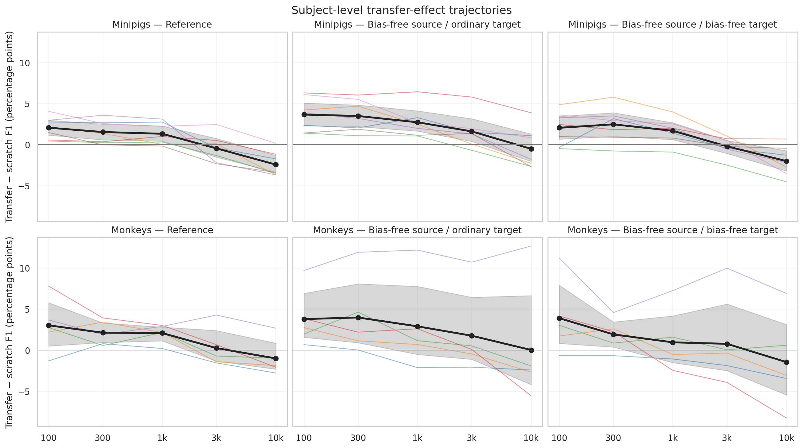

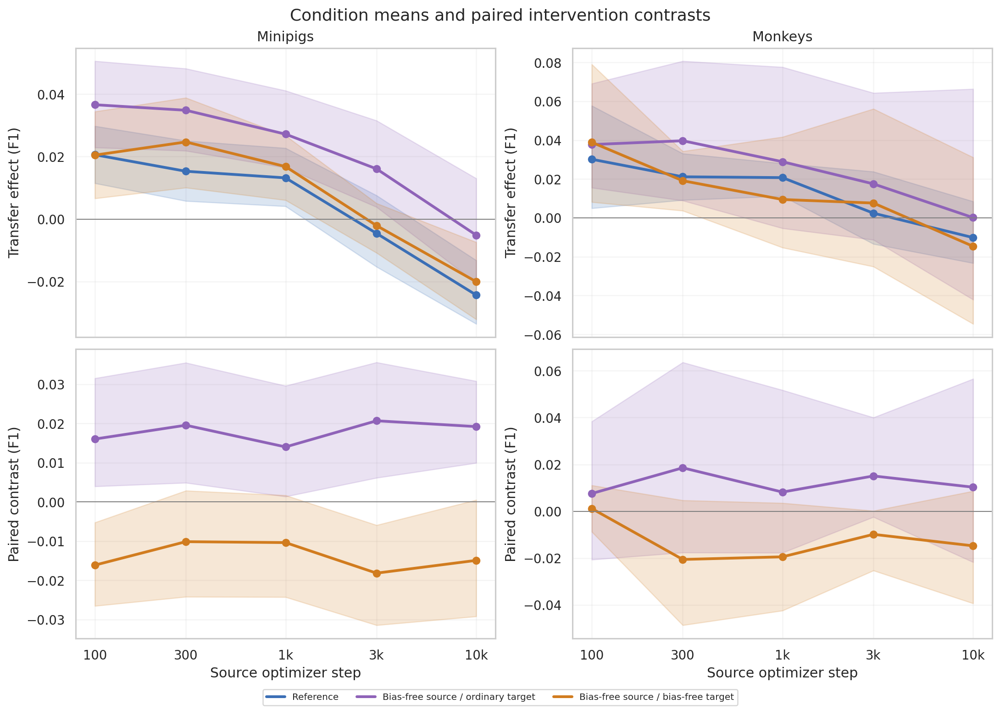

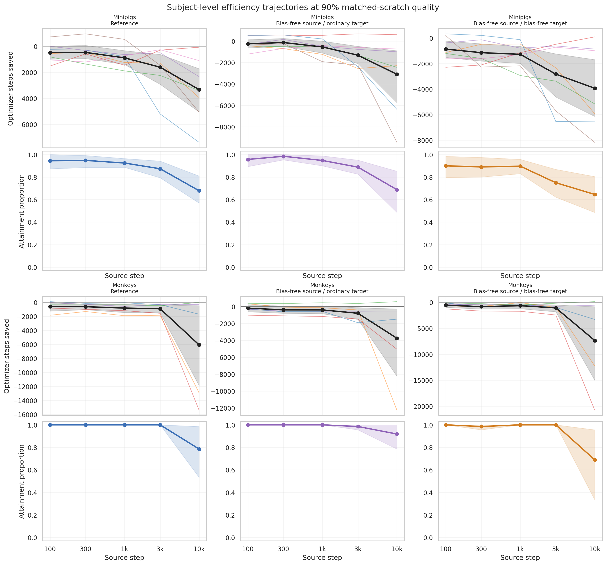

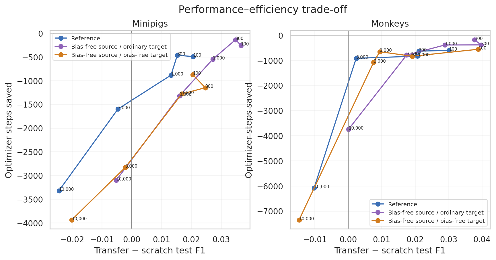

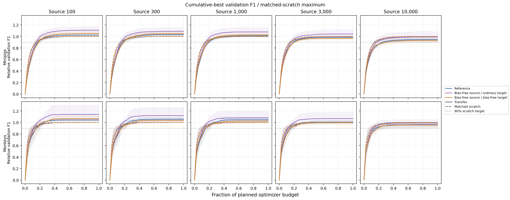

#### Annex and diagnostics

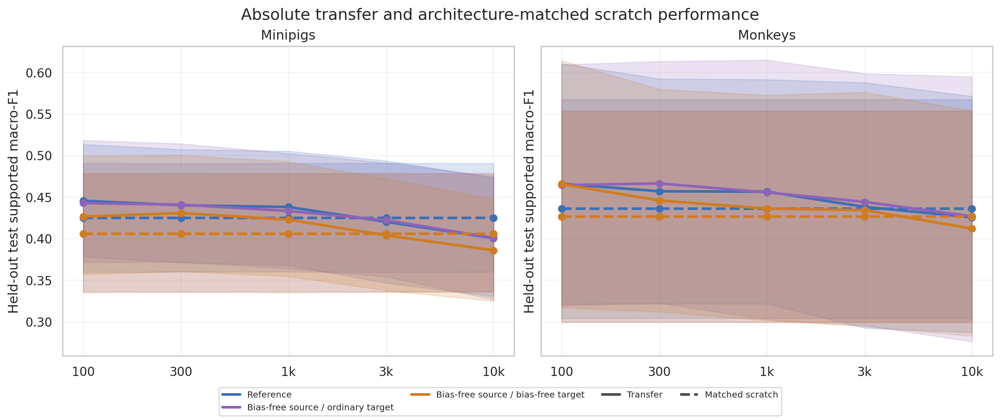

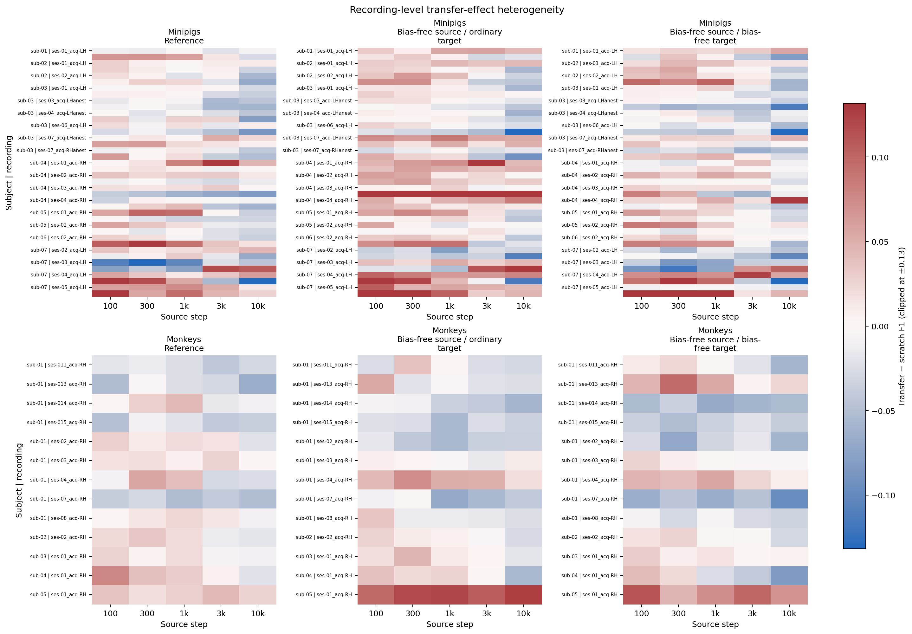

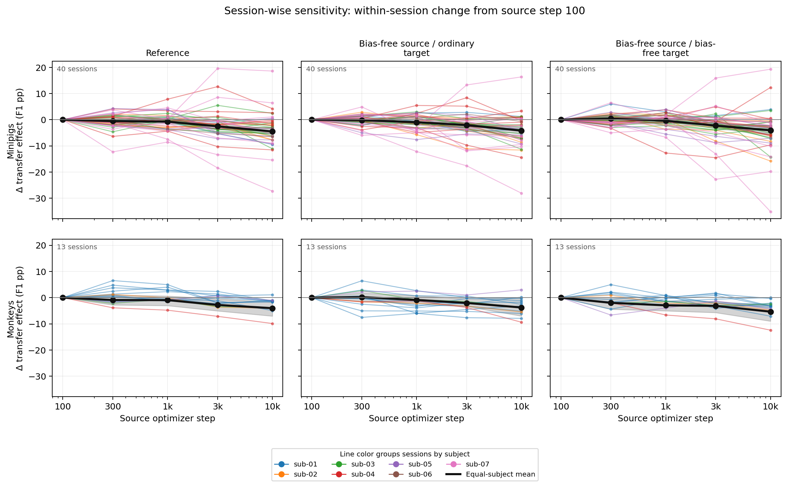

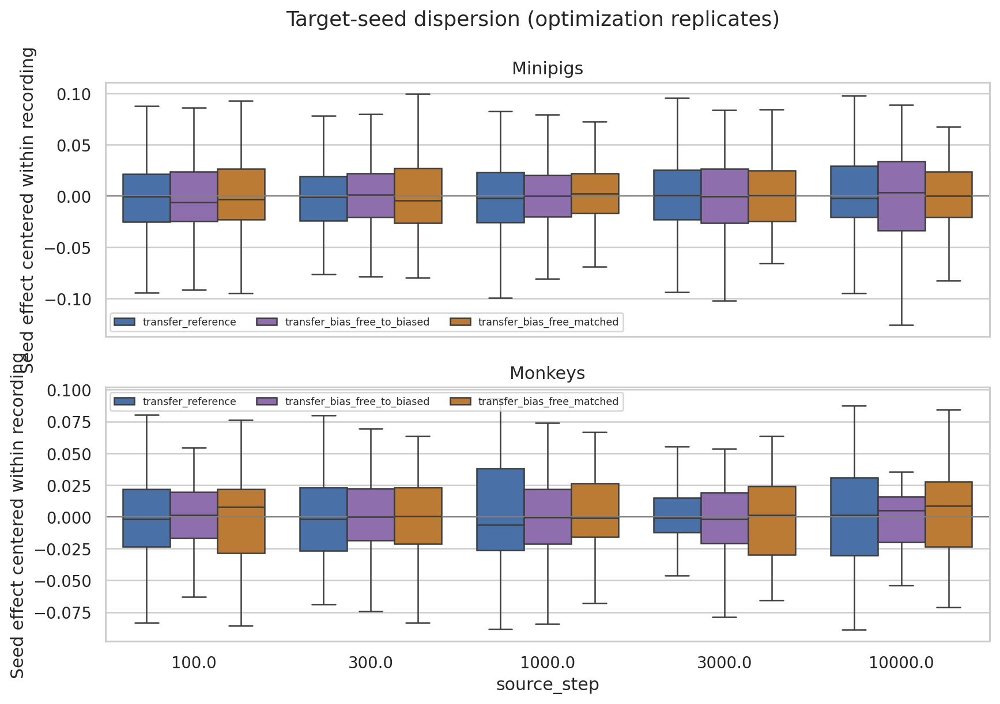

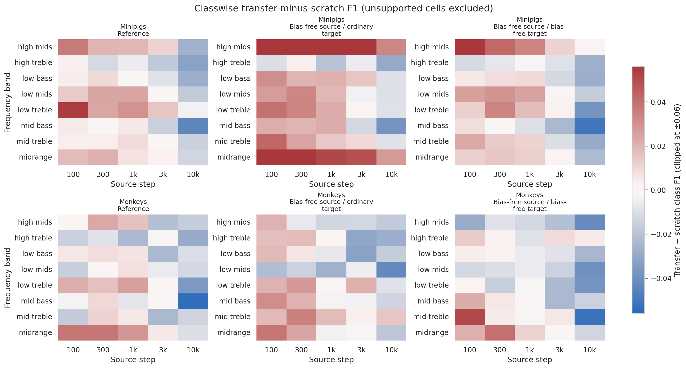

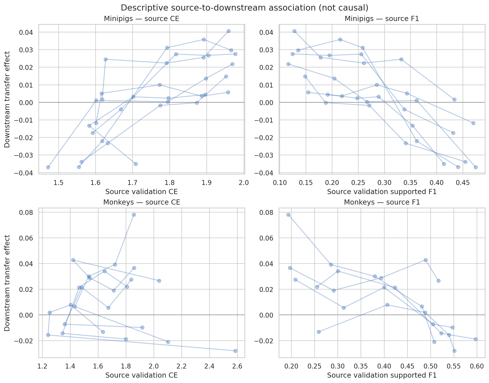

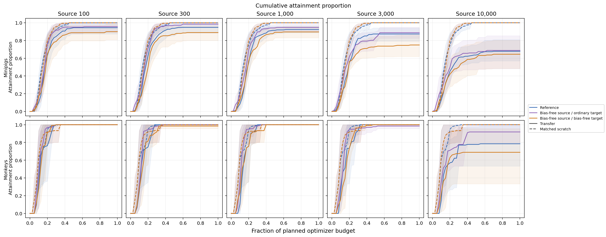

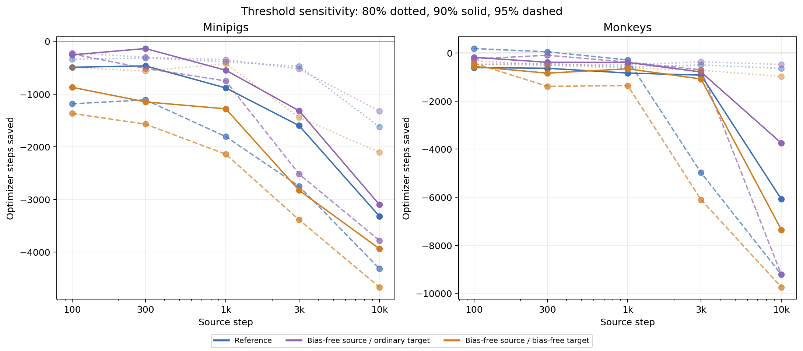

### Figures

All generated figures are referenced in the Analysis section above.

## Conclusions

TBD

## Notes for future experiments

TBD
