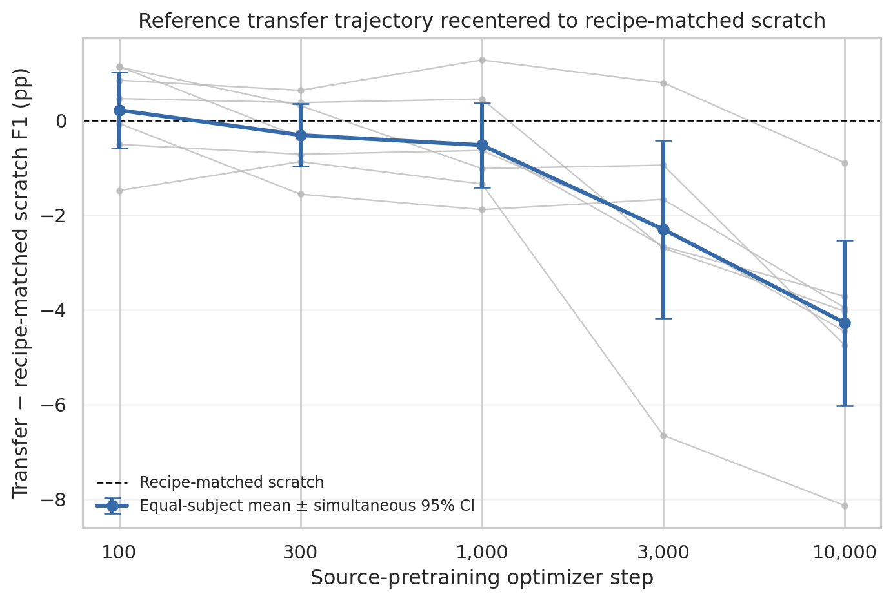
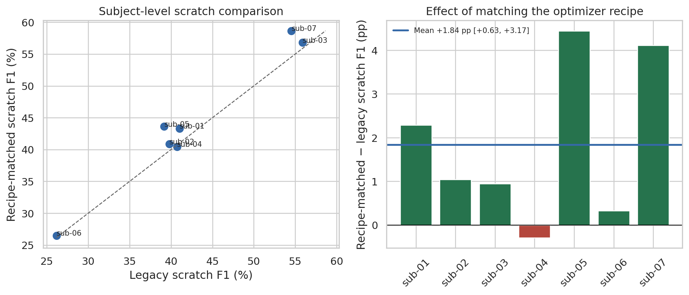
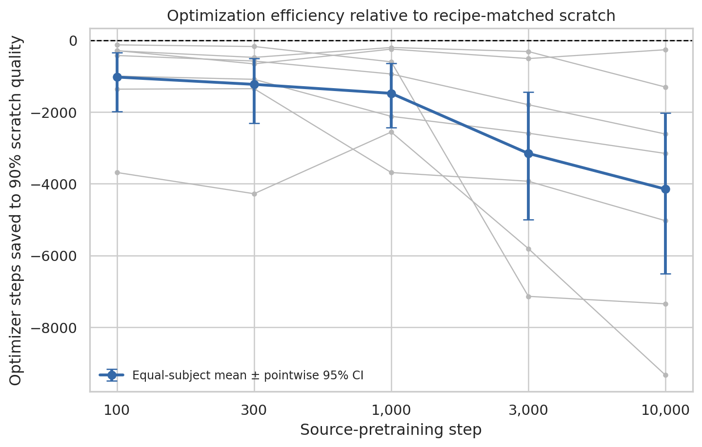
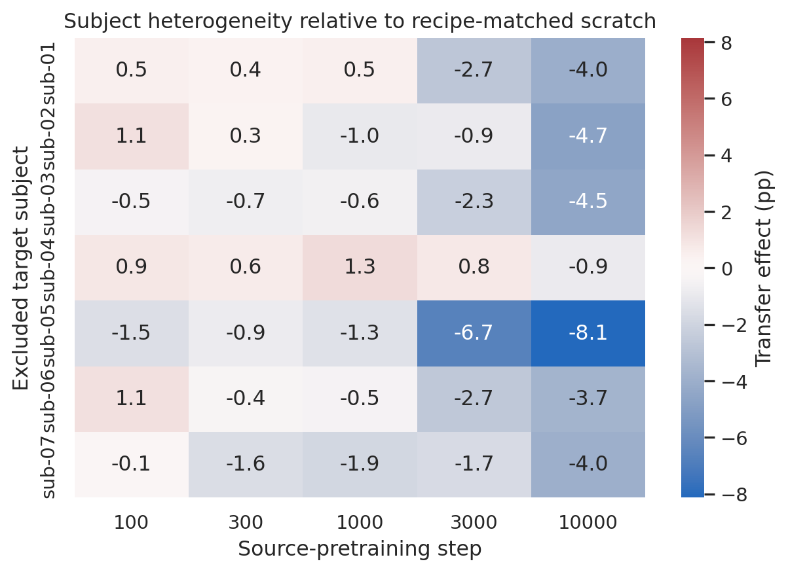

# Recipe-matched scratch transfer control

**Status:** Completed
**Date started:** 2026-09-18
**Parent experiment:** [Batch-128 reference transfer replication](20260916-MS-batch128-reference-transfer-replication.md)
**Follow-up experiments:** TBD
**Tags:** neurosoft, supervised-pretraining, transfer, scratch-control, recipe-matching, discriminative-lr, checkpoint-age, 8band, minipigs

## Background

The [batch-128 reference transfer replication](20260916-MS-batch128-reference-transfer-replication.md)
compared reference-model checkpoints at source steps 100, 300, 1,000, 3,000,
and 10,000 against a scratch reference model. Its downstream transfer recipe
used a base learning rate of `0.003` for newly initialized target components
and a tenfold lower learning rate of `0.0003` for the transferred temporal
frontend and GRU. The scratch control shared the base learning rate, phased
scheduler, target sessions, target-data fraction, and seeds, but set
`backbone_learning_rate=null` and `backbone_components=null`; consequently,
its randomly initialized temporal frontend and GRU trained at `0.003` rather
than under the transfer arm's discriminative learning-rate schedule.

This optimization mismatch is a confound in the reported transfer-minus-
scratch effects. The existing scratch control cannot distinguish a benefit of
source initialization from a benefit of training the temporal frontend and
GRU at a lower learning rate. This follow-up removes that confound by training
a new minipig-only scratch control with the exact downstream optimizer and
scheduler recipe used by the completed transfer runs. The five transfer
checkpoint conditions will be reused rather than relaunched.

## Question

After replacing the original scratch baseline with a scratch reference model
trained under the exact downstream transfer recipe, does any pretrained source
checkpoint yield statistically higher minipig test supported macro-F1?

## Hypothesis

At least one of the five pretrained checkpoints will outperform the new
recipe-matched scratch control. In particular, the early 100- or 300-step
checkpoint is expected to have higher subject-balanced test supported
macro-F1 because useful early source initialization should compensate for the
slower `0.0003` optimization of the temporal frontend and GRU, whereas a fully
random model must learn those components from scratch at that same rate.

The confirmatory criterion is that at least one transfer-minus-new-scratch
contrast has a family-wise simultaneous 95% whole-subject bootstrap interval
entirely above zero across the five checkpoint comparisons. Failure of every
simultaneous interval to exclude zero will provide no evidence of transfer
improvement under the recipe-matched comparison; it will not establish
equivalence.

## Experiment

### Setup

- **Model:** Batch-128 reference `NeurosoftConvBiGRU` architecture
  (`temporal_channels=128`, `gru_hidden_size=128`), initialized entirely from
  scratch for the new control.
- **Data:** All 40 eligible minipig recordings, each at 100% of its causal
  target training split with its existing validation and test partitions.
- **Task:** NeuroSoft 8-band acoustic-stimulus decoding.
- **Training:** Target seeds `{42,43,44}`; base learning rate `0.003` and
  backbone learning rate `0.0003` for `[temporal_frontend,gru]`; the same
  phased step scheduler, 200-epoch maximum, early-stopping patience, validation
  checkpoint selection, and one-time test evaluation as the parent transfer
  cells. The only intended difference from transfer is random initialization
  with no source checkpoint. Expected new matrix: 40 recordings x 3 seeds =
  120 scratch runs.
- **Comparators:** Reuse the parent's completed reference transfer runs at
  source steps `{100,300,1000,3000,10000}` without relaunching them.
- **Primary metric:** Subject-balanced test supported macro-F1. Average target
  seeds within recording, recordings within subject, and weight the seven
  minipig subjects equally.
- **Primary inference:** Five paired transfer-minus-scratch contrasts with
  simultaneous 95% whole-subject bootstrap intervals controlling family-wise
  error across checkpoints.
- **Secondary analysis:** Pointwise intervals, absolute F1, subject-level
  trajectories, and optimization-efficiency endpoints are descriptive.
- **Main plot:** Extend the parent's checkpoint trajectory and recenter every
  checkpoint effect on the new recipe-matched scratch control at zero. Show
  subject-level trajectories plus the equal-subject mean and simultaneous
  95% intervals; retain the original-scratch comparison only as a clearly
  labeled sensitivity analysis.
- **WandB:** Group `20260918-MS-RECIPE-MATCHED-SCRATCH-MINIPIGS`; every
  human-readable run name and deterministic eight-character run ID is recorded
  in the immutable compiled matrix and will be copied into the analysis
  coverage CSV.

### Launch command

```bash
export FOUNDRY_DATA_ROOT=/network/scratch/s/sobralm/brainsets/processed
export FOUNDRY_SNAPSHOT_ROOT=/network/scratch/s/sobralm/foundry-launches
export FOUNDRY_CHECKPOINT_ROOT=/network/scratch/s/sobralm/foundry-checkpoints

git status --short  # must print nothing

uv run python tools/compile_downstream_cells.py \
  --registry launch/checkpoint_sets/architecture-reference_backbone-fixed.jsonl \
  --recipe configs/downstream_recipes/architecture_reference_recipe_matched_scratch.yaml \
  --audit docs/neurosoft-phase0-audit.json \
  --checkpoint-root "$FOUNDRY_CHECKPOINT_ROOT" \
  --output-dir launch/recipe_matched_scratch

uv run python main.py \
  experiment=auditory_decoding/neurosoft_conv_bigru_transfer_minipigs \
  run.group=20260918-MS-RECIPE-MATCHED-SCRATCH-MINIPIGS \
  hydra.sweep.dir=/network/scratch/s/sobralm/runs/20260918-MS-RECIPE-MATCHED-SCRATCH-MINIPIGS \
  'hydra.sweep.subdir=${run.name}' \
  hydra/launcher=slurm_default hydra.launcher.partition=long \
  hydra.launcher.gres=gpu:rtx8000:1 \
  +hydra.launcher.additional_parameters.exclude=cn-c004 \
  hydra.launcher.cell_list=launch/recipe_matched_scratch/recipe-matched-scratch-minipigs.jsonl \
  hydra.launcher.tasks_per_node=8 hydra.launcher.cpus_per_task=2 \
  hyperparameters.num_workers=1 hydra.launcher.mem_gb=32 \
  -m
```

### Submission record

Submitted on 2026-09-18 from clean commit
`2f1d7afdd1fb662732ef5d4a4b8015fe324bf5bc`.

| Logical runs | Packed allocations | Slurm array | Snapshot bundle |
|---:|---:|---|---|
| 120 | 15 | `10848168_[0-14]` | `/network/scratch/s/sobralm/foundry-launches/20260918T171004_20260918-MS-RECIPE-MATCHED-SCRATCH-MINIPIGS_2f1d7afd_1fd55dae` |

The launch used the same latest architecture-transfer scratch envelope: legacy
`long`, one RTX 8000 per allocation, eight cells per GPU, two CPUs per cell,
one data-loader worker per cell, 32 GB allocation memory, the standard
three-hour limit, and `cn-c004` excluded.

### Key config overrides

- `model.temporal_channels=128`
- `model.gru_hidden_size=128`
- `hyperparameters.learning_rate=0.003`
- `hyperparameters.backbone_learning_rate=0.0003`
- `hyperparameters.backbone_components=[temporal_frontend,gru]`
- `hyperparameters.warmup_fraction=0.1`
- `hyperparameters.start_lr_factor=0.0001`
- `hyperparameters.scheduler_name=phased`
- `hyperparameters.scheduler_interval=step`
- `hyperparameters.hold=0`
- `hyperparameters.decay=0`
- `hyperparameters.adapter_warmup_steps=0`
- `data.training_fraction=1.0`
- `run.pretrained_transfer_regime=null`
- `run.evaluate_test=true`

## Results

### Summary

All 120 recipe-matched scratch runs finished and passed identity, endpoint,
history, and compiled-provenance checks. The joint analysis also audited all
600 reused reference-transfer runs and all 120 legacy scratch runs, for 840
exact W&B runs total.

No checkpoint met the preregistered criterion for positive transfer. The
100-step checkpoint was only `+0.22` F1 percentage points above recipe-matched
scratch, and its simultaneous 95% interval included zero. The 300- and
1,000-step estimates were slightly negative and likewise inconclusive. The
3,000- and 10,000-step checkpoints were significantly worse than
recipe-matched scratch, including after family-wise adjustment.

The recipe change materially improved scratch itself: recipe-matched scratch
exceeded legacy scratch by `+1.84` points, with a 95% whole-subject bootstrap
interval of `[+0.63, +3.17]`. Six of seven subjects improved. This upward
shift removed the apparent early-checkpoint advantage in the parent analysis.
Transfer was also slower than recipe-matched scratch at every checkpoint: all
seven subjects had negative mean steps saved at every source age, and every
pointwise 95% interval excluded zero in the unfavorable direction.

### Metrics

Subject-balanced test supported macro-F1. Transfer effects are percentage
points relative to recipe-matched scratch; simultaneous intervals control
family-wise error across the five checkpoint comparisons.

| Source step | Absolute F1 | Transfer effect (pp) | Pointwise 95% CI (pp) | Simultaneous 95% CI (pp) | Subjects positive |
|---:|---:|---:|---:|---:|---:|
| 100 | 44.53% | +0.22 | [-0.47, +0.83] | [-0.58, +1.02] | 4/7 |
| 300 | 44.00% | -0.31 | [-0.87, +0.22] | [-0.97, +0.35] | 3/7 |
| 1,000 | 43.79% | -0.52 | [-1.22, +0.25] | [-1.41, +0.37] | 2/7 |
| 3,000 | 42.01% | -2.30 | [-3.99, -0.88] | [-4.18, -0.42] | 1/7 |
| 10,000 | 40.04% | -4.27 | [-5.85, -2.83] | [-6.03, -2.52] | 0/7 |

The recipe-matched scratch absolute F1 was `44.31%`, compared with `42.47%`
for legacy scratch. For the secondary 90%-of-scratch-quality endpoint, mean
optimizer steps saved were `-1,025`, `-1,228`, `-1,478`, `-3,154`, and
`-4,149` at source steps 100 through 10,000 respectively; negative values mean
transfer was slower.

### Analysis

The reproducible analysis is
[`analysis/20260918-MS-recipe-matched-scratch-control_analysis.py`](../../analysis/20260918-MS-recipe-matched-scratch-control_analysis.py).
It hash-audits both immutable matrices, fetches exact run IDs through
`wandb.Api()`, validates completion and provenance, pairs at recording and
target-seed level, aggregates seed -> recording -> subject, and bootstraps the
seven whole subjects. The simultaneous intervals use the maximum absolute
studentized statistic across the five checkpoint effects with 20,000
whole-subject bootstrap draws.

```bash
uv run python analysis/20260918-MS-recipe-matched-scratch-control_analysis.py
```

The stem-matched CSV caches under `analysis/csv/` contain the exact 840-run
coverage audit, endpoints, histories, paired tables, subject aggregates, and
simultaneous-interval summary. CSV caches are intentionally gitignored.

### Figures

#### Main figures









#### Diagnostics

- [Absolute performance under both scratch controls](../../analysis/figures/20260918-MS-recipe-matched-scratch-control_absolute_performance.png)
- [Recording-level transfer effects](../../analysis/figures/20260918-MS-recipe-matched-scratch-control_recording_effect_heatmap.png)
- [Target-seed dispersion](../../analysis/figures/20260918-MS-recipe-matched-scratch-control_target_seed_dispersion.png)
- [Normalized downstream validation dynamics](../../analysis/figures/20260918-MS-recipe-matched-scratch-control_normalized_training_dynamics.png)
- [Classwise transfer effects](../../analysis/figures/20260918-MS-recipe-matched-scratch-control_classwise_effects.png)

## Conclusions

**Hypothesis refuted.** No pretrained checkpoint had statistically higher
minipig test supported macro-F1 than recipe-matched scratch under the
preregistered family-wise criterion. The 100-step estimate was near zero, and
continued source pretraining changed the comparison from neutral to harmful:
the 3,000- and 10,000-step checkpoints were significantly worse than scratch.
Transfer also reached matched scratch quality more slowly at every checkpoint.

The original scratch recipe was a consequential confound. Applying the same
discriminative learning-rate schedule to the randomly initialized reference
model improved scratch by `+1.84` F1 points and erased the parent's apparent
early transfer advantage. Under this matched downstream recipe, the results
provide no evidence of any performance or optimization benefit from the tested
source checkpoints. This conclusion is specific to the reference model,
supervised source objective, checkpoint family, full-data minipig targets, and
tested downstream recipe; it is not an equivalence claim about all possible
pretraining strategies.

## Notes for future experiments

None requested.
