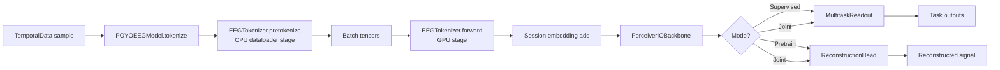

# Foundry Models

`foundry/models` contains the EEG/iEEG model stack used in Foundry:

- a composable `EEGTokenizer` (`tokenizer.py`) for channel handling + temporal embedding,
- a Perceiver IO backbone (`backbones/perceiver.py`),
- the integrated POYO-style model (`poyo_eeg.py`),
- masking strategies for self-supervised pretraining (`masking.py`),
- a reconstruction head for masked signal reconstruction (`reconstruction_head.py`),
- and baseline CNN models (`baselines.py`).

## Current Layout

```text
foundry/models/
├── __init__.py
├── tokenizer.py
├── poyo_eeg.py
├── masking.py
├── reconstruction_head.py
├── baselines.py
├── utils.py
├── backbones/
│   ├── __init__.py
│   └── perceiver.py
└── embeddings/
    ├── __init__.py
    ├── activations.py
    ├── patching.py
    ├── channel/
    │   ├── __init__.py
    │   ├── processors.py
    │   └── spatial_projectors.py
    └── temporal/
        ├── __init__.py
        ├── per_timepoint.py
        ├── patch_linear.py
        ├── patch_mlp.py
        ├── patch_cnn.py
        └── cwt.py
```

## End-to-End Integration



### POYOEEGModel Composition

`POYOEEGModel` composes these modules in order:

1. `EEGTokenizer` -> produces `inputs` with shape `(B, num_tokens, embed_dim)`
2. session conditioning -> adds `session_emb(input_session_index)` to every input token
3. latent/query setup -> latent embeddings + rotary time embeddings
4. `PerceiverIOBackbone` -> encoder cross-attn, processor self-attn, decoder cross-attn
5. Output routing (mode-dependent):
   - **Supervised**: `MultitaskReadout` -> task-specific heads chosen by `output_decoder_index`
   - **Pretrain**: `ReconstructionHead` -> signal reconstruction at masked positions
   - **Joint**: both heads receive their portion of the decoder output

### Three Operating Modes

The model supports three modes, controlled entirely by which optional
components are configured (no mode flag):

| Mode | `readout_specs` | `reconstruction_head` | Output keys |
|---|---|---|---|
| **Supervised** | provided | `None` | `{"task_name": tensor, ...}` |
| **Pretrain** | `None` | provided | `{"reconstruction": tensor}` |
| **Joint** | provided | provided | `{"task_name": ..., "reconstruction": tensor}` |

## EEGTokenizer Architecture

The tokenizer has two phases:

- `pretokenize(...)`: CPU-side per-sample prep in dataloading
- `forward(...)`: GPU-side token embedding in training/inference

### Masking (Pretraining)

When a `MaskingStrategy` is configured on the tokenizer:

- `pretokenize()` generates a boolean mask, extracts reconstruction targets at
  masked positions, and returns them alongside the standard fields.
- `forward()` replaces masked token embeddings with a learned `mask_emb`
  parameter after the temporal embedding and layer norm.

Available strategies:

| Strategy | Description |
|---|---|
| `RandomPatchMasking` | Each token masked independently with probability `mask_ratio` |
| `ContiguousSpanMasking` | Contiguous spans with geometric length distribution |

### Channel Strategies (`embeddings/channel/processors.py`)

| Strategy | Output before temporal embedding | Typical use |
|---|---|---|
| `FixedChannelStrategy` | `(B, num_channels, T)` | Fixed-size channel layout |
| `PerChannelStrategy` | `(B * C_pad, 1, T)` | Independent per-channel tokenization |
| `SpatialProjectionStrategy` | `(B, num_sources, T)` | Learn a common source space from variable channels |

### Spatial Projectors (`embeddings/channel/spatial_projectors.py`)

Used only by `SpatialProjectionStrategy`:

- `LinearSpatialProjector`: shared linear projection from channels to sources
- `SessionSpatialProjector`: session-specific linear projection (optional shared MLP)
- `PerceiverSpatialProjector`: cross-attention projection into latent sources

### Temporal Embeddings (`embeddings/temporal/`)

| Embedding | Expected input | Output |
|---|---|---|
| `PatchLinearEmbedding` | `(B, P, C, S)` | `(B, P, D)` |
| `PatchMLPEmbedding` | `(B, P, C, S)` | `(B, P, D)` |
| `PatchCNNEmbedding` | `(B, P, C, S)` | `(B, P, D)` |
| `PerTimepointLinearEmbedding` | `(B, T, input_dim)` | `(B, T, D)` |
| `PerTimepointIdentityEmbedding` | `(B, T, input_dim)` | `(B, T, D)` |
| `CWTEmbedding` | `(B, num_sources, T)` + `input_sampling_rate`, `input_seq_len` | `(B, target_time_tokens, D)` |

## ReconstructionHead

`reconstruction_head.py` provides a simple MLP that projects decoder
embeddings back to raw signal space:

```
LayerNorm -> Linear(embed_dim, hidden_dim) -> GELU -> Linear(hidden_dim, output_dim)
```

The `output_dim` depends on the tokenizer combination:

| Combination | `output_dim` |
|---|---|
| Fixed/SpatialProj + Patch | `num_channels * patch_samples` |
| PerChannel + Patch | `patch_samples` |
| Fixed/SpatialProj + CWT | `num_channels` |
| Fixed/SpatialProj + PerTimepoint | `num_channels` |
| PerChannel + PerTimepoint | `1` |

## How Tokenizer Variants Relate

Tokenizer configs live in `configs/model/tokenizer/` and combine:

- one channel strategy family (`fixed`, `per_channel`, `spatial_linear`, `spatial_session`, `spatial_perceiver`)
- one temporal embedding family (`patch_linear`, `patch_mlp`, `patch_cnn`, `per_timepoint`, `cwt`)

## API Reference (Practical)

### Build a tokenizer + POYO model (supervised)

```python
from foundry.models import (
    EEGTokenizer,
    POYOEEGModel,
    SpatialProjectionStrategy,
    PerceiverSpatialProjector,
    PatchLinearEmbedding,
)

embed_dim = 128
num_channels = 64
num_sources = 10
patch_samples = 25

tokenizer = EEGTokenizer(
    channel_strategy=SpatialProjectionStrategy(
        num_channels=num_channels,
        num_sources=num_sources,
        projector=PerceiverSpatialProjector(
            num_sources=num_sources,
            d_attn=64,
            num_heads=4,
        ),
    ),
    temporal_embedding=PatchLinearEmbedding(
        embed_dim=embed_dim,
        num_input_channels=num_sources,
        patch_samples=patch_samples,
    ),
    embed_dim=embed_dim,
    patch_duration=0.1,
)

model = POYOEEGModel(
    tokenizer=tokenizer,
    readout_specs=readout_specs,  # list[str], list[ModalitySpec], or dict
    embed_dim=embed_dim,
    sequence_length=30.0,
)
```

### Build a pretraining model

```python
from foundry.models import (
    EEGTokenizer,
    POYOEEGModel,
    FixedChannelStrategy,
    PatchLinearEmbedding,
    RandomPatchMasking,
    ReconstructionHead,
)

embed_dim = 128
num_channels = 64
patch_samples = 25

tokenizer = EEGTokenizer(
    channel_strategy=FixedChannelStrategy(num_channels=num_channels),
    temporal_embedding=PatchLinearEmbedding(
        embed_dim=embed_dim,
        num_input_channels=num_channels,
        patch_samples=patch_samples,
    ),
    embed_dim=embed_dim,
    patch_duration=0.1,
    masking=RandomPatchMasking(mask_ratio=0.15),
)

model = POYOEEGModel(
    tokenizer=tokenizer,
    embed_dim=embed_dim,
    sequence_length=2.0,
    reconstruction_head=ReconstructionHead(
        embed_dim=embed_dim,
        output_dim=num_channels * patch_samples,
    ),
)
```

### Perceiver IO components directly

`backbones/perceiver.py` exposes:

- `PerceiverEncoder`
- `PerceiverProcessor`
- `PerceiverDecoder`
- `PerceiverIOBackbone` (wrapper around the three components)

### Baselines

`baselines.py` provides non-Perceiver references:

- `TemporalConvAvgPoolClassifier`
- `ShallowConvNet`
- `EEGNetEncoder`

These use the same multitask readout interface, but do not use `EEGTokenizer`.

## Training Modules

Two LightningModule wrappers are available in `foundry/training/`:

| Module | Use case | Config |
|---|---|---|
| `EEGModule` | Supervised multitask classification | `configs/module/default.yaml` |
| `PretrainModule` | Masked reconstruction pretraining | `configs/module/pretrain.yaml` |
